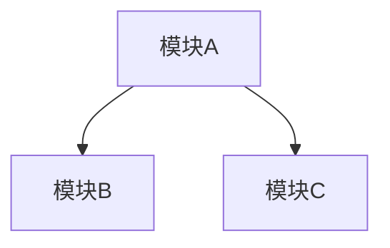

# 项目概览

## 产品视角
[核心用户 + 核心价值 + 主要功能，<= 5 句话]

## 架构图

[模块关系 + 数据流向]

## 模块说明
| 模块 | 职责 | 关键文件 |
|------|------|---------|
| ... | ... | ... |

## 新手入门指南
### 先看这 3 个文件
1. `path/to/file1` — 原因
2. `path/to/file2` — 原因
3. `path/to/file3` — 原因

### 入手路径
[从哪里开始深入的建议路线]

## 技术栈速查表
| 类别 | 技术 | 版本 |
|------|------|------|
| ... | ... | ... |

## 项目结构树
```text
project/
├── src/          # ...
│   ├── ...       # ...
│   └── ...       # ...
├── ...           # ...
└── ...           # ...
```
[深度 2-3 层]
