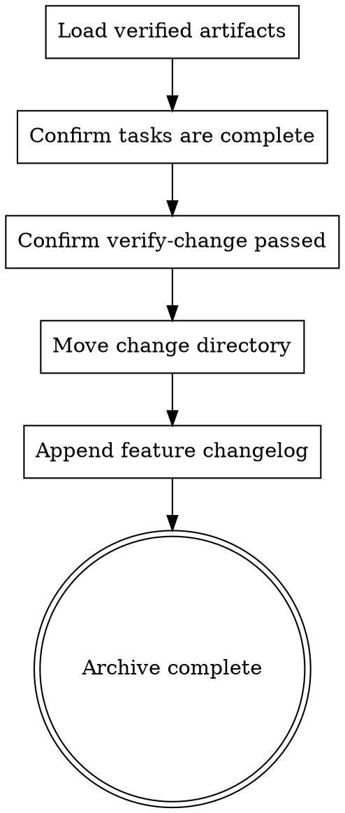

> Source: local small-chain runtime addition

# Archive

Use this skill after `verify-change` passes. It closes the small-chain loop by moving the change directory into `docs/archive/` and appending a concise summary to the feature changelog.

## Hard Gate

**Do not archive unless all tasks are complete and verify-change reports no CRITICAL findings.**

## Inputs

1. Verified change directory
   - `docs/{feature}/YYYY-MM-DD-{change}/`
2. Verification result
   - `PASS` from `verify-change`

## Workflow



## Steps

1. Preconditions
   - Confirm every task in `tasks.md` is `[x]`.
   - Confirm the latest verify report contains no CRITICAL findings.
2. Move directory
   - Move `docs/{feature}/YYYY-MM-DD-{change}/` to `docs/archive/{feature}/YYYY-MM-DD-{change}/`.
3. Update changelog
   - Append one concise entry to `docs/{feature}/CHANGELOG.md`.
   - Summarize the change from `Why` and `Scope` in `design.md`.
4. Report
   - State the archive destination.
   - State the changelog path updated.

## Output

```markdown
# Archive Result

- source: docs/{feature}/YYYY-MM-DD-{change}/
- archived_to: docs/archive/{feature}/YYYY-MM-DD-{change}/
- changelog: docs/{feature}/CHANGELOG.md
```
