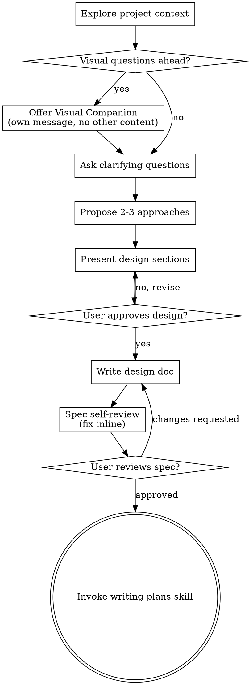

> Source: `obra/superpowers/skills/brainstorming/SKILL.md` (pinned in `community/SOURCES.yaml`)

# Brainstorming Ideas Into Designs

Help turn ideas into fully formed designs and specs through natural collaborative dialogue.

Start by understanding the current project context, then ask questions one at a time to refine the idea. Once you understand what you're building, present the design and get user approval.

<HARD-GATE>
Do NOT invoke any implementation skill, write any code, scaffold any project, or take any implementation action until you have presented a design and the user has approved it. This applies to EVERY project regardless of perceived simplicity.
</HARD-GATE>

## Anti-Pattern: "This Is Too Simple To Need A Design"

Every project goes through this process. A todo list, a single-function utility, a config change — all of them. "Simple" projects are where unexamined assumptions cause the most wasted work. The design can be short (a few sentences for truly simple projects), but you MUST present it and get approval.

## Checklist

You MUST create a task for each of these items and complete them in order:

1. Explore project context
   - Check files, docs, and recent commits.
2. Offer visual companion
   - If the topic will involve visual questions, send this as its own message.
   - Do not combine it with a clarifying question.
   - See the Visual Companion section below.
3. Ask clarifying questions
   - Ask them one at a time.
   - Understand purpose, constraints, and success criteria.
4. Propose 2-3 approaches
   - Include trade-offs and your recommendation.
5. Present design
   - Scale sections to the complexity of the work.
   - Get user approval after each section.
6. Write design doc
   - Save to `docs/{feature}/YYYY-MM-DD-{change}/design.md`.
   - Commit the document.
7. Spec self-review
   - Run a quick inline check for placeholders, contradictions, ambiguity, and scope.
   - See the self-review section below.
8. User reviews written spec
   - Ask the user to review the spec file before proceeding.
9. Transition to implementation
   - Invoke the writing-plans skill to create the implementation plan.

## Process Flow

The terminal state is invoking writing-plans. Do NOT invoke frontend-design, mcp-builder, or any other implementation skill. The ONLY skill you invoke after brainstorming is writing-plans.

## The Process

Understanding the idea:

- Check out the current project state first (files, docs, recent commits)
- Before asking detailed questions, assess scope: if the request describes multiple independent subsystems (e.g., "build a platform with chat, file storage, billing, and analytics"), flag this immediately. Don't spend questions refining details of a project that needs to be decomposed first.
- If the project is too large for a single spec, help the user decompose into sub-projects: what are the independent pieces, how do they relate, what order should they be built? Then brainstorm the first sub-project through the normal design flow. Each sub-project gets its own spec → plan → implementation cycle.
- For appropriately-scoped projects, ask questions one at a time to refine the idea
- Prefer multiple choice questions when possible, but open-ended is fine too
- Only one question per message - if a topic needs more exploration, break it into multiple questions
- Focus on understanding: purpose, constraints, success criteria

Exploring approaches:

- Propose 2-3 different approaches with trade-offs
- Present options conversationally with your recommendation and reasoning
- Lead with your recommended option and explain why

Presenting the design:

- Once you believe you understand what you're building, present the design
- Scale each section to its complexity: a few sentences if straightforward, up to 200-300 words if nuanced
- Ask after each section whether it looks right so far
- Cover: architecture, components, data flow, error handling, testing
- Be ready to go back and clarify if something doesn't make sense

Design for isolation and clarity:

- Break the system into smaller units that each have one clear purpose, communicate through well-defined interfaces, and can be understood and tested independently
- For each unit, you should be able to answer: what does it do, how do you use it, and what does it depend on?
- Can someone understand what a unit does without reading its internals? Can you change the internals without breaking consumers? If not, the boundaries need work.
- Smaller, well-bounded units are also easier for you to work with - you reason better about code you can hold in context at once, and your edits are more reliable when files are focused. When a file grows large, that's often a signal that it's doing too much.

Working in existing codebases:

- Explore the current structure before proposing changes. Follow existing patterns.
- Where existing code has problems that affect the work (e.g., a file that's grown too large, unclear boundaries, tangled responsibilities), include targeted improvements as part of the design - the way a good developer improves code they're working in.
- Don't propose unrelated refactoring. Stay focused on what serves the current goal.

## After the Design

Documentation:

- Write the validated design (spec) to `docs/{feature}/YYYY-MM-DD-{change}/design.md`
  - (User preferences for spec location override this default)
- Use elements-of-style:writing-clearly-and-concisely skill if available
- Commit the design document to git

Spec Self-Review:
After writing the spec document, look at it with fresh eyes:

1. Placeholder scan
   - Look for "TBD", "TODO", incomplete sections, or vague requirements.
   - Fix them inline.
2. Internal consistency
   - Check whether any sections contradict each other.
   - Confirm the architecture matches the feature descriptions.
3. Scope check
   - Decide whether the spec is focused enough for a single implementation plan.
   - If not, decompose it.
4. Ambiguity check
   - Look for requirements that could be interpreted in two different ways.
   - Pick one interpretation and make it explicit.
5. Content completeness
   - Run `references/design-completeness-checklist.md` against the spec.
   - Fix any Missing or Partial items inline.
6. Contract-grade preflight
   - Decide whether the design affects source-of-truth, lifecycle state, schemas, ref grammar, hooks, validators, CI gates, audit, migration/cutover, or multi-agent handoff.
   - If yes, the spec must include `Contract-Grade Preflight` and answer all C1-C8 checks from `references/design-completeness-checklist.md`.
   - Fix any Missing or Partial C-check before user review or writing-plans.
   - Treat this as `brainstorming`'s producer-side responsibility for `design.md`: freeze C1-C8 decisions here before user review and writing-plans.

Fix any issues inline. No need to re-review — just fix and move on.

User Review Gate:
After the spec review loop passes, ask the user to review the written spec before proceeding:

> "Spec written and committed to `<path>`. Please review it and let me know if you want to make any changes before we start writing out the implementation plan."

Wait for the user's response. If they request changes, make them and re-run the spec review loop. Only proceed once the user approves.

Implementation:

- Invoke the writing-plans skill to create a detailed implementation plan
- Do NOT invoke any other skill. writing-plans is the next step.

## Key Principles

- **One question at a time** - Don't overwhelm with multiple questions
- **Multiple choice preferred** - Easier to answer than open-ended when possible
- **YAGNI ruthlessly** - Remove unnecessary features from all designs
- **Explore alternatives** - Always propose 2-3 approaches before settling
- **Incremental validation** - Present design, get approval before moving on
- **Be flexible** - Go back and clarify when something doesn't make sense

## Visual Companion

A browser-based companion for showing mockups, diagrams, and visual options during brainstorming. Available as a tool — not a mode. Accepting the companion means it's available for questions that benefit from visual treatment; it does NOT mean every question goes through the browser.

**Offering the companion:** When you anticipate that upcoming questions will involve visual content (mockups, layouts, diagrams), offer it once for consent:
> "Some of what we're working on might be easier to explain if I can show it to you in a web browser. I can put together mockups, diagrams, comparisons, and other visuals as we go. This feature is still new and can be token-intensive. Want to try it? (Requires opening a local URL)"

**This offer MUST be its own message.** Do not combine it with clarifying questions, context summaries, or any other content. The message should contain ONLY the offer above and nothing else. Wait for the user's response before continuing. If they decline, proceed with text-only brainstorming.

**Per-question decision:** Even after the user accepts, decide FOR EACH QUESTION whether to use the browser or the terminal. The test: **would the user understand this better by seeing it than reading it?**

- **Use the browser** for content that IS visual — mockups, wireframes, layout comparisons, architecture diagrams, side-by-side visual designs
- **Use the terminal** for content that is text — requirements questions, conceptual choices, tradeoff lists, A/B/C/D text options, scope decisions

A question about a UI topic is not automatically a visual question. "What does personality mean in this context?" is a conceptual question — use the terminal. "Which wizard layout works better?" is a visual question — use the browser.

If they agree to the companion, read the detailed guide before proceeding:
`skills/brainstorming/visual-companion.md`

## 流程导航

- 当前完成条件：`design.md` 已写入目标目录，spec self-review 已完成，用户已审阅并批准书面 spec。
- 下一步：`writing-plans`
- 完整链路：`brainstorming → writing-plans → implementation-router → using-git-worktrees（serial 按需） → subagent-driven-development（serial） / parallel-subagent-development（parallel） → verification-before-completion → verify-change → finishing-a-development-branch → archive`

## Context Handoff Contract

- scope registry 是 `contracts/active-doc-scope.yaml`；只有 `management_status in [managed, migrated]` 的 feature 才是默认接手候选。
- `worklog.md` 是 feature 根接手入口；最新记录的 `handoff_status / state_ref / next_ref` 只导航到真实工件，不复制设计或任务内容。
- 本阶段产出的 `design.md` 位于 active workset，并由 `worklog.md` 指向后才进入后续 small-chain 接手。
