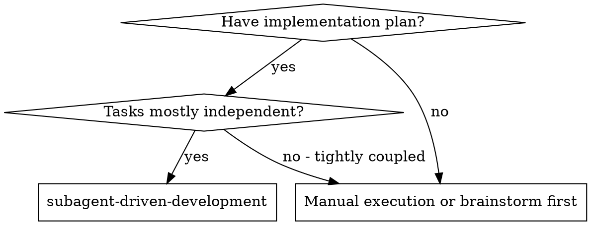
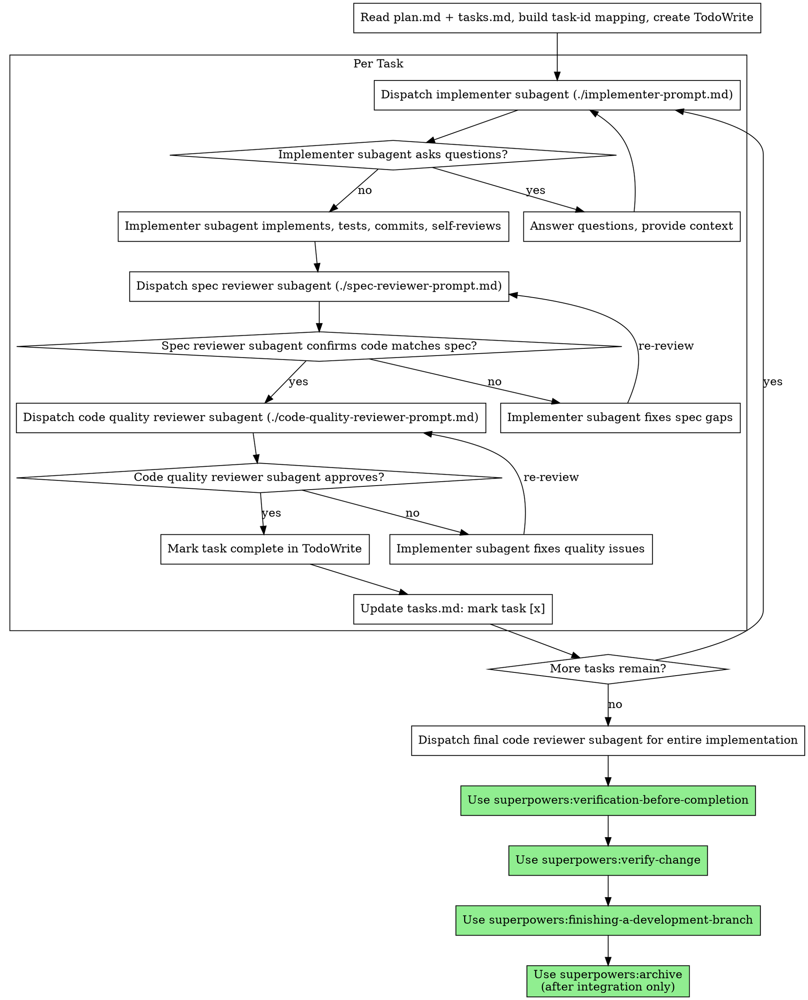

> Source: `obra/superpowers/skills/subagent-driven-development/SKILL.md` (pinned in `community/SOURCES.yaml`)


# Subagent-Driven Development

Execute plan by dispatching fresh subagent per task, with two-stage review after each: spec compliance review first, then code quality review.

In the local small-chain wrapper, this is the serial executor. Use it only after `small-chain-execution-router` produces `execution-route.json` with `decision=serial`.

**Why subagents:** You delegate tasks to specialized agents with isolated context. By precisely crafting their instructions and context, you ensure they stay focused and succeed at their task. They should never inherit your session's context or history — you construct exactly what they need. This also preserves your own context for coordination work.

**Core principle:** Fresh subagent per task + two-stage review (spec then quality) = high quality, fast iteration

## When to Use



## The Process



### Controller Initialization

1. Read `plan.md`
   - Extract all tasks with full text and context.
2. Read `tasks.md`
   - Build task-id mapping.
   - Map each `- [ ] T* ...` line to a TodoWrite item.
3. Create TodoWrite
   - Add all tasks while preserving task-id correspondence to `tasks.md`.

### tasks.md Update Mechanism

After both review stages (spec compliance + code quality) pass for a task, the controller updates `tasks.md`:
- Change `- [ ] T* ...` to `- [x] T* ...` for the completed task.
- This keeps tasks.md as the persistent progress record across sessions

Implementer subagents are also informed of their task-id in tasks.md so they can reference it in commit messages.

## Model Selection

Use the least powerful model that can handle each role to conserve cost and increase speed.

**Mechanical implementation tasks** (isolated functions, clear specs, 1-2 files): use a fast, cheap model. Most implementation tasks are mechanical when the plan is well-specified.

**Integration and judgment tasks** (multi-file coordination, pattern matching, debugging): use a standard model.

**Architecture, design, and review tasks**: use the most capable available model.

**Task complexity signals:**
- Touches 1-2 files with a complete spec → cheap model
- Touches multiple files with integration concerns → standard model
- Requires design judgment or broad codebase understanding → most capable model

## Handling Implementer Status

Implementer subagents report one of four statuses. Handle each appropriately:

**DONE:** Proceed to spec compliance review.

**DONE_WITH_CONCERNS:** The implementer completed the work but flagged doubts. Read the concerns before proceeding. If the concerns are about correctness or scope, address them before review. If they're observations (e.g., "this file is getting large"), note them and proceed to review.

**NEEDS_CONTEXT:** The implementer needs information that wasn't provided. Provide the missing context and re-dispatch.

**BLOCKED:** The implementer cannot complete the task. Assess the blocker:
1. Context problem
   - Provide more context and re-dispatch with the same model.
2. Reasoning problem
   - Re-dispatch with a more capable model.
3. Task too large
   - Break it into smaller pieces.
4. Plan issue
   - Escalate to the human.

**Never** ignore an escalation or force the same model to retry without changes. If the implementer said it's stuck, something needs to change.

## Prompt Templates

- `./implementer-prompt.md` - Dispatch implementer subagent
- `./spec-reviewer-prompt.md` - Dispatch spec compliance reviewer subagent
- `./code-quality-reviewer-prompt.md` - Dispatch code quality reviewer subagent

## Example Workflow

```
You: I'm using Subagent-Driven Development to execute this plan.

[Read plan.md + tasks.md]
[Build task-id mapping from tasks.md]
[Extract all 5 tasks with full text and context]
[Create TodoWrite with all tasks]

Task 1: Hook installation script

[Get Task 1 text and context (already extracted)]
[Dispatch implementation subagent with full task text + context + task-id]

Implementer: "Before I begin - should the hook be installed at user or system level?"

You: "User level (~/.config/superpowers/hooks/)"

Implementer: "Got it. Implementing now..."
[Later] Implementer:
  - Implemented install-hook command
  - Added tests, 5/5 passing
  - Self-review: Found I missed --force flag, added it
  - Committed

[Dispatch spec compliance reviewer]
Spec reviewer: ✅ Spec compliant - all requirements met, nothing extra

[Get git SHAs, dispatch code quality reviewer]
Code reviewer: Strengths: Good test coverage, clean. Issues: None. Approved.

[Mark Task 1 complete]
[Update tasks.md: - [ ] T1 ... → - [x] T1 ...]

Task 2: Recovery modes

[Get Task 2 text and context (already extracted)]
[Dispatch implementation subagent with full task text + context]

Implementer: [No questions, proceeds]
Implementer:
  - Added verify/repair modes
  - 8/8 tests passing
  - Self-review: All good
  - Committed

[Dispatch spec compliance reviewer]
Spec reviewer: ❌ Issues:
  - Missing: Progress reporting (spec says "report every 100 items")
  - Extra: Added --json flag (not requested)

[Implementer fixes issues]
Implementer: Removed --json flag, added progress reporting

[Spec reviewer reviews again]
Spec reviewer: ✅ Spec compliant now

[Dispatch code quality reviewer]
Code reviewer: Strengths: Solid. Issues (Important): Magic number (100)

[Implementer fixes]
Implementer: Extracted PROGRESS_INTERVAL constant

[Code reviewer reviews again]
Code reviewer: ✅ Approved

[Mark Task 2 complete]
[Update tasks.md: - [ ] T2 ... → - [x] T2 ...]

...

[After all tasks]
[Dispatch final code-reviewer]
Final reviewer: All requirements met, ready to merge

Done!
```

## Advantages

**vs. Manual execution:**
- Subagents follow TDD naturally
- Fresh context per task (no confusion)
- Parallel-safe (subagents don't interfere)
- Subagent can ask questions (before AND during work)

**vs. Executing Plans:**
- Same session (no handoff)
- Continuous progress (no waiting)
- Review checkpoints automatic

**Efficiency gains:**
- No file reading overhead (controller provides full text)
- Controller curates exactly what context is needed
- Subagent gets complete information upfront
- Questions surfaced before work begins (not after)

**Quality gates:**
- Self-review catches issues before handoff
- Two-stage review: spec compliance, then code quality
- Review loops ensure fixes actually work
- Spec compliance prevents over/under-building
- Code quality ensures implementation is well-built

**Cost:**
- More subagent invocations (implementer + 2 reviewers per task)
- Controller does more prep work (extracting all tasks upfront)
- Review loops add iterations
- But catches issues early (cheaper than debugging later)

## Red Flags

**Never:**
- Start implementation on main/master branch without explicit user consent
- Skip reviews (spec compliance OR code quality)
- Proceed with unfixed issues
- Dispatch multiple implementation subagents in parallel (conflicts)
- Make subagent read plan file (provide full text instead)
- Skip scene-setting context (subagent needs to understand where task fits)
- Ignore subagent questions (answer before letting them proceed)
- Accept "close enough" on spec compliance (spec reviewer found issues = not done)
- Skip review loops (reviewer found issues = implementer fixes = review again)
- Let implementer self-review replace actual review (both are needed)
- **Start code quality review before spec compliance is ✅** (wrong order)
- Move to next task while either review has open issues

**If subagent asks questions:**
- Answer clearly and completely
- Provide additional context if needed
- Don't rush them into implementation

**If reviewer finds issues:**
- Implementer (same subagent) fixes them
- Reviewer reviews again
- Repeat until approved
- Don't skip the re-review

**If subagent fails task:**
- Dispatch fix subagent with specific instructions
- Don't try to fix manually (context pollution)

## Integration

Required workflow skills:
- superpowers:using-git-worktrees - REQUIRED when isolated workspace has not already been set up
- superpowers:writing-plans - Creates the plan this skill executes
- superpowers:requesting-code-review - Code review template for reviewer subagents
- superpowers:verification-before-completion - Fresh verification evidence before any completion claim
- superpowers:verify-change - Graded verification report (CRITICAL/WARNING/SUGGESTION)
- superpowers:finishing-a-development-branch - Branch/worktree integration and cleanup after verify-change passes

Subagents should use:
- superpowers:test-driven-development - Subagents follow TDD for each task

Terminal chain (after all tasks complete):
1. verification-before-completion
   - Re-run the proving commands and report fresh evidence.
2. verify-change
   - Produce graded report (CRITICAL/WARNING/SUGGESTION).
3. finishing-a-development-branch
   - Finalize branch and worktree after the gate passes.
4. archive
   - Move `docs/{feature}/YYYY-MM-DD-{change}/` to `docs/archive/{feature}/YYYY-MM-DD-{change}/`.
   - Only after the change is integrated on the target branch.

## 流程导航

- 当前完成条件：`tasks.md` 中全部任务已完成，逐任务评审通过，最终实现状态已准备进入 fresh verification。
- 下一步：`verification-before-completion`
- 完整链路：`brainstorming → writing-plans → small-chain-execution-router → using-git-worktrees（serial 按需） → subagent-driven-development → verification-before-completion → verify-change → finishing-a-development-branch → archive`

## Context Handoff Contract

- scope registry 是 `contracts/active-doc-scope.yaml`；执行前从 `worklog.md` 最新记录读取 `handoff_status / state_ref / next_ref`。
- 执行前必须读取 active workset 的 `execution-route.json`，且其 `decision` 必须为 `serial`。
- small-chain 任务进度只更新 active workset 的 `tasks.md`，不要把完成状态复制进 `worklog.md`。
- 需要切换当前 task、blocked 或恢复时，由 context_owner 追加新的 `worklog.md` 记录。
