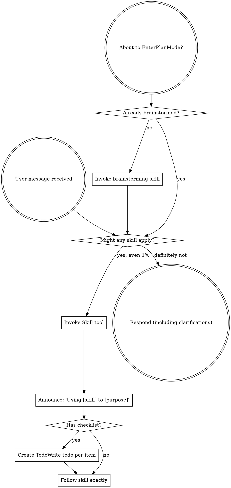

> Source: `obra/superpowers/skills/using-superpowers/SKILL.md` (pinned in `community/SOURCES.yaml`)

<SUBAGENT-STOP>
If you were dispatched as a subagent to execute a specific task, skip this skill.
</SUBAGENT-STOP>

<EXTREMELY-IMPORTANT>
If you think there is even a 1% chance a skill might apply to what you are doing, you ABSOLUTELY MUST invoke the skill.

IF A SKILL APPLIES TO YOUR TASK, YOU DO NOT HAVE A CHOICE. YOU MUST USE IT.

This is not negotiable. This is not optional. You cannot rationalize your way out of this.
</EXTREMELY-IMPORTANT>

## Instruction Priority

Superpowers skills override default system prompt behavior, but **user instructions always take precedence**:

1. User's explicit instructions
   - Includes CLAUDE.md, GEMINI.md, AGENTS.md, and direct requests.
   - Highest priority.
2. Superpowers skills
   - Override default system behavior where they conflict.
3. Default system prompt
   - Lowest priority.

If CLAUDE.md, GEMINI.md, or AGENTS.md says "don't use TDD" and a skill says "always use TDD," follow the user's instructions. The user is in control.

## How to Access Skills

**In Claude Code:** Use the `Skill` tool. When you invoke a skill, its content is loaded and presented to you—follow it directly. Never use the Read tool on skill files.

**In Copilot CLI:** Use the `skill` tool. Skills are auto-discovered from installed plugins. The `skill` tool works the same as Claude Code's `Skill` tool.

**In Gemini CLI:** Skills activate via the `activate_skill` tool. Gemini loads skill metadata at session start and activates the full content on demand.

**In other environments:** Check your platform's documentation for how skills are loaded.

## Platform Adaptation

Skills use Claude Code tool names. Non-CC platforms: see `references/copilot-tools.md` (Copilot CLI), `references/codex-tools.md` (Codex) for tool equivalents. Gemini CLI users get the tool mapping loaded automatically via GEMINI.md.

# Using Skills

## The Rule

**Invoke relevant or requested skills BEFORE any response or action.** Even a 1% chance a skill might apply means that you should invoke the skill to check. If an invoked skill turns out to be wrong for the situation, you don't need to use it.

## Red Flags

These thoughts mean STOP—you're rationalizing:

| Thought | Reality |
|---------|---------|
| "This is just a simple question" | Questions are tasks. Check for skills. |
| "I need more context first" | Skill check comes BEFORE clarifying questions. |
| "Let me explore the codebase first" | Skills tell you HOW to explore. Check first. |
| "I can check git/files quickly" | Files lack conversation context. Check for skills. |
| "Let me gather information first" | Skills tell you HOW to gather information. |
| "This doesn't need a formal skill" | If a skill exists, use it. |
| "I remember this skill" | Skills evolve. Read current version. |
| "This doesn't count as a task" | Action = task. Check for skills. |
| "The skill is overkill" | Simple things become complex. Use it. |
| "I'll just do this one thing first" | Check BEFORE doing anything. |
| "This feels productive" | Undisciplined action wastes time. Skills prevent this. |
| "I know what that means" | Knowing the concept ≠ using the skill. Invoke it. |

## Skill Priority

When multiple skills could apply, use this order:

1. Process skills first
   - Includes brainstorming and debugging.
   - These determine how to approach the task.
2. Implementation skills second
   - Includes frontend-design and mcp-builder.
   - These guide execution.

"Let's build X" → brainstorming first, then implementation skills.
"Fix this bug" → debugging first, then domain-specific skills.

## Skill Types

**Rigid** (TDD, debugging): Follow exactly. Don't adapt away discipline.

**Flexible** (patterns): Adapt principles to context.

The skill itself tells you which.

## User Instructions

Instructions say WHAT, not HOW. "Add X" or "Fix Y" doesn't mean skip workflows.

## Small Chain (End-to-End Workflow)

The standard development chain from idea to archive:

1. brainstorming
   - Explore requirements, design options, and output `design.md`.
2. writing-plans
   - Generate `tasks.md + plan.md + execution-routing-input.json`, then append plan-stage worklog.
3. small-chain-execution-router
   - Produce `execution-route.json` with `serial`, `parallel`, or `blocked`.
4. using-git-worktrees
   - Create isolated branch when `decision=serial` and isolation is still needed.
5. subagent-driven-development / parallel-subagent-development
   - Execute serial tasks with two-stage review, or execute safe parallel groups with route evidence.
6. verification-before-completion
   - Re-run the proving commands before any completion or delivery claim.
7. requesting-code-review
   - Required before `verify-change` for contract-grade or runtime-gate changes.
   - Produces or validates `code-review-result.json`.
8. verify-change
   - Produce graded report (CRITICAL/WARNING/SUGGESTION).
9. finishing-a-development-branch
   - Handle merge / PR / keep-branch / discard and clean up worktree state.
10. archive
   - Archive to `docs/archive/{feature}/...`.
   - Update `docs/{feature}/CHANGELOG.md`.
   - Only after the change is integrated on the target branch.

## 自动衔接

`## 流程导航` is the handoff surface for workflow skills. Use each skill's navigation section together with the active workflow contract to decide whether the next skill should be invoked immediately.

Auto-handoff in the same session when all of the following are true:
- the current skill's completion condition is satisfied
- the next step is unique, or the active conditional branch is objectively determined from current context
- the user did not ask to pause, stop, or review before continuing

Do not auto-handoff when any of the following is true:
- explicit user approval or review is still pending
- the next step is optional or branch-dependent and the active branch is not yet determined
- the current skill is `BLOCKED`, `FAIL`, or has an unresolved gate
- the current skill is terminal (`archive`)

Do not add an extra confirmation turn like "should I continue?" when the next step is already determined by the workflow.

For the active small-chain contract, route by context:
- `brainstorming → writing-plans`
- `writing-plans → small-chain-execution-router`
- `small-chain-execution-router → using-git-worktrees → subagent-driven-development` when `decision=serial` and isolation is still needed
- `small-chain-execution-router → subagent-driven-development` when `decision=serial` and isolation is already satisfied
- `small-chain-execution-router → parallel-subagent-development` when `decision=parallel`
- `small-chain-execution-router` stops when `decision=blocked`
- `subagent-driven-development / parallel-subagent-development → verification-before-completion`
- `verification-before-completion → requesting-code-review → verify-change` when contract-grade or runtime-gate surfaces are touched
- `verification-before-completion → verify-change` when no code-review gate is triggered
- `verify-change → finishing-a-development-branch` when branch integration or worktree cleanup is still pending
- `verify-change → archive` when the change is already integrated on the target branch
- `finishing-a-development-branch → archive` only after integration is complete
- `archive` is terminal

### Chain vs Independent Usage

Small-chain workflow skills (writing-plans, using-git-worktrees, subagent-driven-development, verify-change, finishing-a-development-branch, archive) are auto-invocable within the chain context. Their descriptions include chain prerequisites (e.g., "after brainstorming produces design.md") to prevent mis-triggering outside the chain.

Skills that are general principles (verification-before-completion, test-driven-development) remain manual-only — invoke them via slash command when needed independently.
