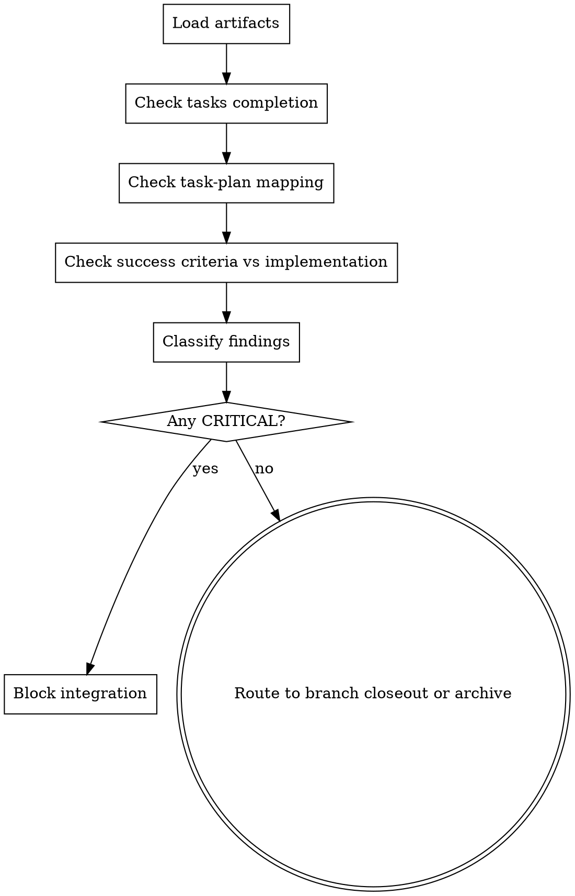

> Source: local small-chain runtime addition

# Verify Change

Use this skill after implementation work is finished and fresh verification evidence exists. It validates the full change against the small-chain artifacts stored under `docs/{feature}/YYYY-MM-DD-{change}/` before branch integration or archive.

## Hard Gate

**Do not approve branch integration or archive when any CRITICAL issue remains.**

## Inputs

1. Change directory
   - `docs/{feature}/YYYY-MM-DD-{change}/design.md`
   - `docs/{feature}/YYYY-MM-DD-{change}/tasks.md`
   - `docs/{feature}/YYYY-MM-DD-{change}/plan.md`
2. Implementation evidence
   - relevant code
   - test output
   - branch state

## Workflow



## Checks

1. Artifact completeness
   - Confirm `design.md`, `tasks.md`, and `plan.md` all exist.
   - Confirm the directory structure matches the small-chain contract.
2. Tasks completion
   - Every task entry in `tasks.md` must be `[x]`.
   - Any remaining `[ ]` is a CRITICAL finding.
3. Task-plan mapping
   - Run `scripts/check_task_plan_consistency.py`.
   - Any missing or unknown task id is a CRITICAL finding.
4. Design coverage
   - Compare `Success Criteria` in `design.md` with the implemented behavior.
   - Missing coverage is a CRITICAL finding.
5. Fresh verification evidence
   - Confirm the latest verification command output is present and matches the claimed passing state.
   - Missing or stale evidence is a CRITICAL finding.
6. Residual quality signals
   - Note warnings for weak evidence, stale docs, or risky assumptions.
   - Record suggestions for follow-up cleanup that does not block archive.
7. Contract-grade proof carryover
   - If `design.md` contains `Contract-Grade Preflight`, confirm each C1-C8 answer is implemented or explicitly out of scope.
   - Confirm fresh evidence covers declared source-of-truth rules, closed grammar/schema, ownership/waiver checks, failure contract, cutover surface, and proving categories.
   - Any implementation that changes source-of-truth, ref grammar, owner/waiver rules, or migration phases outside the approved design is a CRITICAL finding.
8. Adversarial review gate
   - If `design.md` has `Contract-Grade Preflight`, or the diff touches hooks, validators, installers, skills, runtime artifacts, migration/cutover scripts, or scripts that output `PASS`, `decision`, `verified`, `APPROVE`, or `status`, require active workset `code-review-result.json`.
   - `code-review-result.json.review_conclusion` must be `APPROVE`.
   - `code-review-result.json.gate_result` must be `PASS`.
   - The review must be newer than the latest fix evidence when `fix-result.json` exists.
   - Missing, stale, or non-PASS review evidence is a CRITICAL finding.

## Report Format

```markdown
# Verify Change Report

## Status
- PASS | FAIL

## CRITICAL
- [finding or `none`]

## WARNING
- [finding or `none`]

## SUGGESTION
- [finding or `none`]

## Evidence
- files checked
- commands run
- implementation references
- execution route checked
- parallel execution report checked when `decision=parallel`
- code-review-result.json checked when contract-grade/runtime-gate surfaces are touched
```

## Route Evidence Gate

Before branch integration or archive, inspect the active workset route artifacts:

1. `execution-route.json`
   - Required for routed small-chain work.
   - If `decision=blocked`, report `FAIL`.
   - If route hashes do not match current `tasks.md`, `plan.md`, or `execution-routing-input.json`, report `FAIL`.
2. `parallel-execution-report.json`
   - Required when `execution-route.json` has `decision=parallel`.
   - Every route group must be merged or explicitly blocked.
   - Every completed group must list proving commands and merge evidence.
3. Serial route
   - When `decision=serial`, `subagent-driven-development` evidence and fresh proving commands are sufficient.

## Code Review Evidence Gate

`verify-change` is not a substitute for adversarial code review. It checks artifact completion and success-criteria coverage; it does not by itself prove bug absence.

Before reporting `PASS`, require `code-review-result.json` when the change touches any contract-grade or runtime-gate surface:

- `contracts/`
- `shared/hooks/`
- `tools/community/`
- `community/superpowers/skills/`
- `install.sh`
- validators, migration/cutover helpers, route artifacts, or scripts that emit `PASS`, `decision`, `verified`, `APPROVE`, or `status`

The report must include:

- ten-dimension review coverage or equivalent reviewer evidence
- `review_conclusion=APPROVE`
- `gate_result=PASS`
- evidence-integrity coverage when the diff changes skills, hooks, validators, installers, artifacts, or status/decision scripts

## Exit Rules

1. CRITICAL exists
   - Stop and report `FAIL`.
   - Do not enter `finishing-a-development-branch` or `archive`.
2. No CRITICAL exists
   - Report `PASS`.
   - If branch integration or worktree cleanup is still pending, next step is `finishing-a-development-branch`.
   - If already on the target branch and no branch action is pending, next step is `archive`.

## 流程导航

- 当前完成条件：校验结果为 `PASS`，且不存在 `CRITICAL` finding。
- 下一步：若仍有分支集成或 worktree 清理待处理，进入 `finishing-a-development-branch`；若变更已在目标分支集成完成，进入 `archive`。
- 完整链路：`brainstorming → writing-plans → implementation-router → subagent-driven-development（serial） / parallel-subagent-development（parallel） → verification-before-completion → requesting-code-review（contract-grade/runtime-gate） → verify-change → finishing-a-development-branch → archive`

## Context Handoff Contract

- scope registry 是 `contracts/active-doc-scope.yaml`；验证只默认消费 `management_status in [managed, migrated]` 的 feature。
- `worklog.md` 最新记录中的 `handoff_status / state_ref / next_ref` 用于定位真实工件；small-chain PASS/FAIL 仍以 `tasks.md / plan.md / design.md / execution-route.json` 和验证证据为准。
- `decision=parallel` 时，`parallel-execution-report.json` 是 verify-change 必读证据。
- contract-grade/runtime-gate 变更时，`code-review-result.json` 是 verify-change 必读证据。
- `validate_context_contract.py` 阻断时，先修复 registry/worklog/ref 漂移，再继续 verify-change。
