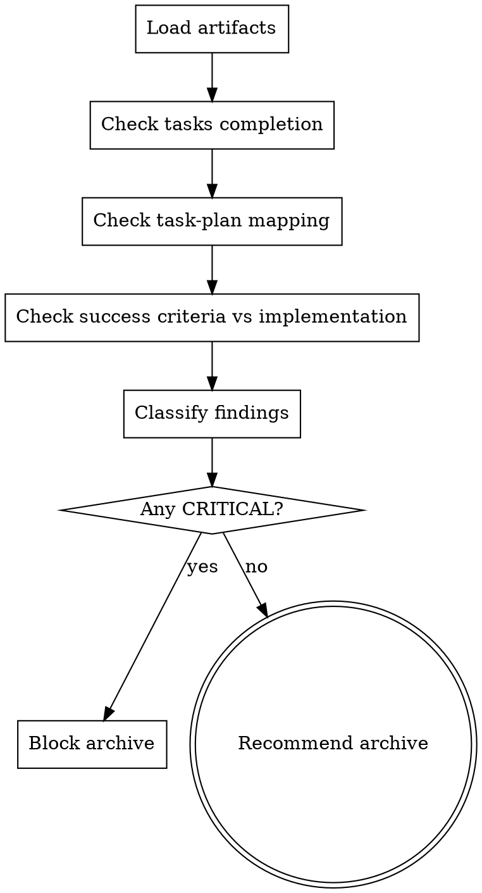

> Source: local small-chain runtime addition

# Verify Change

Use this skill after implementation work is finished and before archive. It validates the full change against the small-chain artifacts stored under `docs/{feature}/YYYY-MM-DD-{change}/`.

## Hard Gate

**Do not approve archive when any CRITICAL issue remains.**

## Inputs

1. Change directory
   - `docs/{feature}/YYYY-MM-DD-{change}/design.md`
   - `docs/{feature}/YYYY-MM-DD-{change}/tasks.md`
   - `docs/{feature}/YYYY-MM-DD-{change}/plan.md`
2. Implementation evidence
   - relevant code
   - test output
   - branch state

## Workflow



## Checks

1. Artifact completeness
   - Confirm `design.md`, `tasks.md`, and `plan.md` all exist.
   - Confirm the directory structure matches the small-chain contract.
2. Tasks completion
   - Every task entry in `tasks.md` must be `[x]`.
   - Any remaining `[ ]` is a CRITICAL finding.
3. Task-plan mapping
   - Run `scripts/check_task_plan_consistency.py`.
   - Any missing or unknown task id is a CRITICAL finding.
4. Design coverage
   - Compare `Success Criteria` in `design.md` with the implemented behavior.
   - Missing coverage is a CRITICAL finding.
5. Residual quality signals
   - Note warnings for weak evidence, stale docs, or risky assumptions.
   - Record suggestions for follow-up cleanup that does not block archive.

## Report Format

```markdown
# Verify Change Report

## Status
- PASS | FAIL

## CRITICAL
- [finding or `none`]

## WARNING
- [finding or `none`]

## SUGGESTION
- [finding or `none`]

## Evidence
- files checked
- commands run
- implementation references
```

## Exit Rules

1. CRITICAL exists
   - Stop and report `FAIL`.
2. No CRITICAL exists
   - Report `PASS`.
   - Recommend `archive`.
