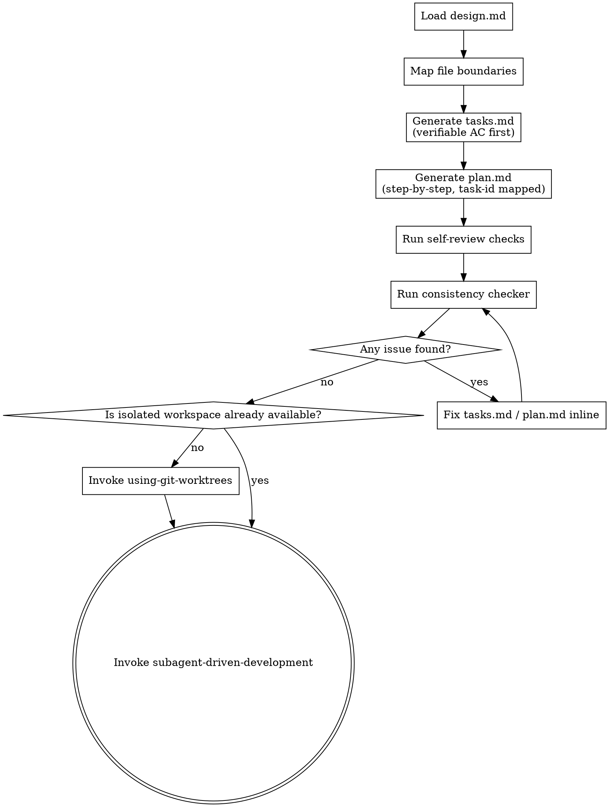

> Source: `obra/superpowers/skills/writing-plans/SKILL.md` (pinned in `community/SOURCES.yaml`)


# Writing Plans

## Overview

Write comprehensive implementation plans assuming the engineer has zero context for our codebase and questionable taste. Document everything they need to know: which files to touch for each task, code, testing, docs they might need to check, how to test it. Give them the whole plan as bite-sized tasks. DRY. YAGNI. TDD. Frequent commits.

Assume they are a skilled developer, but know almost nothing about our toolset or problem domain. Assume they don't know good test design very well.

**Announce at start:** "I'm using the writing-plans skill to create the implementation plan."

**Context:** This runs after `brainstorming` produces `design.md`. Use an isolated worktree before implementation if the current workspace is not already isolated.

**Input:** `docs/{feature}/YYYY-MM-DD-{change}/design.md`

**Outputs** (both under `docs/{feature}/YYYY-MM-DD-{change}/`):
1. `tasks.md`
   - acceptance checklist; single source of truth for completion status
2. `plan.md`
   - execution steps; references tasks but does not hold completion state

Generation order: generate `tasks.md` first (define verifiable deliverables and ACs), then generate `plan.md` (break each task into execution steps).

## Scope Check

If the spec covers multiple independent subsystems, it should have been broken into sub-project specs during brainstorming. If it wasn't, suggest breaking this into separate plans — one per subsystem. Each plan should produce working, testable software on its own.

## Process Flow



## File Structure

Before defining tasks, map out which files will be created or modified and what each one is responsible for. This is where decomposition decisions get locked in.

- Design units with clear boundaries and well-defined interfaces. Each file should have one clear responsibility.
- You reason best about code you can hold in context at once, and your edits are more reliable when files are focused. Prefer smaller, focused files over large ones that do too much.
- Files that change together should live together. Split by responsibility, not by technical layer.
- In existing codebases, follow established patterns. If the codebase uses large files, don't unilaterally restructure - but if a file you're modifying has grown unwieldy, including a split in the plan is reasonable.

This structure informs the task decomposition. Each task should produce self-contained changes that make sense independently.

## Tasks Document (tasks.md)

tasks.md is the single source of truth for completion status. plan.md does not hold completion state.

Template:

```markdown
# Tasks — {change-name}
Created: YYYY-MM-DD
Related plan: ./plan.md

## Acceptance Checklist
- [ ] T1 {deliverable description}
  - AC: {verifiable criteria}
- [ ] T2 {deliverable description}
  - AC: {verifiable criteria}

## Definition of Done
All tasks checked = ready for verify-change.
```

## Bite-Sized Task Granularity

Each step is one action (2-5 minutes):
- "Write the failing test" - step
- "Run it to make sure it fails" - step
- "Implement the minimal code to make the test pass" - step
- "Run the tests and make sure they pass" - step
- "Commit" - step

## Plan Document Header

Every plan MUST start with this header:

```markdown
# [Feature Name] Implementation Plan

> **For agentic workers:** REQUIRED SUB-SKILL: Use superpowers:subagent-driven-development to implement this plan task-by-task.

**Goal:** [One sentence describing what this builds]

**Architecture:** [2-3 sentences about approach]

**Tech Stack:** [Key technologies/libraries]

---
```

## Task Structure in plan.md

plan.md uses numbered lists (not checkbox syntax). Each step references the task-id it belongs to.

````markdown
### Task N: [Component Name] [T{N}]

Files:
- Create: `exact/path/to/file.py`
- Modify: `exact/path/to/existing.py:123-145`
- Test: `tests/exact/path/to/test.py`

1. [T{N}] Write the failing test

```python
def test_specific_behavior():
    result = function(input)
    assert result == expected
```

2. [T{N}] Run test to verify it fails

Run: `pytest tests/path/test.py::test_name -v`
Expected: FAIL with "function not defined"

3. [T{N}] Write minimal implementation

```python
def function(input):
    return expected
```

4. [T{N}] Run test to verify it passes

Run: `pytest tests/path/test.py::test_name -v`
Expected: PASS

5. [T{N}] Commit

```bash
git add tests/path/test.py src/path/file.py
git commit -m "feat: add specific feature"
```
````

## No Placeholders

Every step must contain the actual content an engineer needs. These are **plan failures** — never write them:
- "TBD", "TODO", "implement later", "fill in details"
- "Add appropriate error handling" / "add validation" / "handle edge cases"
- "Write tests for the above" (without actual test code)
- "Similar to Task N" (repeat the code — the engineer may be reading tasks out of order)
- Steps that describe what to do without showing how (code blocks required for code steps)
- References to types, functions, or methods not defined in any task

## Remember
- Exact file paths always
- Complete code in every step — if a step changes code, show the code
- Exact commands with expected output
- DRY, YAGNI, TDD, frequent commits

## Self-Review

After writing the complete plan, look at the spec with fresh eyes and check the plan against it. This is a checklist you run yourself — not a subagent dispatch.

1. Spec coverage
   - Skim each section and requirement in the spec.
   - Map each requirement to a task and list gaps.

2. Placeholder scan
   - Search for patterns from the "No Placeholders" section.
   - Fix every hit inline.

3. Type consistency
   - Verify types, signatures, and names are consistent across tasks.
   - Resolve drift such as `clearLayers()` vs `clearFullLayers()`.

If you find issues, fix them inline. No need to re-review — just fix and move on. If you find a spec requirement with no task, add the task.

## **HARD-GATE: Task-Plan Consistency Audit**

Before handoff, run the following checks. **STOP and fix** if any check fails:

1. Task-plan mapping completeness
   - Every task-id in `tasks.md` appears in `plan.md`.
   - Every `[T*]` in `plan.md` exists in `tasks.md`.
2. AC verifiability
   - Every AC can be checked by command, file check, or API call.
   - No subjective criteria such as "user confirms".
3. design.md coverage
   - Every success criterion in `design.md` has a corresponding task.
4. Placeholder scan
   - No TBD/TODO/pending in either file.

After manual audit passes, run `check_task_plan_consistency.py` to verify task-plan mapping completeness programmatically.

## Execution Handoff

If the current workspace is not already isolated, invoke `using-git-worktrees` first. Once isolation is satisfied, invoke `subagent-driven-development` to execute the plan task-by-task.

## 流程导航

- 当前完成条件：`tasks.md` 和 `plan.md` 已生成，self-review 与 task-plan consistency audit 已通过。
- 下一步：若当前还没有可用的隔离工作区，进入 `using-git-worktrees`；若隔离工作区已满足，进入 `subagent-driven-development`。
- 完整链路：`brainstorming → writing-plans → using-git-worktrees（按需） → subagent-driven-development → verification-before-completion → verify-change → finishing-a-development-branch → archive`
