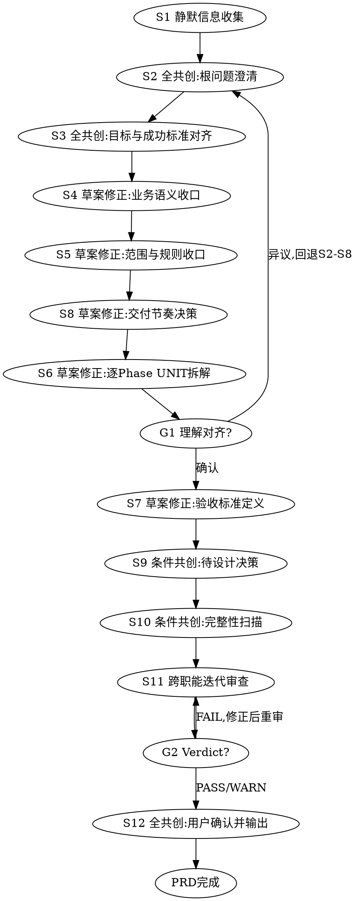

# /product Skill 结构重构设计文档

## 需求/动机

### 流程问题

当前 /product 流程为 S6(UNIT拆解) → S7(AC定义) → S8(Phase分组)，要求先拆完所有 UNIT 才能规划 Phase。但真实产品工作的顺序是先定交付节奏（几个阶段、每阶段交付什么价值），再在每个阶段范围内拆解功能细节。需求是一次性全部定义完并统一评审的，Phase 用于组织交付顺序，让用户尽早看到可用的东西。

### 结构问题

当前产出是单一 prd.md + 顶层 units/（所有 UNIT 平铺），Phase 目录只是空骨架。下游 skill（/design、/tech-lead）按 Phase 工作时，需要从全局 prd.md 里过滤当前 Phase 的 UNIT，容易误读其他 Phase 内容。每个 Phase 应该有自己完整的需求清单和 UNIT 文件。

## 目标

1. 流程顺序匹配真实产品思考方式：理解问题 → 定交付节奏 → 逐 Phase 拆功能 → 定验收标准
2. 每个 Phase 是自包含的需求单元：有自己的 prd.md 和 units/
3. 下游 skill 按 Phase 消费时，读取路径明确、无需过滤无关内容
4. 项目级上下文（问题、目标、约束、评审）集中在 brief.md，无信息重复

## 验收标准

### AC-1：结构正确性

- /product 产出 `docs/{feature}/brief.md` + `phase-{N}/prd.md` + `phase-{N}/units/UNIT-*.md`
- 单 Phase 项目也使用 `phase-1/` 结构
- 不存在顶层 `prd.md` 或顶层 `units/`
- brief.md 包含 20 个必需章节（原 21 个去掉"功能需求 UNIT 索引"，该章节移到 phase-{N}/prd.md）
- phase-{N}/prd.md 包含 3 个必需章节：阶段目标、入口与出口条件、功能需求（UNIT 索引）
- 共创摘要 7 阶段完整（根问题澄清、目标与成功标准对齐、语义/范围收口、Phase 规划、PRD/UNIT 与 AC、待设计决策/完整性、交付确认）

### AC-2：流程正确性

- SKILL.md 流程图为 S5→S8→S6→G1→S7→S9~S12
- S8 语义为"基于范围定义交付节奏"，能在没有 UNIT 的情况下产出 Phase 定义
- S6 按 Phase 范围拆解 UNIT，一次性全部呈现，UNIT 编号全局递增
- G1 呈现 Phase 计划 + 按 Phase 组织的 UNIT 清单，回退范围覆盖 S2-S8
- HARD-GATE 3 的 artifact set 为 `brief.md + phase-{N}/prd.md + phase-{N}/units/`
- S6 步骤描述包含引导："若某个 Phase 拆解后无 UNIT，应主动提示用户该 Phase 边界可能需要调整"
- S6 步骤描述包含校验："若某个 Phase 的 UNIT 数量超过 5，建议回到 S8 拆分该 Phase"

### AC-3：门禁正确性

- `bash tests/run-all.sh` 全部通过
- product/completion_check.sh 的 feature 定位（`resolve_feature_dir` + `TRANSCRIPT_PATTERN`）和 `should_run_gate` 必须同时覆盖 `brief.md`、`phase-{N}/prd.md` 和 `phase-{N}/units/UNIT-*.md` 三类路径，确保这些路径上的编辑都能正确定位到 `FEATURE_DIR` 并触发校验
- 门禁采用分阶段策略，避免流程中途全量校验自锁：
  - 成熟度信号：brief.md 的 `## 审查结论` 中包含可解析的 Verdict（`PASS`/`WARN`/`FAIL`）。这是 S11 跨职能评审完成的自然信号，不可能在 S8/S6/S7 中途出现，也不是可随意编辑的字段
  - 早期写入（审查结论无 Verdict 时，即 S8~S10 阶段）：仅做轻量结构检查（brief.md 存在性、正在编辑的文件的基本格式）
  - 全量校验（审查结论有 Verdict 时，即 S11 完成后）：运行完整 completeness_check（brief 20 章节 + phase-prd 3 章节 + UNIT 文件 + 空 Phase 检查 + 交叉验证 + 依赖校验）
  - S12 确认后再修改任一文件：审查结论 Verdict 仍存在，自动触发全量校验
  - 已知限制：门禁触发基于 Markdown 内容判定（与当前系统一致），理论上可通过编辑 Verdict 字段绕过。在 AI 驱动的工作流中，这是实践上可接受的权衡——AI agent 按流程步骤产出内容，不会随意编辑 Verdict。如未来需要更强保证，可引入外部状态文件
  - 需补自动化测试用例：(1) S8 仅产出骨架时不触发全量校验 (2) S6 中途写入部分 UNIT 不触发全量校验 (3) S11 写入 Verdict 后触发全量校验 (4) 确认后再编辑 UNIT 仍触发全量校验
- product/completion_check.sh 校验 brief.md 的 20 个必需章节
- product/completion_check.sh 遍历每个 phase-{N}/prd.md 校验 3 个必需章节
- product/completion_check.sh 遍历每个 phase-{N}/units/ 校验 UNIT 文件（闭环定义、排除项、AC 三场景）
- UNIT 交叉验证包含三层：
  - Phase 内校验：phase-{N}/prd.md UNIT 索引 vs phase-{N}/units/ 文件一致
  - 全局依赖校验：汇总所有 UNIT 的"依赖 UNIT"字段，验证依赖目标存在且所在 Phase 顺序合法
  - 路由一致性校验：brief.md 交付计划的 UNIT 工作区映射 vs phase-{N}/prd.md UNIT 索引 vs 实际 phase-{N}/units/UNIT-*.md 文件三方一致
- 共创摘要校验 7 阶段（含"Phase 规划"和"PRD、UNIT 与 AC"）
- MVP 全局统计（遍历所有 phase-{N}/units/），3+ 全 MVP 时检查 brief.md 中的 MVP 最小闭环说明
- 交付计划表格校验包含"定义文件"列

### AC-4：下游输入契约与兼容性

下游 skill 不是"只改路径"——每个 skill 必须建立显式的多工件输入契约：

| 下游 Skill | 必读 brief.md 章节 | 必读 phase-{N}/prd.md | 必读 phase-{N}/units/ |
|-----------|-------------------|----------------------|---------------------|
| /design | 目标、影响范围、GAC-*、DD-*、CON-*、审查结论 | 阶段目标、UNIT 索引 | 全部 UNIT 文件 |
| /test-design | 目标、用户角色与核心场景、范围/本期不交付、当前/目标业务流程、GAC-*、CON-*、全局排除项 | UNIT 索引 | 全部 UNIT 文件（AC 提取） |
| /tech-lead | 目标、DD-*、CON-*、审查结论 | UNIT 索引 | 全部 UNIT 文件 |
| /qa | 目标、用户角色与核心场景、范围/本期不交付、当前/目标业务流程、GAC-*、CON-*、全局排除项、业务规则 | UNIT 索引 | 全部 UNIT 文件（验收基线） |
| /project-manager | 交付计划、CON-* | UNIT 索引 | — |
| /analyze | 全部章节（一致性扫描） | UNIT 索引 | 全部 UNIT 文件 |
| /review | 影响范围、审查结论 | — | — |
| /fix | 目标、影响范围、CON-* | UNIT 索引（定位修复范围） | 相关 UNIT 文件 |

- 每个下游 SKILL.md 的前置条件和读取输入步骤必须明确列出 brief.md + phase-{N}/prd.md + phase-{N}/units/ 的读取责任
- common.sh 函数从 brief.md 读取交付计划，Phase 上下文解析正确
- 所有下游 completion_check.sh 使用新函数名
- 所有 reviewer prompt 引用 `brief.md + phase-{N}/prd.md + phase-{N}/units/`
- phase-selection-protocol.md 更新为读取 brief.md，并统一 Phase 选择优先级：显式目标/当前编辑路径 > 第一个非 DONE Phase > fallback。common.sh 和 phase-selection-protocol.md 必须使用同一套选择逻辑，避免 hook 和 skill 选到不同 Phase
- contracts/skill-chain.yaml 的工件链从 `prd.md + units/UNIT-*.md` 更新为 `brief.md + phase-{N}/prd.md + phase-{N}/units/UNIT-*.md`
- shared/agents/*.md（designer、tech-lead、qa、test-designer）的输入路径更新
- 机械验证（零残留）通过可执行脚本实现，纳入 `tests/run-all.sh`：
  - 使用 `rg`（ripgrep）而非 `grep -P`，确保 Darwin/Linux 可移植
  - 残留扫描实现为可执行测试脚本（纳入 `tests/run-all.sh`），扫描范围限定为运行时消费者目录：`shared/skills/`、`shared/agents/`、`shared/protocols/`、`contracts/`、相关 `tests/`。覆盖以下旧合同形式：
    - 文本路径：`docs/{feature}/prd.md`、`docs/{feature}/units/UNIT-*.md`
    - 脚本变量：`$FEATURE_DIR/prd.md`、`$FEATURE_DIR/units`
    - 正则/glob：`docs/*/prd.md`、`units/UNIT-[0-9]+\.md`（非 phase-*/units/ 路径下的）
    - 旧函数名：`_from_prd`（全仓库扫描，无合法例外）
  - 正向断言：核心下游 SKILL.md（design、test-design、tech-lead、qa）必须包含 `brief.md` 引用（确认新合同已落地）
  - 具体 regex 模式在实现时根据实际命中情况调整，设计文档只约定意图和扫描范围
  - 扫描范围：仓库根目录递归，排除 `docs/product-restructure/`（本设计文档）和 `docs/archive/`（归档目录）
  - 实施时序：设计文档在全部变更完成并验证通过后归档到 `docs/archive/`

### AC-5：内容质量

- phase-splitting-guide.md 提供范围驱动的 Phase 决策框架，包含：切分原则、信号识别、反模式、校验规则（S6 后生效）、默认行为（单 Phase）
- phase-splitting-guide.md 不包含任何以 UNIT 数量作为 S8 决策输入的规则（UNIT 计数仅出现在 S6 后的校验规则部分）
- brief-template.md 覆盖所有 20 个项目级必需章节 + 交付计划 + MVP 说明，字段无遗漏
- phase-prd-template.md 轻量（阶段目标 + 入口出口条件 + UNIT 索引 + 顶部引用链接），无 CON-*/DD-*/GAC-* 内容复制
- 旧 prd-template.md 已删除，不残留在仓库中

## 修改范围

### 产出结构定义

```
改后:
docs/{feature}/
├── brief.md                  项目级简报
├── phase-1/
│   ├── prd.md                Phase 1 需求清单
│   ├── units/                Phase 1 UNIT 定义
│   │   ├── UNIT-1.md
│   │   └── UNIT-2.md
│   ├── unit-1/               Phase 1 执行产物（下游填充）
│   └── unit-2/
└── phase-2/
    ├── prd.md
    ├── units/
    │   └── UNIT-3.md
    └── unit-3/
```

### brief.md 内容

项目级文档，包含所有跨 Phase 共享的信息：

- 业务背景与根问题、目标与成功标准、关键假设
- 用户角色与核心场景
- 业务术语、业务对象、当前/目标业务流程
- 范围/本期不交付、业务规则、影响范围
- 非功能需求(GAC-*)、全局排除项、前置约束(CON-*)、待设计决策(DD-*)
- 已排查并排除的潜在问题、MVP 最小闭环说明
- 共创摘要（7 阶段）、交付确认
- 审查结论（审查汇总 + 审查问题台账）
- 交付计划（含 Phase 定义 + UNIT 工作区映射表，表格增加"定义文件"列）
- 交接项

### phase-{N}/prd.md 内容

Phase 级需求清单，轻量文档：

- 顶部引用：`> 项目背景、约束与设计决策见 [brief.md](../brief.md)`
- 阶段目标（一段话）
- 入口与出口条件
- 功能需求（UNIT 索引）：表格含 UNIT 编号、标题、闭环目标、优先级、依赖、定义文件路径

不包含 CON-*/DD-*/GAC-* 的内容复制，仅通过引用链接指向 brief.md。

### 流程变更



### S8 语义重定义

- 位置：S5 之后、S6 之前
- 输入：S5 范围产出（无 UNIT）
- 决策逻辑：基于范围/交付价值定义 Phase（非 UNIT 计数）
- 引用：phase-splitting-guide.md（重写为范围驱动）
- 触发条件：始终执行（不再是"UNIT >= 4 时"条件触发）
- 产出：Phase 定义 + `phase-{N}/` 目录 + `phase-{N}/prd.md` 骨架
- 共创模式：草案修正

### S6 语义调整

- 位置：S8 之后、G1 之前
- 输入：S8 产出的 Phase 定义（每个 Phase 的范围边界）
- 过程：在每个 Phase 范围内拆解 UNIT，一次性全部完成并呈现
- 产出路径：`phase-{N}/units/UNIT-*.md`
- UNIT 编号：全局递增（不按 Phase 重置）
- 引导规则：空 Phase 提示用户调整、UNIT >5/Phase 提示拆分
- 共创模式：草案修正

### common.sh 函数变更

| 原名 | 新名 | 内部变更 |
|------|------|---------|
| `resolve_current_phase_context_from_prd` | `resolve_current_phase_context` | `prd.md` → `brief.md` |
| `resolve_work_dir_from_prd` | `resolve_work_dir` | 内部调用改名 |
| `resolve_phase_work_dir_from_prd` | `resolve_phase_work_dir` | 内部调用改名 |

函数签名不变，内部改读取路径和函数名。行为补充：当 `TOOL_FILE_PATH` 包含 `phase-{N}/` 路径时，Phase 解析必须优先从被编辑文件的路径中提取 Phase 编号，而非仅依赖"第一个非 DONE Phase"回退逻辑。需补回归测试：phase-1 未完成时编辑 phase-2/ 下文件，门禁仍应锁定 phase-2。

### 关键设计决策

| 决策 | 结论 | 理由 |
|------|------|------|
| UNIT 编号 | 全局递增，不按 Phase 重置 | 避免跨 Phase 引用歧义 |
| CON-*/DD-*/GAC-* 归属 | 全部在 brief.md，phase-prd 只放交叉引用链接 | 消除漂移风险，brief.md 是唯一真源 |
| UNIT 工作区映射 | 放 brief.md 交付计划中 | common.sh 只读一个文件即可定位 |
| 审查结论 | 放 brief.md（项目级一次性审查） | 需求一次性定义完、一次性评审 |
| MVP 检查 | 全局统计（遍历所有 phase-{N}/units/） | MVP 是项目级概念 |
| 空 Phase 处理 | S6 提示用户调整 + completion_check.sh 硬门禁（每个 phase-{N}/ 至少包含一个 UNIT 文件） | 软引导（S6 提示）+ 硬兜底（门禁阻断） |
| UNIT 超限（>5/Phase） | S6 完成后提示，建议回退 S8 拆分 | UNIT 计数从 S8 输入降级为 S6 事后校验 |
| 向后兼容 | 不兼容旧结构 | 减少复杂度 |
| 提交策略 | 一次性原子提交 | 结构变更必须全局同步 |

### 改什么

| 层 | 文件 | 数量 |
|----|------|------|
| 共享基础 | common.sh（函数改名+内部路径）、constraint.sh（注释更新） | 2 |
| Product 核心 | SKILL.md、completion_check.sh、phase-splitting-guide.md（重写）、conversation-guide.md、completeness-checklist.md、3 个 reviewer prompt | 8 |
| Product 模板 | brief-template.md（新建）、phase-prd-template.md（新建）、prd-template.md（删除） | 3 |
| 下游 SKILL.md | design、tech-lead、test-design、qa、project-manager、review、fix、analyze、ux | 9 |
| 下游脚本 | design、tech-lead、test-design、qa、project-manager、review 的 completion_check.sh | 6 |
| 下游 references | 7 个 reviewer prompt + design template-notes + design-template + qa-report-template + methodology + consistency-report-template + check-matrix + docs-scan-rules | 14 |
| 协议 | phase-selection-protocol.md | 1 |
| 链路契约 | contracts/skill-chain.yaml | 1 |
| Agent 定义 | shared/agents/designer.md、tech-lead.md、qa.md、test-designer.md、code-reviewer.md | 5 |
| 测试 | test-skill-output-and-gate-contract.sh、test-phase-context-resolution.sh、test-eval-fixtures-contract.sh | 3 |
| Eval | fixtures + scenarios + graders（7 个文件） | 7 |
| **总计** | | **~62** |

### 不改什么

- UNIT 文件格式（closed-loop-unit-spec.md 不变）
- AC 编号格式（AC-U{N}-{N} 不变）
- phase-{N}/unit-{M}/ 执行产物目录结构不变
- 下游 skill 的流程步骤编号和共创模式不变（输入源和读取契约需更新，见 AC-4）
- S11 审查流程不变（仍是 3 视角一次性审查）
- S1-S5、S9-S10 的步骤语义不变

### 旧结构处理

- 不提供自动迁移脚本或双读兼容窗口
- 已有 `docs/{feature}/prd.md + units/` 结构的项目需要重新运行 /product 生成新结构后，下游 skill 才能消费
- 切换日前应通知所有使用者，确认无进行中的项目会因结构切换而中断
- 发布前验证：运行 `find docs -maxdepth 2 -name 'prd.md' -not -path '*/product-restructure/*' -not -path '*/archive/*'` 确认仓库内无活跃旧结构项目（仅检查 feature 根层 prd.md，不误报 phase-{N}/prd.md）

### 明确不做

- 旧结构自动迁移脚本
- 新建 /roadmap skill
- UNIT 文件格式变更（不加"所属 Phase"字段，Phase 归属由目录结构隐含）
- 下游 skill 流程重构

### 最高风险文件

1. **common.sh**（`resolve_current_phase_context` 函数）：bug 级联到所有 skill 的 completion hook
2. **product/completion_check.sh**：571 行，6 处逻辑重写 + 4 处新增逻辑
3. **phase-splitting-guide.md**：需要全新的范围驱动内容创作，直接决定 S8 AI 行为质量
