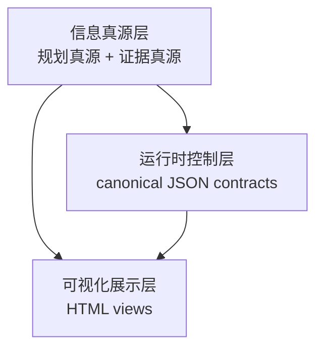
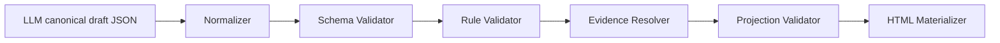

# 标准链路契约基础层设计

## Why

当前标准链路把 `md template`、skill 文案、关键词匹配和运行时控制混在一起：LLM 输出高噪音、脚本校验脆弱、状态流转依赖自然语言章节与措辞。结果不是“文档不好看”，而是“控制面不稳定”。

本次设计把标准链路重构为 `canonical JSON + evidence refs + HTML` 三层体系，目标是把机器消费和人类阅读彻底分层：LLM 与脚本只面对稳定契约，人类统一看派生展示，不再让运行时 process `md` 承担真源与门禁职责。

## Scope

- In scope:
  - 标准链路与执行辅助角色：`product / design / test-design / tech-lead / developer / verify / review / qa / delivery-owner / user-decision writer`
  - canonical contract 基础层：共享核心契约、各工件独立 schema、统一 vocabulary、refs/version/transition 规则
  - validator 基础设施：schema validator、rule validator、evidence resolver、projection validator
  - HTML 投影契约：HTML 只从 canonical JSON + evidence refs 派生
  - 标准链路默认切换：旧 process `md` 退出运行时主链路
- Out of scope:
  - 轻量级链路
  - HTML 交互写回、签收按钮、重跑入口
  - 证据层“大一统 schema”
  - 本次直接重构非标准链路技能

## Problem Statement

现状的核心问题有四类：

1. `md` 同时承担真源、状态、解释、展示四种职责，职责混杂。
2. `completion_check.sh` 之类的脚本主要靠章节标题和关键词匹配判定，容易因措辞变化、顺序变化或漏写一行而漂移。
3. 下游 LLM 需要重复读取长篇自然语言才能提炼状态，导致上下文噪音大、token 浪费、稳定性差。
4. 运行时隐藏逻辑分散在 skill、template、脚本和历史文档中，缺少统一契约层，导致 replay、接管和升级判断都不够硬。

## Goals

- 标准链路的 LLM 规范输出统一为 canonical JSON。
- 运行时控制逻辑只依赖 JSON 契约中的控制字段，不依赖自然语言说明字段。
- HTML 成为唯一的人类阅读面，但不参与控制流，也不是真源。
- 原始证据继续保留，并通过稳定 `evidence_ref` 被引用。
- 旧 process `md` 在标准链路内退出官方输出与消费路径，不保留双真源。
- validator 体系替代关键词匹配，默认 fail-closed。

## Non-Goals

- 不把所有知识都压成纯枚举字段；JSON 中允许受约束文本字段与嵌套对象。
- 不把 `prd / design / tasks / plan` 之外的所有历史文档一次性迁移完。
- 不追求一版完成所有 UI 细节；HTML v1 只解决浏览、筛选、聚合和跳转。
- 不让 HTML 成为状态回写入口。

## Design Principles

1. **格式不是关键，契约才是关键**
   - `json` 与 `md` 都只是表达格式；真正决定稳定性的，是 schema、消费规则和 fail-closed 校验。
2. **控制字段与说明字段分离**
   - JSON 契约中既允许强结构化控制字段，也允许受约束文本字段；运行时控制只消费前者。
3. **真源、控制、展示三层分离**
   - 信息真源层定义事实与证据，运行时控制层定义状态与流转，展示层定义阅读方式。
4. **派生物不得反向定义真源**
   - HTML 不能回写状态；说明文本不能替代控制字段；规范化层不能偷偷补业务语义默认值。
5. **默认 fail-closed**
   - 缺关键字段、非法枚举、断链引用、混版本消费、非法阶段流转时直接失败。

## Three-Layer Model

### 信息真源层

- 规划真源：
  - `brief`
  - `phase-prd`
  - `unit-definition`
  - `design`
  - `mod`
  - `adr`
  - `test-cases`
  - `plan`
- 证据真源：
  - 测试输出
  - 日志
  - trace
  - browser evidence
  - review findings
  - QA 观察文本

职责：定义事实、约束、证据。  
说明：本层长期可以 JSON-backed，但这次重点不是重构其全部历史内容，而是把标准链路的 canonical 输出收束到统一契约上。

### 运行时控制层

- 以 canonical JSON 为唯一运行时控制真源。
- 承载状态、门禁、流转、版本、引用、放行、签收与恢复信号。
- 脚本与下游 agent 只消费这一层。

### 可视化展示层

- 从 canonical JSON + evidence refs 派生 HTML。
- 只负责浏览、筛选、聚合、跳转。
- 不是状态真源，不参与控制流。

## Canonical Artifact Model

### 规划层 canonical artifacts

- `brief.json`
- `phase-prd.json`
- `unit-definition.json`
- `design.json`
- `mod.json`
- `adr.json`
- `test-cases.json`
- `plan.json`
- `tasks.json`

### 执行层 canonical artifacts

- `developer-report.json`
- `verify-result.json`
- `code-review-result.json`
- `qa-result.json`
- `delivery-state.json`
- `artifact-registry.json`
- `signoff-package.json`
- `user-decision.json`

### Projection sidecars

- `projection-manifest.json`

### Evidence artifacts

证据层不做大一统正文 schema，只统一最小引用合同：

- `evidence_id`
- `type`
- `producer`
- `created_at`
- `ref_target`

原始正文保留在各自证据文件中，canonical JSON 只保存稳定引用。

## Shared Core Contract

共享核心契约只承载跨工件必须统一的公共语言，不承载某个工件自己的正文结构。

共享核心契约分三层，避免把运行时字段污染到全部 artifact：

- **Core Envelope**
  - 所有 canonical artifact 必带
  - 仅包含身份、版本、引用、authority、来源信息
- **Runtime Flow Extension**
  - 仅运行时控制 artifact 必带
  - 包含 stage、transition、gate、blocking、next_action 语义
- **Projection Extension**
  - 仅需要进入 HTML 投影的 artifact 必带
  - 包含 title、sort_key、filter_tags、jump_anchor 与 projection provenance

### 1. 身份与版本

所有 canonical artifact 必带：

- `artifact_type`
- `artifact_id`
- `schema_version`
- `producer`
- `produced_at`
- `chain_version`
- `chain_registry_digest`
- `authority_scope`
- `authoritative_fields`

仅绑定静态实施基线的 artifact 必带：

- `baseline_plan_version_ref`
- `baseline_tasks_version_ref`

仅 runtime control artifact 必带：

- `active_plan_version_ref`
- `active_tasks_version_ref`

### 2. 引用与追踪

- `parent_refs`
- `goal_source_refs`
- `constraint_source_refs`
- `obligation_source_refs`
- `execution_basis_refs`
- `evidence_refs`
- `related_issue_ids`

### 3. 统一 vocabulary

- `status`
- `decision`
- `severity`
- `priority`
- `gate_result`
- `release_recommendation`
- `control_action`

### 4. 链路流转

- `current_stage`
- `allowed_next_stages`
- `required_prerequisites`
- `prerequisite_status`
- `blocking_transition_reason_codes`
- `transition_decision`

### 5. 展示投影最小字段

- `title`
- `stage`
- `sort_key`
- `filter_tags`
- `jump_anchor`

### 6. 字段适用边界

| 字段组 | 是否所有 artifact 必带 | 说明 |
|---|---|---|
| Core Envelope | 是 | 统一身份、版本、引用、producer、authority；其中 `baseline_plan_version_ref / baseline_tasks_version_ref` 只对绑定静态基线的 artifact 强制 |
| Runtime Flow Extension | 否 | 仅 `delivery-state / signoff-package / user-decision / qa-result / verify-result` 等运行时控制工件需要 |
| Projection Extension | 否 | 仅需要进入 HTML 聚合展示的 artifact 需要 |

规划真源工件如 `brief.json / adr.json / mod.json` 不强制带 `current_stage / allowed_next_stages / sort_key / filter_tags`，除非它们被显式纳入投影范围。

`allowed_next_stages` 不是 authoritative stage source；它只允许作为投影/调试字段存在，且必须是全局 transition matrix 的真子集或等价映射。

## Contract Semantics

本设计不把“有语义”与“可结构化”对立起来。相反：

- **控制语义** 用强结构化字段表达：
  - 例如 `status`、`control_action`、`release_recommendation`
- **说明语义** 也可以放在 JSON 中：
  - 例如 `summary_text`、`remaining_gap_text`、`risk_acceptance_basis`
- **运行时裁决** 只能依赖控制字段，不能依赖说明文本字段做模糊推理

因此 canonical JSON 允许：

- 枚举字段
- 布尔字段
- 稳定 ID
- 嵌套对象
- 受约束文本字段
- 真源引用

不再要求“有自然语言就必须回到 `md`”。

## Vocabulary Registry

共享 vocabulary 不能只停留在“会有统一词表”的承诺层，必须冻结最小命名与枚举规则，保证 schema / rule / replay / projection 说的是同一种语言。

### 最小 registry 范围

- `status`
  - `PENDING / IN_PROGRESS / PASS / FAIL / BLOCKED / N_A / CLOSED`
- `gate_result`
  - `PASS / FAIL / CONDITIONAL / NOT_RUN / N_A`
- `release_recommendation`
  - `ALLOW / CONDITIONAL_ALLOW / BLOCK / DEFER`
- `control_action`
  - `CONTINUE / ESCALATE / REPLAN / BLOCK / REQUEST_DECISION / CLOSE`
- `decision`
  - `APPROVE / REJECT / ACCEPT_RISK / REQUEST_CHANGES / ACKNOWLEDGED`
- `severity`
  - `S0 / S1 / S2 / S3`
- `priority`
  - `P0 / P1 / P2 / P3`
- `runtime_status`
  - `PENDING / READY / IN_PROGRESS / BLOCKED / VERIFIED / FAILED / CLOSED`
- `sign_off_status`
  - `PENDING / SIGNED_OFF / REJECTED / SUPERSEDED`
- `business_risk_acceptance_status`
  - `NOT_REQUIRED / PENDING / ACCEPTED / REJECTED / SUPERSEDED`

### 稳定标识命名规则

- `issue_id`
  - `{producer-prefix}-{NNN}`，例如 `QAR-003`、`REV-012`
- `gate_id`
  - `{stage}-{gate-name}`，例如 `PHASE_QA-QA_C`
- `decision_code`
  - 大写蛇形，如 `NON_CONVERGENCE`
- `reason_code`
  - 大写蛇形，如 `MISSING_USER_DECISION`

规则：

- 同一语义不能在不同 artifact 中自造别名
- 新增枚举或 code 必须进入 registry 才能被 active consumption 使用
- projection 层只能展示 registry 已知状态，不得渲染隐式新状态

## Foundation Registry Bundle

`chain_version` 不能只是口头语义版本；它必须绑定到唯一的 foundation registry bundle。

bundle 至少覆盖：

- vocabulary registry
- authority registry
- stage registry
- compatibility matrix

规则：

- `chain_version` 必须映射到 `contracts/canonical/` 下唯一的 registry bundle
- 所有 canonical artifact 必须携带对应 bundle 的 `chain_registry_digest`
- validator / resolver / materializer / replay 必须校验 `chain_version + chain_registry_digest` 组合
- 同一 `chain_version` 出现多个 digest 时直接 fail-closed
- 任何 consumer 不允许内置“同 `chain_version` 的私有 registry 变体”

### goal closure 结果枚举

- `goal_closure[].result`
  - `MET / PARTIAL / NOT_MET / N_A`

一致性规则：

- `PARTIAL` 不得与 `sign_off_status=SIGNED_OFF` 静默组合，必须同时带 `remaining_gap_text` 或 waiver/acceptance 依据
- `NOT_MET` 不得与 `release_recommendation=ALLOW` 组合
- `N_A` 必须带 `reason_code`

## Task Registry And Runtime State

`tasks` 不能继续只停留在历史 `tasks.md` 的概念里，否则后续 `writing-plans`、执行状态与 `REPLAN` 生命周期都会失去单一真源。

本设计冻结两层任务语义：

### `tasks.json`

- producer: `tech-lead`
- 作用：任务注册表与执行基线真源
- 承载：
  - `task_id`
  - `task_title`
  - `phase_ref`
  - `unit_refs`
  - `scope_item_refs`
  - `design_refs`
  - `test_refs`
  - `depends_on`
  - `shared_files`
  - `batch`
  - `acceptance_targets`
  - `baseline_plan_version_ref`
- 约束：
  - 发布后 immutable
  - 发生 `REPLAN` 时不原地改写，生成新的 `tasks.json` 版本

### `delivery-state.json.tasks`

- producer: `delivery-owner`
- 作用：任务运行时状态真源
- 承载：
  - `task_id`
  - `runtime_status`
  - `owner`
  - `attempt_count`
  - `current_batch`
  - `active_blocker`
  - `next_action`
  - `latest_upstream_refs`
- 约束：
  - 只允许引用 `tasks.json` 已冻结的 `task_id`
  - 不允许修改任务静态定义
  - `REPLAN` 后必须切换到新的 `active_plan_version_ref + active_tasks_version_ref`

## Task Lineage Contract

`REPLAN` 不能只切版本，不冻结任务谱系；否则 task runtime、replay 和 validator 会各自发明继承规则。

### 稳定性规则

- 语义未变、仅重新排期的任务：
  - 保持原 `task_id`
- 任务被拆分：
  - 旧任务进入 superseded 状态
  - 新任务必须带 `supersedes_task_refs`
- 多任务被合并：
  - 新任务带多个 `supersedes_task_refs`
- 任务语义发生根本变化：
  - 必须创建新 `task_id`
  - 不允许复用旧 `task_id` 假装“同任务新版本”

### 必带字段

- `task_state`
  - `ACTIVE / SUPERSEDED / CANCELLED / CLOSED`
- `supersedes_task_refs`
- `derived_task_refs`
- `carry_forward_strategy`
  - `NONE / ATTEMPT_ONLY / BLOCKERS_ONLY / EVIDENCE_ONLY / FULL_RUNTIME_CONTEXT`

### carry-forward 规则

- `attempt_count` 只有在 `carry_forward_strategy` 明确允许时才能继承
- 已 finalize 的 upstream verdict 不得因任务 split/merge 被直接复用为新任务 verdict
- `delivery-state.json.tasks` 必须显式标注任务状态是“继承”“重建”还是“作废”

### validator 断言

- `supersedes_task_refs` 只能指向旧 `baseline_tasks_version_ref` 所绑定的任务谱系
- 同一个旧任务不得被多个新任务重复声明为 `FULL_RUNTIME_CONTEXT` 继承
- split/merge 后的任务集合必须仍能覆盖原 `acceptance_targets`
- 被 supersede 的任务不得继续作为 active task dispatch 目标

## Artifact Ownership

| Artifact | Producer | Primary Consumers | Scope |
|---|---|---|---|
| `brief.json` | `product` | `design / test-design / tech-lead` | feature |
| `phase-prd.json` | `product` | `design / test-design / tech-lead / qa / delivery-owner` | phase |
| `unit-definition.json` | `product` | `design / test-design / tech-lead / qa / delivery-owner` | unit |
| `design.json` | `design` | `test-design / tech-lead / developer / verify / review / qa / delivery-owner` | phase |
| `mod.json` | `design` | `test-design / tech-lead / developer / verify / review` | phase |
| `adr.json` | `design` | `tech-lead / delivery-owner` | phase |
| `test-cases.json` | `test-design` | `tech-lead / developer / qa / delivery-owner` | unit |
| `plan.json` | `tech-lead` | `delivery-owner / qa / verify` | phase |
| `tasks.json` | `tech-lead` | `delivery-owner / developer / verify / qa` | phase |
| `developer-report.json` | `developer` | `verify / delivery-owner` | unit-task |
| `verify-result.json` | `verify` | `delivery-owner` | unit-task |
| `code-review-result.json` | `review` | `delivery-owner / qa` | phase |
| `qa-result.json` | `qa` | `delivery-owner` | phase |
| `delivery-state.json` | `delivery-owner` | `delivery-owner / html materializer` | phase |
| `artifact-registry.json` | `runtime tooling`（authority 归 `delivery-owner`） | `resolver / validator / replay / html materializer` | phase |
| `projection-manifest.json` | `materializer` | `html viewer / replay / projection validator` | view |
| `signoff-package.json` | `delivery-owner` | `user-facing html / user-decision writer` | phase |
| `user-decision.json` | `user-decision writer` | `delivery-owner / html materializer / replay` | phase |

## Operation Matrix

除 producer / consumer 外，还必须冻结 create / update / finalize / override 权限，避免 implementation 时各脚本各自发明规则。

| Artifact | Create | Update | Finalize | Override | 备注 |
|---|---|---|---|---|---|
| `brief / phase-prd / unit-definition / design / mod / adr / test-cases / plan / tasks` | owner | `DRAFT` 可原地更新；`FINALIZED` 后仅允许新版本重发 | owner | 不允许 | 规划真源 finalize 后 immutable，修订靠新版本 |
| `developer-report / verify-result / code-review-result / qa-result` | owner | producer 仅可在本轮未 finalize 前更新 | producer | 不允许 | 下游只能消费，不能改写 verdict |
| `delivery-state.json` | `delivery-owner` | `delivery-owner` | `delivery-owner` | 不允许 | 允许聚合状态，但不能覆盖 upstream verdict |
| `artifact-registry.json` | `runtime tooling` | `runtime tooling` 在 `delivery-owner` 授权下追加新 revision | `delivery-owner` | 不允许；恢复以新 revision 发布 | registry 是 active discovery 与 quarantine 的控制真源，不允许脚本私有状态绕开 |
| `projection-manifest.json` | `materializer` | `materializer` 可重建新版本 | `materializer` | 不允许；替换以新 version 发布 | sidecar 必须与具体 HTML 输出一一绑定，并可被 registry 隔离 |
| `signoff-package.json` | `delivery-owner` | `delivery-owner` | `delivery-owner` | 不允许 | 只表达交付建议与风险包，不代表用户决定 |
| `user-decision.json` | `user-decision writer` | `user-decision writer` | `user-decision writer` | 不允许；修正以 supersede 方式 | 写入通道是 `user-decision writer`，authority 仍归 `user` |
| validators | 不创建业务 artifact | 只读 | 不适用 | 不允许 | 只输出诊断与 verdict，不改业务语义 |
| materializer | 创建 view artifact | 可重建 | finalize 由构建过程完成 | 不允许 | 只能投影，不得派生新的控制真源 |

字段级规则：

- Core Envelope 字段发布后 immutable
- Runtime Flow 字段只有对应运行时 owner 可更新
- `*_result` verdict 字段 finalize 后 immutable
- `active_plan_version_ref / active_tasks_version_ref` 只允许 runtime owner 更新
- validator 不得补影响语义的默认值
- materializer 不得汇总出未定义状态源

## Draft And Finalize Lifecycle

规划真源不能简单粗暴地“一律 immutable”，否则 `writing-plans`、自审修订和 finalize gate 会互相打架。

### 生命周期

- `DRAFT`
  - 允许 owner 原地编辑
  - 不得被运行时 active consumption 消费
- `FINALIZED`
  - 进入正式版本
  - 受 immutable 约束
- `SUPERSEDED`
  - 有新 finalized 版本取代
  - 仅允许 lineage/replay 引用

### 规则

- `brief / phase-prd / unit-definition / design / test-cases / plan / tasks` 在 finalize 前允许原地编辑
- 进入 `FINALIZED` 时必须写入稳定 `artifact_id + version`
- 运行时只允许消费 `FINALIZED` 版本
- 对 `DRAFT` 的任何引用都必须 fail-closed

## Runtime Lifecycle Contract

runtime artifact 不能只靠 `Operation Matrix` 口头定义 finalize；否则不同实现会各自决定“原地改”还是“新版本替换”。

### verdict snapshot artifacts

适用对象：

- `developer-report.json`
- `verify-result.json`
- `code-review-result.json`
- `qa-result.json`
- `signoff-package.json`
- `user-decision.json`

生命周期：

- `DRAFT`
  - producer 可在 finalize 前编辑
  - 不得被 active gate 消费
- `FINALIZED`
  - verdict immutable
  - 允许被 replay / delivery-owner / signoff 消费
- `SUPERSEDED`
  - 被更新版本替代
  - 仅用于 lineage / replay

### state revision artifacts

适用对象：

- `delivery-state.json`
- `artifact-registry.json`

规则：

- 每次状态变化必须生成新的 `revision`，禁止绕过 revision 原地静默覆盖
- 同一 `phase` 在任一时刻只允许一个 active `delivery-state.json` revision
- 同一 `phase` 在任一时刻只允许一个 active `artifact-registry.json` revision
- 新 revision finalize 后，旧 active revision 进入 `SUPERSEDED`
- runtime consumer 只消费 registry 标记为 active 的最新 finalized revision

### view provenance artifacts

适用对象：

- `projection-manifest.json`

规则：

- 每次 HTML 重建都必须生成新的 `projection-manifest.json` version
- `projection-manifest.json` 必须与其 `rendered_artifact_ref` 一一对应
- 被 supersede 或 quarantined 的 HTML，不得继续关联旧 manifest 充当 active provenance
- active HTML view 必须通过 registry 指向唯一 active `projection-manifest.json`

### quarantine 与恢复

- `QUARANTINED` 只适用于 `artifact-registry.json` 中登记的 artifact entry，不是 producer 可自报状态
- `QUARANTINED -> FINALIZED` 恢复必须通过新 registry revision 发布
- 恢复记录必须带 `restore_basis_refs`
- replay 必须能区分“继续隔离”“显式恢复”“被 supersede 作废”

## User Decision Contract

用户签收和业务风险接受不能继续被隐含在 `delivery-owner` 产物里，必须单独成约。

### `signoff-package.json`

- producer: `delivery-owner`
- 作用：交付建议包
- 承载：
  - `delivery_owner_release_decision`
  - `release_recommendation`
  - `residual_risk`
  - `uncovered_boundary`
  - `known_issue_refs`
  - `goal_closure`
  - `evidence_refs`
- 不承载最终用户决定

### `user-decision.json`

- producer: `user-decision writer`
- 作用：记录用户侧的正式决定
- 必带字段：
  - `sign_off_status`
  - `business_risk_acceptance_status`
  - `actor_id`
  - `actor_type`
  - `decision_at`
  - `decision_source`
  - `decision_basis_refs`
  - `authority_proof_refs`
  - `decision_payload_digest`
  - `rationale_text`
  - `supersedes_ref`（如修订）

authority 规则：

- `delivery-owner` 不得写入 `sign_off_status` / `business_risk_acceptance_status`
- `user-decision writer` 只是录入通道，authority 归属仍然是 `user`
- `user-decision.json` 缺失时，标准链路不得进入 `CLOSED`
- `signoff-package.json` 与 `user-decision.json` 冲突时，以用户决策为准，但保留两者并供 replay 审计

### `user-decision writer` v1 定位

`user-decision writer` 不是抽象角色名，而是 v1 必做的受控录入通道。

- 职责：
  - 把用户明确给出的签收/接受风险决定写入 `user-decision.json`
  - 只做录入、schema 校验与 authority 证明
  - 不得替用户生成决定
- v1 唯一用户入口：
  - 受控 CLI
- v1 内部实现：
  - CLI 可调用脚本入口，但脚本不是面向用户的独立写入口
- v1 对最终落盘字段的冻结：
  - `user-decision.json.decision_source` 只允许 `CLI / MANUAL_IMPORT`
  - `SCRIPT` 只能作为 CLI 内部实现细节存在，不得作为最终用户决策 source 落盘
- v1 不允许：
  - 手工自由编辑 JSON 后直接落盘
  - HTML 表单或按钮直接写回
  - API 直写绕过 CLI authority 校验
  - 由 `delivery-owner` 代填用户决定

## Authority Registry

共享 authority validator 需要统一 grammar，而不是只给 `user-decision.json` 写特例。

### scope registry

- `artifact`
- `field`
- `phase`
- `signoff`

### field-path grammar

统一使用 JSONPath 子集：

- 根路径：`$`
- 对象字段：`$.goal_closure`
- 数组字段：`$.goal_closure[*].result`

### actor/source registry

- `actor_type`
  - `USER / AGENT / SYSTEM / TOOLING`
- `decision_source`
  - `CLI / SCRIPT / HTML_FORM / API / MANUAL_IMPORT`

规则：

- `authoritative_fields` 必须使用冻结后的 field-path grammar
- 未注册的 `actor_type / decision_source / authority_scope` 直接 fail-closed
- authority validator 必须校验 producer 通道与 authority actor 不混淆
- registry 枚举描述的是全局 grammar，不等于 v1 全部开放
- v1 只允许 `CLI / SCRIPT / MANUAL_IMPORT`，其中 `SCRIPT` 仅允许作为 CLI 内部通道
- finalized `user-decision.json` 若出现 `decision_source=SCRIPT` 直接 fail-closed

## Authority Proof Contract

authority 不能只靠 `actor_type=USER` 自报，必须有可验证 proof object。

### proof 引用方式

- `user-decision.json.authority_proof_refs[]` 必须至少包含 1 个 proof ref
- proof ref 在 v1 只允许指向 `evidence` artifact
- proof ref 必须与 `decision_payload_digest` 绑定

### 最小 proof 字段

- `proof_id`
- `proof_type`
  - `AUTHENTICATED_CLI_SESSION / SIGNED_RECEIPT / HUMAN_CONFIRMED_IMPORT`
- `verified_actor_id`
- `verified_channel`
- `verified_at`
- `proof_basis_refs`
- `decision_payload_digest`

### 规则

- `actor_id` 必须与 proof 中的 `verified_actor_id` 一致
- `decision_source=CLI` 时，proof 必须来自 authenticated CLI session
- `decision_source=MANUAL_IMPORT` 时，proof 必须带人工确认回执
- `SCRIPT` 若作为内部实现通道被记录到 proof lineage，必须可回溯到同一次 authenticated CLI session；不能单独构成最终 authority proof
- supersede 后的新 `user-decision.json` 必须携带新的 `authority_proof_refs`
- 缺 proof、proof 与 payload digest 不一致、proof actor 不一致时直接 fail-closed
- v1 不引入独立 `attestation` artifact family；authority 证明统一留在 evidence layer

## Waiver And Exception Contract

`条件放行 / 部分达成 / 风险接受` 不能只停留在场景名，必须冻结成可验证对象。

统一使用 `waiver_entries[]`，允许出现在：

- `signoff-package.json`
- `user-decision.json`

每条 `waiver_entry` 必带：

- `waiver_id`
- `scope_refs`
- `reason_code`
- `waiver_type`
  - `PARTIAL_GOAL / STALE_EVIDENCE / RISK_ACCEPTANCE / CONDITIONAL_RELEASE`
- `approved_by_ref`
- `decision_basis_refs`
- `expires_at`

规则：

- `release_recommendation=CONDITIONAL_ALLOW` 时，必须至少关联 1 条 `waiver_entry`
- `goal_closure[].result=PARTIAL` 时，必须能回溯到对应 `waiver_entry` 或 `remaining_gap_text`
- 过期 waiver 不得支撑 active signoff

## Reference Grammar

ref 规则必须冻结成统一 grammar，避免 schema validator、rule validator、evidence resolver、HTML materializer 各自发明一套。

### Canonical ref 语法

统一使用：

`artifact://{artifact_type}/{artifact_id}@{version}#{anchor}`

说明：

- `artifact_type`
  - 如 `brief`、`plan`、`tasks`、`qa-result`、`evidence`
- `artifact_id`
  - 稳定逻辑 ID，不直接等于文件路径
- `version`
  - 消费时绑定的有效版本，如 `v1`、`plan-v3`
- `anchor`
  - 工件内稳定锚点，缺失时不允许伪造默认锚点

### Path mapping 规则

- 物理文件路径通过 artifact registry 中的 `artifact_path` 提供
- ref 一律引用 `artifact_id`，不直接拼物理路径
- renderer 可以展示 `artifact_path`，但 validator 与 replay 只认 canonical ref

### 合法示例

- `artifact://brief/sample-feature.brief@v1#goal-001`
- `artifact://plan/sample-feature.phase-1.plan@plan-v3#plan-version`
- `artifact://tasks/sample-feature.phase-1.tasks@plan-v3#task-T3`
- `artifact://qa-result/sample-feature.phase-1.qa@plan-v3#qar-002`
- `artifact://evidence/sample-feature.phase-1.browser-trace@ev-17#trace-root`

### 规则

- 不允许相对路径 ref
- 不允许拼接式 `A + B + C` 复合文本 ref；复合引用必须用数组
- lineage refs 与 active consumption refs 必须显式分开
- anchor 缺失、未知 artifact type、版本缺失、跨 phase 非法引用时 fail-closed

## Artifact Registry Contract

canonical ref 已冻结后，仍需要唯一的物理解析真源，避免 resolver 各自实现路径猜测。

每个 cutover unit 必带 `artifact-registry.json`，至少包含：

- `scope_ref`
- `registry_revision`
- `artifact_id`
- `artifact_type`
- `version`
- `artifact_path`
- `lifecycle_state`
  - `DRAFT / FINALIZED / SUPERSEDED / QUARANTINED`
- `active_for_consumption`
- `produced_by`
- `restore_basis_refs`（恢复 revision 时必带）

规则：

- `artifact-registry.json` 的 authority owner 是 `delivery-owner`
- `runtime tooling` 只是生产通道，不拥有最终激活权限
- registry entry 的身份键是 `(artifact_type, artifact_id, version)`
- ref resolver 只能经由 `artifact-registry.json` 解析物理路径
- `active_for_consumption=true` 的 artifact 必须同时是 `FINALIZED`
- `QUARANTINED` artifact 不得被 validator、replay、materializer 当作有效输入
- 同一 `(artifact_type, scope_ref)` 同时最多只能有 1 个 `active_for_consumption=true`
- `active_for_consumption`、`lifecycle_state`、`QUARANTINED -> FINALIZED` 只允许通过新的 registry revision 变更
- registry revision 必须 append-only；不允许就地回写覆盖旧 revision
- `registry_revision` 只是文件 revision 标签，不足以单独证明恢复正确；replay 与 cutover 审计必须同时比对 active entry tuple 集合，至少包含 `(artifact_type, artifact_id, version, artifact_path, lifecycle_state, active_for_consumption)`

## Reference Semantics Registry

不仅 ref 语法要统一，ref 的语义类别也必须冻结。

### lineage refs

- `parent_refs`

### active requirement refs

- `goal_source_refs`
- `constraint_source_refs`
- `obligation_source_refs`
- `execution_basis_refs`

### active evidence refs

- `evidence_refs`

规则：

- lineage refs 只用于追溯，不参与 active verdict
- active requirement refs 必须全部来自当前有效上游 finalized artifact
- active evidence refs 必须通过 freshness / supersede 校验

## Version Compatibility Matrix

`schema_version / chain_version / chain_registry_digest / baseline_plan_version_ref / active_plan_version_ref` 语义不同，必须分开。

| 字段 | 作用 | 谁负责 | 是否参与 active consumption |
|---|---|---|---|
| `schema_version` | 当前 artifact 的结构版本 | producer | 是 |
| `chain_version` | shared core vocabulary 与全局约束版本 | foundation owner | 是 |
| `chain_registry_digest` | `chain_version` 对应 registry bundle 的精确内容指纹 | foundation owner | 是 |
| `baseline_plan_version_ref` | 当前 artifact 静态绑定的 plan 基线 | artifact producer | 否，除非该 artifact 本身是 baseline truth |
| `baseline_tasks_version_ref` | 当前 artifact 静态绑定的 tasks 基线 | artifact producer | 否，除非该 artifact 本身是 baseline truth |
| `active_plan_version_ref` | 当前运行时消费的执行基线 | runtime producer | 是 |
| `active_tasks_version_ref` | 当前运行时消费的任务注册表版本 | runtime producer | 是 |
| `parent_refs` | lineage / 历史来源 | producer | 否 |

规则：

- planning / verdict artifact 必须声明自己的 `baseline_*_version_ref`
- runtime control artifact 必须声明自己的 `active_*_version_ref`
- `signoff-package.json` 与 `user-decision.json` 同时属于 verdict snapshot 与 runtime control artifact，必须同时声明 `baseline_*_version_ref` 与 `active_*_version_ref`
- `chain_version` 与 `chain_registry_digest` 必须始终成对校验
- `parent_refs` 不能替代任何 `baseline_*` 或 `active_*` 字段
- `REPLAN` 后允许保留 lineage，但所有 runtime artifact 必须切到新的 `active_plan_version_ref + active_tasks_version_ref`
- schema/chain 组合不兼容时直接失败
- active requirement refs 必须与当前有效 `active_plan_version_ref + active_tasks_version_ref` 对齐
- 对 `signoff-package.json` 与 `user-decision.json`，`baseline_*` 绑定被评估/签收的证据基线，`active_*` 绑定写入当时的 phase 运行时基线；两组 ref 不一致时，除非该 artifact 已被 `SUPERSEDED` 且仅保留作 lineage/replay，否则直接 fail-closed
- `REPLAN` 后旧 `signoff-package.json` / `user-decision.json` 不得继续 active consumption，必须按新 baseline 与 active baseline 重新生成

最小判定矩阵：

| 场景 | 是否允许 |
|---|---|
| 新 `active_plan_version_ref` 消费旧 `qa-result` verdict | 否 |
| 同一 `chain_version` 但 `chain_registry_digest` 不同 | 否 |
| 新 `chain_version` 消费旧但兼容的 `schema_version` | 仅 matrix 明确允许时 |
| `parent_refs` 指向旧 plan，但 active `active_plan_version_ref` 正确 | 是 |
| `active_plan_version_ref` 正确但 `active_tasks_version_ref` 仍指向旧任务基线 | 否 |
| `REPLAN` 后继续复用旧 active verdict | 否 |

## Stage Registry And Transition Matrix

运行时流转必须有全局真源，不能只靠 artifact 自报。

### Stage registry

仅运行时控制 artifact 使用下列阶段：

- `PLANNING`
- `TASK_DISPATCH`
- `TASK_EXECUTION`
- `TASK_VERIFICATION`
- `PHASE_REVIEW`
- `PHASE_QA`
- `SIGNOFF_PENDING`
- `SIGNOFF_RECORDED`
- `CLOSED`
- `BLOCKED`
- `REPLAN_PENDING`

终态集合：

- `CLOSED`

外部可恢复终态：

- `BLOCKED`（等待外部依赖解除或用户补决策）

## Phase Stage Authority

运行时可以有多个 artifact 携带局部阶段信息，但 phase 级 authoritative stage 必须唯一。

- phase authoritative source:
  - `delivery-state.json.current_stage`
- local snapshot only:
  - `qa-result.current_stage`
  - `signoff-package.current_stage`
  - `user-decision.current_stage`

规则：

- 若 local snapshot 与 `delivery-state.json.current_stage` 不一致，以 `delivery-state.json` 为准
- 其他 artifact 的 `current_stage` 仅用于自描述与调试，不得反向推进 phase 状态
- replay oracle 必须以 `delivery-state.json.current_stage` 作为阶段真源
- `allowed_next_stages` 仅用于调试/投影；若存在，validator 只校验其是否是 transition matrix 的合法子集

### Transition matrix

| From | To | 是否允许 | 说明 |
|---|---|---|---|
| `PLANNING` | `TASK_DISPATCH` | 是 | 基线已冻结 |
| `TASK_DISPATCH` | `TASK_EXECUTION` | 是 | 已派发 |
| `TASK_EXECUTION` | `TASK_VERIFICATION` | 是 | 实现完成进入验收 |
| `TASK_VERIFICATION` | `TASK_EXECUTION` | 是 | fix loop |
| `TASK_VERIFICATION` | `PHASE_REVIEW` | 是 | 全部任务闭环 |
| `PHASE_REVIEW` | `TASK_EXECUTION` | 是 | review fix loop |
| `PHASE_REVIEW` | `PHASE_QA` | 是 | review pass |
| `PHASE_QA` | `TASK_EXECUTION` | 是 | qa fix loop |
| `PHASE_QA` | `SIGNOFF_PENDING` | 是 | qa pass |
| 任意非终态 | `BLOCKED` | 是 | 外部依赖或等待用户决策 |
| `BLOCKED` | 显式 `resume_stage` | 是 | blocker 清除后只能回到预先写明的恢复目标 |
| `SIGNOFF_PENDING` | `SIGNOFF_RECORDED` | 是 | 用户决定已写入 |
| `SIGNOFF_RECORDED` | `CLOSED` | 是 | 交付闭环完成 |
| 任意非终态 | `REPLAN_PENDING` | 是 | 触发再计划 |
| `REPLAN_PENDING` | `PLANNING` | 是 | 切入新版本 |
| 终态后继续推进 | 任意 | 否 | fail-closed |

字段语义：

- `current_stage` 为 producer 声明值
- validator 依据 stage registry 校验其合法性
- `allowed_next_stages` 不能与 stage registry 冲突
- `transition_decision` 必须能被前置条件与 authority 解释

## Blocked State Contract

`BLOCKED` 不能只表示“现在停住了”，还必须冻结“从哪停住、恢复去哪、凭什么恢复”。

进入 `BLOCKED` 时，`delivery-state.json` 必带：

- `blocker_id`
- `blocked_from_stage`
- `resume_stage`
- `blocker_reason_code`
- `blocker_opened_at`
- `blocker_basis_refs`

解除 `BLOCKED` 时，`delivery-state.json` 必带：

- `blocker_resolution_evidence_refs`
- `unblocked_by_ref`
- `unblocked_at`

规则：

- `resume_stage` 必须在进入 `BLOCKED` 时就显式写入，禁止恢复时推断
- `resume_stage` 只能是 `blocked_from_stage` 或 `REPLAN_PENDING`
- 没有 `blocker_resolution_evidence_refs` 不得离开 `BLOCKED`
- replay 必须核对 `blocked_from_stage / resume_stage / blocker_id`

## Upstream Closure Rule

仅靠字段合法与 ref 存在还不够，必须保证上游义务被完整承接。

统一规则：

- 每个 upstream goal 必须在下游 contract 中出现一次且仅一次
- 每个 constraint 必须通过 `constraint_source_refs` 被承接或显式标记 `N_A` + `reason_code`
- 每个 handoff obligation 必须通过 `obligation_source_refs` 在消费侧出现承接结果
- 每个 gate row 必须在下游 verdict / state 中有去向

禁止：

- 静默丢弃上游 goal / constraint / obligation
- 用自由文本总结代替显式承接行
- 让 replay 依赖人工脑补缺失承接

## Hidden Logic Pulled Into The Contract Layer

契约基础层必须吸收当前散落在 skill、template、脚本和历史文档中的隐藏逻辑：

- 阶段流转契约
- producer / consumer / authority 契约
- 版本消费一致性
- 新鲜度 / 观察时效
- 证据引用契约
- 稳定 `issue / gate / decision` 词表
- `N/A / 条件放行 / 部分达成` 分支语义
- authority contract
- 失败分类与恢复路径
- HTML projection contract
- schema 校验 vs 规则门禁校验分层
- replay / materialization 契约
- upstream obligation closure 契约

## Validation And Materialization Pipeline

### Normalizer

- 只做格式收敛。
- 不得修改业务语义。
- 不得补会影响语义的默认值。

### Schema Validator

负责字段、类型、枚举、版本、ref 格式校验。

### Rule Validator

负责校验：

- 前置条件
- 阶段流转
- producer 权限
- authority 约束
- 版本一致性
- 门禁合法性

### Evidence Resolver

负责确认：

- 引用目标真实存在
- 引用类型匹配
- 结论与证据关系可追溯
- 证据未过期且未被 supersede

### Projection Validator

负责确认：

- HTML 投影所需字段完整
- 跳转锚点可解析
- 不存在未定义状态源
- projection provenance 完整

### HTML Materializer

- 只读 canonical JSON + evidence refs
- 禁止偷读旧 process `md`
- 禁止偷读自由文本作为状态真源
- 必须产出 sidecar `projection-manifest.json`

## Evidence Contract

最小 evidence contract 需要扩到能支持 freshness、traceability 与 supersede。

必带字段：

- `evidence_id`
- `type`
- `producer`
- `created_at`
- `observed_at`
- `relation_type`
- `ref_target`
- `artifact_path`

可选字段：

- `valid_until`
- `superseded_by_ref`
- `content_digest`

规则：

- 没有 `observed_at` 的 evidence 不能参与 freshness 判定
- `superseded_by_ref` 存在时，旧 evidence 不能再作为 active evidence
- `relation_type` 至少区分 `proves / observes / blocks / traces`

## Freshness Comparator Contract

freshness 不能只看字段存在，还要冻结比较基线。

### 比较基线

- 对 requirement-derived evidence：
  - 相对当前 active `active_plan_version_ref + active_tasks_version_ref`
- 对 runtime observation evidence：
  - 相对消费该 evidence 的 artifact `produced_at`
- 对 signoff evidence：
  - 相对最新 `signoff-package.json` 的 `produced_at`

规则：

- evidence 早于其所声称覆盖的 active baseline 且无显式 waiver 时，视为 stale
- `valid_until` 过期时直接 stale
- stale evidence 只能作为 lineage 证据，不得作为 active evidence

## Projection Provenance Contract

每个 HTML view 都必须带 sidecar `projection-manifest.json`，用于证明展示层只消费了被允许的 canonical sources。

sidecar 至少包含：

- `view_id`
- `source_artifact_refs`
- `section_source_map`
- `generated_at`
- `renderer_version`
- `rendered_artifact_ref`
- `rendered_content_digest`

规则：

- HTML 中每个聚合 section 必须能映射到 `section_source_map`
- projection validator 只认 sidecar，不认人工解释
- `rendered_artifact_ref` 必须唯一指向对应 HTML 输出
- `rendered_content_digest` 必须能证明当前 HTML 与 sidecar 配对
- 缺 provenance、引用未声明 source、输入缺字段时静默降级，都必须 fail-closed

## Replay Oracle Contract

replay 必须有统一 oracle，不允许每个测试各自解释“算不算恢复成功”。

### replay target artifacts

- `delivery-state.json`
- `artifact-registry.json`
- `qa-result.json`
- `signoff-package.json`
- `user-decision.json`（若场景包含用户决策）
- `projection-manifest.json`（若场景包含 HTML 投影）

### replay profile

所有 replay target 共享：

- `must_match`
  - `artifact_id`
  - `schema_version`
  - `chain_version`
  - `chain_registry_digest`
- `may_differ`
  - `produced_at`
  - `generated_at`
  - `renderer_version`
- `must_not_exist`
  - 未声明的 active refs
  - 被 quarantine 的 artifact 输入
  - 与当前 active baseline 冲突的 stale evidence

按 artifact type 追加：

- `delivery-state.json`
  - `active_plan_version_ref`
  - `active_tasks_version_ref`
  - `current_stage`
  - `status`
  - `control_action`
  - `blocker_id`
  - `blocked_from_stage`
  - `resume_stage`
  - `blocker_reason_code`
  - `blocker_basis_refs`
  - `blocker_resolution_evidence_refs`
  - `unblocked_by_ref`
- `artifact-registry.json`
  - `scope_ref`
  - `registry_revision`
  - `active_entry_tuples[]`
  - `quarantined_entry_tuples[]`（若场景包含 quarantine）
  - `restore_entry_tuples[]`（若场景包含恢复）
  - `restore_basis_refs`
- `qa-result.json`
  - `baseline_plan_version_ref`
  - `baseline_tasks_version_ref`
  - `gate_result`
  - `related_issue_ids`
- `signoff-package.json`
  - `baseline_plan_version_ref`
  - `baseline_tasks_version_ref`
  - `active_plan_version_ref`
  - `active_tasks_version_ref`
  - `release_recommendation`
  - `goal_closure[].result`
  - `waiver_entries[].waiver_id`
- `user-decision.json`
  - `baseline_plan_version_ref`
  - `baseline_tasks_version_ref`
  - `active_plan_version_ref`
  - `active_tasks_version_ref`
  - `sign_off_status`
  - `business_risk_acceptance_status`
  - `decision_basis_refs`
  - `authority_proof_refs`
  - `decision_payload_digest`
- `projection-manifest.json`
  - `source_artifact_refs`
  - `section_source_map`
  - `rendered_artifact_ref`
  - `rendered_content_digest`

规则：

- 每条 replay matrix 必须明确 target artifact 集合与 profile
- `BLOCKED / CONDITIONAL_ALLOW / PARTIAL / authority-conflict` 场景必须增加对应 profile 字段，不允许只跑通用字段集
- `authority-conflict` 场景必须额外比对 proof 解出的 `verified_actor_id / verified_channel / proof_type`
- `QUARANTINED -> 恢复` 场景必须额外比对 entry-level tuple：`artifact_type + artifact_id + version + restore_basis_refs`
- oracle 不允许依赖过程 `md` 或人工解释

## Runtime Output Rules

### JSON as the canonical output

标准链路中的 LLM 输出统一为 canonical JSON。  
JSON 是唯一运行时真源。

### HTML as the human-facing view

人类统一看 HTML，而不是 process `md`。  
HTML 是派生产物，不得定义状态。

### Process markdown retirement

旧 process `md`：

- 不再是标准链路 official outputs
- 不再是脚本消费源
- 不再作为下游 agent 主交接物
- 不保留兼容镜像

静态规范文档仍可保留文档形态，但不属于 canonical outputs。

## Cutover Strategy

本次采用一次切换为默认的策略：

1. 建立共享 core contract 与各 artifact schema
2. 建立 validator 基础设施与 replay / projection 基础设施
3. 将标准链路角色切换为输出 canonical JSON
4. 清理旧 process `md` 在标准链路内的输出与消费路径
5. HTML 成为统一展示层

不采用：

- 长期双跑
- `md/json` 双真源
- HTML 读旧文档兜底

### Cutover unit

cutover 单位不是“整个仓库所有历史目录立即切换”，而是：

- **新进入标准链路的 feature-phase 工作区**

规则：

- 同一个 `feature / phase` 内不允许 mixed mode
- 已在旧链路执行中的 phase 不在本次切换范围内
- 新 phase 默认 canonical-only

### Readiness gates

只有同时满足以下条件，某个 phase 才允许切到 canonical-only：

- core contract registry 已冻结
- ref grammar / version matrix / stage registry 已冻结
- schema validator / rule validator / evidence resolver / projection validator 全绿
- 至少 1 条 replay matrix 全绿
- 对应角色的 canonical templates 已落地
- `user-decision writer` 已落地并接入 validator

### Migration order

1. foundation registry
2. validator stack
3. planning artifacts
4. execution artifacts
5. delivery/signoff artifacts
6. `user-decision writer`
7. HTML projection

## Implementation Workstreams

为避免 `writing-plans` 替 design 补系统边界，本次实现切片先冻结为 6 条 workstream。

| Workstream | 负责面 | 主要产物 | 依赖 | 独立验收焦点 |
|---|---|---|---|---|
| WS1 Foundation Registries And Schemas | vocabulary / authority / compatibility / artifact schemas / canonical templates | `contracts/canonical/*` | 无 | 枚举、schema、模板、兼容矩阵、registry digest 单一真源 |
| WS2 Runtime State And Registry | `delivery-state` / `artifact-registry` / blocked-recovery | `tools/community/*` + runtime contracts | WS1 | active discovery、quarantine、恢复路径可验证 |
| WS3 Canonical Validation Stack | normalizer / schema / rule / evidence / projection validator | `tools/community/*` | WS1, WS2 | fail-closed、无隐式默认值、profile 校验可跑通 |
| WS4 User Decision Channel | `user-decision writer` CLI + authority proof | `tools/community/*` + contracts | WS1, WS3 | authority 可验证、不可伪造、supersede 需重认证 |
| WS5 Projection And Replay | HTML materializer / projection manifest / replay oracle | `tools/community/*` + `shared/runtime/*` | WS2, WS3, WS4 | HTML provenance、replay profile、负路径覆盖 |
| WS6 Legacy Consumer Replacement | 旧 `md` 消费者替换与 cutover 适配 | hooks / skills / tests | WS3, WS5 | 不 mixed mode、consumer 全部切源、`freeze + quarantine` 可执行 |

规则：

- workstream 是计划边界，不是执行 task 清单
- `writing-plans` 只能在这些边界内继续拆分，不能再发明新的系统切片
- 若某个 workstream 需要新增角色或控制真源，必须先回到 design

## Repo-Level Topology

本仓库内的首选落点冻结如下：

| 模块面 | 仓库落点 | 职责 |
|---|---|---|
| canonical registries / compatibility matrix / artifact schemas / canonical templates | `contracts/canonical/` | vocabulary、authority、version、stage、artifact schema、canonical template 真源 |
| runtime catalog / generated manifests | `shared/runtime/` | runtime 可消费目录、catalog、默认投影清单 |
| validators / resolvers / materializers / CLI | `tools/community/` | normalizer、validator、resolver、materializer、`user-decision writer` CLI |
| regression / replay / negative-path gates | `tests/` | contract tests、replay tests、cutover negative-path、authority conflict |
| golden pilot fixtures | `tests/fixtures/` 或 feature docs fixtures | canonical sample、blocked/replan/quarantine/user-decision 样本 |

规则：

- 设计阶段只冻结模块边界与职责，不在这里下沉到 task 级文件清单
- 若实现需要偏离这些落点，必须先说明现有落点为何不足

## Current Consumer Replacement Matrix

旧 `process md` 退出后，现有消费者必须有一一对应的新输入源。

| 当前消费者类型 | 当前依赖 | 新输入源 | 切换阶段 | 回退/隔离策略 |
|---|---|---|---|---|
| hooks / check scripts | 章节标题、关键词匹配 | validator stack + `delivery-state.json` + `artifact-registry.json` | WS3, WS6 | 失败时 registry 标记 `QUARANTINED`，phase 保持冻结 |
| replay / rollout audit | 历史文档和人工解释 | replay oracle profiles + runtime artifacts | WS5 | mixed-version 或 profile 缺失直接 fail |
| HTML renderer | 旧 `md` 与自由文本 | canonical JSON + `projection-manifest.json` | WS5 | provenance 缺失直接 fail，不回退偷读 `md` |
| agent handoff / runtime consumers | process `md` 章节与经验规则 | canonical artifacts + active registry | WS2, WS6 | 不允许 mixed mode |
| 文档阅读者 | `md` 说明文档 | 静态规范文档继续保留文档形态 | 不切运行时 | 不参与控制流 |

### Rollback rule

- 若某个 cutover unit 在 readiness gates 后仍出现阻塞，不允许半切换运行
- v1 的唯一回退模式是 `freeze + quarantine`，不支持同一 phase in-place 回切旧链路
- 若用户决定继续沿旧链路推进，只允许新开 phase/workspace 重新开始，不允许重定向当前 phase 的 consumer
- 不允许同一 phase 同时消费 JSON 和旧 process `md`

### Rollback quarantine contract

失败 cutover 单元产生的半成品不能只是“逻辑上不用”，必须被系统性隔离。

- 失败 artifact 必须在 `artifact-registry.json` 中标记 `lifecycle_state=QUARANTINED`
- 被 quarantine 的 JSON / HTML / projection sidecar 不得参与 active discovery
- validator / replay / materializer 扫描输入时必须默认忽略 `QUARANTINED`
- 只有显式恢复操作才能把 quarantine 工件重新激活

### Blast radius

- 限定在单个 feature-phase
- 不影响轻量链路
- 不自动迁移历史归档文档

## V1 Freeze

为避免 implementation 无限膨胀，v1 必须打通的闭环冻结如下。

### V1 must-have artifacts

- 规划层：
  - `brief.json`
  - `phase-prd.json`
  - `unit-definition.json`
  - `design.json`
  - `test-cases.json`
  - `plan.json`
  - `tasks.json`
- 执行层：
  - `developer-report.json`
  - `verify-result.json`
  - `code-review-result.json`
  - `qa-result.json`
  - `delivery-state.json`
  - `signoff-package.json`
  - `user-decision.json`
  - `artifact-registry.json`
- 展示侧：
  - `projection-manifest.json`

### V1 deferred

- `mod.json`
- `adr.json`
- richer HTML aggregate views beyond required operational pages

### V1 milestone freeze

- `M1 foundation+planning`
  - 冻结 registries、planning canonical artifacts、baseline refs
- `M2 runtime control`
  - 冻结 `delivery-state.json`、`artifact-registry.json`、blocked recovery、runtime lifecycle
- `M3 signoff authority`
  - 冻结 `user-decision writer` CLI、authority proof、`signoff-package.json`
- `M4 projection+replay+cutover`
  - 冻结 `projection-manifest.json`、replay profiles、legacy consumer replacement

规则：

- 任一 milestone 未闭合时，不得声称 V1 全闭环
- `writing-plans` 只能在 milestone freeze 内继续细化，不得扩大 V1 边界

### V1 golden pilot path

v1 不按“所有 artifact 横向铺开”验收，而按一条黄金闭环样本验收。

黄金样本最小要求：

- 单 `feature`
- 单 `phase`
- 单 `unit`
- 至少 1 次 `REPLAN`
- 至少 1 次 `BLOCKED -> 恢复`
- 至少 1 次 cutover 失败 -> `QUARANTINED` -> 显式恢复
- 至少 1 次 `user-decision.json` 写入
- 至少 1 次 `PARTIAL` goal closure

黄金样本必须同时产出：

- planning baseline artifacts
- runtime verdict artifacts
- `artifact-registry.json`
- `projection-manifest.json`
- HTML operational view
- replay oracle record

### V1 acceptance closure

v1 必须证明：

- 新 phase 可在 canonical-only 模式跑通
- task identity / runtime state / phase gate / signoff authority 全闭环
- replay matrix 覆盖：
  - `BLOCKED`
  - `REPLAN`
  - `QUARANTINED -> 恢复`
  - `条件放行`
  - `部分达成`
  - `N/A`
  - mixed-version fail
  - ref 断链 fail
  - user authority conflict fail

## Acceptance Criteria

- 标准链路 canonical JSON 成为唯一 LLM 输出真源
- 旧 process `md` 在标准链路内彻底清理
- validator 体系替代关键词匹配
- replay matrix 必须覆盖 `BLOCKED / REPLAN / 条件放行 / 部分达成 / N/A / mixed-version / authority-conflict / ref-break`
- replay matrix 必须覆盖 `QUARANTINED -> 恢复` 与 projection provenance 一致性
- replay 必须定义 oracle：至少明确恢复出的 canonical state artifact 和必须一致的字段集合
- HTML 可从 canonical JSON + evidence refs 稳定生成
- 缺关键控制字段、非法枚举、断链引用、旧版本混用、非法阶段流转时 fail-closed

## Risks And Mitigations

### 风险 1：schema 失控膨胀

如果把所有叙述和历史上下文都塞进 JSON，契约会变成新的噪音源。

缓解：

- 共享 core contract 只保留公共语言
- 单工件正文放各自 schema
- 证据正文继续留在 evidence layer

### 风险 2：新的“大 completion_check”回潮

如果 schema 校验、业务规则、证据解析和 HTML 投影全塞进一个脚本，会复刻旧问题。

缓解：

- validator 强制拆层
- 职责按 schema / rule / evidence / projection 分离

### 风险 3：HTML 反向污染控制面

如果 HTML 再承担签收或状态来源，会重新混层。

缓解：

- HTML 纯展示
- 脚本与下游 agent 不读取 HTML 做裁决

### 风险 4：切换时遗漏隐藏规则

如果旧 skill/template/check 里的隐式规则没有被迁入契约层，切换后会出现“看起来结构化了，但行为丢了”。

缓解：

- 以隐藏逻辑清单做迁移对照
- 用 replay 场景覆盖 `BLOCKED / REPLAN / 条件放行 / 部分达成 / N/A`

## Final Decision

本次标准链路改造不是“Markdown 改 JSON”的格式替换，而是一次运行时控制面的重建。

冻结决策如下：

- 标准链路 LLM 输出统一为 canonical JSON
- 人类统一看 HTML
- 原始证据继续保留
- 运行时控制只依赖 JSON 控制字段
- 旧 process `md` 退出标准链路主路径
- 以共享 core contract + 各工件独立 schema 为基础架构
