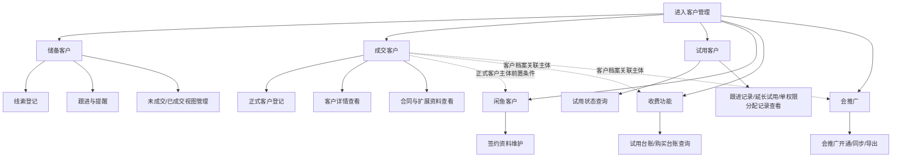
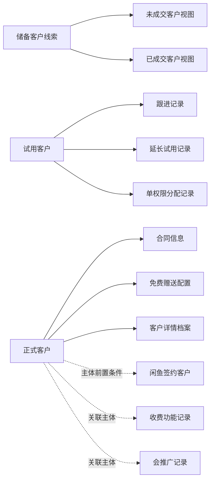
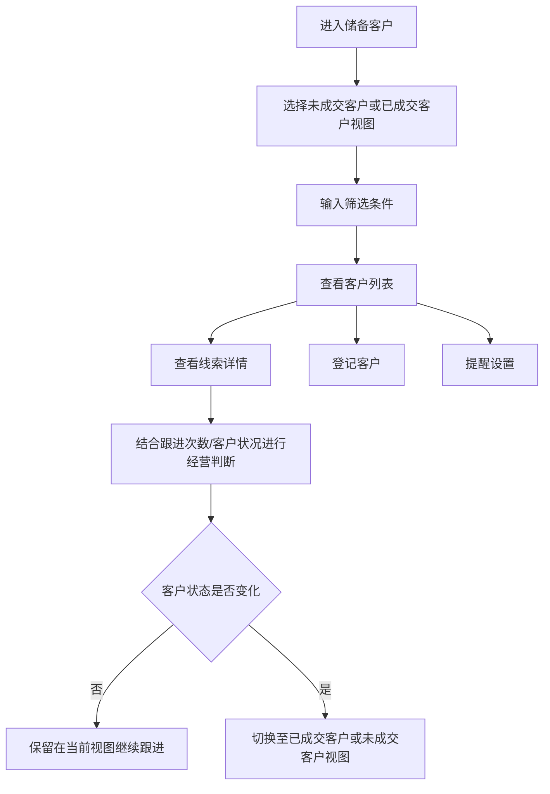
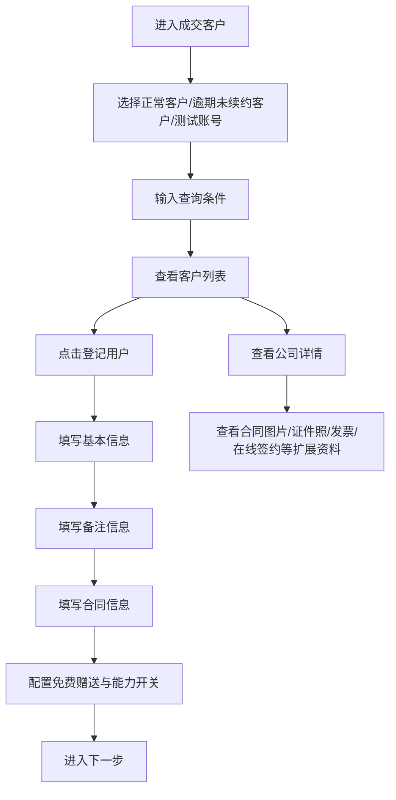
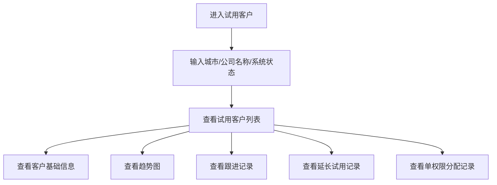
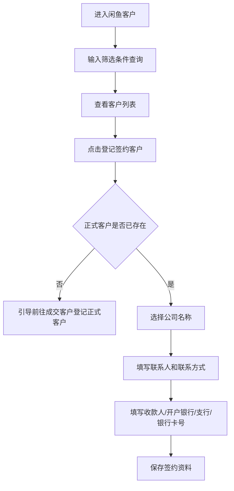
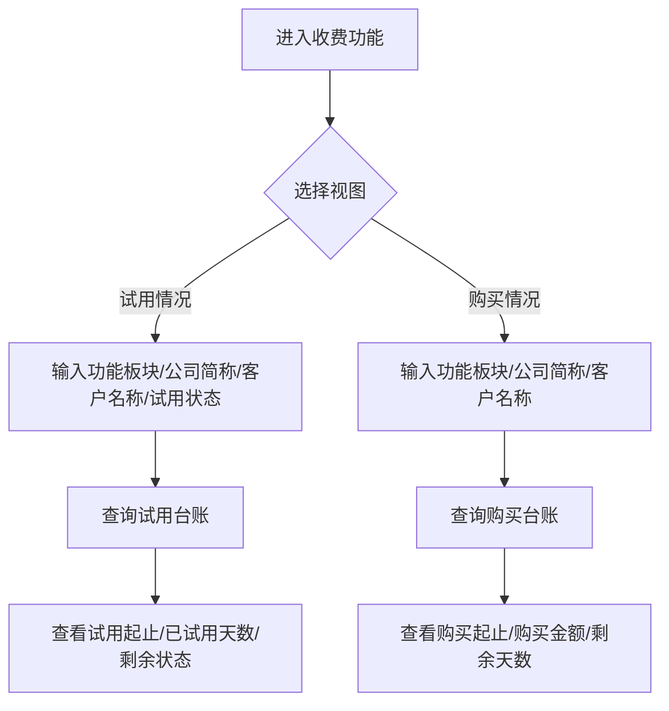
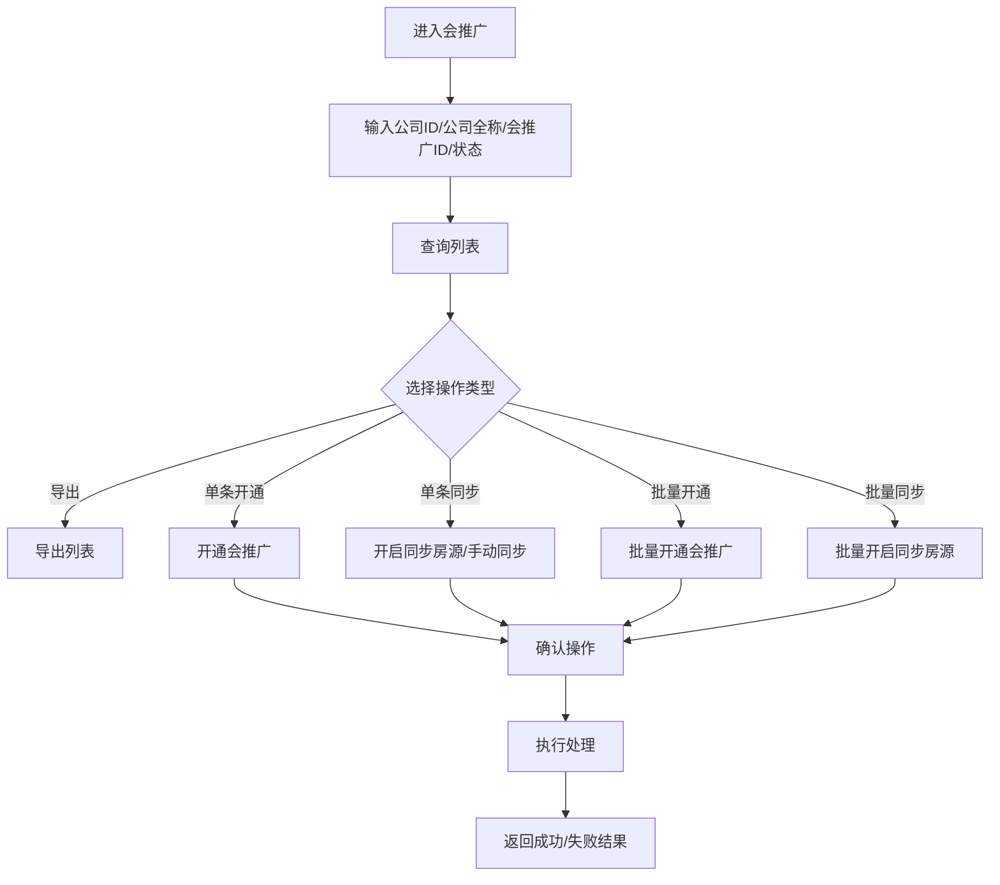
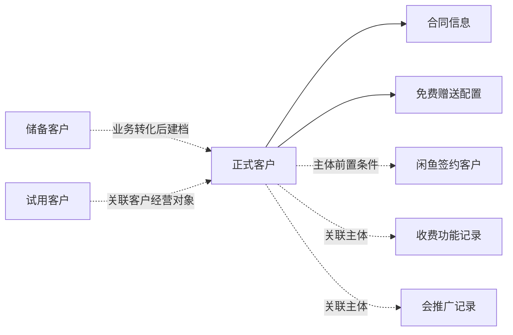

# 客户管理 PRD

| 项 | 内容 |
| --- | --- |
| 文档名称 | 客户管理产品需求文档（PRD） |
| 文档版本 | V1.3 |
| 文档状态 | 正式版 |
| 所属模块 | 客户管理 |
| 编写日期 | 2026-04-03 |
| 业务范围 | 成交客户、试用客户、储备客户、闲鱼客户、收费功能、会推广 |
| 适用对象 | 产品、研发、测试、运营、实施、管理人员 |
| 文档目的 | 统一客户管理模块的业务定义、交互要求、数据要求、实施要求与验收标准，作为项目评审与交付依据 |

## 文档修订记录

| 版本 | 日期 | 修订内容 | 修订人 |
| --- | --- | --- | --- |
| V1.0 | 2026-04-03 | 完成客户管理模块正式版 PRD 初稿 | 杨柳思盼 |
| V1.1 | 2026-04-03 | 补充角色矩阵、业务流程图、页面规范、数据关系、实施要求 | 杨柳思盼 |
| V1.2 | 2026-04-03 | 按实际页面证据复核并收严总流程、对象关系图、数据关系图和流程验收标准 | 杨柳思盼 |
| V1.3 | 2026-04-03 | 补充术语定义、页面状态与跳转关系、字段校验矩阵、高风险操作清单、测试重点和上线准备要求 | 杨柳思盼 |

### 1. 产品概述

#### 1.1 产品背景

客户管理模块是后台经营系统中的核心业务模块之一，用于统一承载客户从线索获取、试用跟踪、正式签约、渠道签约、增值服务使用到推广服务开通的全流程管理。模块以客户为核心对象，通过 `储备客户`、`成交客户`、`试用客户`、`闲鱼客户`、`收费功能`、`会推广` 六个子模块协同实现客户经营闭环。

#### 1.2 产品目标

1. 建立统一的客户主数据与经营台账入口，减少客户信息散落在不同模块中的问题。
2. 支持销售、商务、运营、客服、管理员等角色在同一后台完成客户查询、登记、跟进、状态追踪和能力开通。
3. 为正式客户管理、试用客户管理、渠道签约管理、增值服务台账和推广服务管理提供标准化操作入口。
4. 通过字段校验、状态区分、日志留痕和高风险动作确认机制，提升客户数据质量与运营安全性。

#### 1.3 范围定义

功能范围：

- 左侧一级菜单 `客户管理` 下的六个子模块入口
- 列表查询、详情查看、客户登记、提醒设置、签约补录、收费功能台账、推广能力管理
- 页面内涉及的字段、视图切换、弹窗表单、分页、导出、批量操作和结果反馈

不在本文档范围内：

- 审批中心、财务管理、售后服务、统计报表等跨模块的深层实现细节
- 外部平台接口协议、数据库表结构、代码设计细节
- 与第三方系统的底层同步机制和技术实现方案

#### 1.4 角色与职责

| 角色 | 核心职责 | 主要使用模块 |
| --- | --- | --- |
| 销售/商务 | 录入线索、跟进客户、登记正式客户、推进客户转化 | 储备客户、成交客户 |
| 运营 | 查询试用状态、维护渠道签约信息、跟踪收费功能和会推广开通情况 | 试用客户、闲鱼客户、收费功能、会推广 |
| 客服/实施 | 查询客户详情、核对合同和功能状态、辅助排查客户问题 | 成交客户、试用客户、收费功能 |
| 管理员 | 统一查看全量客户数据，执行高权限操作和风险控制 | 全模块 |

#### 1.5 核心业务对象

| 对象 | 定义 | 核心归属模块 |
| --- | --- | --- |
| 储备客户 | 尚未签约或仍在跟进中的潜在线索客户 | 储备客户 |
| 试用客户 | 已开通试用功能、处于评估阶段的客户 | 试用客户 |
| 正式客户 | 已签约并纳入正式客户体系的客户 | 成交客户 |
| 渠道签约客户 | 渠道来源且已签约的客户资料 | 闲鱼客户 |
| 收费功能记录 | 客户增值能力的试用和购买台账 | 收费功能 |
| 会推广记录 | 客户推广服务的开通、同步和导出记录 | 会推广 |

#### 1.6 成功标准

- 六个子模块均可在统一入口下访问，模块定位清晰。
- 正式客户、试用客户、储备客户、渠道签约客户等对象均有明确的管理入口和核心信息展示。
- 正式客户登记、闲鱼签约登记、会推广批量操作等关键场景具备前置校验和风险控制。
- 敏感信息默认脱敏展示，所有关键写操作具备操作日志留痕。
- 收费功能和会推广模块可独立支撑运营查询与业务处理。

#### 1.7 术语定义

| 术语 | 定义 |
| --- | --- |
| 储备客户 | 尚在跟进阶段、尚未完成正式签约的潜在线索客户 |
| 试用客户 | 已进入系统试用阶段、需跟踪使用状态和转化情况的客户 |
| 正式客户 | 已纳入正式客户体系管理，拥有合同、资源、能力配置等主档信息的客户 |
| 渠道签约客户 | 在渠道来源场景下补录签约与收款资料的客户档案 |
| 收费功能记录 | 客户增值功能的试用和购买台账记录 |
| 会推广记录 | 客户推广服务的开通、同步、导出等运营处理记录 |
| 主体前置条件 | 某业务对象必须依赖正式客户主体存在后才能维护或使用 |
| 视图切换 | 同一页面通过不同页签、按钮或状态入口切换不同数据集合 |

### 2. 用户故事

#### 2.1 用户故事清单

| ID | 角色 | 动作 | 目标 |
| --- | --- | --- | --- |
| US-CM-001 | 销售/商务 | 在储备客户中登记线索并跟进 | 沉淀潜在客户信息，支撑转化推进 |
| US-CM-002 | 销售/商务 | 在成交客户中搜索正式客户 | 快速定位客户并核对经营与合同信息 |
| US-CM-003 | 销售/商务 | 在成交客户中登记正式客户 | 将已成交客户纳入正式客户体系 |
| US-CM-004 | 运营/客服 | 在试用客户中查看试用状态与历史记录 | 评估转化机会并辅助客户服务 |
| US-CM-005 | 运营/商务 | 在闲鱼客户中登记签约客户 | 维护渠道客户的签约与收款资料 |
| US-CM-006 | 运营 | 在收费功能中查看试用与购买台账 | 跟踪增值服务使用与续费状态 |
| US-CM-007 | 运营 | 在会推广中执行开通、同步和导出 | 推进推广服务交付和后续运营 |
| US-CM-008 | 管理员 | 查看客户详情、附件与扩展资料 | 完成审核、核对和风险把控 |

#### 2.2 典型使用场景

| 场景ID | 场景名称 | 入口 | 主要动作 | 结果 |
| --- | --- | --- | --- | --- |
| SC-CM-001 | 线索转化管理 | 储备客户 | 筛选线索、跟进、提醒、标记结果 | 线索持续经营或转入正式客户流程 |
| SC-CM-002 | 正式客户建档 | 成交客户 | 点击登记用户、填写基本信息与合同信息、进入下一步 | 建立正式客户档案 |
| SC-CM-003 | 客户详情核对 | 成交客户列表 | 点击查看 | 查看公司详情、合同信息、附件和扩展数据 |
| SC-CM-004 | 试用客户跟踪 | 试用客户 | 搜索客户、查看右侧基础信息、查看历史记录 | 判断试用活跃度与下一步动作 |
| SC-CM-005 | 渠道签约补录 | 闲鱼客户 | 登记签约客户、选择已有客户、填写收款资料 | 完成渠道签约信息维护 |
| SC-CM-006 | 增值服务查询 | 收费功能 | 切换试用情况/购买情况、按条件查询 | 形成增值服务运营台账 |
| SC-CM-007 | 推广服务开通与同步 | 会推广 | 搜索客户、单条/批量执行开通或同步 | 返回处理结果并形成操作记录 |

#### 2.3 角色与模块权限矩阵

| 角色 | 成交客户 | 试用客户 | 储备客户 | 闲鱼客户 | 收费功能 | 会推广 |
| --- | --- | --- | --- | --- | --- | --- |
| 销售/商务 | 查询、登记、查看详情 | 查询、查看 | 登记、跟进、提醒 | 查看 | 查看 | 查看 |
| 运营 | 查询、查看详情 | 查询、记录查看 | 查看 | 查询、登记签约客户 | 查询 | 查询、开通、同步、导出 |
| 客服/实施 | 查询、查看详情 | 查询、记录查看 | 查看 | 查看 | 查询 | 查看 |
| 管理员 | 全权限 | 全权限 | 全权限 | 全权限 | 全权限 | 全权限 |

### 3. 业务流程

#### 3.1 客户管理模块协同流程

#### 3.2 客户对象关系图

#### 3.3 储备客户业务流程

#### 3.4 成交客户业务流程

#### 3.5 试用客户业务流程

#### 3.6 闲鱼客户业务流程

#### 3.7 收费功能业务流程

#### 3.8 会推广业务流程

#### 3.9 流程协同规则

1. 储备客户承担线索经营职责；客户进入签约阶段后，需转入成交客户模块建立正式客户档案。
2. 试用客户承担试用经营与记录跟踪职责；如客户已进入正式签约阶段，则纳入正式客户体系管理。
3. 闲鱼客户属于渠道签约资料补录场景，前提是客户已在正式客户体系中存在。
4. 收费功能与会推广均以正式客户为业务基础对象，不直接脱离客户主档独立存在。
5. 会推广相关动作属于高风险运营动作，必须通过确认机制与操作日志进行控制。

### 4. 功能清单

#### 4.1 功能优先级定义

| 优先级 | 定义 |
| --- | --- |
| P0 | 核心经营链路必须具备，缺失将直接影响客户管理闭环 |
| P1 | 重要运营支撑能力，缺失会影响效率或数据完整性 |
| P2 | 辅助能力，用于优化运营体验和后续管理 |

#### 4.2 模块能力矩阵

| 模块 | 查询 | 新增/登记 | 详情 | 记录查看 | 批量操作 | 导出 |
| --- | --- | --- | --- | --- | --- | --- |
| 成交客户 | 是 | 是 | 是 | 是 | 否 | 否 |
| 试用客户 | 是 | 否 | 是 | 是 | 否 | 否 |
| 储备客户 | 是 | 是 | 是 | 是 | 否 | 否 |
| 闲鱼客户 | 是 | 是 | 是 | 否 | 否 | 否 |
| 收费功能 | 是 | 否 | 否 | 是 | 否 | 否 |
| 会推广 | 是 | 是 | 否 | 是 | 是 | 是 |

#### 4.3 功能清单

| ID | 功能名称 | 优先级 | 端 | 描述 |
| --- | --- | --- | --- | --- |
| F-CM-001 | 客户管理导航 | P0 | 前端 | 在左侧菜单中统一展示客户管理及 6 个子模块入口 |
| F-CM-002 | 成交客户列表查询 | P0 | 全栈 | 支持按省份、城市、公寓全称、公寓简称、收费模式等条件查询正式客户 |
| F-CM-003 | 正式客户登记 | P0 | 全栈 | 支持录入基本信息、备注、合同信息、赠送项并进入下一步 |
| F-CM-004 | 正式客户详情查看 | P0 | 全栈 | 支持查看公司详情、客户信息、合同信息、附件和扩展资料 |
| F-CM-005 | 试用客户查询 | P1 | 全栈 | 支持按城市、公司名称、系统状态查询试用客户 |
| F-CM-006 | 试用客户历史记录查看 | P1 | 全栈 | 支持查看跟进记录、延长试用记录、单权限分配记录 |
| F-CM-007 | 储备客户线索管理 | P0 | 全栈 | 支持未成交/已成交客户切换、客户登记、提醒设置和线索筛选 |
| F-CM-008 | 闲鱼客户查询 | P1 | 全栈 | 支持按公司名称、联系人、联系方式、签署状态、签约状态查询闲鱼客户 |
| F-CM-009 | 闲鱼签约客户登记 | P0 | 全栈 | 支持选择已存在客户并补录收款与签约信息 |
| F-CM-010 | 收费功能试用情况查询 | P1 | 全栈 | 支持按功能板块、公司简称、客户名称、试用状态查询试用台账 |
| F-CM-011 | 收费功能购买情况查询 | P1 | 全栈 | 支持按功能板块、公司简称、客户名称查询购买台账 |
| F-CM-012 | 会推广列表查询 | P1 | 全栈 | 支持按公司ID、公司全称、会推广ID、开通状态、同步状态筛选 |
| F-CM-013 | 会推广导出 | P2 | 全栈 | 支持导出筛选后的会推广数据列表 |
| F-CM-014 | 会推广开通与同步 | P0 | 全栈 | 支持单条或批量开通会推广、开启同步房源和手动同步 |
| F-CM-015 | 列表分页与详情联动 | P0 | 前端 | 各列表页支持分页显示，并允许查看详情或关联记录 |
| F-CM-016 | 敏感信息脱敏与风险操作确认 | P0 | 全栈 | 对联系电话、身份证、银行卡等敏感信息脱敏展示，对删除/批量操作增加确认 |
| F-CM-017 | 客户记录联动展示 | P1 | 全栈 | 在试用客户、成交客户等场景下展示跟进、延长试用、分配记录等辅助信息 |
| F-CM-018 | 操作留痕与结果反馈 | P0 | 全栈 | 关键操作记录操作人、时间、结果和失败原因 |

### 5. 页面与交互需求

#### 5.1 页面清单

| 页面ID | 页面名称 | 路由 | 页面目标 | 核心交互 |
| --- | --- | --- | --- | --- |
| P-CM-001 | 成交客户 | `/login/CustomerManagement/CarryOut` | 管理正式客户和合同信息 | 查询、登记用户、查看详情、查看附属记录、分页 |
| P-CM-002 | 试用客户 | `/login/CustomerManagement/TrialCustomer` | 查询试用客户和使用状态 | 搜索、查看、查看历史记录、分页 |
| P-CM-003 | 储备客户 | `/login/CustomerManagement/ReserveClient` | 管理销售线索和跟进结果 | 未成交/已成交切换、登记客户、提醒设置、搜索、查看 |
| P-CM-004 | 闲鱼客户 | `/login/CustomerManagement/leisureFish` | 管理闲鱼来源签约商户 | 搜索、登记签约客户、查看、分页 |
| P-CM-005 | 收费功能 | `/login/CustomerManagement/chargingFun` | 查询收费功能试用和购买台账 | 视图切换、搜索、分页 |
| P-CM-006 | 会推广 | `/login/CustomerManagement/promotion` | 查询和管理会推广开通与同步 | 搜索、导出、单条操作、批量操作、分页 |

#### 5.2 通用交互规范

1. 列表页统一采用“筛选区 + 列表区 + 分页区”的布局。
2. 关键写操作必须进行显式确认，并在操作后返回成功或失败结果。
3. 表单页必填项以 `*` 标识，未通过校验时需在字段级展示错误提示。
4. 所有列表页均支持分页，分页区域需展示当前页、总页数和总记录数。
5. 敏感字段默认脱敏展示，完整信息仅在受控详情场景中按权限查看。

#### 5.3 成交客户页面规范

页面定位：
成交客户页面是正式客户主入口，承担正式客户查询、登记、详情查看、经营信息查看和扩展资料查看职责。

查询与视图：

| 区域 | 要素 | 说明 |
| --- | --- | --- |
| 顶部视图 | 正常客户、逾期未续约客户、测试账号 | 支持不同客户状态视角切换 |
| 查询条件 | 省份、城市、公寓全称、公寓简称、收费模式 | 用于缩小正式客户查询范围 |
| 辅助操作 | 偏好设置、更多 | 用于扩展显示和个性化配置 |

主操作：

| 操作 | 说明 | 输出结果 |
| --- | --- | --- |
| 搜索 | 按条件查询客户列表 | 返回匹配客户 |
| 登记用户 | 打开正式客户登记弹窗 | 进入客户建档流程 |
| 查看 | 打开公司详情弹窗 | 查看合同、附件和客户信息 |

列表字段：

| 字段 | 说明 |
| --- | --- |
| 城市 | 客户归属城市 |
| 公司ID | 客户唯一标识 |
| 公司全称/简称 | 客户主体信息 |
| 群名 | 客户群组信息 |
| 合同开始/结束 | 合同有效区间 |
| 购买数量 | 客户购买规模 |
| 已用房源数量 | 当前使用情况 |
| 微信功能/支付功能 | 功能能力开通情况 |
| 系统状态 | 客户当前系统状态 |
| 顾问/主体授权 | 运营与主体管理信息 |

详情与弹窗：

| 弹窗/区域 | 内容 | 说明 |
| --- | --- | --- |
| 登记正式客户 | 基本信息、备注、合同信息、免费赠送 | 客户主档建立入口 |
| 公司详情 | 基本信息、客户信息、合同信息、备注信息 | 核对客户完整档案 |
| 扩展页签 | 合同图片、客户证件照、其他消费、应用市场、发票信息、在线签约管理 | 查看附属资料 |

#### 5.4 正式客户登记表单规范

| 字段组 | 字段 | 说明 |
| --- | --- | --- |
| 基本信息 | 城市、客户来源人、公寓全称、公寓简称、详细地址、法人姓名、公司域名、邮箱、身份证号、联系电话、座机号码、来源类型、登记时间、是否建信合作、统一社会信用代码 | 用于建立正式客户主档 |
| 备注信息 | 备注 | 备注字数限制 300 字以内 |
| 合同信息 | 付费模式、合同年限、版本、合同开始、合同结束、房源数量、年付总价、房源单价 | 用于建立合同与计费基础 |
| 免费赠送 | 电子合同、短信、人脸识别、实名认证、图片、三方合同、视频、免费延时 | 用于配置赠送资源 |
| 能力开关 | 在线支付、微信公众号、小程序、房东代付 | 用于配置能力开通状态 |

交互要求：

1. 合同结束日期不得早于合同开始日期。
2. 价格与数量字段应限制为合法数值输入。
3. 点击 `下一步` 前必须完成必填项校验。

#### 5.5 试用客户页面规范

页面定位：
试用客户页面用于跟踪试用客户使用情况、基础信息与运营记录，支撑试用期内的经营判断。

| 区域 | 要素 | 说明 |
| --- | --- | --- |
| 查询条件 | 城市、公司名称、系统状态 | 支持试用客户定位 |
| 列表字段 | 城市、公司简称、法人名字、域名、房源规模、业务类型、已用房源数、已用短信数、试用开始时间、试用结束时间、系统状态、微信状态、业务员 | 展示试用概况 |
| 记录区 | 跟进记录、延长试用记录、单权限分配记录 | 展示试用过程中的操作历史 |
| 侧边信息 | 客户基础信息、趋势图 | 辅助运营判断 |

#### 5.6 储备客户页面规范

页面定位：
储备客户页面用于管理潜在客户线索、跟进节奏与客户转化结果，是销售经营的前置管理入口。

| 区域 | 要素 | 说明 |
| --- | --- | --- |
| 顶部视图 | 未成交客户、已成交客户 | 区分线索转化状态 |
| 查询条件 | 统计月份、公寓名称、老板电话、城市、登记人、业务员、来源类型、业务类型、状态 | 支持多维度筛选 |
| 主操作 | 登记客户、提醒设置、搜索、查看 | 支持线索维护和提醒管理 |
| 列表字段 | 城市、公司简称、业务类型、公司房源规模、是否上门、跟进、合计跟进、客户状况、业务员、状态、登记时间、来源类型 | 展示线索经营全貌 |

#### 5.7 闲鱼客户页面规范

页面定位：
闲鱼客户页面用于维护闲鱼渠道来源客户的签约资料，是渠道签约信息补录与查询入口。

| 区域 | 要素 | 说明 |
| --- | --- | --- |
| 查询条件 | 公司名称、联系人、联系方式、签署状态、签约状态 | 支持渠道客户检索 |
| 主操作 | 登记签约客户、查询 | 支持签约信息维护 |
| 列表字段 | 公司名称、联系人、联系方式、收款人、开户行与支行、收款卡号、录入人、录入时间、运营协议签署状态、在线签约状态、促销活动 | 展示签约和收款资料 |

登记签约客户规则：

1. 公司名称从已存在正式客户中选择，不允许自由录入新客户主体。
2. 若目标客户不存在，系统引导用户前往成交客户完成正式客户登记。
3. 保存时需校验联系人、联系方式及收款信息的完整性。

#### 5.8 收费功能页面规范

页面定位：
收费功能页面用于展示增值功能的试用与购买台账，面向运营角色进行客户使用和续费管理。

| 视图 | 查询条件 | 核心字段 |
| --- | --- | --- |
| 试用情况 | 功能板块、公司简称、客户名称、试用状态 | 公司简称、客户名称、联系电话、功能板块、试用起止、试用时长、已试用天数、试用状态 |
| 购买情况 | 功能板块、公司简称、客户名称 | 公司简称、客户名称、联系电话、功能板块、购买起止、购买时长、购买金额、已使用时长、剩余天数 |

#### 5.9 会推广页面规范

页面定位：
会推广页面用于完成推广服务的开通、同步和导出管理，是运营处理推广能力的核心后台入口。

| 区域 | 要素 | 说明 |
| --- | --- | --- |
| 查询条件 | 公司ID、公司全称、会推广ID、开通状态、同步状态 | 支持精准定位目标客户 |
| 主操作 | 搜索、导出列表、批量开启同步房源、批量开通会推广、手动同步、开启同步房源、开通会推广 | 支持单条与批量运营动作 |
| 列表字段 | 公司开通时间、城市、公司ID、公司全称、会推广ID、会推广开通时间 | 展示推广服务基础信息 |

交互要求：

1. 所有单条和批量操作执行前必须展示确认提示。
2. 操作执行后返回成功数、失败数和失败原因。
3. 导出在大数据量场景下支持异步导出。

#### 5.10 页面状态要求

| 状态 | 适用页面 | 表现要求 |
| --- | --- | --- |
| 初始加载 | 全页面 | 展示页面级加载状态，禁止出现空白页 |
| 查询中 | 列表页 | 展示表格或区域级 loading，防止重复点击 |
| 空状态 | 列表页、记录页 | 显示“暂无数据”类提示，保留筛选区和返回操作 |
| 查询失败 | 列表页、详情页 | 显示错误提示，并提供重试入口 |
| 无权限 | 高权限页面/按钮 | 隐藏按钮或提示无权限访问，不暴露敏感操作能力 |
| 提交成功 | 登记/开通/同步/导出 | 明确反馈成功结果，必要时刷新列表或关闭弹窗 |
| 提交失败 | 登记/开通/同步/导出 | 明确反馈失败原因，保留上下文便于修正和重试 |

#### 5.11 页面跳转与联动关系

| 来源页面 | 触发动作 | 目标页面/弹窗 | 关系类型 | 说明 |
| --- | --- | --- | --- | --- |
| 成交客户 | 点击 `登记用户` | 登记正式客户弹窗 | 页面内弹窗 | 正式客户主档建立入口 |
| 成交客户 | 点击 `查看` | 公司详情弹窗 | 页面内弹窗 | 查看客户基础信息、合同与附件 |
| 试用客户 | 点击客户记录区域 | 跟进记录/延长试用记录/单权限分配记录区 | 页面内联动 | 查看试用运营历史 |
| 储备客户 | 点击 `登记客户` | 客户登记入口 | 页面内动作 | 用于新增或补录线索客户 |
| 储备客户 | 点击 `提醒设置` | 提醒设置入口 | 页面内动作 | 维护后续跟进提醒 |
| 闲鱼客户 | 点击 `登记签约客户` | 登记签约客户弹窗 | 页面内弹窗 | 渠道签约资料补录 |
| 闲鱼客户 | 公司主体不存在时点击提示链接 | 成交客户页面 | 跨模块引导 | 先完成正式客户登记，再回到闲鱼客户补录 |
| 收费功能 | 切换 `试用情况/购买情况` | 同页不同视图 | 页面内切换 | 切换台账类型 |
| 会推广 | 点击 `导出列表` | 导出任务结果 | 操作结果 | 支持同步或异步导出反馈 |
| 会推广 | 点击开通/同步类动作 | 操作确认 + 结果反馈 | 操作链路 | 单条或批量处理均需确认和回执 |

### 6. 接口与数据需求

#### 6.1 接口能力需求

| 接口ID | 接口名称 | 触发页面 | 方法 | 核心入参 | 核心出参 | 说明 |
| --- | --- | --- | --- | --- | --- | --- |
| API-CM-001 | 客户列表查询 | 成交客户/试用客户/储备客户 | GET/POST | 客户类型、城市、省份、公司名称、状态、分页参数 | 列表数据、总数、当前页 | 不同子模块返回字段不同，但均支持分页 |
| API-CM-002 | 正式客户登记 | 成交客户 | POST | 基本信息、合同信息、赠送项、操作人 | 客户ID、登记结果、下一步状态 | 正式客户建档入口 |
| API-CM-003 | 正式客户详情查询 | 成交客户 | GET | 客户ID | 基本信息、客户信息、合同信息、备注、附件统计、扩展页签数据 | 用于公司详情弹窗 |
| API-CM-004 | 试用客户历史记录查询 | 试用客户 | GET | 客户ID、记录类型、分页参数 | 跟进记录、延长试用记录、单权限分配记录 | 记录类型采用枚举定义 |
| API-CM-005 | 储备客户登记/更新 | 储备客户 | POST/PUT | 线索基本信息、来源类型、业务员、状态、提醒配置 | 线索ID、保存结果 | 支持线索录入和状态更新 |
| API-CM-006 | 闲鱼签约客户登记 | 闲鱼客户 | POST | 已有客户ID、联系人、联系方式、收款信息 | 登记结果、签约客户ID | 公司主体需为已存在正式客户 |
| API-CM-007 | 收费功能台账查询 | 收费功能 | GET | 视图类型、功能板块、公司简称、客户名称、状态、分页参数 | 试用/购买台账列表、统计信息 | 支持试用与购买视图切换 |
| API-CM-008 | 会推广列表查询 | 会推广 | GET | 公司ID、公司全称、会推广ID、开通状态、同步状态、分页参数 | 推广列表、总数、当前页 | 支持导出前筛选 |
| API-CM-009 | 会推广动作执行 | 会推广 | POST | 客户ID列表、动作类型、操作人 | 执行结果、失败原因、任务状态 | 动作类型包括开通、开启同步、手动同步、批量处理 |
| API-CM-010 | 列表导出 | 会推广 | POST | 当前筛选条件、导出范围 | 导出任务ID、文件地址 | 支持大数据量异步导出 |

#### 6.2 页面与接口映射

| 页面 | 触发动作 | 接口ID | 业务目的 |
| --- | --- | --- | --- |
| 成交客户 | 搜索 | API-CM-001 | 查询正式客户 |
| 成交客户 | 登记用户 | API-CM-002 | 新增正式客户 |
| 成交客户 | 查看详情 | API-CM-003 | 查看客户档案 |
| 试用客户 | 搜索 | API-CM-001 | 查询试用客户 |
| 试用客户 | 查看记录 | API-CM-004 | 查询试用历史记录 |
| 储备客户 | 搜索/登记/更新 | API-CM-001 / API-CM-005 | 线索管理 |
| 闲鱼客户 | 查询 | API-CM-001 | 查询渠道客户 |
| 闲鱼客户 | 登记签约客户 | API-CM-006 | 补录渠道签约资料 |
| 收费功能 | 查询 | API-CM-007 | 查询增值服务台账 |
| 会推广 | 查询 | API-CM-008 | 查询推广服务数据 |
| 会推广 | 开通/同步 | API-CM-009 | 执行推广服务动作 |
| 会推广 | 导出 | API-CM-010 | 导出列表数据 |

#### 6.3 核心数据对象

| 对象 | 关键字段 | 说明 |
| --- | --- | --- |
| 正式客户 | 客户ID、城市、公司全称、公司简称、群名、合同起止、购买数量、系统状态、顾问、主体授权 | 用于成交客户主列表和详情页 |
| 试用客户 | 客户ID、城市、公司简称、法人姓名、域名、房源规模、试用起止、系统状态 | 用于试用客户列表和试用分析 |
| 储备客户 | 线索ID、城市、公司简称、业务类型、房源规模、是否上门、跟进次数、客户状况、业务员、登记时间 | 用于线索经营和提醒 |
| 闲鱼签约客户 | 客户ID、公司名称、联系人、联系方式、收款人、开户银行、支行、银行卡号、签署状态、签约状态 | 用于渠道客户签约维护 |
| 收费功能记录 | 客户ID、功能板块、试用起止、试用时长、购买起止、购买金额、剩余天数 | 用于增值功能试用和购买查询 |
| 会推广记录 | 客户ID、公司ID、公司全称、会推广ID、开通状态、同步状态、开通时间 | 用于推广服务开通和同步 |

#### 6.4 数据关系图

#### 6.5 状态与枚举定义

| 对象 | 状态/枚举 | 说明 |
| --- | --- | --- |
| 成交客户视图 | 正常客户、逾期未续约客户、测试账号 | 用于正式客户不同运营视角切换 |
| 储备客户视图 | 未成交客户、已成交客户 | 用于区分线索转化结果 |
| 收费功能视图 | 试用情况、购买情况 | 用于区分增值服务台账类型 |
| 闲鱼客户状态 | 签署状态、签约状态 | 用于描述渠道客户协议与签约进度 |
| 会推广状态 | 开通状态、同步状态 | 用于描述推广服务当前处理结果 |
| 试用客户状态 | 系统状态、微信状态 | 用于描述试用期内系统与功能状态 |

#### 6.6 数据与安全要求

1. 联系电话、身份证号、银行卡号等敏感信息在列表和详情中默认脱敏展示。
2. 所有新增、修改、导出、批量开通、批量同步等关键操作必须记录操作人和操作时间。
3. 批量操作必须返回成功数、失败数和失败原因，便于运营复盘。
4. 所有客户数据查询均应受角色权限与数据范围控制。

#### 6.7 关键字段校验矩阵

| 业务场景 | 字段 | 必填 | 校验规则 | 失败提示方向 |
| --- | --- | --- | --- | --- |
| 正式客户登记 | 城市 | 是 | 必须选择有效城市 | 提示选择城市 |
| 正式客户登记 | 客户来源人 | 是 | 必须选择有效来源人或来源角色 | 提示选择来源人 |
| 正式客户登记 | 公寓全称 | 是 | 不可为空，长度符合名称规范 | 提示填写公寓全称 |
| 正式客户登记 | 公寓简称 | 是 | 不可为空，长度符合名称规范 | 提示填写公寓简称 |
| 正式客户登记 | 详细地址 | 是 | 不可为空 | 提示填写详细地址 |
| 正式客户登记 | 法人姓名 | 是 | 不可为空 | 提示填写法人姓名 |
| 正式客户登记 | 联系电话 | 是 | 手机号格式合法 | 提示填写正确联系电话 |
| 正式客户登记 | 邮箱 | 否 | 如填写则需符合邮箱格式 | 提示邮箱格式错误 |
| 正式客户登记 | 身份证号 | 否 | 如填写则需符合证件格式 | 提示身份证号格式错误 |
| 正式客户登记 | 合同开始/结束 | 是 | 结束日期不得早于开始日期 | 提示修正合同日期 |
| 正式客户登记 | 房源数量 | 是 | 非负整数 | 提示填写合法房源数量 |
| 正式客户登记 | 年付总价 | 是 | 非负数值 | 提示填写合法金额 |
| 正式客户登记 | 房源单价 | 是 | 非负数值 | 提示填写合法单价 |
| 渠道签约登记 | 公司名称 | 是 | 必须从已存在客户中选择 | 提示先登记正式客户或重新选择 |
| 渠道签约登记 | 联系人 | 是 | 不可为空 | 提示填写联系人 |
| 渠道签约登记 | 联系方式 | 是 | 手机号格式合法 | 提示填写正确联系方式 |
| 渠道签约登记 | 收款人 | 否 | 如填写则不得为空白字符 | 提示填写收款人 |
| 渠道签约登记 | 开户银行/支行 | 否 | 如填写需成对保存 | 提示补齐开户信息 |
| 渠道签约登记 | 银行卡号 | 否 | 如填写需符合银行卡号格式 | 提示银行卡号格式错误 |

### 7. 异常场景与业务规则

#### 7.1 异常场景

| ID | 场景 | 触发条件 | 期望处理 |
| --- | --- | --- | --- |
| EX-CM-001 | 正式客户登记必填缺失 | 用户未填写带 `*` 字段即尝试提交 | 阻止提交，并在字段级提示错误 |
| EX-CM-002 | 正式客户合同日期异常 | 合同结束时间早于合同开始时间 | 阻止提交，并提示用户修正日期 |
| EX-CM-003 | 渠道签约客户无对应正式客户 | 在闲鱼客户中登记签约客户时目标公司不存在 | 阻止保存，并引导前往成交客户登记正式客户 |
| EX-CM-004 | 查询无结果 | 查询条件无匹配记录 | 展示空状态，不报系统异常 |
| EX-CM-005 | 分页越界 | 用户输入不存在的页码 | 自动回退到有效页，或提示页码无效 |
| EX-CM-006 | 高风险操作误触 | 用户点击批量开通、批量同步、删除等高风险动作 | 执行前展示确认提示 |
| EX-CM-007 | 导出量过大 | 会推广导出数据超出同步阈值 | 自动转为异步导出并提示任务状态 |
| EX-CM-008 | 外部同步失败 | 会推广同步或开通处理失败 | 返回失败原因，并允许重试 |
| EX-CM-009 | 敏感信息越权展示 | 非授权角色访问完整联系方式、证件号或银行卡号 | 按权限限制，默认脱敏 |

#### 7.2 业务规则

1. 储备客户模块用于线索经营和转化前管理，不承担正式客户主档管理职责。
2. 成交客户模块为正式客户唯一主档入口，正式客户的合同信息、赠送资源和能力开关在本模块中维护。
3. 闲鱼签约客户登记必须绑定已存在的正式客户主体，禁止绕过正式客户建档流程直接创建主体。
4. 收费功能模块必须明确区分 `试用情况` 与 `购买情况` 两种视图，不得混用字段。
5. 会推广模块中的开通、同步、批量处理、导出均属于高风险操作，必须具备确认与留痕。

#### 7.3 前置条件与校验规则

| 场景 | 前置条件 | 校验规则 | 失败处理 |
| --- | --- | --- | --- |
| 正式客户登记 | 用户具备登记权限 | 必填项完整、日期合法、金额数量合法 | 阻止进入下一步 |
| 公司详情查看 | 列表存在有效客户ID | 客户ID有效且可访问 | 提示无权查看或数据不存在 |
| 试用记录查看 | 存在试用客户ID | 记录类型合法 | 返回空记录或提示无数据 |
| 渠道签约登记 | 客户已在正式客户体系存在 | 公司名称必须来源于客户选择器 | 引导前往正式客户登记 |
| 会推广批量操作 | 已勾选目标客户 | 勾选项非空、动作类型合法 | 阻止执行并提示原因 |
| 导出列表 | 查询结果已生成 | 导出范围合法 | 返回导出失败原因 |

#### 7.4 风险控制机制

- 批量操作采用二次确认机制，并明确提示影响范围。
- 对导出、开通、同步类操作形成完整日志链路，便于问题追踪。
- 敏感信息采用列表脱敏、详情受控、接口权限校验三层保护。
- 关键业务动作在前端做表单校验，在后端做业务规则校验，避免脏数据入库。

#### 7.5 高风险操作清单

| 操作 | 模块 | 风险点 | 前端控制 | 后端控制 | 日志要求 |
| --- | --- | --- | --- | --- | --- |
| 批量开通会推广 | 会推广 | 误开通、批量影响范围大 | 二次确认、展示勾选数量 | 校验目标客户与动作权限 | 记录操作人、目标客户、成功失败数 |
| 批量开启同步房源 | 会推广 | 误同步、外部平台数据波动 | 二次确认、展示影响范围 | 校验同步资格与状态 | 记录同步任务号和结果 |
| 单条开通会推广 | 会推广 | 单客误开通 | 按钮确认 | 校验客户状态和权限 | 记录客户ID与执行结果 |
| 手动同步 | 会推广 | 反复触发同步 | 防重复点击、结果提示 | 幂等控制、失败重试 | 记录触发时间和响应结果 |
| 导出列表 | 会推广 | 敏感数据批量导出 | 导出确认、数据量提示 | 导出权限校验、异步任务控制 | 记录导出范围、文件生成结果 |
| 正式客户登记 | 成交客户 | 脏数据入档 | 必填校验、格式校验 | 业务规则校验 | 记录建档信息和操作结果 |
| 渠道签约登记 | 闲鱼客户 | 绑定错误主体或错误收款信息 | 主体选择器、格式校验 | 主体存在性和数据一致性校验 | 记录签约资料保存结果 |

### 8. 验收标准

#### 8.1 功能验收标准

| PRD编号 | 功能 | 验收条件 | 优先级 | 验证方式 |
| --- | --- | --- | --- | --- |
| AC-CM-001 | 客户管理导航 | 左侧菜单能正常展示 6 个子模块入口，点击后可切换到对应页面 | P0 | 页面走查 |
| AC-CM-002 | 成交客户查询 | 支持按省份、城市、公寓全称、公寓简称、收费模式查询并正确返回分页结果 | P0 | 页面走查 + 数据核对 |
| AC-CM-003 | 正式客户登记 | `登记用户` 弹窗可正常打开，必填项校验生效，填写完成后可进入下一步 | P0 | 页面走查 |
| AC-CM-004 | 正式客户详情 | `查看` 弹窗能展示基本信息、客户信息、合同信息、备注信息及附件页签 | P0 | 页面走查 |
| AC-CM-005 | 试用客户查询 | 支持按城市、公司名称、系统状态筛选试用客户，结果与右侧客户信息联动 | P1 | 页面走查 |
| AC-CM-006 | 试用客户记录 | 支持查看跟进记录、延长试用记录、单权限分配记录三个区域 | P1 | 页面走查 |
| AC-CM-007 | 储备客户线索管理 | 支持未成交/已成交切换、登记客户、提醒设置及线索筛选 | P0 | 页面走查 |
| AC-CM-008 | 闲鱼签约登记 | 闲鱼签约客户登记仅允许选择已存在客户；不存在时明确引导先登记正式客户 | P0 | 页面走查 |
| AC-CM-009 | 收费功能台账 | 试用情况与购买情况两个视图均可查询并展示对应字段 | P1 | 页面走查 |
| AC-CM-010 | 会推广查询与导出 | 支持按条件查询会推广列表，并触发导出动作 | P1 | 页面走查 |
| AC-CM-011 | 会推广批量动作 | 批量开通/同步前有确认机制，执行后反馈结果状态 | P0 | 页面走查 + 日志核对 |
| AC-CM-012 | 数据安全 | 联系电话、身份证号、银行卡号等敏感信息默认脱敏展示 | P0 | 页面走查 |
| AC-CM-013 | 审计留痕 | 写操作可记录操作人和操作时间 | P0 | 日志核对 |

#### 8.2 流程验收标准

| 流程 | 验收项 | 验收标准 |
| --- | --- | --- |
| 储备客户流程 | 线索经营闭环 | 支持线索查询、未成交/已成交视图切换、提醒设置和客户状态管理 |
| 成交客户流程 | 正式客户建档闭环 | 支持客户登记、合同信息维护、详情查看与扩展资料查看 |
| 试用客户流程 | 试用跟踪闭环 | 支持查询、记录查看和状态辅助判断 |
| 闲鱼客户流程 | 渠道签约闭环 | 支持查询、已存在客户选择、签约资料保存和前置校验 |
| 收费功能流程 | 台账查看闭环 | 支持试用与购买双视图查询和字段区分展示 |
| 会推广流程 | 推广服务处理闭环 | 支持查询、导出、单条/批量开通与同步、结果反馈 |

#### 8.3 数据与安全验收标准

| 类别 | 验收项 | 验收标准 |
| --- | --- | --- |
| 数据准确性 | 列表字段与详情字段一致 | 同一客户在列表与详情中的基础信息保持一致 |
| 数据完整性 | 关键表单字段完整 | 正式客户登记、签约登记等表单字段完整并可保存 |
| 脱敏要求 | 敏感信息默认脱敏 | 列表页不允许直接展示完整手机号、身份证号、银行卡号 |
| 日志要求 | 关键操作可追踪 | 开通、同步、导出、登记等动作可追溯到操作人和时间 |
| 风险控制 | 高风险操作需确认 | 批量操作和导出类操作均存在确认机制 |

#### 8.4 交付物清单

| 交付物 | 说明 |
| --- | --- |
| PRD 文档 | 客户管理正式版 PRD |
| 页面原型/页面说明 | 页面结构与交互说明 |
| 接口契约文档 | 页面动作与接口定义 |
| 权限矩阵 | 角色与模块操作权限清单 |
| 状态流转文档 | 客户、签约、推广等核心状态机说明 |
| 测试用例 | 按功能与流程覆盖的测试用例集 |

#### 8.5 测试重点

| 类别 | 测试重点 |
| --- | --- |
| 页面功能 | 六个子模块入口、列表查询、分页、视图切换、弹窗打开 |
| 表单校验 | 正式客户登记、渠道签约登记的必填与格式校验 |
| 记录联动 | 试用客户记录区、成交客户详情扩展页签联动展示 |
| 视图区分 | 成交客户状态视图、储备客户视图、收费功能双视图区分准确 |
| 高风险操作 | 会推广开通、同步、导出、批量操作的确认与回执 |
| 权限控制 | 不同角色看到的模块、按钮、敏感信息范围正确 |
| 安全控制 | 联系电话、身份证号、银行卡号脱敏展示正确 |
| 异常处理 | 无数据、接口失败、分页越界、同步失败、导出失败处理正确 |

### 9. 非功能需求与实施说明

#### 9.1 性能要求

- 常规列表查询首屏返回时间目标不超过 3 秒。
- 分页切换响应时间目标不超过 2 秒。
- 导出任务提交响应时间目标不超过 5 秒；大数据量采用异步导出。
- 批量开通、批量同步类操作应在可接受时间内给出任务状态反馈。

#### 9.2 安全与权限要求

- 所有页面、按钮和接口均受角色权限控制。
- 敏感信息采用默认脱敏策略，并限制完整信息查看权限。
- 高风险操作采用确认机制、操作日志、失败回执三重控制。
- 与外部系统交互的能力开通和同步操作须具备失败回滚或重试机制。

#### 9.3 可用性与审计要求

- 页面需支持空状态、错误状态、分页状态和操作结果状态展示。
- 列表页支持常用筛选条件组合使用，提升运营查询效率。
- 所有新增、修改、导出、同步、开通动作需记录操作日志。
- 日志应至少包含操作模块、操作人、操作时间、目标对象、处理结果和失败原因。

#### 9.4 实施说明

1. 正式客户登记中的 `客户来源人`、`来源类型`、`版本` 等字段采用统一字典维护。
2. 会推广模块中涉及的导出、开通、同步类动作统一接入任务状态回传机制。
3. 收费功能模块当前聚焦查询台账；若后续新增开通、关闭、调整等动作，应追加审批和日志规范。
4. 客户管理模块实施时，应同步产出接口契约、权限矩阵、状态机说明和测试用例。

#### 9.5 版本规划

| 版本 | 规划内容 |
| --- | --- |
| V1.0 | 完成客户管理主模块的查询、登记、详情、试用记录、收费功能台账、会推广管理能力定义 |
| V1.1 | 补充角色矩阵、页面规范、数据关系、业务流程图和实施要求 |
| V1.2 | 按页面证据收严流程图、对象关系和验收口径 |
| V1.3 | 补充术语定义、页面状态、跳转关系、字段校验矩阵、高风险操作清单、测试重点 |
| V1.4 | 补充接口契约、权限矩阵、状态流转、批量操作回执规范 |
| V1.5 | 补充跨模块联动规则，包括审批、财务、消息通知和外部平台同步细则 |

#### 9.6 上线与培训准备

1. 上线前由产品、研发、测试、运营共同完成功能走查，确认页面、流程、权限与数据口径一致。
2. 对销售、运营、客服等使用角色输出模块操作说明，重点培训 `正式客户登记`、`渠道签约登记`、`会推广高风险操作`。
3. 上线前准备异常回退说明，明确导出失败、同步失败、误操作等场景的处理方式。
4. 上线后首周重点关注会推广相关高风险操作日志与客户数据异常情况。
