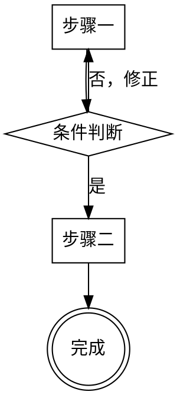

# 最佳实践实施方案

日期基线：`2026-03-31`（v3，基于用户裁决 + 三路深度调研修订）

---

## 1. 核心裁决（已确认）

1. 执行收口在 superpowers（subagent-driven-development），不使用 opsx:apply
2. OpenSpec 只吸收优秀概念，不依赖其运行时（CLI/工具链）
3. tasks.md 是独立验收真源，不从 plan.md 派生
4. plan.md 是执行计划，通过 task-id 引用 tasks.md
5. 标准链 tech-lead 产出 plan 后，project-manager 开始前也生成 tasks.md
6. 文件目录必须有 feature 层级，真源文件名用日期前缀
7. 不被历史包袱干扰，从"什么才是最佳实践"出发设计

---

## 2. 三套体系的最终定位

```
superpowers（执行骨架）
├── 行为纪律：rules/（始终加载）
├── 按需知识：reference/（被引用时读取）
├── 流程规范：skills/（显式或默认触发）
├── 自动守门：hooks/（事件驱动）
└── 执行收口：subagent-driven-development（统一执行方式）

OpenSpec 概念（工件语义，不依赖运行时）
├── change 生命周期：proposed → implementing → verifying → archived
├── proposal.md：why / scope（动机与边界）
├── design.md：how（设计决策持久化）
├── tasks.md：验收清单（独立真源）
├── verify 分级：CRITICAL / WARNING / SUGGESTION
└── archive 闭环：完成度确认 + 归档

/product 标准链（大需求重治理）
├── /product → /design → /test-design → /tech-lead → /project-manager
├── 多 phase / 多 unit / 正式签收
└── 显式手动入口，不纳入默认链
```

---

## 3. 从 OpenSpec 吸收的概念清单

### 3.1 直接采用（纯概念，不依赖运行时）

| 概念 | 定义 | 解决的问题 | 采用方式 |
|------|------|-----------|---------|
| change 生命周期 | proposed → implementing → verifying → archived | 防止跳步，强制每阶段门禁确认 | 用目录结构体现状态：活跃 change 在 `changes/`，归档在 `archive/` |
| proposal.md why/scope 分层 | 强制区分"为什么做"和"做什么范围" | 防止 AI 跳过问题澄清直接实现 | 模板固定：`## Why` + `## Scope`（in/out）+ `## Success Criteria` |
| design.md 决策持久化 | 记录方案选择、权衡、关键决策点 | 防止设计决策散落在对话历史中 | 模板固定：`## Approach` + `## Alternatives Considered` + `## Key Decisions` |
| tasks.md checklist | `- [ ] T1 描述` 格式，唯一 ID，完成即勾选 | 防止遗漏、跑偏、虚假完成 | 独立验收真源，task-id 是跨文档引用锚点 |
| verify 分级报告 | CRITICAL（阻断）/ WARNING（需评估）/ SUGGESTION（建议） | 让"是否可归档"有机器可判断的结论 | 验证阶段产出分级报告，CRITICAL 阻断归档 |
| archive 完成度确认 | 归档前检查所有 task 完成、所有 CRITICAL 解决 | 防止带未完成 task 归档 | 归档操作前强制完成度检查 |
| explore "只思考不实现" | 探索阶段禁止写代码 | 防止在需求未清晰时就开始实现 | brainstorming 的 HARD-GATE 已覆盖此约束 |

### 3.2 改造后采用

| 概念 | 原始形式 | 改造方式 | 理由 |
|------|---------|---------|------|
| tasks-plan 一致性校验 | `check_task_plan_consistency.py` 双状态同步检查 | 改为单真源 + task-id 映射完整性检查：plan 中每个 checklist 必须引用 task-id，tasks.md 中每个 task 必须被 plan 引用 | tasks.md 是唯一进度真源，plan 不独立持有完成状态 |
| spec-driven schema | OpenSpec config.yaml 中定义工件依赖顺序 | 改为文档约定：proposal → design → tasks 的产出顺序写入 skill 流程，不依赖 CLI | 去运行时依赖 |

### 3.3 不采用

| 概念 | 理由 |
|------|------|
| delta specs 同步 | 当前实际使用中未被激活，机制复杂但价值未验证 |
| openspec validate --strict | 依赖 CLI 可用性，与 tasks-plan 校验功能重叠 |
| openspec instructions 动态读取 | spec-driven 下 contextFiles 固定，动态读取增加复杂度无实际收益 |
| opsx:apply 执行模式 | 执行收口在 superpowers，不需要 OpenSpec 参与运行时执行 |

---

## 4. 统一文件目录与命名规范

### 4.1 目录结构

```
docs/
├── {feature}/                              # feature 层级（必须）
│   │
│   │  ── community-first 链工件 ──
│   │
│   ├── YYYY-MM-DD-{change}/                # 日期前缀 change 目录
│   │   ├── proposal.md                     # why / scope
│   │   ├── design.md                       # how（设计决策）
│   │   ├── tasks.md                        # 验收清单（独立真源）
│   │   └── plan.md                         # 执行计划（引用 task-id）
│   │
│   │  ── 标准链工件 ──
│   │
│   ├── YYYY-MM-DD-prd.md                   # 产品需求（真源）
│   ├── units/
│   │   └── UNIT-NNN.md                     # 功能单元
│   ├── phase-{N}/
│   │   ├── YYYY-MM-DD-design.md            # 技术设计（真源）
│   │   ├── YYYY-MM-DD-plan.md              # Phase 级计划（真源）
│   │   ├── YYYY-MM-DD-tasks.md             # Phase 级验收清单（独立真源）
│   │   ├── design/
│   │   │   ├── MOD-NNN.md
│   │   │   └── adr/ADR-NNN.md
│   │   ├── unit-{M}/
│   │   │   ├── test-cases.md
│   │   │   └── dev-report.md
│   │   ├── code-review-report.md
│   │   ├── qa-report.md
│   │   └── acceptance-summary.md
│   │
│   │  ── 共享 ──
│   │
│   ├── CHANGELOG.md                        # feature 级变更日志（派生摘要）
│   └── constitution.md                     # 架构约束（可选）
│
├── archive/                                # 全局归档区
│   └── {feature}/                          # 保持原结构
│
├── reports/                                # 分析报告
│   └── YYYY-MM-DD-*.md
│
└── rfcs/                                   # RFC
    └── YYYY-MM-DD-*.md
```

### 4.2 命名规范

| 类型 | 命名规则 | 示例 | 理由 |
|------|---------|------|------|
| feature 目录 | 英文 kebab-case | `user-auth/`、`payment-flow/` | 团队统一，避免中英文混用 |
| change 目录 | `YYYY-MM-DD-{change-name}/` | `2026-03-31-add-oauth/` | 日期前缀防冲突 + 自然排序 |
| 真源文件（community-first） | 固定命名，在日期前缀目录内 | `proposal.md`、`tasks.md` | 目录已有日期前缀，文件名不需要重复 |
| 真源文件（标准链） | `YYYY-MM-DD-{type}.md` | `2026-03-31-prd.md`、`2026-03-31-design.md` | 标准链无日期前缀目录，文件名需要日期 |
| 序号工件 | `{TYPE}-NNN.md` | `UNIT-001.md`、`MOD-001.md`、`ADR-001.md` | 序号递增，稳定引用 |
| 审查/报告 | 固定命名或带轮次 | `code-review-report.md`、`design-review-1.md` | 多轮审查需区分轮次 |
| 归档目录 | 保持原结构移入 `archive/` | `archive/user-auth/` | 归档不改名，保持可追溯 |

### 4.3 日期前缀规则

- 格式统一为 `YYYY-MM-DD`
- 同一天多个 change 时加序号后缀：`2026-03-31-add-oauth-2/`
- 日期是创建日期，不是归档日期
- 归档时不改名，保持原日期前缀

### 4.4 真源关系

| 工件 | 真源类型 | 说明 |
|------|---------|------|
| proposal.md | 动机真源 | why / scope，变更的合法性依据 |
| design.md | 设计真源 | how，设计决策的持久化记录 |
| tasks.md | 验收真源 | 独立于 plan，执行前锁定，逐 task 勾选 |
| plan.md | 执行计划 | 通过 task-id 引用 tasks.md，可在执行中调整 |
| prd.md | 需求真源 | 标准链 feature 级 |
| acceptance-summary.md | 签收真源 | 标准链交付凭证 |
| dev-report / qa-report | 执行证据真源 | 标准链执行与验收证据 |
| CHANGELOG.md | 派生摘要 | 从 archive 事件自动追加，不是真源 |
| brainstorming designs/ draft | 草稿 | formal design.md 生成后退出必选输入 |

---

## 5. tasks.md 统一设计

### 5.1 定位

tasks.md 是验收清单，独立于 plan.md。它回答"交付什么、怎么算完成"，不回答"怎么做、什么顺序"。

### 5.2 模板

```markdown
# Tasks — {change/phase 名称}

创建日期：YYYY-MM-DD
关联 plan：{plan.md 相对路径}

## 验收清单

- [ ] T1 {交付物描述}
  - AC: {验收标准，可验证}
- [ ] T2 {交付物描述}
  - AC: {验收标准}
- [ ] T3 {交付物描述}
  - AC: {验收标准}

## 完成定义

所有 task 勾选完成 = change/phase 可进入 verify 阶段。
```

### 5.3 规则

1. 每个 task 必须有唯一 ID（`T1`、`T2`...），同一 change/phase 内统一格式
2. 每个 task 必须有至少一条可验证的验收标准（AC）
3. 执行前锁定，执行中不随 plan 变更而变更（除非用户显式修改）
4. 完成一个勾选一个，禁止批量补勾
5. plan.md 中每个 checklist 必须引用 task-id，tasks.md 中每个 task 必须被 plan 引用

### 5.4 两条链的 tasks.md

| 链路 | 生成时机 | 生成者 | 位置 |
|------|---------|--------|------|
| community-first | brainstorming 收口后，propose 阶段生成 | brainstorming → propose | `docs/{feature}/YYYY-MM-DD-{change}/tasks.md` |
| 标准链 | tech-lead 产出 plan 后，project-manager 开始前 | tech-lead 或 project-manager 入口 | `docs/{feature}/phase-{N}/YYYY-MM-DD-tasks.md` |

---

## 6. 执行模式：subagent-driven-development + tasks.md

### 6.1 执行链路

```
writing-plans 产出 plan.md（checklist 引用 task-id）
    ↓
subagent-driven-development 启动
    ↓ 读取 plan.md + tasks.md，建立 task-id 映射
    ↓
For each task:
    ├── 派发 implementer 子代理
    │   └── 实现 + TDD + 自我审查 + 提交
    │   └── 更新 tasks.md 对应 task 为 in-progress
    │
    ├── 派发 spec-reviewer 子代理
    │   └── 对照 tasks.md 中该 task 的 AC 验证
    │   └── ✅ 或 ❌（修复后重新 review）
    │
    ├── 派发 code-quality-reviewer 子代理
    │   └── 代码质量 + 测试覆盖
    │   └── ✅ 或 issues（修复后重新 review）
    │
    └── 两阶段审查通过 → 控制器更新 tasks.md 为 completed
    ↓
所有 task 完成
    ↓
final code-reviewer（整体审查）
    ↓
finishing-a-development-branch（验证 + 收尾）
```

### 6.2 关键适配

1. implementer-prompt 注入 tasks.md 更新职责
2. spec-reviewer 的验收范围扩展到 tasks.md 的 AC
3. 控制器在两阶段审查通过后才更新 tasks.md 为 completed
4. tasks.md 状态始终滞后于实现但领先于下一个任务开始

### 6.3 标准链的执行适配

标准链 project-manager 保持自己的调度逻辑（4 Phase + developer/verifier/QA 子代理派发 + 熔断机制 + 用户签收），不替换为 subagent-driven-development。

PM 需要增加的适配：

1. tasks.md 联动：PM Phase 2 每 task 通过 verifier 后，更新 `phase-{N}/YYYY-MM-DD-tasks.md` 对应 task 为 completed
2. tasks.md 作为 Phase 3 QA_A 的验收基线：QA_A 逐条对照 tasks.md 的 AC 验收，而不是从 plan.md 提取 AC

PM 需要吸收的 SDD 优点（融入 PM 自身流程）：

| 吸收点 | 当前 PM 状态 | 改进方式 |
|--------|------------|---------|
| 控制器主动构建上下文 | developer 自己读 design.md/MOD-*.md | PM dispatch 时将 design 关键接口、MOD 约束直接嵌入派发 prompt，减少 developer 上下文噪音和误解风险 |
| 审查者"不信任报告"指令 | verifier 收到 developer-report 后审查（隐式锚定） | verifier 派发时加入明确指令："不信任 developer-report，必须独立读代码验证" |
| 审查顺序强制 | 未明确规定 SPEC_OK 先于 2A/2B/2C | 明确规定 SPEC_OK 通过后才启动 2A/2B/2C 审查 |
| 上下文隔离原则 | 通过 worktree 物理隔离，但未明确表述原则 | PM SKILL.md 补充："子代理不继承控制器会话上下文，控制器主动构建子代理所需的精确上下文" |
| 升级路径描述 | developer 遇到问题时"报告 PM"（笼统） | developer 补充具体升级触发条件清单（类似 SDD 的"When You're in Over Your Head"） |

---

## 7. CHANGELOG 定位

### 7.1 角色

CHANGELOG.md 是 feature 级派生摘要，不是真源。

### 7.2 位置

`docs/{feature}/CHANGELOG.md`

### 7.3 格式

```markdown
# Changelog — {feature}

## [2026-03-31] add-oauth

OAuth 2.0 登录集成，支持 Google 和 GitHub 第三方登录。

- Added: OAuth 授权流程
- Changed: 登录页增加第三方入口
- Fixed: 会话过期处理

## [2026-03-28] fix-session-timeout

修复会话超时后未正确跳转登录页的问题。

- Fixed: 会话过期重定向逻辑
```

### 7.4 更新规则

- archive 完成时自动追加一条（从 proposal.md 的 scope 提取）
- 标准链 acceptance-summary 签收后追加
- 格式遵循 Keep a Changelog 风格（Added/Changed/Fixed/Removed）
- 内容用中文

---

## 8. 推荐的统一流程

### 8.1 默认链（community-first，日常小需求）

```
brainstorming                              # 需求澄清 + 方案探索 + 设计草稿
    ↓ 用户批准设计（HARD-GATE）
propose                                    # 生成 proposal.md + design.md + tasks.md
    ↓ 自动推荐
writing-plans                              # 生成 plan.md（checklist 引用 task-id）
    ↓ 推荐
using-git-worktrees                        # 创建工作分支（可选）
    ↓
subagent-driven-development                # 逐 task 执行 + 两阶段审查 + 更新 tasks.md
    ↓
finishing-a-development-branch             # 验证 + 收尾
    ↓
verify                                     # 分级报告（CRITICAL/WARNING/SUGGESTION）
    ↓ 推荐（显式确认）
archive                                    # 归档 + CHANGELOG 追加
```

### 8.2 升级链（标准链，大需求）

```
/product                                   # 需求共创 → prd.md + units/
    ↓
/design                                    # 架构共创 → design.md + MOD/ + ADR/
    ↓
/test-design                               # 测试设计 → test-cases.md
    ↓
/tech-lead                                 # 设计评审 → plan.md
    ↓
生成 tasks.md                              # 验收清单（独立真源）
    ↓
/project-manager                           # PM 自有调度逻辑执行
    ├── Phase 1: 前置检查 + 用户确认
    ├── Phase 2: developer + verifier 子代理（逐 task 更新 tasks.md）
    ├── Phase 3: Code Review + QA（tasks.md AC 作为 QA_A 基线）
    └── 交付签收: acceptance-summary.md
    ↓
verify + archive                           # 验证 + 归档 + CHANGELOG
```

### 8.3 自动化边界

| 衔接点 | 自动化方式 | 理由 |
|--------|-----------|------|
| brainstorming → propose | 自动推荐 | 用户已批准设计，下一步确定 |
| propose → writing-plans | 自动推荐 | 工件已生成，下一步确定 |
| writing-plans → worktree | 推荐 | 用户可能想在当前分支开发 |
| worktree → subagent-driven-development | 推荐 | 执行方式已确定 |
| 每 task 完成 → 更新 tasks.md | 自动 | 控制器职责，不需要人工 |
| 全部完成 → finishing-a-development-branch | 自动 | subagent-driven-development 内置 |
| finishing → verify | 推荐 | 用户可能想先手动检查 |
| verify 通过 → archive | 推荐（显式确认） | 归档是状态变更，必须确认 |
| archive → CHANGELOG 追加 | 自动 | 派生摘要，不需要人工 |
| 自动升级到 /product | 不自动 | 需求复杂度判断依赖人类经验 |
| 自动选择 change | 不自动 | 多 change 并存时需用户裁决 |

---

## 9. 消除的冗余

| 冗余 | 变更 |
|------|------|
| 设计文档双写（brainstorming draft + propose design.md） | draft 定位为草稿，propose 读取 draft 作为上下文生成 formal design.md，draft 退出后续必选输入 |
| tasks.md / plan.md 双状态 | tasks.md 是唯一进度真源，plan.md 不持有完成状态 |
| opsx:apply 与 subagent-driven-development 并存 | 统一用 subagent-driven-development，opsx:apply 退出执行链 |
| openspec CLI 运行时依赖 | 只吸收概念，不依赖 `openspec new/status/instructions/validate` 命令 |

---

## 10. SKILL 编写格式规范

### 10.1 流程图格式：统一为 Graphviz dot

所有 skill 的工艺流程图统一使用 `dot`（Graphviz digraph），不使用 Mermaid graph TD。

对比依据：

| 维度 | Graphviz dot | Mermaid graph TD |
|------|-------------|-----------------|
| LLM 解析准确性 | 高。显式声明 shape（box/diamond/doublecircle），边和 label 分离，语法严格无歧义 | 中。节点类型靠符号推断，边和 label 混在一行，复杂图容易解析出错 |
| 表达能力 | 强。支持 subgraph cluster、rankdir、fillcolor，能表达嵌套循环 | 中。subgraph 支持有限，复杂嵌套流程表达力不足 |
| 人类可读性 | 中 | 高，但 skill 文件主要消费者是 LLM |
| 渲染支持 | 需 Graphviz 工具 | GitHub/IDE 原生支持，但 skill 文件不需要渲染 |

决策理由：SKILL.md 的主要消费者是 LLM，LLM 解析准确性是第一优先级。dot 的显式语法让 LLM 更准确地理解流程结构、分支条件和终止状态。

格式示例：



### 10.2 步骤描述格式：标题换行 + 子弹点拆句

所有 skill 的流程步骤统一使用"编号标题 + 换行 + 子弹点"格式，禁止单行长句。

对比：

当前标准链（单行长句）：
```markdown
1. 静默信息收集 — 基于用户输入的需求描述（$ARGUMENTS），扫描项目现状、核心业务、已有文档、项目约束文档（`AGENTS.md` / `CLAUDE.md`）和相关流程信息，把上下文融入后续对话。同时检查 `docs/constitution.md` 是否存在，存在则读取并在后续步骤中验证需求一致性。
```

superpowers（标题换行 + 子弹点）：
```markdown
**理解这个想法：**

- 首先检查当前项目状态（文件、文档、最近提交）
- 评估范围：如果请求描述了多个独立的子系统，请立即标记
- 对于范围适当的项目，一次提出一个问题来完善想法
- 重点理解：目的、约束、成功标准
```

统一为标题换行 + 子弹点格式，理由：

1. LLM 的 token 窗口是线性的，单行 200+ 字符的长句处理到句尾时对句首的注意力衰减。拆成多个短句后，每个子弹点是独立语义单元，注意力分配更均匀
2. 指令遵循粒度更细：一个长句包含 3 个约束，LLM 可能只执行前 2 个。拆成 3 个子弹点后，每个约束独立可检查
3. 回溯定位更快：LLM 确认"这一步要做什么"时，扫描子弹点列表比重新解析长句快

### 10.3 加粗使用规范：稀缺性原则

步骤名默认不加粗。`**` 只用于高风险信号，保持稀缺性以维持区分度。

与 `reference/Skill质量标准.md` 对齐：

| 该用 `**` | 不该用 `**` |
|-----------|------------|
| 终止/警告条件：`**终止并提示**`、`**立即暂停**` | 普通步骤标题：编号本身已表达结构 |
| HARD-GATE、STOP、FORBIDDEN | 前置条件/输入标签 |
| 角色锚点（每 skill 最多 1 处） | 输出格式标签 |

量化约束（来自 Skill 质量标准）：
- 全文加粗行数 ≤ 10%
- 单行最多 1 处 `**`
- 普通步骤标题默认不加粗

决策理由：如果 12 个步骤全加粗，等于没加粗。`**` 的价值在于稀缺性 — 只在 HARD-GATE、终止条件、STOP 等关键节点使用时，LLM 才会对它分配更高注意力权重。

### 10.4 关联规范

本节格式规范与以下文档协同，实施时需同步对齐：

- `reference/Skill质量标准.md` — D1 结构合规、D6 Token 效率、表达优先级
- `reference/文档规范.md` — 命名、强调和归档约定
- `/new-skills` skill — 新建 skill 时的结构模板

### 10.5 实施影响

现有标准链 skill（product、design、project-manager 等）需要按上述规范统一改造：
- 流程图从 Mermaid 改为 dot
- 单行长句步骤拆为标题换行 + 子弹点
- 检查加粗使用是否符合稀缺性原则
纳入 P1 实施阶段。

---

## 11. 实施方案

### P0：基础对齐（前置条件）

| 任务 | 内容 | 验证 |
|------|------|------|
| P0-1 | 对齐标准链 plan.md 路径口径（统一到 Phase 工作区） | 所有 skill 中 plan.md 引用路径一致 |
| P0-2 | 定义 tasks.md 模板和规则 | 模板可用，规则写入 reference/ |
| P0-3 | 定义统一目录结构和命名规范 | 规范写入 reference/，现有 skill 路径引用对齐 |

### P1：核心机制落地

| 任务 | 内容 | 验证 |
|------|------|------|
| P1-1 | 修改 brainstorming skill：draft 退出后续必选输入 | propose 不再依赖 designs/ 目录 |
| P1-2 | 修改 propose 流程：不依赖 openspec CLI，直接按模板生成 proposal.md + design.md + tasks.md | 无 CLI 调用，工件格式符合模板 |
| P1-3 | 修改 writing-plans：plan checklist 必须引用 task-id | 一致性校验通过 |
| P1-4 | 适配 subagent-driven-development：implementer-prompt 注入 tasks.md 更新职责，控制器在审查通过后更新 tasks.md | 执行过程中 tasks.md 状态实时更新 |
| P1-5 | 实现 verify 流程（不依赖 openspec CLI）：tasks.md 完成度 + task-plan 映射完整性 + 分级报告 | verify 产出 CRITICAL/WARNING/SUGGESTION 报告 |
| P1-6 | 实现 archive 流程：完成度确认 + 目录移动 + CHANGELOG 追加 | 归档后目录结构正确，CHANGELOG 已追加 |
| P1-7 | 标准链适配：tech-lead 后生成 tasks.md；PM 吸收 SDD 5 项优点（上下文构建、审查独立性、审查顺序、隔离原则、升级路径）；PM Phase 2 逐 task 更新 tasks.md | PM dispatch-guide 含上下文嵌入 + 不信任指令，tasks.md 状态实时更新 |
| P1-8 | SKILL 格式统一：标准链 skill 流程图从 Mermaid 改为 dot，单行长句步骤拆为标题换行+子弹点，检查加粗符合稀缺性原则 | 所有 skill 流程图为 dot 格式，步骤为标题换行+子弹点，加粗行数 ≤ 10% |

### P2：增强与收口

| 任务 | 内容 | 验证 |
|------|------|------|
| P2-1 | 一致性校验器改造：从双状态同步改为单真源 + task-id 映射完整性 | 新旧模式兼容，无误报 |
| P2-2 | 自动推荐衔接：propose → writing-plans 自动推荐 | 流程顺滑，无手动跳转 |
| P2-3 | 文档回写：更新 README.md、contracts、reference/ | 所有文档与实际流程一致 |
| P2-4 | 归档过时文档到 docs/archive/ | 活跃区无过时文档 |

### 回归验证

每个阶段完成后验证：
- 目录结构符合 4.1 节定义
- tasks.md 模板和规则可执行
- task-plan 映射完整性校验通过
- community-first 与标准链路由/路径解析一致

---

## 12. 裁决清单

以下需要确认，达成共识后进入实施：

1. 是否接受 4.1 节的统一目录结构（feature 层级 + 日期前缀 change 目录 + 标准链真源文件日期前缀）
2. 是否接受 5.2 节的 tasks.md 模板（task-id + AC + 完成定义）
3. 是否接受 6.1 节的执行链路（subagent-driven-development + tasks.md 联动）
4. 是否接受 8.3 节的自动化边界（软自动化为主，归档显式确认）
5. 是否接受 7 节的 CHANGELOG 定位（feature 级派生摘要，archive 时追加）
6. 是否接受 10 节的 SKILL 编写格式规范（流程图统一 dot，步骤拆为标题换行+子弹点，加粗遵循稀缺性原则）

---

## 13. 核心证据索引

调研证据：
- brainstorming 调研：设计文档双写冗余识别
- OpenSpec 调研：tasks-plan 一致性校验为核心价值，高/低价值机制分类
- superpowers 调研：三层约束体系分析，执行模式对比
- 标准链调研：phase/unit 目录体系，工件依赖链
- 执行模式调研：subagent-driven-development 流程详解，与 tasks.md 配合方案
- 文件结构调研：三种方案对比，推荐方案分析

仓库内证据：
- `community/superpowers/skills/brainstorming/SKILL.md`
- `community/superpowers/skills/subagent-driven-development/SKILL.md`
- `community/superpowers/skills/writing-plans/SKILL.md`
- `community/openspec/skills/openspec-propose/SKILL.md`
- `community/openspec/skills/openspec-verify-change/SKILL.md`
- `community/openspec/skills/openspec-archive-change/SKILL.md`
- `docs/community-first/README.md`
- `docs/community-first/codex-doc-review-report.md`
- `shared/reference/文档规范.md`
- `shared/protocols/phase-selection-protocol.md`
- `shared/skills/tech-lead/SKILL.md`
- `shared/skills/project-manager/SKILL.md`
