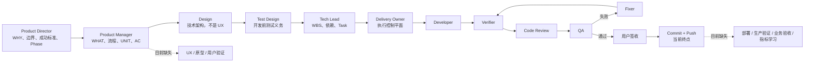
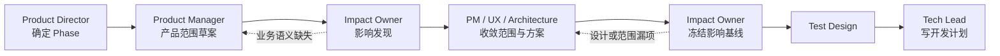
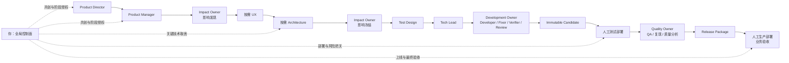
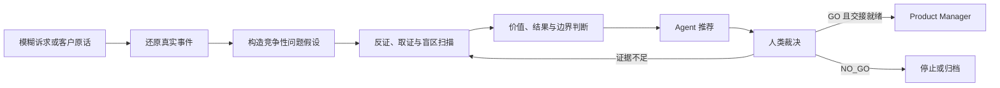

# Product Director Session Export

This is a human-readable export of a local Codex session. It is not an official Codex import package.

## Metadata

- Source session id: `019fb278-a881-71d0-b433-979b6d8b1c0e`
- Source JSONL: `/Users/lijieli/.codex/sessions/2026/07/30/rollout-2026-07-30T03-01-19-019fb278-a881-71d0-b433-979b6d8b1c0e.jsonl`
- Exported at: `2026-07-30T15:36:01.500Z`
- Originator: `Codex Desktop`
- CLI version: `0.146.0-alpha.3.1`
- Source cwd: `/Users/lijieli/org-claude-skills`
- Source git branch: `main`
- Source git commit: `f710dbe28c5c6275aab7d3af1d24b72e5106a627`
- Source repository: `https://github.com/jieli-cqwl/org-claude-skills.git`
- JSONL events: `3199`
- Visible transcript events exported: `219`

## Export Scope

- Included: user-visible user messages, user-visible assistant messages, and the latest Codex compaction summary when present.
- Excluded: developer/system instructions, hidden reasoning, tool call arguments, tool outputs, raw subagent internals, token accounting, and local runtime metadata beyond the summary above.
- Purpose: cross-machine review and continuation context. Do not treat this file as the canonical product/process source of truth; use checked-in specs and plans for that.

## Continuation Prompt

Use this prompt when starting a new Codex session on another machine:

~~~~~~~~text
请先读取 AGENTS.md，然后读取 docs/product-dirrctor-session.md 和 docs/superpowers/specs/2026-07-30--product-director-decision-case--design.md。

当前目标：基于已确认的 Product Director 设计进入下一阶段，先产出 implementation plan，不要直接修改 runtime skill。计划通过后，再使用 skill-creator 进入 Product Director skill 改造。

关键约束：
- Product Director 设计文档是设计输入，不是 runtime 真源。
- 不要重新讨论一人 + Agent 团队的宏观架构，除非发现设计文档存在硬矛盾。
- 不要提前推进 qft-tenants 真实案例；案例只用于最后的整链验收。
- 不要跳过人工审阅门禁。
~~~~~~~~

## Event Counts

| Event | Count |
|---|---:|
| `compacted` | 5 |
| `event_msg:agent_message` | 146 |
| `event_msg:agent_reasoning` | 569 |
| `event_msg:context_compacted` | 5 |
| `event_msg:patch_apply_end` | 22 |
| `event_msg:sub_agent_activity` | 58 |
| `event_msg:task_complete` | 61 |
| `event_msg:task_started` | 73 |
| `event_msg:thread_rolled_back` | 12 |
| `event_msg:thread_settings_applied` | 75 |
| `event_msg:token_count` | 433 |
| `event_msg:turn_aborted` | 12 |
| `event_msg:user_message` | 73 |
| `event_msg:web_search_end` | 17 |
| `inter_agent_communication_metadata` | 33 |
| `response_item:agent_message` | 33 |
| `response_item:custom_tool_call` | 146 |
| `response_item:custom_tool_call_output` | 146 |
| `response_item:function_call` | 186 |
| `response_item:function_call_output` | 186 |
| `response_item:message` | 243 |
| `response_item:reasoning` | 489 |
| `session_meta` | 61 |
| `turn_context` | 78 |
| `world_state` | 37 |

## Visible Transcript

### 001. User - 2026-07-30T10:01:20.204Z

~~~~~~~~text
[$brainstorming](/Users/lijieli/.agents/skills/brainstorming/SKILL.md) 从product-director 到 delivery-owner 的闭环工作流程，我的原本的需求场景是想打造一人+agent团队，完成产品开发的完整流程。现在还没有投入使用，因为我看了对应的内容，直观的感受就不是我想要的。也有可能是我的理解错觉，我是业务刚转的产品，老板要求以后必须是一个人+codex（你）来完成产品的交付；现在我没有目标和方向，我有些迷茫；
~~~~~~~~

### 002. Assistant (commentary) - 2026-07-30T10:01:20.204Z

~~~~~~~~text
我会按 `$brainstorming` 先把问题扒开，不碰实现。目标先定成：判断现有 `product-director → delivery-owner` 链路为什么让你直觉不对，并把“一个业务转产品的人 + Codex 能真实交付产品”收敛成可执行流程，而不是再堆一套角色名和文档仪式。先查现有链路、项目约束和近期改动，再只问你一个关键问题。
~~~~~~~~

### 003. Assistant (commentary) - 2026-07-30T10:01:20.205Z

~~~~~~~~text
协作判断已读：当前是单一设计问题，先由主对话直接梳理；没有必要把你的困惑切碎后丢给一群子 Agent，那只会提前复制现有流程的毛病。现在开始找链路真源和它实际承诺的交付边界。
~~~~~~~~

### 004. Assistant (commentary) - 2026-07-30T10:01:20.213Z

~~~~~~~~text
先给一个不粉饰的初判：你的“不对劲”不是错觉。仓库自己已经承认两件事——`product-director` 只适合受控复杂需求试用，`delivery-owner` 甚至只允许“有人类盯场的证据试点”；但主链仍铺了 6 个主角色、十多类 JSON、审计、派发包、循环和签核。它更像“把多人研发组织压进 Agent 流程”，还不是“让一个产品新人借 Codex 完成交付”。我继续核对中间角色和真实试跑证据，避免只凭文档体感下结论。
~~~~~~~~

### 005. Assistant (final_answer) - 2026-07-30T10:01:20.224Z

~~~~~~~~text
结论：你的直觉没错。现有链路主要解决“多角色、多工件、强治理怎么不失控”，不是“产品新人如何带着 Codex 把一个产品做上线”。六个主角色、十多类 JSON、反复审计与签核，控制很强，但会把你变成流程管理员。更要命的是，仓库自己的评审也承认：

- `product-director` 仅适合复杂需求的受控试用；
- `delivery-owner` 仅允许有人盯场的证据试点；
- 完整链路尚未证明能用于真实交付。

所以现在别急着优化这条链。第一步必须钉死“交付终点”，否则所有流程设计都是漂亮废纸。

老板所说的“一人 + Codex 完成产品交付”，具体要求到哪一步？

A. 从模糊需求到真实上线并通过业务验收，你对全过程负责
B. 做到可合并代码、测试证据和部署包，发布由别人负责
C. 只负责产品方案、PRD和项目推进，研发交付仍由团队负责

如果老板没明确说过，请选最接近其真实期待的一项；我目前推测是 **A**。
~~~~~~~~

### 006. User - 2026-07-30T10:01:20.227Z

~~~~~~~~text
A
~~~~~~~~

### 007. Assistant (final_answer) - 2026-07-30T10:01:20.228Z

~~~~~~~~text
明白，目标是完整闭环：需求澄清 → 产品设计 → 技术实现 → 测试 → 部署上线 → 业务验收。这里不能装神弄鬼：Codex 可以承担大量执行，但业务决策、生产权限和最终风险仍必须由你负责。

下一个关键问题：你现在是否已经有一个必须交付的真实项目？

A. 没有具体项目，老板只是提出能力要求
B. 有现有产品中的小需求或小改版
C. 有从零开始的新产品
D. 有涉及客户、资金、隐私或核心业务的高风险项目

我推荐从 **B** 开始；如果确实没有项目，就选 **A**，我们再设计一个低风险试点。
~~~~~~~~

### 008. User - 2026-07-30T10:01:20.228Z

~~~~~~~~text
B
~~~~~~~~

### 009. Assistant (final_answer) - 2026-07-30T10:01:20.228Z

~~~~~~~~text
好，首个试点就锁定为“现有产品中的小需求”。这是正确起点：已有用户、代码和运行环境，成功与失败都能观察，不用先造一个假项目自嗨。

请只用一句话描述这个小需求是什么；先写业务现象，不用写你设想的解决方案。
~~~~~~~~

### 010. User - 2026-07-30T10:01:20.229Z

~~~~~~~~text
你的目的是啥？现在我有些没看懂你的推进节奏？是直接就用需求来验证现有的流程来吗？
~~~~~~~~

### 011. Assistant (final_answer) - 2026-07-30T10:01:20.234Z

~~~~~~~~text
不是直接拿需求跑现有流程。刚才我推进太快，没把意图讲清楚。

我的目标是：

> 重新设计一套适合“业务转产品的你 + Codex”完成真实上线的闭环，并判断现有 `product-director → delivery-owner` 哪些该留、该删、该降级。

当前仍在“定义问题”，没有验证流程，更没有开始开发。

真实小需求后面只作为校准案例：

1. 先设计最小闭环；
2. 再用真实需求做桌面推演，检查你能否理解、决策和接管；
3. 设计通过后，才考虑实际试跑；
4. 不会默认套用现有六角色重流程。

接下来我会先给你现有流程的病因诊断，再提出 2–3 种重构方向，不继续盘问需求细节。

确认一下：你要的是“先重构出适合你的一人 + Codex 工作方式，再用真实小需求验证”，对吗？
~~~~~~~~

### 012. User - 2026-07-30T10:01:20.237Z

~~~~~~~~text
不完全是，咋们先把一人 + Agent（是Codex也有可能是claude等） 工作方式的方向和思路讨论清楚，然后再来评估当前的流程是否符合，如果继续沿用那么再深入评估每个环节的skill是否符合预期
~~~~~~~~

### 013. Assistant (commentary) - 2026-07-30T10:01:20.238Z

~~~~~~~~text
你这个纠偏是对的。顺序应该是“先定义操作系统，再审现有实现”，不能拿现有链路当尺子反过来定义目标。`$brainstorming` 也会继续卡住实现：这一阶段只建立方向、原则和边界，不改 Skill、不跑真实需求。
~~~~~~~~

### 014. Assistant (final_answer) - 2026-07-30T10:01:20.239Z

~~~~~~~~text
对，正确顺序应当是：

1. 从第一性原理定义“一人 + Agent”的目标工作方式；
2. 明确人和 Agent 的责任、决策权、协作循环与失败边界；
3. 再拿这套目标模型审视现有 `standard-chain`；
4. 判断是沿用、裁剪、重构还是废弃；
5. 只有决定沿用某个环节，才深入评估对应 Skill。

本轮目标产物不是“流程评测报告”，而是供应商无关的《一人 + Agent 工作方式设计》。Codex、Claude只是可替换执行者。

第一个根问题：当这套模式成熟后，你认为自己最不可替代的核心职责应该是什么？

A. 判断业务问题、确定优先级、做关键取舍、承担风险并验收结果
B. 亲自完成产品分析、方案、计划和交付，Agent只是辅助工具
C. 给不同 Agent 分派任务、检查文档并协调它们工作

我推荐 **A**。B 可以是你的成长过程，但不该是终局；C 看似在“带团队”，实际很容易沦为 Agent 流程管理员。
~~~~~~~~

### 015. User - 2026-07-30T10:01:20.242Z

~~~~~~~~text
A
~~~~~~~~

### 016. Assistant (final_answer) - 2026-07-30T10:01:20.243Z

~~~~~~~~text
那就先锁定第一条原则：

> 人是业务 Owner，不是全能执行者，也不是 Agent 调度员。
> 你负责目标、优先级、关键取舍、风险接受和最终验收；其余工作原则上应由 Agent 系统承担，并把真正需要你决定的问题提纯后交给你。

下一个关键问题：日常工作时，你希望自己直接面对谁？

A. 只面对一个主 Agent；它理解目标、维护上下文、调度其他专业 Agent，并对结果负责
B. 直接管理产品、设计、开发、测试等多个 Agent
C. 根据任务自行选择不同 Agent，没有固定主 Agent

我推荐 **A**。多个专业能力可以存在，但应藏在主 Agent 后面；否则你只是从“管理人类团队”降级成“管理一排聊天窗口”。
~~~~~~~~

### 017. User - 2026-07-30T10:01:20.244Z

~~~~~~~~text
这里取决于哪些需要我共创，我理解和Agent 共创的方式可能会更好，其中产品、架构设计环节我认为是需要我一起共创的，在执行环节由agent自己来完成，我主要看每个环节的产出是否符合预期
~~~~~~~~

### 018. Assistant (final_answer) - 2026-07-30T10:01:20.244Z

~~~~~~~~text
你的补充把模型说清了一半：

- 产品与架构设计：人和 Agent 共创，因为这里存在目标、范围、价值和长期成本取舍。
- 开发、测试、修复、部署准备：Agent 自主闭环。
- 人不负责具体执行，但负责确认阶段结果是否仍然服务于目标。

不过有个暗坑：“看每个环节的全部产出”很容易把你变成人肉审批流水线。合理边界应该是：Agent 检查专业细节，你检查关键决策、业务影响和可观察结果；高风险或证据冲突时再下钻。

你希望采用哪种审阅方式？

A. 每个阶段都停下来，由你完整审阅产物后继续
B. 只在产品、架构、上线验收三个节点停下来，其余全自动
C. 默认只审关键节点；Agent 根据风险、不可逆性和置信度主动增加检查点，你也可随时下钻

我推荐 **C**。它既保留共创，又不会把“一个人 + Agent”做成审批地狱。
~~~~~~~~

### 019. User - 2026-07-30T10:01:20.245Z

~~~~~~~~text
C
~~~~~~~~

### 020. Assistant (final_answer) - 2026-07-30T10:01:20.245Z

~~~~~~~~text
锁定第二条原则：

> 人类介入由“风险、不可逆性、置信度和目标漂移”触发，而不是每完成一个角色步骤就机械审批。

默认产品、架构和上线验收需要共创；执行过程由 Agent 自主闭环。低风险事项不中断你，高风险事项必须带着证据、选项和推荐方案来找你。

下一个关键取舍：这套工作方式除了完成交付，是否还必须帮助你成长为能够判断产品与交付质量的人？

A. 交付速度优先，解释尽量少
B. 交付与成长并重，只在关键决策点解释原理、证据和取舍
C. 学习优先，每个阶段都详细教学

我推荐 **B**。只追求速度，你会逐渐失去判断 Agent 是否在胡扯的能力；处处教学，又会把一次交付拖成培训班。
~~~~~~~~

### 021. User - 2026-07-30T10:01:20.246Z

~~~~~~~~text
B
~~~~~~~~

### 022. Assistant (final_answer) - 2026-07-30T10:01:20.246Z

~~~~~~~~text
锁定第三条原则：

> 每个共创节点同时交付“结果”和“判断能力”：Agent 给推荐结论，也解释关键依据、被排除方案、风险和验证方法；但不把整段执行过程倾倒给你。

这样你是在交付中成长，不是先学完产品、架构、研发再开工。

下一个关键问题：Agent 完成执行后，什么证据才足以让你判断“符合预期”？

A. 主 Agent 汇报已完成、测试已通过
B. 另一个 Agent 独立检查并给出通过结论
C. 独立检查 + 可复现测试或运行证据 + 你对真实业务行为做最终验收

我推荐 **C**。Agent 的自我总结不是证据，两个 Agent 互相点赞也不是；必须能复现，并最终落到用户可观察的业务结果。
~~~~~~~~

### 023. User - 2026-07-30T10:01:20.246Z

~~~~~~~~text
C
~~~~~~~~

### 024. Assistant (final_answer) - 2026-07-30T10:01:20.247Z

~~~~~~~~text
锁定第四条原则：

> 交付不能自证。执行 Agent、验证机制和业务验收必须分离。

专业正确性由独立检查和可复现证据证明；业务正确性由你根据真实可观察结果验收。专业角色可以由同一底层模型承担，但不能复用同一段推理和未审查结论假装“独立”。

下一个边界：Agent 对生产环境应该拥有多大操作权？

A. 所有门禁通过后可自动部署生产
B. Agent 自动完成开发、测试、预发布和上线准备；生产发布、数据迁移及其他不可逆动作必须由你显式授权
C. Agent 不接触生产，最终发布必须交给其他人

我推荐 **B**。它仍然是一人 + Agent 完成交付，但不会把“自动化”误解成“Agent 可以擅自碰生产”。
~~~~~~~~

### 025. User - 2026-07-30T10:01:20.248Z

~~~~~~~~text
现在的方向给我的感觉不是很对，有点太细节了，我们应该把团队的形态搭建起来，具体权限啥的应该是每个环节不一样；我的场景应该社区也有人尝试过，这是算是软件工程的返程吧？要不先看看别人是怎么搞的？我更聚焦咋们第一阶段先把宏观的架构流程高明白
~~~~~~~~

### 026. Assistant (commentary) - 2026-07-30T10:01:20.252Z

~~~~~~~~text
对，刚才我钻进了“治理参数”，方向偏细了。你现在要的不是先定义生产权限，而是先看清“一人 + Agent 团队”有哪些成熟形态、它们如何从需求走到交付，以及哪种宏观架构适合你。

这仍属于 `$brainstorming` 的项目探索阶段：我先查社区与官方的一手实践，提炼共同结构和失败模式；暂不拿现有 `standard-chain` 套答案，也不逐个审 Skill。
~~~~~~~~

### 027. Assistant (commentary) - 2026-07-30T10:01:20.269Z

~~~~~~~~text
接下来的宏观团队形态用图会比文字清楚得多——我可以在浏览器里并排展示社区方案、角色关系和交付闭环。这个能力还比较新，也会多消耗一些 token。要用吗？我会直接为你打开。
~~~~~~~~

### 028. Assistant (final_answer) - 2026-07-30T10:01:20.269Z

~~~~~~~~text
接下来的宏观团队形态用图会比文字清楚得多——我可以在浏览器里并排展示社区方案、角色关系和交付闭环。这个能力还比较新，也会多消耗一些 token。要用吗？我会直接为你打开。
~~~~~~~~

### 029. User - 2026-07-30T10:01:20.270Z

~~~~~~~~text
同意
~~~~~~~~

### 030. Assistant (commentary) - 2026-07-30T10:01:20.270Z

~~~~~~~~text
你已接受 Visual Companion。按 `$brainstorming` 的要求，我先读取它的完整操作指南，然后把社区主流形态和我们要讨论的宏观候选架构做成第一张对比图；这一步仍然只做方向设计，不进入现有流程评估。
~~~~~~~~

### 031. Assistant (final_answer) - 2026-07-30T10:01:20.273Z

~~~~~~~~text
方向已经拉回宏观层面。这个领域通常叫：

- Agent-native software delivery
- Agent-first engineering
- Harness engineering
- Spec-driven development

它不只是软件工程，还横跨产品决策、Agent 编排与人机协作。

我查到的主流实践可以归为四种：

- Spec Kit：`意图 → 规格 → 计划 → 任务 → 实现` 的工件驱动链路。[GitHub Spec Kit](https://github.com/github/spec-kit)
- BMAD / gstack：用产品、架构、开发、QA等专业角色覆盖生命周期。[BMAD Workflow Map](https://github.com/bmad-code-org/BMAD-METHOD/blob/main/docs/reference/workflow-map.md)、[gstack](https://github.com/garrytan/gstack)
- OpenAI / Anthropic：人类定方向，Lead Agent 动态调度专家，依靠环境与反馈循环推进。[OpenAI Harness Engineering](https://openai.com/index/harness-engineering/)、[Anthropic Building Effective Agents](https://www.anthropic.com/engineering/building-effective-agents)
- Ralph：计划明确后，Agent 按任务持续执行、验证和记录。[Ralph](https://github.com/iannuttall/ralph)

我的初判是：**主 Agent + 动态专家做团队骨架，规格管理意图，自主循环负责执行**。专业角色可以保留，但不应变成你必须逐个调用的一排虚拟员工。

浏览器应该已经打开；备用地址是 [Visual Companion](http://localhost:61347/?key=0931bcb92480a65b7209d897f071e4c07932d2e672edaa8537a23f5de1db0f29)。

页面展示了四种宏观团队形态及推荐组合。请点击你认可的一个或多个骨架，再告诉我哪些地方对、哪些地方仍然不对。
~~~~~~~~

### 032. User - 2026-07-30T10:01:20.275Z

~~~~~~~~text
我建议前期可以设计成我逐个去调用，先确保每个环节是符合预期的，前期现有完整的架构，至于是手动执行还是自动执行，我的建议是跑顺了，在考虑自动
~~~~~~~~

### 033. Assistant (commentary) - 2026-07-30T10:01:20.276Z

~~~~~~~~text
这个判断基本对：先把“团队能力架构”和“交付主链”搭完整，再采用手动编排；等每个环节的输入、输出、回退和质量都跑顺，才逐步自动化。这里要防一个坑——“完整架构”应是完整能力地图，不是第一天就把所有角色、文档和门禁做满。现在我按你的意见把宏观模型改成“手动优先、自动化就绪”的三阶段演进图。
~~~~~~~~

### 034. Assistant (commentary) - 2026-07-30T10:01:20.278Z

~~~~~~~~text
Visual Companion 服务刚刚被本地进程回收了；按指南我用同一项目目录恢复，它会复用原端口，已打开的页面会自动重连，不需要换链接。设计内容没有丢。
~~~~~~~~

### 035. Assistant (final_answer) - 2026-07-30T10:01:20.279Z

~~~~~~~~text
你的方向成立，关键是把两件事拆开：

- 团队架构：完整定义需要哪些能力、如何交接、失败回哪里。
- 执行模式：前期手动调用，跑顺后才逐步自动化。

我把宏观模型调整为：

`机会与问题 → 产品定义 → 体验与架构 → 交付计划 → 构建与验证 → 发布与验收 → 运行与学习`

同一套架构支持三种成熟度：

- M0：你逐环节调用和检查；
- M1：你启动宏观阶段，Agent 自动完成阶段内部协作；
- M2：Lead Agent 自适应编排，你只参与共创和重大决策。

已更新 [Visual Companion](http://localhost:61347/?key=0931bcb92480a65b7209d897f071e4c07932d2e672edaa8537a23f5de1db0f29)。请看七段主链和 M0–M2 演进图，选择“基本正确”或“仍需调整”，再告诉我判断。
~~~~~~~~

### 036. User - 2026-07-30T10:01:20.280Z

~~~~~~~~text
我刚刚想了一下，咋们先把团队需要哪些环节定义下来；社区和官方已经有比较专业的对应环节的skill，我们先把架子去确定下来，然后再去社区或则官网find skill对应高质量可用skill再结合咋们本地的改造为咋们的环节skill形成闭环；如果有不对的及时指出
~~~~~~~~

### 037. Assistant (commentary) - 2026-07-30T10:01:20.280Z

~~~~~~~~text
这个顺序大体正确，但我先把一个会害死后续设计的误区钉住：**环节、角色、Skill 不是一回事，也绝不能强行一一对应。**

正确分层应是：先定义生命周期环节解决什么问题；再定义每个环节需要哪些能力和决策权；最后才找 Skill 作为可替换实现。官方或高 Star 只说明“有人维护”，不证明适合你的闭环。第三方源也应优先通过适配层接入，不能直接污染本地真源或上游镜像。接下来先只裁决团队骨架。
~~~~~~~~

### 038. Assistant (final_answer) - 2026-07-30T10:01:20.281Z

~~~~~~~~text
你的顺序基本正确，我补三条硬约束：

1. 先定义环节，再定义能力合同，最后才找 Skill；不能反过来被现成 Skill 塑造流程。
2. 一个环节不必对应一个 Skill；研究、评审、测试、安全等可能是跨环节能力。
3. “官方、热门、高 Star”不等于适配。候选必须用真实任务证明输入、输出、边界、失败回退和下游可消费性。

我给了三种团队骨架，推荐：

> 三环组织结构 + 控制面 + 七个前期手动入口

七个入口暂定为：

`需求路由 → 产品定义 → 体验设计 → 技术方案 → 交付计划 → 构建验证 → 发布学习`

其中产品环、方案环、交付环负责业务推进；目标上下文、编排状态、质量安全和运行反馈属于控制面，不应伪装成额外流水线阶段。

已更新 [Visual Companion](http://localhost:61347/?key=0931bcb92480a65b7209d897f071e4c07932d2e672edaa8537a23f5de1db0f29)。请先选择骨架方案；选定后，我们再逐个裁决七个环节是否必要、重叠或缺失。
~~~~~~~~

### 039. User - 2026-07-30T10:01:20.283Z

~~~~~~~~text
流程其实我还是更倾向于使用 product-director 到 delivery-owner的闭环流程；你下深入理解下整个完整的流程；然后澄清下我的意图以及存在的问题
~~~~~~~~

### 040. Assistant (commentary) - 2026-07-30T10:01:20.283Z

~~~~~~~~text
明白。先停止另起炉灶，也暂停 Skill 选型。你的真实倾向是：**保留 `product-director → delivery-owner` 作为候选主骨架，但你还没有被它说服；要先看清整条链到底如何工作、每个环节为什么存在、你和 Agent 在哪里共创、哪里自主执行，以及它为什么让你直觉不对。**

这轮我继续用 `$brainstorming` 做意图收敛，并引入工作流审计视角；同时按仓库协作规则，把六个主环节和运行闭环分块核查，最后由我统一还原，不让你看一堆子任务碎片。先读审计与并行调查规范，再展开。
~~~~~~~~

### 041. Assistant (commentary) - 2026-07-30T10:01:20.285Z

~~~~~~~~text
我已把 Visual Companion 切到等待页。并行调查现在只做读证据：六个主角色分别还原自身职责与交接，另两路查跨链真源和成熟度证据。这里使用并行调查是因为各角色文档边界独立；最终判断仍由我串链，避免“八个人各说各话”。
~~~~~~~~

### 042. Assistant (commentary) - 2026-07-30T10:01:20.294Z

~~~~~~~~text
目前已经看到一个高概率根因：链路里的 `/design` 实际是“技术架构设计”，不是产品体验/交互设计；而你说需要共创的“产品、架构设计”之间，现有主链没有独立 UX/原型/用户验证环节。也就是说，名字看起来完整，能力地图可能并不完整。我继续核对这是不是被 PM 内嵌承担，还是确实断档。
~~~~~~~~

### 043. Assistant (commentary) - 2026-07-30T10:01:20.296Z

~~~~~~~~text
第二个已经坐实的结构性问题：这条链的“交付终点”不是你选择的 A。`delivery-owner` 在拿到 `/commit` 返回结果后就允许声明 `DELIVERED`；它没有把部署、生产验证、业务指标观察和上线后复盘纳入主链。因此它闭合的是“代码交付证据”，不是“真实上线并通过业务验收”。这个差异不是措辞问题，是终局定义错位。
~~~~~~~~

### 044. Assistant (commentary) - 2026-07-30T10:01:20.298Z

~~~~~~~~text
结构上看，现有链并不是你刚才担心的“自动黑盒”：六个主 Skill 在运行面全部标为 `manual`，只有进入 `delivery-owner` 后，developer / verifier / QA / fixer 才作为受调度执行 Agent。这一点其实与你“先逐环节调用、跑顺后再自动化”的想法高度一致。现在需要判断的不是骨架有没有价值，而是它的环节定义、终点和控制成本是否配得上你的目标。顺手跑两条现有针对性门禁，验证合同链是否仍能工作；这不等于真实交付证明。
~~~~~~~~

### 045. Assistant (commentary) - 2026-07-30T10:01:20.299Z

~~~~~~~~text
我先给你一个阶段性结论：这条链的“骨架”大概率值得保留，但它现在实际交付的是“需求到代码提交”，不是你想要的“需求到上线并被业务验收”。另外，刚跑出的 `product-manager → design` 新鲜交接测试失败了；我会按系统化调试规范只查根因、不改代码，避免把“设计问题”和“当前回归”混在一起。
~~~~~~~~

### 046. Assistant (commentary) - 2026-07-30T10:01:20.301Z

~~~~~~~~text
这个失败已经定位清楚：不是 Agent 能力问题，而是仓库契约漂移。6 月 2 日给 UNIT 的每条验收标准新增了必填 `source_refs`，但“黄金示例”4 个 UNIT、共 12 条 AC 一条都没更新；5 月 10 日建立的 E2E 测试因此必挂。它暴露的不是一个孤立小错，而是当前流程治理本身的风险：规则越重，维护链条越容易自相矛盾。先记为“当前可用性证据不成立”，本轮不修。
~~~~~~~~

### 047. Assistant (commentary) - 2026-07-30T10:01:20.307Z

~~~~~~~~text
现在可以把“你的错觉”基本排除了：你不是没看懂，而是角色名把真实边界包装得比实际更完整。`product-director` 不是产品战略/路线图负责人，`design` 不是 UX 设计，`delivery-owner` 也不是上线运营负责人。它们分别更接近“复杂需求基线门”“技术架构”“开发到 Git 提交的执行编排”。我还在等各环节审计收口，随后会把“现有真实链路、与你意图的匹配/错位、哪些骨架值得留”一次说透。
~~~~~~~~

### 048. Assistant (commentary) - 2026-07-30T10:01:20.312Z

~~~~~~~~text
我会用已开启的可视化伴侣补一张“现有真实链路 vs 你真正要的闭环”对照图；它只用于帮助我们确认宏观理解，不会开始改流程或写 Skill。
~~~~~~~~

### 049. Assistant (final_answer) - 2026-07-30T10:01:20.319Z

~~~~~~~~text
结论：你倾向保留 `product-director → delivery-owner` 是对的，但应保留“专业分工骨架”，不能默认接受现有整套实现。

它现在不是“一人 + Agent 完成产品交付闭环”，而是一个高审计、强契约的“复杂需求到 Git 提交”控制系统。



### 我对你意图的澄清

你真正想搭建的不是一堆角色名，而是这样的工作系统：

- 你是业务事实、产品取舍、投入边界、风险接受和最终验收负责人。
- 产品方案、UX、关键架构由你和 Agent 共创，Agent 必须给推荐、依据与取舍，而不只是生成文档让你签字。
- 测试设计、计划、开发、验证、代码审查、QA、修复由 Agent 团队自主执行。
- 前期由你逐环节手动调用和验收；跑顺后才考虑自动路由。
- 环节能力与具体 Skill、Codex、Claude 解耦，可以替换实现。
- 真正终点是上线、生产验证、业务验收，并把数据反馈送回下一轮，而不是代码提交。

### 现有流程对得上的地方

- 六个主环节全部是手动入口，符合你“先逐个调用”的设想。
- Product Director、PM、Design 都采用 Agent 推荐、用户裁决的协作模式。
- Delivery Owner 已具备 developer、verifier、review、QA、fixer 的执行回路。
- 目标变化会使旧证据失效并回流对应 owner，这个思想值得保留。
- 用户保留签收与业务风险接受权，Agent 不应替你拍板。

完整角色与权责定义在 [standard-chain.yaml](/Users/lijieli/org-claude-skills/contracts/standard-chain.yaml:4)。

### 真正的问题

1. **角色名制造了“已经闭环”的错觉。**

   - Product Director 实际是“复杂需求 WHY 基线门”，不是产品战略、市场发现、路线图负责人。
   - Design 明确是技术架构，不负责 UX。[design/SKILL.md](/Users/lijieli/org-claude-skills/shared/skills/design/SKILL.md:11)
   - Delivery Owner 实际终点是 commit/push。[delivery-owner/SKILL.md](/Users/lijieli/org-claude-skills/shared/skills/delivery-owner/SKILL.md:146)、[commit/SKILL.md](/Users/lijieli/org-claude-skills/shared/skills/commit/SKILL.md:35)

2. **缺失两段关键闭环。**

   - 界面型产品缺 UX、原型和用户验证。仓库虽有 `/ux`，但仍消费旧 `brief.md`，没有接入标准链。[ux/SKILL.md](/Users/lijieli/org-claude-skills/shared/skills/ux/SKILL.md:30)
   - 缺部署、生产验证、业务指标观察和复盘学习。

3. **控制系统明显过重。**

   当前有 19 类 canonical 工件、236 个字段、470 条消费关系；登录样板本身包含 24 个 JSON、4,686 行。对于强监管、多团队项目可能值得，对于一人开发很容易变成“实现很小，填表比实现还贵”。

4. **更糟的是：复杂度并没有换来可靠性。**

   本轮 fresh 反证包括：

   - PM→Design 黄金链路当前直接失败：schema 新增了 AC 必填 `source_refs`，四个 UNIT 的样例一个都没更新。[E2E 测试](/Users/lijieli/org-claude-skills/tests/test-pm-design-chain-e2e.sh:31)、[Schema](/Users/lijieli/org-claude-skills/shared/skills/product-manager/contracts/unit-definition.schema.json:70)
   - `delivery-state` 局部允许 `READY_FOR_COMMIT/DELIVERED`，共享 schema 又禁止，导致这两个最终状态实际无法 canonical 落盘。
   - 多个环节的“用户已确认”只能证明 Agent 写了一个确认字段，不能证明真人真的确认过。
   - Design、Test Design、Tech Lead 的部分门禁只验证文件存在或结构正确，不能证明业务语义真的成立。

5. **当前可用性证据不足。**

   六个主环节只有 PM 留有历史 `retain`，其余五个都是 `optimize`；而 PM 当前又有 fresh E2E 失败。正式全链 readiness 评估只有已批准设计，没有结果集。当前 active scope 也是空的：[active-doc-scope.yaml](/Users/lijieli/org-claude-skills/contracts/active-doc-scope.yaml:19)。

所以正确判断是：

- **流程骨架：大体正确，值得继续。**
- **闭环边界：不完整。**
- **现有控制系统：需要重新裁决复杂度。**
- **现有各环节 Skill：尚未证明整体可用，不能直接投入。**

我已经把对照图放在[可视化伴侣](http://localhost:58086/?key=c751bb10250da06de432c76e6774fd605ca33123dc95eb8990590736da7dbd14)。

现在只确认一个关键问题：

- **A（推荐）**：保留角色、顺序、权责和回流骨架；现有 JSON、门禁、Skill 全部重新逐层验收。
- **B**：骨架和当前 canonical 控制系统都默认保留，只修冲突、缺口和终点。
- **C**：现有实现整体保留，以修 Bug 为主，不再重审复杂度。

你选 A、B 还是 C？
~~~~~~~~

### 050. User - 2026-07-30T10:01:20.319Z

~~~~~~~~text
A
~~~~~~~~

### 051. Assistant (commentary) - 2026-07-30T10:01:20.320Z

~~~~~~~~text
收到，A 已锁定：只保留专业骨架，现有 JSON、门禁和 Skill 都不享受“默认正确”。我会继续用 brainstorming 把宏观团队架构先定清；这一轮先裁决闭环的首尾边界，不进入任何 Skill 改造。
~~~~~~~~

### 052. Assistant (final_answer) - 2026-07-30T10:01:20.320Z

~~~~~~~~text
A 已锁定：保留角色、顺序、权责和回流骨架；现有控制系统与 Skill 全部重新验收。

下一项必须裁决的是 UX 在团队中的位置。我的建议是：

- **A（推荐）**：增加独立的 `product-design / UX` 环节，放在 PM 与技术架构之间；仅用户界面、交互或用户旅程类需求触发，纯后端需求可跳过。
- **B**：把 UX 并入 Product Manager，环节更少，但 PM 容易再次膨胀成万能角色。
- **C**：不设 UX 环节，继续交给技术设计或开发临场处理。

你选 A、B 还是 C？
~~~~~~~~

### 053. User - 2026-07-30T10:01:20.321Z

~~~~~~~~text
A
~~~~~~~~

### 054. Assistant (commentary) - 2026-07-30T10:01:20.321Z

~~~~~~~~text
收到：UX/Product Design 作为独立但按需触发的环节，位置固定在 Product Manager 与技术架构之间；纯后端、无交互变化的需求可以显式跳过。继续按 brainstorming 一次只裁决一个宏观边界。
~~~~~~~~

### 055. Assistant (final_answer) - 2026-07-30T10:01:20.321Z

~~~~~~~~text
下一项是定义闭环从哪里开始。我的建议是：

- **A（推荐）双循环**：上层是低频的“产品战略/机会发现/优先级”循环；选中的机会再进入 `Product Director → Delivery` 交付链。Product Director 是两层之间的桥。
- **B 单一大闭环**：每个需求都从市场、战略、路线图重新跑到交付。看似完整，实际会把小需求也拖进重流程。
- **C 只做交付链**：默认需求已经选定，战略与机会发现完全放在系统之外。

你选 A、B 还是 C？
~~~~~~~~

### 056. User - 2026-07-30T10:01:20.322Z

~~~~~~~~text
A 不是很懂，什么事双循环？
~~~~~~~~

### 057. Assistant (commentary) - 2026-07-30T10:01:20.322Z

~~~~~~~~text
你先别选，刚才这个词我讲抽象了。这里的“双循环”不是两套重复流程，而是把“决定做什么”和“把它做出来”拆开；我用一张关系图解释，避免继续靠术语绕你。
~~~~~~~~

### 058. Assistant (final_answer) - 2026-07-30T10:01:20.324Z

~~~~~~~~text
“双循环”不是两套重复流程，而是两种不同问题：

1. 方向循环：决定做什么

老板目标、客户反馈、数据和业务痛点 → 比较价值与优先级 → 选出值得投入的机会。

它防止 Agent 很高效地做错东西，通常按月、季度或重大变化运行。

2. 交付循环：把选中的事情做成

`Product Director → PM → UX → Architecture → Test Design → Tech Lead → Delivery Owner → 上线与业务验收`

上线结果再反馈给方向循环，决定继续、调整或停止。

例如：

- 方向循环判断：“退款处理慢”和“获客成本高”，现在先解决哪个？
- 交付循环负责：选中退款问题后，具体做什么、如何交互、怎么开发测试，并验证处理时长是否真的下降。

关系图已经更新在[可视化伴侣](http://localhost:58086/?key=c751bb10250da06de432c76e6774fd605ca33123dc95eb8990590736da7dbd14)。

现在重新确认一次：是否把这个轻量的“方向循环”也纳入团队架构？

- **A（推荐）**：纳入，作为 Product Director 之前的上层入口。
- **B**：暂不纳入，第一阶段只搭需求已经选定后的交付链。
~~~~~~~~

### 059. User - 2026-07-30T10:01:20.324Z

~~~~~~~~text
1、我建议暂不纳入，我担心会膨胀；2、需要评估product-director、product-manager 的各自作用，我的理解 product-director 应该是先把需求拆分为多个独立的需求，然后确保每个需求的上下文足够清晰和小闭环，确保下游的实施是高质量的产出；你看下我理解是否合理，或则你有更好的思考
~~~~~~~~

### 060. Assistant (commentary) - 2026-07-30T10:01:20.326Z

~~~~~~~~text
你的担心对：方向循环先不纳入，避免第一阶段膨胀。接下来我会用 brainstorming 只裁决 `product-director / product-manager` 的职责分界；这里最关键的是区分“两层拆分”，否则两个角色一定互相踩脚。
~~~~~~~~

### 061. Assistant (final_answer) - 2026-07-30T10:01:20.326Z

~~~~~~~~text
结论：你的理解方向对，但颗粒度错了一层。

`Product Director` 应该拆分大需求，但不应直接拆成 PM 粒度的“独立需求/功能单元”。否则 PD 和 PM 会重复劳动，PM最终沦为填表员。

更合理的是四层拆分：

| 层级 | Owner | 回答的问题 | 完成标准 |
|---|---|---|---|
| 业务需求 | 用户 | 为什么可能要做 | 提供真实场景与问题线索 |
| 价值 Phase | Product Director | 这次值得解决什么、投入多少 | 可独立上线、产生业务价值、可判断成败 |
| Product Unit | Product Manager | 用户具体完成什么行为 | 业务行为、规则、边界、AC、验证方式清晰 |
| Task | Tech Lead | 工程上如何实现 | Agent 可独立执行、验证和交接 |

### Product Director 应该负责什么

把模糊、庞大或混杂的需求转化为一个或多个“可独立投资和验收的价值 Phase”：

- 根问题与目标用户是谁。
- 为什么现在做。
- 成功信号是什么。
- 总范围、非目标、约束和主要风险。
- 如何切成若干具有独立业务价值的 Phase。
- 当前优先进入哪个 Phase。
- 当前 Phase 的入口、出口和投入边界。

其输出应达到“值得投入且边界稳定”，而不是“开发可以直接编码”。

现有 Product Director 的设计其实已经偏向这一定位：[product-director/SKILL.md](/Users/lijieli/org-claude-skills/shared/skills/product-director/SKILL.md:23)。

### Product Manager 应该负责什么

只接当前被选中的 Phase，把它进一步拆成可设计、可测试的 Product Units：

- AS-IS / TO-BE 流程。
- 用户路径、业务对象、状态、权限和规则。
- 功能边界与异常路径。
- Product Unit 的触发条件、核心行为和可观察结果。
- 每个 Unit 的 AC、依赖、排除项和验证方式。
- 给 UX 和技术架构的明确交接。

其输出应达到“产品语义完整，下游不需要猜”。

这正是现有 PM 试图承担的工作：[product-manager/SKILL.md](/Users/lijieli/org-claude-skills/shared/skills/product-manager/SKILL.md:29)。

### 一个关键纠偏

“小”不等于“高质量”。

一个需求切得再小，如果不能独立产生价值、没有可观察结果或仍需下游猜业务规则，依然是垃圾切分。合理切片需要同时满足：

- 有明确用户或业务角色。
- 有完整触发到结果的小闭环。
- 结果可以观察和验证。
- 边界与不做项清楚。
- 依赖和未知项可控。

Product Director 对下游质量负责的方式，是确保大家在做正确且边界稳定的问题；不是替 PM、架构师、测试和 Tech Lead 检查所有细节。否则责任会无限膨胀。

### 三种分工方式

- **A（推荐）两级拆分**：PD 拆价值 Phase；PM 拆 Product Unit、AC 和验证口径。边界最清楚，也最符合现有骨架。
- **B PD 拆到 Product Unit**：PM只补流程和 AC。角色严重重叠，PM接近需求文档编辑器。
- **C 合并 PD 与 PM**：简单需求效率高，但复杂需求容易边做边改目标，不符合你目前想保留的专业闭环。

是否按 A 冻结这两个角色的边界：`Product Director = 需求 → 价值 Phase`，`Product Manager = 当前 Phase → Product Unit / AC`？
~~~~~~~~

### 062. User - 2026-07-30T10:01:20.327Z

~~~~~~~~text
你的考虑是什么？我先听听你的意见
~~~~~~~~

### 063. Assistant (commentary) - 2026-07-30T10:01:20.327Z

~~~~~~~~text
我会直接给判断，不把选择题丢回给你。继续按 brainstorming 的边界，只解释推荐依据，不进入流程或 Skill 改造。
~~~~~~~~

### 064. Assistant (final_answer) - 2026-07-30T10:01:20.327Z

~~~~~~~~text
我的意见：保留 Product Director 和 Product Manager 两个环节，但必须重新定义它们。

最准确的定位是：

- **Product Director = 需求投资与价值切片负责人**
- **Product Manager = 产品定义与可验收闭环负责人**

不是上下级关系，而是分别防两种完全不同的失败。

### 为什么需要 Product Director

Product Director 防的是：Agent 把错误的问题做得非常漂亮。

它要回答：

- 这个需求背后的真实问题是什么？
- 值不值得现在投入？
- 成功如何判断？
- 本期做到哪里就该停？
- 需求太大时，怎样切出最先产生价值的 Phase？

但有一点需要纠正：**不是所有需求都必须拆成多个 Phase。**

如果一个需求本身已经足够清晰、能在一个短周期内独立上线并验证，就保留一个 Phase。强行拆分只会制造文档和交接。

只有出现以下情况才拆 Phase：

- 无法一次上线。
- 不同部分价值优先级明显不同。
- 存在高风险假设，需要先验证。
- 前后部分可以独立产生业务价值。
- 一次投入过大，失败成本不可接受。

而且 Product Director 只需要详细冻结当前 Phase，后续 Phase 保留方向性假设即可。否则会提前设计未来，十有八九返工。

### 为什么还需要 Product Manager

Product Manager 防的是：方向虽然正确，但产品行为含糊，研发只能靠猜。

它接手已确认的当前 Phase，回答：

- 谁在什么场景下使用？
- 从什么状态进入？
- 用户具体做什么？
- 系统和业务对象如何变化？
- 正常、异常和边界路径是什么？
- 什么结果算完成？
- 怎么证明它满足要求？

所以 PM 负责拆的是 Product Unit，不是重新决定 Phase。

一个 Product Unit 不一定能单独产生完整商业价值，但必须形成一个可独立描述、设计和验证的业务行为闭环。

### 举个例子

原始需求：“做一个智能工单系统。”

Product Director 处理后可能得到：

- 根问题：人工分类和分派耗时，导致响应超时。
- Phase 1：系统自动分类，人工确认后完成分派。
- Phase 2：低风险工单自动分派。
- Phase 3：根据处理结果持续优化分类。
- 当前只投入 Phase 1，因为先验证分类准确性和人工效率提升。

Product Manager 接手 Phase 1，再拆成：

- 工单进入后的自动分类。
- 低置信度结果提示人工修正。
- 人工确认分类并完成分派。
- 分类失败后的降级路径。
- 权限、状态变化、审计记录和对应 AC。

这时 UX、架构、测试和开发才真正有稳定输入。

### 两个角色必须有四条铁律

1. Product Director 不写详细功能、AC、交互、接口或任务。
2. Product Manager 不得重新解释根问题、成功标准和 Phase 边界。
3. PM 发现基线错误必须回 Product Director，不能偷偷修改。
4. 已经确认的业务事实只传递、不重复询问用户。

否则所谓两个角色，只是同一个 Agent换两顶帽子重复写文档。

### 对“一人 + Agent”的实际形态

这不是要求你扮演两个岗位。

- Product Director 阶段：你和 Agent 深度共创，决定问题、投入和价值切片。
- Product Manager 阶段：Agent 主导细化，你只补充真实业务规则、异常情况和关键裁决。
- 后续阶段：Agent执行，你验收关键产出。

因此我的最终建议就是两级收敛：

```text
原始需求
  ↓
Product Director
需求是否值得做？当前交付哪个价值 Phase？
  ↓
Product Manager
当前 Phase 具体包含哪些可验证的产品行为？
  ↓
UX / Architecture / Test / Plan / Delivery
```

这套边界我认为合理，也比现有“两个角色共同修改一堆重型 JSON”更适合一人 + Agent。

是否同意把这套定义作为第一版 Product Director / Product Manager 的正式职责边界？
~~~~~~~~

### 065. User - 2026-07-30T10:01:20.328Z

~~~~~~~~text
同意
~~~~~~~~

### 066. Assistant (commentary) - 2026-07-30T10:01:20.328Z

~~~~~~~~text
好，这一条正式锁定。下一步继续收口闭环终点：为了避免角色膨胀，需要裁决“上线与业务验收”是扩展 Delivery Owner，还是再增加一个角色。仍只讨论宏观职责，不碰现有实现。
~~~~~~~~

### 067. Assistant (final_answer) - 2026-07-30T10:01:20.328Z

~~~~~~~~text
已锁定：

- Product Director：原始需求 → 价值 Phase。
- Product Manager：当前 Phase → Product Unit、业务规则、AC。
- 方向循环第一阶段不纳入。
- UX 是独立、按需触发的环节。

下一项是闭环终点。我的建议是不再增加角色，而是扩展 Delivery Owner：

- **A（推荐）**：Delivery Owner 从冻结计划一直负责到部署、生产验证和业务验收包；你负责最终业务签收与风险接受。
- **B**：新增 Release/Operations Owner，专门负责部署、监控和上线验收。边界更专业，但角色和交接明显膨胀。
- **C**：Delivery Owner 仍停在 commit/push，上线由你临时处理。最简单，但不再是完整交付闭环。

我推荐 A。Delivery Owner 可以调度部署、监控和验证 Agent，但不能自行改变产品目标或替你接受业务风险。

你选 A、B 还是 C？
~~~~~~~~

### 068. User - 2026-07-30T10:01:20.329Z

~~~~~~~~text
我更倾向于拆成2部分，第一部分是调度开发、verifier、review、fixer 完成开发闭环到提测前标准，第二部分调度QA、fixer 完成质量验收并达到上线前标准；提测-测试环境部署、上线-线上部署，独立交给人工来把关；我的思考 有两个方面：1、执行者交给agent并尽可能的减少上下文的干扰 2、关键环节交给人来验收和把关再执行后续
~~~~~~~~

### 069. Assistant (commentary) - 2026-07-30T10:01:20.329Z

~~~~~~~~text
你的思路是对的，而且比“Delivery Owner 一口气跑到底”更适合一人 + Agent。我要重点校准两件事：两部分应当是上下文隔离的执行域，不一定要膨胀成两个顶层角色；另外 QA 修复后不能直接回 QA，必须重新经过受影响的 verifier 和 review。先按 brainstorming 把这条边界讲清。
~~~~~~~~

### 070. Assistant (final_answer) - 2026-07-30T10:01:20.329Z

~~~~~~~~text
你的思考是合理的，而且抓住了 Agent 团队最关键的两个设计原则：

- Agent 负责高频执行，人负责不可逆的阶段迁移。
- 不同职责使用隔离上下文，通过结构化证据交接，而不是共享整段对话。

我建议形成下面两段：

```text
第一段：开发闭环
Developer → Verifier → Review
       ↖ Fixer ↙
        ↓
达到提测前标准
        ↓
人工确认 + 人工部署测试环境
        ↓
第二段：质量验收
QA → Fixer → QA复测
        ↓
达到上线前标准
        ↓
人工确认 + 人工生产部署 + 最终业务签收
```

但需要补一条硬规则：

**QA 阶段发生代码修复后，不能直接交给 QA 复测。**

正确回路应当是：

```text
QA发现缺陷
→ Fixer定位并修改
→ 受影响的 Verifier 重新验证
→ Fresh Code Review
→ 形成新候选版本
→ 人重新部署测试环境
→ QA复测
```

否则第二阶段的 Fixer 会绕过第一阶段质量门，最后“QA通过”的其实是未经重新验证和审查的新代码。

### 上下文如何真正隔离

第一段 Agent 只读取：

- 冻结 Task。
- 架构约束。
- 测试义务。
- 当前代码范围。
- 需要提交的证明。

第二段重新启动全新上下文，只读取：

- 测试环境和候选版本。
- Product Unit 与 AC。
- QA 测试合同。
- 第一段的证据摘要。
- 已知风险和排除项。

它不继承开发过程中的讨论、猜测和实现理由，避免 QA 被开发者思路污染。

Fixer 也不应该获得全部上下文，只收到一个“缺陷包”：复现步骤、期望与实际结果、证据、版本和允许修改的范围。

### 人工把关也要绑定版本

人工确认不能只是一句“同意提测”或“同意上线”，必须绑定具体候选版本：

- 提测授权绑定 `candidate version A`。
- Fixer 修改后产生 `candidate version B`，原授权自动失效。
- 上线授权只能针对已完成 QA 的同一版本。
- 实际生产部署版本必须与授权版本一致。

人负责批准和执行部署，但 Agent 可以准备确定性的部署方案、检查清单、回滚方案和验证命令。别让“人工把关”退化成“人工临场手敲命令”。

### 我唯一需要确认的分歧

我推荐拆分执行上下文，但暂时不拆成两个顶层 Owner：

- **A（推荐）**：一个 Delivery Owner 维护全局状态；内部启动“开发编排器”和“质量编排器”两套隔离上下文，阶段迁移由人授权。
- **B**：拆成 Development Owner 和 Quality Owner 两个顶层角色；隔离更硬，但还需要第三个角色解决状态同步和冲突。
- **C**：一个 Owner、一个连续上下文；最简单，但违背你的上下文隔离目标。

关系图已更新在[可视化伴侣](http://localhost:58086/?key=c751bb10250da06de432c76e6774fd605ca33123dc95eb8990590736da7dbd14)。

你说的“拆成两部分”，更接近 A 还是 B？
~~~~~~~~

### 071. User - 2026-07-30T10:01:20.330Z

~~~~~~~~text
我更倾向于B，这里你说的 第三个角色解决状态同步和冲突 是啥意思？
~~~~~~~~

### 072. Assistant (commentary) - 2026-07-30T10:01:20.331Z

~~~~~~~~text
你倾向 B 是可以成立的。我前面说“第三个角色”容易让人误解成还要再加一个 Agent；更准确地说，需要的是一个跨阶段的“总状态责任”，它可以由你承担，并不必新增角色。我按这个前提解释。
~~~~~~~~

### 073. Assistant (final_answer) - 2026-07-30T10:01:20.331Z

~~~~~~~~text
你倾向 B 可以成立。“第三个角色”不是必须再增加一个 Agent，而是两位独立 Owner 之间必须有人对全局状态负责。这个责任完全可以由你承担。

### 为什么需要总状态责任

假设两个顶层角色完全独立：

- Development Owner 说：候选版本 A 已达到提测标准。
- Quality Owner 测试后发现 Bug。
- Fixer 修改代码，产生版本 B。

此时会出现几个跨边界问题：

- 版本 A 的 verifier、review 证据是否自动失效？
- 谁把流程从“质量验收”退回“开发闭环”？
- 版本 B 是否重新经过 verifier 和 review？
- Quality Owner 当前应该测试 A 还是 B？
- 谁确认重新部署测试环境？
- 最终上线授权到底绑定哪个版本？

Development Owner 只管开发，Quality Owner 只管质量，谁都不应该单方面修改对方的阶段状态。这个所有权空洞，就是我说的“需要第三方解决状态同步和冲突”。

### 更适合你的结构

不增加第三个 Agent，改成：

```text
Development Owner
负责开发闭环
        ↓
提交“提测准入包 + 候选版本 A”
        ↓
你：确认准入并部署测试环境
        ↓
Quality Owner
负责质量验收
```

如果 QA 失败：

```text
Quality Owner
输出缺陷包
        ↓
Fixer 诊断
        ↓
如果需要修改代码：
候选版本 A 失效
        ↓
你将流程退回 Development Owner
        ↓
修复 → Verifier → Fresh Review
        ↓
形成候选版本 B
        ↓
你重新部署测试环境
        ↓
Quality Owner 基于版本 B 重新验收
```

这里你不是亲自判断代码对不对，而是检查：

- Verifier 是否通过。
- Review 是否通过。
- 是否还有未关闭的严重问题。
- 候选版本是否与证据一致。
- 已知风险是否可接受。
- 是否具备回滚条件。

技术判断由 Agent 提供，阶段迁移权由你掌握。

### 两个 Owner 的边界

**Development Owner**

- 调度 Developer、Verifier、Review、Fixer。
- 负责代码达到提测前标准。
- 产出不可变候选版本和提测准入包。
- QA 阶段无权自行继续修改候选版本。

**Quality Owner**

- 接收已经人工部署的测试版本。
- 调度 QA 和缺陷诊断。
- 负责用户路径、边界、回归和残余风险评估。
- 产出上线准入包。
- 不能自行接受业务风险，也不能让代码修复绕过 Development Owner 的验证门。

**你**

- 决定两个 Owner 之间何时交接。
- 执行测试环境和生产环境部署。
- 确认版本与证据一致。
- 接受或拒绝上线风险。
- 完成最终业务签收。

### B 方案的代价

好处很符合你的目标：

- 开发思路不会污染 QA 判断。
- 两个 Owner 都能使用干净、受限的上下文。
- 人掌握提测和上线两个关键门。
- 质量阶段可以真正独立挑战开发结果。

代价是交接次数增加，而且 QA 缺陷可能在两个 Owner 之间反复往返。解决办法不是再塞一个大 Agent，而是规定：

- Owner 只能提交阶段迁移申请，不能自行切换阶段。
- 每次交接必须绑定明确候选版本。
- 代码一变，旧 verifier、review、QA 证据自动失效。
- 两个 Owner 通过版本化交接包通信，不共享完整上下文。

所以我现在支持你的 B，但把它修正为：

> 两个独立 Agent Owner + 你作为跨阶段状态和迁移负责人。

现在只确认一点：第一阶段是否由你承担这个总状态与阶段迁移责任，暂时不再增加 Delivery Controller Agent？
~~~~~~~~

### 074. User - 2026-07-30T10:01:20.331Z

~~~~~~~~text
那QA这里，发现问题之后是先记录问题？还是怎么处理比较好？
~~~~~~~~

### 075. Assistant (commentary) - 2026-07-30T10:01:20.332Z

~~~~~~~~text
QA 发现问题后，第一步应该记录“可复验事实”，但不要立刻把所有异常都判成代码 Bug。关键是先形成 Finding，再分类和路由；这样既保留证据，也避免 QA 越权诊断。继续按 brainstorming 把这条回路收口。
~~~~~~~~

### 076. Assistant (final_answer) - 2026-07-30T10:01:20.333Z

~~~~~~~~text
对，QA 发现问题后应先记录，但第一条记录叫 **QA Finding（质量发现）**，不要直接叫 Bug。

原因很简单：看到异常，不等于已经知道根因。它可能是代码缺陷，也可能是需求不清、测试数据错误、环境异常或用例本身有问题。

推荐流程：

```text
发现异常
→ 记录 QA Finding
→ 补齐复现与证据
→ Quality Owner 分类
→ 路由对应 Owner
→ 修复与重新验证
→ 人工重新部署
→ QA 复测并关闭
```

### 第一步：QA 记录事实

每个 Finding 至少包含：

- Finding ID。
- 当前候选版本。
- 测试环境。
- 对应 Product Unit、AC 和测试用例。
- 前置条件与复现步骤。
- 预期结果。
- 实际结果。
- 截图、日志、请求响应等证据。
- 是否稳定复现。
- 影响范围与严重程度。
- 是否阻断本轮测试。

QA 可以记录“疑似影响区域”，但不要编造根因或指定修改方案。

### 第二步：Quality Owner 分类

| 类型 | 含义 | 路由 |
|---|---|---|
| `CODE_DEFECT` | 预期明确，实际行为错误 | Development Owner |
| `PRODUCT_GAP` | 业务规则、AC或预期结果不明确 | Product Manager；涉及目标或Phase则回 Product Director |
| `UX_GAP` | 交互、状态或用户路径不明确 | Product Design / UX |
| `DESIGN_GAP` | 技术方案、接口或数据边界有问题 | Architecture Owner |
| `TEST_GAP` | 测试用例、断言或测试义务错误 | Test Design / Quality Owner |
| `ENVIRONMENT_ISSUE` | 测试环境、配置、数据或依赖异常 | 人工环境负责人 |
| `OUT_OF_SCOPE` | 本期不承诺的问题或改进建议 | 记录候选需求，不阻断当前交付 |

这样 QA 不会把所有问题都粗暴扔给 Fixer。

### 第三步：什么时候停止测试

采用风险分层，别一发现小问题就停，也别系统已经坏了还机械执行：

- 核心路径不可用、数据破坏、安全问题、环境失效：立即停止并路由。
- 一般功能缺陷：记录后继续测试不受影响的范围，当前轮结束后批量交接。
- 纯文案、小体验或非阻断问题：继续测试，作为残余问题统一评估。

这样可以减少 Development Owner 和 Quality Owner 来回乒乓。

### 第四步：代码缺陷的回路

```text
Quality Owner
生成 Defect Packet
        ↓
Development Owner
调度 Fixer 定位并修复
        ↓
受影响 Verifier 重新验证
        ↓
Fresh Code Review
        ↓
形成新候选版本
        ↓
你重新部署测试环境
        ↓
QA复测原问题 + 受影响回归
```

几个硬规则：

- Fixer 修改代码后，旧候选版本和旧验证证据不能继续使用。
- 一个缺陷复测失败时，应重开原 Finding，不能不断创建重复问题。
- Developer 和 Fixer只能声明“已修复待复测”。
- **只有 QA 可以关闭 QA 提出的问题。**
- QA关闭的是具体候选版本上的问题，不能跨版本复用结论。

### 哪些情况需要你介入

普通代码缺陷不需要每次找你。你只在这些情况介入：

- 需要改变范围、AC、目标或 Phase。
- Owner之间对预期行为有争议。
- 建议带风险上线或暂不修复。
- 需要重新部署测试环境。
- 最终上线准入和生产部署。

因此我建议正式规则是：

> QA先记录 Finding，Quality Owner负责分类；明确的代码缺陷自动交给 Development Owner闭环，涉及产品边界、风险接受或环境部署时才暂停给你。

是否同意采用这条 QA 问题处理主线？
~~~~~~~~

### 077. User - 2026-07-30T10:01:20.333Z

~~~~~~~~text
1、这里的自动怎么来实现？2、Quality Owner 和 QA 是一个环节吗？
~~~~~~~~

### 078. Assistant (commentary) - 2026-07-30T10:01:20.334Z

~~~~~~~~text
这两个问题正好暴露了我上一条里的一个用词错误：当前阶段不该叫“自动交给 Development Owner”，而应该先定义成“确定性路由、人工触发”；跑顺后才自动调度。另一个结论先说：Quality Owner 和 QA 属于同一个质量验收阶段，但不是同一个角色。
~~~~~~~~

### 079. Assistant (final_answer) - 2026-07-30T10:01:20.334Z

~~~~~~~~text
你问得对，我上一条把“确定性路由”说成了“自动交给”，不准确。

### 1. “自动”怎么实现

按照你已经确定的原则，第一阶段不应该直接自动调用。应该分三级演进：

| 阶段 | 处理方式 | 人的参与 |
|---|---|---|
| M0 初始版 | Quality Owner 分类并生成路由包 | 你手动调用下一个 Owner |
| M1 半自动 | 系统准备好调用动作 | 你确认后执行 |
| M2 自动 | 命中确定规则后自动调用 | 只在异常和关键准入门暂停 |

第一阶段采用 M0：

```text
QA记录 Finding
        ↓
Quality Owner 分类
        ↓
输出路由结论和交接包
        ↓
你查看并手动调用 Development Owner
```

例如 Quality Owner 输出：

```text
Finding: QF-012
类型: CODE_DEFECT
候选版本: candidate-A
影响: AC-03
当前状态: RETURN_TO_DEVELOPMENT
下一 Owner: Development Owner
需要动作: 修复后重新执行 Verify + Review
恢复条件: 产生 candidate-B 并重新部署测试环境
```

未来所谓自动化，也不是让模型自由猜下一步，而是根据确定规则调度：

```text
CODE_DEFECT       → Development Owner
PRODUCT_GAP       → Product Manager
UX_GAP            → Product Design
DESIGN_GAP        → Architecture Owner
TEST_GAP          → Test Design
ENVIRONMENT_ISSUE → 人工处理
风险接受/范围变化  → 必须暂停给你
```

只有 Finding 必填信息完整、分类明确、目标 Owner唯一时，才允许自动路由。否则必须失败关闭，不能让 Agent猜。

### 2. Quality Owner 和 QA 是什么关系

它们属于同一个“质量验收阶段”，但不是同一个角色。

| 角色 | 层级 | 职责 |
|---|---|---|
| Quality Owner | 编排者/阶段负责人 | 制定测试轮次、调度QA、汇总Finding、分类路由、维护候选版本状态、形成上线准入包 |
| QA | 执行者 | 执行测试、采集证据、记录Finding、复测并关闭问题 |
| 你 | 阶段迁移和风险负责人 | 部署环境、批准上线、接受风险、处理跨Owner争议 |

关系类似：

```text
Quality Owner
├── QA Agent：主流程
├── QA Agent：异常和边界
├── QA Agent：回归或专项
└── 汇总与裁决
```

Quality Owner 不应该亲自测试，否则既当裁判又当运动员；QA 也不应该决定上线或把问题随意派给其他角色。

### Fixer 放在哪里

这里也需要修正：

- Quality Owner 可以调度只读的缺陷分析，补充复现和影响范围。
- 一旦需要修改代码，必须交回 Development Owner。
- 代码修改型 Fixer 属于 Development Owner 的开发闭环。
- QA只负责复测和关闭问题。

所以两个阶段应当是：

```text
Development Owner
└── Developer / Fixer / Verifier / Review

Quality Owner
└── QA / 缺陷复现与质量分析
```

这样不会出现 Quality Owner 绕过开发质量门直接修改代码。

我的建议是第一阶段采用：

> Quality Owner 负责分类和生成路由包，你手动调用目标 Owner；暂不允许两个顶层 Owner 自动互相调用。

是否按这个 M0 人工路由模式冻结第一版？
~~~~~~~~

### 080. User - 2026-07-30T10:01:20.335Z

~~~~~~~~text
同意
~~~~~~~~

### 081. Assistant (commentary) - 2026-07-30T10:01:20.335Z

~~~~~~~~text
好，M0 人工路由已锁定：两个顶层 Owner 不互相自动调用，你掌握阶段迁移。下一项要裁决的是 `Test Design` 是否继续独立；它决定测试标准是在开发前冻结，还是等 Quality Owner 接手后再补。
~~~~~~~~

### 082. Assistant (final_answer) - 2026-07-30T10:01:20.336Z

~~~~~~~~text
下一项是 `Test Design` 的位置。我的建议是继续保持独立：

- **A（推荐）独立 Test Design Owner**：位于 Architecture 与 Tech Lead 之间，开发前冻结“如何证明需求和设计正确”。Development Owner 与 Quality Owner共同消费它。
- **B 并入 Quality Owner**：角色更少，但 Quality Owner 需要从开发前一直工作到上线前，上下文很长，也削弱你想要的隔离。
- **C 并入 Product Manager 或 Tech Lead**：流程最轻，但测试标准容易被产品描述或实施方案带偏，缺少独立质量视角。

选择 A 时，Test Design 只负责：

- 将 Product Unit、AC 和架构决策转换为测试义务。
- 明确正常、异常、边界、回归和专项测试范围。
- 分配哪些由 Developer自测，哪些由 QA验收。
- 暴露不可测试的产品或架构缺口。
- 不执行测试、不修改代码、不决定上线。

它产出的测试合同会同时约束两端：

```text
Test Design
├── Development Owner：开发时必须完成哪些自测和证据
└── Quality Owner：提测后必须执行哪些独立验收
```

这样 Quality Owner 接手候选版本时，不需要临时发明测试标准；它只负责独立执行、探索补充和给出质量结论。

为避免流程膨胀，Test Design 的深度可以按风险变化：

- 普通需求：主路径、异常、边界、回归范围。
- 高风险需求：增加安全、性能、数据一致性、迁移和回滚测试。
- 不因为角色独立，就强制每个需求生成重型材料。

你选 A、B 还是 C？
~~~~~~~~

### 083. User - 2026-07-30T10:01:20.336Z

~~~~~~~~text
A，但是他的产出应该分为冒烟测试用例，完整测试用例；冒烟测试用例用于开发提测标准和QA准入标准验收
~~~~~~~~

### 084. User - 2026-07-30T10:01:20.337Z

~~~~~~~~text
同意A
~~~~~~~~

### 085. Assistant (commentary) - 2026-07-30T10:01:20.337Z

~~~~~~~~text
已锁定：Test Design 是独立的开发前质量设计环节，同时约束 Development Owner 和 Quality Owner；深度按风险调整。下一项裁决 Architecture Owner 与 Tech Lead 的边界，重点避免所有小改动都被迫跑重型架构。
~~~~~~~~

### 086. Assistant (final_answer) - 2026-07-30T10:01:20.337Z

~~~~~~~~text
下一项是 Architecture Owner 与 Tech Lead 是否独立。

我的建议：

- **A（推荐）独立但按需触发**：涉及模块边界、接口、数据、质量属性、迁移、回滚或关键技术取舍时，进入 Architecture；普通局部改动只做“无架构变化”检查后跳过。
- **B 所有需求都运行完整 Architecture**：治理最强，但小需求也会承担重型成本。
- **C 并入 Tech Lead**：阶段更少，但架构决策容易混进任务拆解，用户也难以在实施前参与架构共创。

选择 A 时，职责边界是：

**Architecture Owner**

- 将产品和 UX 方案转换为技术 HOW。
- 给出推荐方案、备选方案、取舍和失效条件。
- 定义模块、接口、数据、质量属性、迁移与回滚。
- 你共同确认外部约束、质量优先级和关键风险。
- 不拆开发 Task。

**Tech Lead**

- 消费冻结的产品、UX、架构和测试设计。
- 生成 WBS、依赖、批次、执行顺序和 Task。
- 判断哪些工作能并行、哪些必须串行。
- 不重新决定产品范围或架构方案。

```text
Architecture Owner
决定“系统应该怎样设计”
        ↓
Test Design Owner
决定“怎样证明设计和产品正确”
        ↓
Tech Lead
决定“Agent 团队按什么顺序实施”
```

Architecture 的触发条件必须由可观察变化决定，不能因为 Skill 存在就强制调用。

你选 A、B 还是 C？
~~~~~~~~

### 087. User - 2026-07-30T10:01:20.337Z

~~~~~~~~text
A
~~~~~~~~

### 088. Assistant (commentary) - 2026-07-30T10:01:20.337Z

~~~~~~~~text
好，Architecture Owner 独立且按需触发，Tech Lead 只负责任务化。到这里，宏观角色已经足够完整；我会把已确认内容合成第一版“团队拓扑”，请你只验收角色、顺序和人工关口，不讨论现有 JSON 或 Skill。
~~~~~~~~

### 089. Assistant (final_answer) - 2026-07-30T10:01:20.338Z

~~~~~~~~text
目前团队拓扑已经成型：

```text
Product Director
需求 → 价值 Phase
        ↓
Product Manager
Phase → Product Unit / 业务规则 / AC
        ↓
Product Design / UX（按需）
用户路径 / 交互 / 原型 / 体验验收
        ↓
Architecture Owner（按需）
技术方案 / 接口 / 数据 / 风险 / 回滚
        ↓
Test Design Owner
开发自测与 QA 验收合同
        ↓
Tech Lead
WBS / 依赖 / 批次 / Agent Task
        ↓
Development Owner
Developer / Fixer / Verifier / Review
        ↓
人工提测准入 + 人工部署测试环境
        ↓
Quality Owner
QA执行 / Finding分类 / 复测 / 上线准入
        ↓
人工上线准入 + 生产部署 + 最终业务签收
```

### 顶层 Owner

1. Product Director
2. Product Manager
3. Product Design / UX，可跳过
4. Architecture Owner，可跳过
5. Test Design Owner
6. Tech Lead
7. Development Owner
8. Quality Owner

### 执行角色

- Development Owner 内部：Developer、代码修改型 Fixer、Verifier、Review。
- Quality Owner 内部：QA、缺陷复现与质量分析。
- QA发现代码问题后只生成路由包；代码修复必须退回 Development Owner。
- 两个顶层 Owner 第一阶段不能自动互相调用。

### 你的职责

- 与 Agent 共创产品、UX和关键架构。
- 手动调用每个顶层 Owner。
- 查看并验收各环节输出。
- 决定跨 Owner 回流。
- 执行测试环境和生产环境部署。
- 接受残余风险并完成最终业务签收。

### 第一阶段明确不做

- 不引入产品战略/机会发现循环。
- 不自动路由顶层 Owner。
- 不把所有需求强制送入 UX 或 Architecture。
- 不让同一长上下文贯穿产品、开发和 QA。
- 暂不继承现有重型 JSON 和门禁设计。

完整拓扑图已更新在[可视化伴侣](http://localhost:58086/?key=c751bb10250da06de432c76e6774fd605ca33123dc95eb8990590736da7dbd14)。

这部分是否可以批准为第一版宏观团队架构？
~~~~~~~~

### 090. User - 2026-07-30T10:01:20.338Z

~~~~~~~~text
影响范围在哪个环节梳理？
~~~~~~~~

### 091. User - 2026-07-30T10:01:20.339Z

~~~~~~~~text
产品、开发影响范围在哪个环节梳理？
~~~~~~~~

### 092. Assistant (commentary) - 2026-07-30T10:01:20.339Z

~~~~~~~~text
这个问题不能塞给单一环节，否则要么产品影响漏掉，要么技术影响靠猜。我的初步判断是：不新增“影响分析 Owner”，而是按层分权，并设置两道硬门。我会按影响分析规范校准后给出明确归属。
~~~~~~~~

### 093. Assistant (final_answer) - 2026-07-30T10:01:20.340Z

~~~~~~~~text
结论：产品影响和开发影响不能放在同一个环节一次性完成，也不建议新增“影响分析 Owner”。

它应该是一条跨阶段递进的责任链：

| 环节 | 影响范围职责 |
|---|---|
| Product Director | 判断是否影响根问题、成功标准、投入边界和 Phase |
| Product Manager | 产品影响主责：用户、场景、流程、对象、状态、权限、规则、端和外部业务系统 |
| Product Design / UX | 用户路径、交互状态、异常反馈和体验一致性影响 |
| Architecture Owner | 技术影响主责：模块、接口、数据、配置、任务、缓存、外部依赖、兼容、迁移和回滚 |
| Test Design Owner | 将产品与技术影响转换成变更验证、旧逻辑保护和回归范围 |
| Tech Lead | 把已确认的影响范围映射成 Task、依赖、批次和执行顺序 |
| Development Owner | 基于真实代码再次核验影响范围，发现遗漏必须回流，不能静默扩展 |
| Quality Owner | 在真实测试环境验证影响是否闭合，不重新定义影响范围 |

### 第一道门：产品影响门

由 Product Manager 主责，在进入 UX/Architecture 前闭合。

需要回答：

- 哪些用户和业务角色受影响。
- 哪些入口、流程和业务场景发生变化。
- 哪些业务对象、状态、权限和规则变化。
- 哪些端、报表、通知或外部系统受影响。
- 哪些既有行为必须保持不变。
- 哪些影响仍不确定，需要用户裁决。

Product Director 只处理其中会改变目标、范围、Phase或投入边界的问题，不负责详细产品影响清单。

### 第二道门：技术影响门

由 Architecture Owner 主责，在进入 Test Design 和 Tech Lead 前闭合。

技术影响不能只列“预计修改哪些文件”，而要从真实系统向上追踪：

```text
代码/配置/数据原子
→ 调用链
→ API、任务或页面
→ 用户入口
→ 产品影响
→ 验证断言
```

至少覆盖：

- 直接修改的模块。
- 所有调用方和运行入口。
- 读写数据、缓存、搜索索引和异步任务。
- API、配置和外部依赖。
- 必须保持的旧逻辑。
- 不改代码但必须回归的路径。
- 尚未追踪清楚的未知项。

“小改动”不能自动推导出“小影响”。

### Development Owner 为什么还要再检查

Architecture 分析发生在计划之前，Development Owner 拿到真实代码开始执行时，可能发现隐藏调用、动态配置或历史兼容路径。

这时只能做三种处理：

- 仍在已确认影响范围内：补齐具体代码落点后继续。
- 需要改变技术方案：退回 Architecture Owner。
- 暴露新的产品行为或业务边界：退回 Product Manager，必要时再回 Product Director。

Development Owner 不能为了省事偷偷扩大 Task。

### Test Design 的作用

Test Design 根据产品影响和技术影响建立三类验证：

- `CHANGE`：新行为必须证明。
- `KEEP_AS_IS / REGRESSION_ONLY`：旧行为必须防回归。
- `NEEDS_TRACE / NEEDS_DECISION`：影响没查清或需要裁决，禁止进入开发。

因此它不是重新做影响分析，而是检查每项影响是否都有验证去处。

### 举例

需求：“修改退款资格规则。”

Product Manager 梳理：

- 影响消费者、客服和财务。
- 影响申请退款、人工审核和状态展示。
- 历史订单仍使用旧规则。
- 管理后台和用户端展示必须一致。

Architecture Owner 梳理：

- 资格判断服务。
- 用户端和后台API。
- 订单状态数据。
- 异步退款任务。
- 缓存和报表导出。
- 历史订单兼容路径。

Test Design 再生成：

- 新订单使用新规则。
- 历史订单保持旧行为。
- 后台与用户端结果一致。
- 缓存刷新和异步任务回归。
- 禁止不符合资格的退款进入后续状态。

所以我的建议是：

> Product Manager 负责产品影响基线，Architecture Owner 负责技术影响基线，Test Design 负责验证覆盖，Development Owner 基于真实代码做执行前复核。

是否同意把影响分析定义成这条跨阶段责任链，而不是增加一个独立环节？
~~~~~~~~

### 094. User - 2026-07-30T10:01:20.340Z

~~~~~~~~text
同意
~~~~~~~~

### 095. Assistant (commentary) - 2026-07-30T10:01:20.341Z

~~~~~~~~text
已锁定：影响分析不是新增环节，而是 `PM 产品影响 → Architecture 技术影响 → Test Design 验证覆盖 → Development Owner 代码复核 → Quality Owner 运行验收` 的责任链。下一项需要决定各环节如何交接；这直接决定上下文能否真正隔离。
~~~~~~~~

### 096. Assistant (final_answer) - 2026-07-30T10:01:20.341Z

~~~~~~~~text
下一项是交接模型。它决定“上下文隔离”到底是真的，还是只换了一个 Agent 名字却继续读取全部历史。

有三种方案：

### A（推荐）：阶段自有、版本化交接包

每个 Owner 只拥有自己的输出，不允许下游修改上游产物。

```text
Product Director Package v1
        ↓ 引用
Product Manager Package v1
        ↓ 引用
UX / Architecture Package v1
        ↓
Test Design Package v1
        ↓
Tech Lead Package v1
```

每个交接包只包含四类信息：

- 本阶段已经做出的结论。
- 输入来源、范围和版本。
- 支撑结论的证据与验收标准。
- 未解决问题、下一 Owner和恢复条件。

人看到简洁的 Markdown 摘要；Agent 消费结构化交接数据。人不需要直接审几十个 JSON 字段。

如果上游发生变化：

```text
PM Package v1
→ Product Director重新确认
→ Product Director Package v2
→ PM Package v1 自动失效
→ PM基于v2重新产出 Package v2
```

下游不能偷偷修改旧包。

### B：所有角色共同修改一个 Phase 文档

优点是文件少；缺点正是当前流程已经暴露的问题：

- 谁拥有哪个字段不直观。
- Agent容易覆盖上游结论。
- 修改后难以判断哪些下游证据失效。
- 为保护字段必须增加大量锁、digest和消费契约。
- 上下文隔离基本是假象。

### C：只用聊天摘要交接

最轻，但无法可靠恢复：

- 上下文压缩后容易丢失。
- 不知道下游依据的是哪个版本。
- 无法判断修复、测试和上线证据是否已经过期。
- Codex与Claude之间难以稳定交接。

我的建议是 A，但要避免重蹈“19类工件、几千行 JSON”的覆辙：

- 一个阶段只保留一个权威交接包。
- 旧版本只做历史，不进入日常上下文。
- 下游按引用读取必要字段，不加载所有上游全文。
- 对人默认展示摘要，结构化数据隐藏在后面。
- 先确定语义契约，暂不决定一定使用 JSON、YAML还是数据库。

你选 A、B 还是 C？
~~~~~~~~

### 097. User - 2026-07-30T10:01:20.341Z

~~~~~~~~text
同意A
~~~~~~~~

### 098. Assistant (commentary) - 2026-07-30T10:01:20.342Z

~~~~~~~~text
已锁定：采用阶段自有、版本化、下游只引用不修改的交接包；人看摘要，Agent读结构化内容。下一部分需要定义“包什么时候有效、上游变化后哪些结果失效”，否则版本化只会变成文件堆。
~~~~~~~~

### 099. Assistant (final_answer) - 2026-07-30T10:01:20.342Z

~~~~~~~~text
版本化交接需要一个极简状态模型。否则每个 Skill 自创状态，很快又会膨胀成现在的控制系统。

我建议只保留六种状态：

| 状态 | 含义 |
|---|---|
| `DRAFT` | Owner 正在工作，可以修改 |
| `READY_FOR_REVIEW` | Owner 已自检并冻结，等待你验收 |
| `ACCEPTED` | 你已接受该版本，可以手动调用下一环节 |
| `BLOCKED` | 缺少事实、权限、环境或上游裁决 |
| `STALE` | 上游版本变化，当前包需要重新评估 |
| `SUPERSEDED` | 已被新版本替代，只保留历史 |

基本流转：

```text
DRAFT
  ↓ Owner完成并自检
READY_FOR_REVIEW
  ↓ 你接受
ACCEPTED
```

如果你要求修改：

```text
READY_FOR_REVIEW v1
  ↓ 反馈
SUPERSEDED v1
  ↓
DRAFT v2
```

如果上游变化：

```text
Product Package v1 → v2
        ↓
引用v1的下游包全部标记 STALE
        ↓
影响分析
├── 确认无影响：重新绑定v2，生成新版本
└── 确认有影响：重新执行对应环节
```

### 失效范围不能一刀切

- Product Director 改变目标、范围或 Phase：PM及其下游重新评估。
- PM 改变业务规则或 AC：UX、Architecture、Test Design及之后环节按引用判断。
- Architecture 改变接口或数据：Test Design、Tech Lead、Development、Quality重新评估。
- 代码修复：只使候选版本、Verifier、Review和QA证据失效，不重跑产品定义。
- QA发现产品缺口：从 Product Manager开始回流。
- QA发现环境问题：不应让产品、设计和开发包失效。

失效范围由已经确定的影响分析责任链判断，不能由某个 Agent一句“可能受影响”就全链推倒重来。

### 状态权限

- Agent Owner只能提交 `READY_FOR_REVIEW` 或 `BLOCKED`。
- 只有你能把顶层交接包转成 `ACCEPTED`。
- 上游版本改变后，可以按依赖关系自动标记 `STALE`，但第一阶段仍由你手动触发重跑。
- 已接受的版本不可原地修改，只能创建新版本。
- `SUPERSEDED` 的历史包不进入日常 Agent 上下文。

三个方案：

- **A（推荐）**：采用上述六状态和依赖失效规则。
- **B**：每个环节自行定义详细状态，表达力强但必然膨胀。
- **C**：只记录版本、不维护状态，最轻但无法判断是否还能使用。

你选 A、B 还是 C？
~~~~~~~~

### 100. User - 2026-07-30T10:01:20.342Z

~~~~~~~~text
同意A
~~~~~~~~

### 101. Assistant (commentary) - 2026-07-30T10:01:20.342Z

~~~~~~~~text
已锁定：六状态、版本不可原地修改、依赖变化先标记 `STALE`，再按影响分析决定重跑范围。下一项要确定交接包的颗粒度；过细会文件爆炸，过粗又会把所有上下文重新塞回一个包。
~~~~~~~~

### 102. Assistant (final_answer) - 2026-07-30T10:01:20.342Z

~~~~~~~~text
推荐采用分层颗粒度，既避免一个巨型上下文，也避免每个 Unit 都复制整套材料。

### 推荐层级

```text
Demand
└── Phase
    ├── Product Unit
    │   └── Task
    └── Candidate Version
```

| 层级 | 用途 | Owner |
|---|---|---|
| Demand | 原始需求、价值判断、Phase地图 | Product Director |
| Phase | 一次可独立交付和业务验收的价值范围 | PM及方案类Owner |
| Product Unit | 可独立描述和验证的产品行为 | Product Manager |
| Task | 单个Agent可执行和验证的工程工作 | Tech Lead / Development Owner |
| Candidate | 实际部署和QA验收的不可变版本 | Development Owner / Quality Owner |

### 各环节交接包的建议颗粒度

**Demand级**

- Product Director 每个 Demand 一个包。
- 包含价值判断和 Phase地图。
- 只详细冻结当前 Phase，未来 Phase保持粗粒度。

**Phase级**

每个 Owner、每个 Phase只维护一个顶层交接包：

- Product Manager Package。
- Product Design / UX Package，可选。
- Architecture Package，可选。
- Test Design Package。
- Tech Lead Package。

这些包内部可以按 Product Unit分段，但不为每个 Unit复制一套完整上下文。

**Task级**

Tech Lead 将 Phase拆成 Task。

Development Owner 为每个 Task生成受限执行包：

- 当前 Task目标。
- 允许修改的范围。
- 必要产品、架构和测试引用。
- 验证命令与完成证据。
- 禁止跨越的边界。

Developer、Fixer和Verifier不读取完整 Phase历史。

**Candidate级**

全部计划内 Task集成后，Development Owner产生一个不可变候选版本：

```text
candidate-A
├── 包含哪些 Task
├── 代码版本
├── Verify结果
├── Review结果
├── 已知问题
└── 提测准入摘要
```

Quality Owner只验收这个候选版本。代码发生变化则产生 `candidate-B`，不能继续沿用 candidate-A 的QA结论。

### 三种方案

- **A（推荐）分层颗粒度**：Demand → Phase → Unit → Task → Candidate；顶层每阶段一个包，执行时再生成受限Task包。
- **B 每个Product Unit都生成整套PM、UX、架构和测试包**：隔离最强，但文件和交接数量会爆炸。
- **C 每个Phase只有一个大包，所有角色共同读取**：文件最少，但上下文重新污染，Owner边界也会模糊。

我推荐 A。它允许 Agent按Task并行，又让人只需要验收Phase和Candidate摘要。

你选 A、B 还是 C？
~~~~~~~~

### 103. User - 2026-07-30T10:01:20.343Z

~~~~~~~~text
同意A
~~~~~~~~

### 104. Assistant (commentary) - 2026-07-30T10:01:20.345Z

~~~~~~~~text
已锁定分层颗粒度：Demand → Phase → Product Unit → Task → Candidate；顶层按阶段保留一个包，执行 Agent只拿受限Task包。下一项需要定义你的验收深度，否则“每环节人工把关”很容易重新变成你亲自审所有技术细节。
~~~~~~~~

### 105. Assistant (commentary) - 2026-07-30T10:01:20.346Z

~~~~~~~~text
已锁定 A：采用“分层包”，而不是每个 Unit 复制一套完整上下文。接下来我继续按 brainstorming 的节奏，只收敛一个宏观问题：你在各阶段到底审到什么深度，避免“一人 + Agent”最后退化成你亲自复核全部细节。
~~~~~~~~

### 106. Assistant (final_answer) - 2026-07-30T10:01:20.348Z

~~~~~~~~text
已锁定：采用分层包结构——`Demand → Phase → Product Unit → Task → Candidate`。下游只拿必要上下文，禁止把整条历史塞给执行 Agent。

下一项是“人工验收到什么深度”。我建议选 A。

### A｜分层验收（推荐）

所有阶段仍由你手动确认并调用下一环节，但审查深度不同：

- **深度共创**：Product Director、Product Manager、按需 UX、按需 Architecture
  你确认目标、业务规则、体验、关键技术取舍。
- **证据验收**：Test Design、Tech Lead、Development Owner
  你看结论、覆盖范围、风险、缺口和版本，不重新做测试设计、任务拆分或代码审查。
- **强制人工门禁**：测试环境部署、生产部署、风险豁免、最终业务验收
  每次操作必须绑定明确的 Package/Candidate 版本。
- **Quality Owner**：Agent 对 QA 结果负责，你对“是否允许上线”负责。

关键区别：

> 你点击“接受”，表示“证据足够，授权进入下一阶段”，不表示“你亲自证明了所有技术细节都正确”。

### B｜每环节全量人工复核

你阅读全部产物、代码、测试和技术细节。控制感强，但会把 Agent 团队重新变成“你亲自干，Agent 写材料”，不可持续。

### C｜只在测试和上线时人工把关

效率最高，但早期流程尚未校准，上游错误会一路传到 QA，返工代价太大。适合以后流程成熟再演进。

是否按 **A：分层验收** 锁定？
~~~~~~~~

### 107. User - 2026-07-30T10:01:20.349Z

~~~~~~~~text
同意A
~~~~~~~~

### 108. Assistant (commentary) - 2026-07-30T10:01:20.350Z

~~~~~~~~text
A 已锁定。我继续用 brainstorming 把现有结论收束成一版“团队宏观架构”，不再往字段、权限这类细节钻；先确认整个骨架对不对，再进入现有流程逐环节评估。
~~~~~~~~

### 109. Assistant (commentary) - 2026-07-30T10:01:20.352Z

~~~~~~~~text
这一步是整条链路的结构确认，图比文字更容易发现“角色重复”和“断点”。我会同步用已开启的可视化 companion 展示最终骨架；它只辅助判断，不会改项目流程或 Skill。
~~~~~~~~

### 110. Assistant (final_answer) - 2026-07-30T10:01:20.353Z

~~~~~~~~text
已锁定 A。至此，宏观架构已经形成可评审的 V1，不该继续塞角色了。

核心形态是：

- **你是控制面**：参与产品与架构共创，接受阶段产物，手动调用下一 Owner，把关测试部署、生产部署和最终业务验收。
- **定义链**：Product Director → Product Manager → 按需 UX → 按需 Architecture → Test Design → Tech Lead。
- **开发闭环**：Development Owner 隔离调度 Developer、Fixer、Verifier、Reviewer，产出不可变 Candidate。
- **质量闭环**：Quality Owner 独立调度 QA；不直接改代码。代码缺陷必须返回 Development Owner，产生新 Candidate 后重新部署、重新验收。
- **上下文隔离**：`Demand → Phase → Product Unit → Task → Candidate`，执行 Agent 只获得必要切片。
- **V1 运行方式**：全部跨 Owner 调用由你手动触发；暂不自动路由、不自动部署、不建设“大一统状态平台”。
- **真正终态**：不是提交代码，而是生产部署完成并通过业务验收。

这保留了 `product-director → delivery-owner` 的专业主干，但修正了三个硬伤：Delivery Owner 职责过大、链路停在 Git、共享上下文过重。

完整图已更新：[查看一人 + Agent 团队宏观架构 V1](http://localhost:58086/?key=c751bb10250da06de432c76e6774fd605ca33123dc95eb8990590736da7dbd14)

下一步不再空谈架构，而是拿它作为标尺，逐环节评估现有流程和 Skill。

你是否选择：

- **A（推荐）**：批准这版为 V1 目标架构，进入现有流程差距评估
- **B**：总体正确，但还要调整一个角色或边界
- **C**：整体方向仍不对，返回团队形态重新设计
~~~~~~~~

### 111. User - 2026-07-30T10:01:20.354Z

~~~~~~~~text
1、现在我无法打开该设计网页，无法查看
2、刚刚仔细想了一下影响范围，比如，场景一：客户的一句话需求，但是有可能会影响系统很多地方，这种应该怎么梳理影响范围？我在想是不是应该在写计划之前得专门一个梳理影响范围的环节？/Users/lijieli/project/qft-tenants 项目就是该场景，我想该场景将会是我们作为目标验收场景，如果该场景都能搞定，那么整个一人 + Agent 团队基本就是成功的；这里先回退到范围梳理环节再重新探讨下
~~~~~~~~

### 112. Assistant (commentary) - 2026-07-30T10:01:20.362Z

~~~~~~~~text
这个回退是对的：前面把“影响分析”分摊给多个角色，责任看似完整，实际很容易没人对“有没有漏影响”负责。`qft-tenants` 这种存量、多租户、跨层系统正适合做硬验收场景。

我先做两件事：修复无法打开的图；按 brainstorming 与影响分析规范，只读检查 `qft-tenants` 的结构和现有约束，再判断应该新增“独立环节”、还是给现有角色增加明确门禁。不会改两个项目的代码。
~~~~~~~~

### 113. Assistant (commentary) - 2026-07-30T10:01:20.364Z

~~~~~~~~text
页面打不开的原因已经确认：状态文件还在，但监听进程已经死了，是“假在线”。我现在按原项目目录重启，同一页面内容会保留。
~~~~~~~~

### 114. Assistant (commentary) - 2026-07-30T10:01:20.377Z

~~~~~~~~text
`qft-tenants` 不是单项目，而是 PC、Harmony/App、多模块后端、公共库、任务/Canal 链组成的业务系统；一个需求跨仓扩散是常态。按协作判断，这里适合并行做只读审计：分别查业务语义、源码扩散、既有影响分析产物和验证链。各路只返回证据，不改代码，也不碰你当前大量未提交改动。
~~~~~~~~

### 115. Assistant (commentary) - 2026-07-30T10:01:20.395Z

~~~~~~~~text
初步证据已经很硬：客户输入只有几行，但它同时改变了“房间—租客关系”的核心不变量，并波及登记、查询、合同、账务、设备、水电、门锁、转续退换、PC/Android/iOS/HarmonyOS 和异步派生链。当前仓甚至整理出了约 3,416 个查询源码原子、986 个流程源码节点。

这证明需要显式影响分析；但也暴露另一面：几千行 CSV 很可能把“可审计”做成了“不可阅读”。我正在区分两件事：是否需要独立责任环节，以及该环节最小产物应该是什么，避免把现有重型台账原样搬进新流程。
~~~~~~~~

### 116. Assistant (commentary) - 2026-07-30T10:01:20.404Z

~~~~~~~~text
已经定位到你说的真实案例：`qft-tenants` 里的“将搬入”。

客户原始输入本质上只有两件事：已租房允许登记多个不重叠租期的后续租客；办理入住时再触发门锁、水电等动作。但它实际改的是核心业务模型，不是一个页面开关。更关键的是，现有 PRD 自己已经写出“影响清单未重基前不得进入开发计划”，说明你的直觉没错：**计划前必须有影响范围准入**。现在剩下要裁决的是，它是一锤子买卖的单阶段，还是贯穿架构前后的一个 Owner。
~~~~~~~~

### 117. Assistant (final_answer) - 2026-07-30T10:01:20.414Z

~~~~~~~~text
结论：你的判断是对的。**影响分析必须成为计划前的独立准入环节**。前面的“各角色顺手分析各自影响”责任太散，遇到 `qft-tenants` 这种系统必漏。

网页已重新启动并验证 HTTP 200：[打开新的设计页面](http://localhost:61347/?key=0931bcb92480a65b7209d897f071e4c07932d2e672edaa8537a23f5de1db0f29)。原链接的状态文件还在，但服务进程已经死掉，是假在线。

### 为什么必须回退

`qft-tenants` 的客户原话只有几行：

> 已租房间支持登记多个租期不重叠的租客，且不能影响当前租客，并继续支持转、续、延、退、换、收款、业绩、门锁、水电等能力。

来源见[将搬入需求调研](/Users/lijieli/project/qft-tenants/docs/feature--将搬入--0629/历史输入/将搬入需求调研.md:18)。

但这不是增加一个按钮，而是把核心模型从“一间房对应一名有效租客”改成“一条当前关系 + 多条后续关系”，见[业务场景需求](/Users/lijieli/project/qft-tenants/docs/feature--将搬入--0629/将搬入业务场景需求.md:70)。

当前静态分析已经扩散到：

- 约 3,416 个查询源码原子；
- 约 986 个流程源码节点；
- PC、Android、iOS、HarmonyOS；
- 后端、公共契约、合同、账务、设备、门锁、水电、Canal 和离线任务。

这正说明：**客户的一句话 ≠ 产品范围 ≠ 技术影响范围 ≠ 开发计划。**

现有 PRD 也明确写了：影响清单没有完成重基，不得进入开发计划，见[PRD 开发准入](/Users/lijieli/project/qft-tenants/docs/feature--将搬入--0629/已租房登记后续租客/已租房登记后续租客--PRD.md:919)。

### 我的建议：一个 Impact Owner，两个检查点

不是增加两个角色，而是同一个影响分析责任人贯穿一个阶段窗口：



两个检查点分别解决：

- **影响发现**：当前系统到底有哪些入口、对象、状态、调用点、数据链和旧逻辑，避免架构凭感觉设计。
- **影响冻结**：架构完成后重新确认新增触点，冻结 `CHANGE / 保持并回归 / 有证据排除 / 待追踪 / 待业务裁决`，然后才允许 Test Design 和 Tech Lead 工作。

Impact Owner 不决定业务规则，也不设计技术方案：

- PM 决定“目标行为是什么”；
- Impact Owner 证明“它会影响哪里、有没有漏”；
- Architecture 决定“怎么改”；
- Test Design 决定“怎么证明改对且旧逻辑没坏”；
- Tech Lead 只能拆已冻结的范围，不能边写计划边猜影响。

几千行源码原子可以作为 Agent 使用的机器台账，但绝不能让你人工审几千行。你只审人类视图：受影响业务域、真实入口、关键变化、保留行为、阻塞缺口、残余风险；每项可下钻到原子证据。

现在需要先选择影响分析的形态：

- **A（推荐）**：独立 Impact Owner，一个 Package、两个检查点
- **B**：独立单次环节，仅在 Architecture 后、计划前执行
- **C**：不设独立责任人，由 PM、Architecture、Test Design 分摊

你倾向哪一个？
~~~~~~~~

### 118. User - 2026-07-30T10:01:20.416Z

~~~~~~~~text
A
~~~~~~~~

### 119. Assistant (commentary) - 2026-07-30T10:01:20.416Z

~~~~~~~~text
A 已锁定：新增独立 **Impact Owner**，只维护一个版本化 Impact Package，但设“影响发现”和“影响冻结”两个检查点。它不是第二套产品或架构角色，而是对“有没有漏影响”承担唯一责任。

我继续按 brainstorming 收敛下一项：把 `qft-tenants` 的验收场景切到既足够难、又能真正跑完的边界。
~~~~~~~~

### 120. Assistant (final_answer) - 2026-07-30T10:01:20.419Z

~~~~~~~~text
A 已锁定。Impact Owner 对“有没有漏影响”承担唯一责任；PM、Architecture、Test Design 不再互相甩锅。

现在必须区分两个概念：

- **影响分析范围**可以覆盖整个系统。
- **本期交付范围**只能是一个可上线的小闭环。

发现会影响合同、账务、设备，不等于本期全部改造；但必须逐项裁决为本期修改、保持回归、后续 Phase、带证据排除或阻塞项。

`将搬入` 原始需求实际上至少包含两个独立场景：

1. 已租房登记并管理后续租客；
2. 日期型将搬入办理入住。

修改、转租、续约、延期、退房、换房和关系接替又可以继续拆成后续 Phase。把这些揉成一个首轮验收，基本等于主动制造烂尾。

建议选择：

- **A（推荐）**：整个“将搬入”作为 Demand；以“已租房登记后续租客”为首个黄金 Phase
  闭环为：真实入口登记 B → B 成为后续关系 → 当前租客 A 和房间当前结果不变 → 能唯一找到并打开 B → PC、Android、iOS、HarmonyOS 分端验收。Impact Owner 仍分析合同、账务、设备、异步链等全局影响，但 PD 决定哪些是本 Phase 上线硬依赖。
- **B**：整个“将搬入”及转续延退换、办理入住、关系接替一次性交付
  足够难，但不是验收案例，是一个项目群；失败后无法判断是流程不行还是范围失控。
- **C**：只选 PC 或单个后端接口作为黄金案例
  容易跑通，但绕开了多端、异步和旧逻辑保护，证明力太弱。

是否选择 **A：Demand 保持完整，首个黄金 Phase 采用“已租房登记后续租客”**？
~~~~~~~~

### 121. User - 2026-07-30T10:01:20.419Z

~~~~~~~~text
A
~~~~~~~~

### 122. User - 2026-07-30T10:01:20.420Z

~~~~~~~~text
这里不应该先定义 Phase，而是交给后续的 product-director 来定义
~~~~~~~~

### 123. Assistant (commentary) - 2026-07-30T10:01:20.421Z

~~~~~~~~text
对。刚才那一步我越权了：我替 Product Director 先切了 Phase，等于把待验证能力直接写进标准答案，黄金案例也被“泄题”了。

我继续按 brainstorming 修正验收模型：这里只冻结原始 Demand 和系统基线；Phase 划分必须作为 Product Director 的受测输出。
~~~~~~~~

### 124. Assistant (final_answer) - 2026-07-30T10:01:20.422Z

~~~~~~~~text
你说得对。Phase 是 **Product Director 的核心产物**，不能由我们预埋。

修正后的黄金验收链应该是：

```text
客户原始 Demand + qft-tenants 系统基线
→ Product Director 与你共创
→ 产出 Phase Map、依赖、优先级和推荐首期
→ 你批准某个 Phase
→ Product Manager
→ Impact Owner
→ 后续链路
```

这里固定的只有：

- 客户原始需求；
- 当前系统与源码基线；
- 已确认的外部约束；
- 最终需要形成可独立交付的价值闭环。

不能预先固定：

- 应该拆几个 Phase；
- 哪个 Phase 先做；
- Product Unit；
- 技术方案；
- 开发范围。

否则测到的不是 Product Director，而是它能不能复述我们的答案。

下一步要确定黄金验收时 Product Director 能看到哪些资料：

- **A（推荐）｜受控净室**：提供客户原话、必要业务背景、真实系统和源码访问；暂时隐藏现有业务真源、PRD、Phase 拆分和影响 CSV。现有文档只作为事后对照与反例库，不作为标准答案。
- **B｜全部开放**：允许直接读取现有业务真源、PRD 和影响产物。更接近实际接手，但只能验证资料整合能力，无法验证需求分析与 Phase 切分能力。
- **C｜只给客户一句话**：完全不提供系统和业务上下文。看似纯净，实际是在逼 Agent 猜需求，验收价值最低。

是否选择 **A：受控净室输入**？
~~~~~~~~

### 125. User - 2026-07-30T10:01:20.423Z

~~~~~~~~text
A
~~~~~~~~

### 126. Assistant (commentary) - 2026-07-30T10:01:20.424Z

~~~~~~~~text
A 已锁定：黄金案例采用受控净室。Product Director 只能看到客户原话、必要业务背景、真实系统与源码；现有业务真源、PRD、Phase 拆分和影响 CSV 不进入输入，只供事后审计。

下一步不是规定“正确应该拆成哪几个 Phase”，而是定义：**没有唯一标准答案时，怎么客观判断 Product Director 拆得好不好。**
~~~~~~~~

### 127. Assistant (final_answer) - 2026-07-30T10:01:20.427Z

~~~~~~~~text
A 已锁定。现在 Product Director 的验收不能采用“是否拆成我们预期的几个 Phase”，否则还是变相预定义答案。

更合理的是：**不验收唯一答案，验收拆分质量和需求守恒。**

有三种判法：

- **A（推荐）｜规则型验收**
  允许不同 Phase 方案，但必须证明：
  - 每个 Phase 都产生独立用户价值；
  - 能独立验收，原则上能独立发布；
  - 不是按前端、后端、数据库等技术层拆分；
  - 客户每条原始诉求都有明确归属，没有静默丢失；
  - 共享约束、依赖、风险和延期项明确；
  - 当前 Phase 深度足够，下阶段只是粗粒度地图；
  - 业务未知会向你提问，不根据源码自行编规则；
  - 推荐顺序有价值、风险和依赖依据。

  现有 `qft-tenants` 文档只用于构造隐藏反例，例如“不能把后续租客当字段”“不能破坏当前租客”“不能漏掉异步副作用”，不要求 Phase Map 与旧文档一致。

- **B｜标准答案比对**
  预先写一份 Phase Map，要求 Agent 接近它。容易打分，但会扼杀合理替代方案，也容易让评测变成背答案。

- **C｜完全人工主观判断**
  只由你看完后决定好不好。适合日常共创，但无法比较不同 Skill、模型和版本是否真的进步。

建议采用 **A + 你的最终裁决**：机器检查需求守恒和结构规则，你判断业务价值与优先级。

是否选择 **A：规则型验收，不设唯一 Phase 标准答案**？
~~~~~~~~

### 128. User - 2026-07-30T10:01:20.428Z

~~~~~~~~text
等等，现在有些过度讨论案例场景了，这些是等我们完成了整个架构和细节之后再开始讨论的；现在应该先聚焦整个架构，架构完成之后我们会继续每个环节的细节；最后才是通过案例来验收整个一人+agent团队
~~~~~~~~

### 129. Assistant (commentary) - 2026-07-30T10:01:20.428Z

~~~~~~~~text
你说得对。我刚才从“架构设计”滑进了“案例评测设计”，层级跑偏了。

现在纠正：`qft-tenants` 只登记为最后的终局验收案例，暂不讨论输入、Phase 标准和评分规则。当前只把 Impact Owner 嵌回团队宏观架构，确认角色、顺序、责任与回流。之后才逐环节设计，最后才跑案例。
~~~~~~~~

### 130. Assistant (commentary) - 2026-07-30T10:01:20.429Z

~~~~~~~~text
这一轮是架构图，视觉化有价值。我会更新成加入 Impact Owner 的 V1.1；图中只放角色、主链和回流，不放案例评分、字段或 Skill 细节。网页仍提供辅助，正文也会给出完整文字版，避免再被链接卡住。
~~~~~~~~

### 131. Assistant (final_answer) - 2026-07-30T10:01:20.432Z

~~~~~~~~text
你说得对：案例验收被我提前了。现已回退，`qft-tenants` 只登记为最后的终局验收场景，不参与当前架构裁决。

加入 Impact Owner 后，宏观架构 V1.1 为：



关键说明：

- Impact Owner 图中出现两次，但只是**一个角色、一个 Package、一个责任窗口**。
- Product Director 决定 Phase，其他角色不得越权预定义。
- Impact Owner 发现影响但不定义业务、不设计方案。
- Test Design 消费冻结后的影响全集；Tech Lead 之后才能写计划。
- Development Owner 负责提测前开发闭环。
- Quality Owner 负责上线前质量闭环，禁止直接改代码。
- 测试环境部署、生产部署和最终业务验收由你执行。
- 第一阶段所有跨 Owner 调用仍由你手动触发。
- Skill、字段、门禁、自动化和案例评分全部后置。

完整图已更新；即使网页再次失效，上面的 Mermaid 也是同一内容：[查看宏观架构 V1.1](http://localhost:61347/?key=0931bcb92480a65b7209d897f071e4c07932d2e672edaa8537a23f5de1db0f29)。

现在只判断宏观结构：

- **A**：批准 V1.1，随后逐环节设计
- **B**：角色基本正确，但顺序需要调整
- **C**：仍缺少一个顶层能力或闭环

你选哪一个？
~~~~~~~~

### 132. User - 2026-07-30T10:01:20.441Z

~~~~~~~~text
你的考虑是什么？我想听听你的意见
~~~~~~~~

### 133. Assistant (commentary) - 2026-07-30T10:01:20.456Z

~~~~~~~~text
我不会选 A 直接冻结。我倾向 **B：骨架基本正确，但还缺真正的终局闭环**。问题不在再加角色，而在当前图把“生产部署”画成了终点，实际上交付还没闭合。

我按 brainstorming 从终局倒推一下，只讨论架构级缺口。
~~~~~~~~

### 134. Assistant (final_answer) - 2026-07-30T10:01:20.490Z

~~~~~~~~text
我的判断：选 **B**。V1.1 的角色和前半段顺序已经合理，但现在冻结还差两条宏观闭环。

### 已经正确的部分

- PD、PM、Impact、UX、Architecture、Test Design、Tech Lead 的决策类型没有混在一起。
- Development Owner 与 Quality Owner 分离，减少执行上下文污染。
- 影响分析有唯一责任人，不再靠下游“顺手看看”。
- 测试部署、生产部署等不可逆操作由你把关。
- 没有为了完整感乱加安全、运维、发布等常驻角色。

### 缺口一：生产部署后没人负责验证

当前尾部是：

```text
Quality Owner → Release Package → 你部署生产 → 业务验收
```

问题是生产部署本身可能产生配置、数据、缓存、异步任务或环境问题。你负责授权和执行部署，不代表你还应独自完成技术验证。

建议改成：

```text
Quality Owner 上线前验收
→ 你执行生产部署
→ Quality Owner 恢复上下文，执行生产验证
→ 你完成最终业务验收
```

Quality Owner 不获得部署权限，只负责验证和提供回滚/继续建议。生产异常仍由你决定停止或回滚。

### 缺口二：一个 Phase 上线后没有回到 Product Director

Product Director 目前只在链头拆 Phase，之后就消失了。这不叫闭环，只叫发完任务就跑路。

正确终局应是：

```text
最终业务验收
→ Product Director 接收实际结果
→ 判断当前 Phase 关闭、调整后续 Phase，或者结束整个 Demand
→ 你决定是否启动下一 Phase
```

这不是把“战略机会循环”塞回来，而是在当前 Demand 内完成 Phase 生命周期闭合。

因此我建议 V1.2 只补两条，不新增角色：

```text
生产部署 → Quality Owner 生产验证 → 人工业务验收
人工业务验收 → Product Director Phase 关闭 / 下一 Phase 建议
```

是否同意把这两条终局闭环加入 V1.2？
~~~~~~~~

### 135. User - 2026-07-30T10:01:20.490Z

~~~~~~~~text
同意
~~~~~~~~

### 136. Assistant (commentary) - 2026-07-30T10:01:20.492Z

~~~~~~~~text
同意已锁定。V1.2 增加两条终局闭环：生产部署后由 Quality Owner 做生产验证；最终业务验收后回到 Product Director 关闭当前 Phase 或建议下一 Phase。

我会更新完整架构图，并做一次只看“是否还缺顶层角色、终态或责任断点”的收敛式复检；不进入任何环节字段、Skill 或案例细节。
~~~~~~~~

### 137. Assistant (commentary) - 2026-07-30T10:01:20.496Z

~~~~~~~~text
V1.2 图已更新。当前复检只盯三个终局问题：有没有无人负责的状态、有没有角色互相越权、有没有“看似闭环但实际停在交付物”的假终点。暂时没有发现需要新增常驻角色的理由。
~~~~~~~~

### 138. Assistant (final_answer) - 2026-07-30T10:01:20.500Z

~~~~~~~~text
我的复检结论：**角色和主链已经完整，不需要再加人。** 冻结前只需补三条架构级不变量，不展开字段和状态细节。

1. **Candidate 同一性**
   测试通过和生产部署必须绑定同一个不可变 Candidate。代码、构建物、迁移或受控配置发生变化，就必须生成新 Candidate，旧 QA 证据不得继承。

2. **失败不能假关闭**
   生产验证或业务验收失败时，禁止进入 Product Director 的正常 Phase 关闭。由你决定停止或回滚，Finding 返回对应 Owner，修复后重新走必要门禁。

3. **终态必须区分**
   必须区分：
   - Phase 成功关闭；
   - Phase 暂停、终止或回滚待返工；
   - Demand 已完成、暂停或仍有后续 Phase。

   具体状态字段后面设计，现在只锁定这个语义。

加上这三条，V1.2 就可以冻结为宏观架构；接下来再逐环节讨论职责、输入输出、门禁与 Skill。

是否同意加入这三条并冻结宏观架构 V1.2？
~~~~~~~~

### 139. User - 2026-07-30T10:01:20.502Z

~~~~~~~~text
同意
~~~~~~~~

### 140. Assistant (commentary) - 2026-07-30T10:01:20.503Z

~~~~~~~~text
宏观架构 V1.2 已正式冻结。brainstorming 接下来进入第二层：按主链顺序逐个设计 Owner 契约；先只定职责、边界、交接和人工参与，再评估现有 Skill，最后才做案例验收。

我先把三条不变量补进最终架构图，然后从 Product Director 开始，不重问已经确认过的结论。
~~~~~~~~

### 141. Assistant (final_answer) - 2026-07-30T10:01:20.506Z

~~~~~~~~text
宏观架构 V1.2 已正式冻结。最终图已补齐三条不变量：[查看冻结版架构](http://localhost:61347/?key=0931bcb92480a65b7209d897f071e4c07932d2e672edaa8537a23f5de1db0f29)。

现在进入逐环节设计，统一按“目标、输入、输出、权限、人工参与、退出门禁、回流”七项展开。先从 Product Director 开始。

### Product Director 初版契约

- **目标**：判断 Demand 是否值得做、如何拆成独立价值 Phase，以及先做什么。
- **输入**：客户原始需求、业务背景、现有产品事实、资源与风险约束。
- **输出**：
  - Demand Brief；
  - Phase Map；
  - 推荐当前 Phase；
  - 当前 Phase Brief；
  - 未决问题与主要风险。
- **核心责任**：
  - 穿透客户方案描述，识别根问题、目标用户、业务结果和成功方向；
  - 不强制拆多个 Phase；
  - Phase 按独立用户价值和可验收闭环拆，不按前端、后端、数据库拆；
  - 当前 Phase 深入，下游 Phase 保持粗粒度。
- **权限边界**：
  - 可以建议接受、拒绝、延期、合并、拆分和调整顺序；
  - 不定义详细业务规则和 AC；
  - 不做 UX、技术方案、源码影响分析或开发任务。
- **你的参与**：共同裁决业务价值、投入边界、Phase 边界和优先级；只有你能接受并启动当前 Phase。
- **退出门禁**：原始诉求没有静默丢失；当前 Phase 有独立价值、明确范围和非目标；关键业务决策不存在未处理歧义。
- **回流**：Impact Owner 发现 Phase 依赖错误时返回重划；生产验收后由 Product Director 关闭、暂停当前 Phase或建议下一 Phase。

这版 Product Director 角色契约是否符合你的预期？
~~~~~~~~

### 142. User - 2026-07-30T10:02:08.029Z

~~~~~~~~text
我有点拿不准，你可以来深挖我需要解决的场景问题；现在属于我的未知未知或则未知已知
~~~~~~~~

### 143. User - 2026-07-30T10:02:20.772Z

~~~~~~~~text
我有点拿不准，你可以来深挖我需要解决的场景问题；现在属于我的未知未知或则未知已知
~~~~~~~~

### 144. Assistant (commentary) - 2026-07-30T10:03:08.535Z

~~~~~~~~text
这不是你“没想清楚”，而是我们刚才在用角色清单替代真实问题。Product Director 契约先不冻结。

我会用 brainstorming 做一轮场景诊断：从你实际收到什么、如何判断、哪里失控、老板如何验收反推需要什么能力；一次只追一个问题，不要求你先知道自己的未知，也不提前做案例验收。
~~~~~~~~

### 145. Assistant (final_answer) - 2026-07-30T10:04:03.439Z

~~~~~~~~text
对。你现在不是缺答案，而是问题空间还没被显性化。继续抽象讨论角色，只会造出一套“看起来专业、实际不好用”的流程。Product Director 契约先不冻结，我们从真实工作反推团队能力。

先回答一个问题：最近一次老板或客户把需求丢给你时，对方最原始的一句话是什么？尽量还原原话，暂时不要补分析或方案。
~~~~~~~~

### 146. User - 2026-07-30T10:12:58.513Z

~~~~~~~~text
全房通系统，房间已租状态下，无法登记租客。对于高端公寓，经常是上一个租客还在租期，下一个租客就已经签了合同，需要录入全房通系统进行管理。这是客户的原话需求
~~~~~~~~

### 147. User - 2026-07-30T10:13:10.843Z

~~~~~~~~text
“全房通系统，房间已租状态下，无法登记租客。对于高端公寓，经常是上一个租客还在租期，下一个租客就已经签了合同，需要录入全房通系统进行管理。” 这是客户的原话需求
~~~~~~~~

### 148. User - 2026-07-30T10:13:28.635Z

~~~~~~~~text
"全房通系统，房间已租状态下，无法登记租客。对于高端公寓，经常是上一个租客还在租期，下一个租客就已经签了合同，需要录入全房通系统进行管理。" 这是客户的原话需求
~~~~~~~~

### 149. Assistant (commentary) - 2026-07-30T10:13:35.163Z

~~~~~~~~text
我继续用 brainstorming 从这句原话反推真实决策链。先不解方案，也不碰案例验收；这一轮只区分“客户描述的现象”和“系统真正要支持的业务变化”。
~~~~~~~~

### 150. Assistant (final_answer) - 2026-07-30T10:13:54.709Z

~~~~~~~~text
这句话表面是“无法登记租客”，实质可能是：系统把“房间已租”错误地等同于“该房间不能再存在未来租约”。但这只是推断，不能直接当需求结论。

先追业务目的：客户提前录入下一位租客后，紧接着要在系统里完成什么动作？
~~~~~~~~

### 151. User - 2026-07-30T10:15:24.490Z

~~~~~~~~text
对于客户而言就是一个有效的租客，可以完成租客相关的业务动作，包括不限于签约、收款、业绩等；但是当前租期的租客不能影响
~~~~~~~~

### 152. User - 2026-07-30T10:15:33.498Z

~~~~~~~~text
对于客户而言就是一个有效的租客，可以完成租客相关的业务动作，包括不限于签约、收款、业绩等；但是当前租期的租客不能影响
~~~~~~~~

### 153. Assistant (commentary) - 2026-07-30T10:15:56.020Z

~~~~~~~~text
我继续按 brainstorming 往下拆。现在已经能排除“只是提前保存一个待生效联系人”这种浅需求；接下来要找的是并行有效业务的边界，否则一句“不能影响”会把所有冲突都藏起来。
~~~~~~~~

### 154. Assistant (final_answer) - 2026-07-30T10:16:33.072Z

~~~~~~~~text
这句话把核心问题暴露出来了：**“有效租客”不等于“当前入住人”**。系统很可能错误地把租客业务资格、合同关系和房间当前占用状态绑成了一个状态。若不拆开，签约、收款、业绩、账单、报表都会串错。

先确认一个危险边界：现实中一个房间最多只会并存“当前租客＋下一租客”，还是可能提前连续签下两份以上的未来合同？
~~~~~~~~

### 155. User - 2026-07-30T10:17:30.404Z

~~~~~~~~text
等等，现在是推进需求的拆解了吗？还是定义 Product Director 环节？
~~~~~~~~

### 156. Assistant (commentary) - 2026-07-30T10:17:42.076Z

~~~~~~~~text
你抓得对：我刚才推进偏了，已经从“定义 Product Director”滑进了“替 Product Director 拆这个需求”。我先用 brainstorming 把层级拉回去；这个案例只当探针，不产出它的需求方案。
~~~~~~~~

### 157. Assistant (final_answer) - 2026-07-30T10:18:06.071Z

~~~~~~~~text
结论：**现在是在定义 Product Director 环节，不是在推进这个需求。**刚才我越界了；“能否存在多个未来合同”已经属于 PM 的业务规则澄清，不该现在追。

这个案例现在只作为一块“试金石”，用于反推 Product Director 必须做到：

- 从客户原话中分离：事实、诉求、推断和未知。
- 识别真正的问题、目标用户、业务价值与成功方向。
- 划定本阶段解决什么、不解决什么。
- 判断是否需要拆 Phase，但不设计具体功能。
- 把待澄清问题分派给 PM、Impact Owner 或 Architecture Owner，而不是自己回答。

我的判断是：Product Director 的出口必须让你能作出三个决定——**值不值得进入、这一阶段做到哪里、是否足够清晰可以交给 PM**。是否同意以这三个决策作为 Product Director 的核心验收目标？
~~~~~~~~

### 158. User - 2026-07-30T10:23:34.952Z

~~~~~~~~text
是的，我的理解该环节需要承担以下核心能力
1、深入系统性的挖掘客户的需求场景，结合第一性原理挖掘到根因；有点类似[https://github.com/anthropics/knowledge-work-plugins/tree/main/product-management/skills/product-brainstorming](https://github.com/anthropics/knowledge-work-plugins/tree/main/product-management/skills/product-brainstorming)、[https://github.com/obra/superpowers/tree/main/skills/brainstorming](https://github.com/obra/superpowers/tree/main/skills/brainstorming) 等或则其他社区的类似场景问题
2、产出什么？属于该角色的产出能力标准定义，属于我们对刚刚岗位的预期；下游怎么承接（团队作战的全局考虑）
~~~~~~~~

### 159. User - 2026-07-30T10:23:50.000Z

~~~~~~~~text
是的，我的理解该环节需要承担以下核心能力
1、深入系统性的挖掘客户的需求场景，结合第一性原理挖掘到根因；有点类似[https://github.com/anthropics/knowledge-work-plugins/tree/main/product-management/skills/product-brainstorming](https://github.com/anthropics/knowledge-work-plugins/tree/main/product-management/skills/product-brainstorming)、[https://github.com/obra/superpowers/tree/main/skills/brainstorming](https://github.com/obra/superpowers/tree/main/skills/brainstorming) 等或则其他社区的类似场景问题
2、产出什么？属于该角色的产出能力标准定义，属于我们对刚刚岗位的预期；下游怎么承接（团队作战的全局考虑）

我不确定我是否理解正确
~~~~~~~~

### 160. Assistant (commentary) - 2026-07-30T10:24:00.225Z

~~~~~~~~text
你的理解大方向对，但把两层东西揉在了一起：一层是 Product Director 如何把模糊原话挖成“值得解决的问题”，另一层是它如何把结果交给整支 Agent 团队。两层都必须有，不能塞进一个巨型 brainstorming 提示词里。

我继续用 brainstorming 定义角色，并会对照你给的 Anthropic、Superpowers 原始技能和本地现状，避免靠印象拍脑袋。
~~~~~~~~

### 161. Assistant (commentary) - 2026-07-30T10:25:22.902Z

~~~~~~~~text
目前已看到一个关键差异：Anthropic 的 `product-brainstorming` 明说“不是产出物生成器，也不是决策者”；Superpowers 的 `brainstorming` 则一路覆盖到设计文档和实施计划。前者太轻，后者越界太深。它们都适合拆能力，不适合直接冒充 Product Director。
~~~~~~~~

### 162. Assistant (commentary) - 2026-07-30T10:27:09.811Z

~~~~~~~~text
我正在把“岗位”“能力模块”“产出契约”三层拆开复核。这个区分是成败点：不拆，最终一定会得到一个几千行的万能 Skill，既会访谈又写 PRD 又做方案，最后没有任何角色真正负责。
~~~~~~~~

### 163. Assistant (final_answer) - 2026-07-30T10:31:31.353Z

~~~~~~~~text
结论：你的方向正确，但少了最关键的一刀——**岗位不等于 Skill**。Product Director 应当是“决策责任人＋能力编排器＋产出契约”，社区 Skill 只是它调用的能力零件。

### 三种做法

1. 直接拿 Anthropic `product-brainstorming` 当 PD
   擅长问题探索、假设挑战、第一性原理和方案发散；但它明确声明自己“不负责交付物”，brainstorm 也不等于正式决策，因此无法承担团队交接。[Anthropic 原始 Skill](https://github.com/anthropics/knowledge-work-plugins/blob/main/product-management/skills/product-brainstorming/SKILL.md)

2. 直接拿 Superpowers `brainstorming` 当 PD
   有单轮单问、方案比较、用户确认和自审，但最终会写技术设计并进入实施计划，已经吞掉 PM、Architecture、Test Design 和 Tech Lead。[Superpowers 原始 Skill](https://github.com/obra/superpowers/blob/main/skills/brainstorming/SKILL.md)

3. **Product Director 作为角色编排器，按需调用社区能力（推荐）**
   保留社区 Skill 的高质量思考方法，但由我们自己定义角色目标、决策权、产出标准和下游契约。

### Product Director 的核心目标

把客户、老板或内部人员的模糊诉求，收敛成一份**有证据、可证伪、可供人作投资裁决的 WHY 基线**，最终支持三类结论：

- `GO`：值得进入产品细化。
- `DISCOVERY`：关键事实不足，先调研或验证。
- `NO_GO`：不值得做、暂不做或问题并不成立。

“深入访谈”和“第一性原理”只是手段。尤其别迷信“终极根因”，那很容易无限追问。PD 应找到的是：**足以改变是否做、为谁做、做到哪里的决策相关因果机制**。

### 最小产出：Director Package

它至少包含：

- 原始诉求及来源证据。
- 问题模型：谁、什么场景、当前如何处理、产生什么代价、为什么发生。
- 事实状态：哪些是事实、推断、假设、未知和冲突。
- 价值判断：为什么现在做、期望改变什么结果。
- 成功与失败信号：如何观察结果，以及何时止损。
- 当前 Phase：最小价值闭环、投入边界、硬约束和明确不做。
- Phase Map：当前 Phase 详细，后续 Phase 只保留粗粒度方向。
- 风险与未知：仅保留可能推翻问题、价值或 Phase 边界的项目。
- 决策与理由：`GO / DISCOVERY / NO_GO`。
- 确认与版本：人类确认、冻结内容、失效及回流条件。

### 下游承接

PD **只需要对下一跳 PM 可承接负责**，别妄图一次服务所有下游，否则又会膨胀成超级 PRD。

- PM 接收已确认的当前 Phase，将 WHY 转成产品 WHAT：流程、对象、状态、规则、权限、Product Unit、AC。
- PM 不得偷偷改写 PD 冻结的问题、目标和 Phase 边界。
- 新事实若改变 WHY，退回 PD；范围内产品细节由 PM 自己闭合。
- 系统影响交给 Impact Owner，技术方案交给 Architecture，PD 不提前替他们干活。

当前本地 PD 的角色方向本来就接近这个边界，但执行形态已经过重，并且存在成功标准传递有损、PD/PM 重复语义建模等问题，后续评估 Skill 时再动刀。[现有 Product Director](/Users/lijieli/org-claude-skills/shared/skills/product-director/SKILL.md:17) / [现有 Product Manager](/Users/lijieli/org-claude-skills/shared/skills/product-manager/SKILL.md:13)

是否同意把 Product Director 定义成“**角色编排器＋可替换能力模块＋单一 Director Package**”，而不是一个什么都干的万能 Skill？
~~~~~~~~

### 164. User - 2026-07-30T10:43:24.146Z

~~~~~~~~text
角色编排器＋可替换能力模块 这两块没看懂啥意思
~~~~~~~~

### 165. Assistant (commentary) - 2026-07-30T10:43:36.336Z

~~~~~~~~text
这个词确实说得太架构化了，容易让人以为又要新增角色。实际没那么玄：我用 brainstorming 把它翻译成你真正怎么操作、Agent 内部怎么工作。
~~~~~~~~

### 166. Assistant (final_answer) - 2026-07-30T10:44:06.935Z

~~~~~~~~text
说人话就是：**一个 Product Director 主 Skill，加一组内部方法库。**不是新增角色，也不是让你多调用几次。

### Product Director 主 Skill

你只需要手动调用一次：

> `/product-director 客户原始需求`

它负责整个环节：

- 判断目前处于场景挖掘、根因判断还是 Phase 划分。
- 决定接下来该用哪种分析方法。
- 控制不越界到 PM、架构或开发。
- 汇总判断并给出明确推荐。
- 和你完成共创确认。
- 产出唯一的 Director Package，交给 PM。

这就是我之前说的“角色编排器”，叫“**主控 Skill**”更好懂。

### 内部方法库

Product Director 工作时，可能按需使用不同方法：

- 客户场景不清楚 → 使用“场景深挖方法”。
- 客户说的是解决方案 → 使用“症状与根因分离方法”。
- 判断建立在猜测上 → 使用“假设挑战方法”。
- 需求过大 → 使用“价值切片与 Phase 划分方法”。
- 存在未知未知 → 使用“反例、失败路径和未知扫描方法”。

这些就是“可替换能力模块”，更准确可以叫“**专项方法包**”。

它们有四个限制：

- 不是独立团队角色。
- 不需要你分别调用。
- 不独立生成正式产物。
- 不直接交给下游。

例如现在这条“已租房间无法登记下一租客”的需求，你只调用 Product Director。它内部可能先用 Anthropic 的问题探索方法，再用假设挑战和 Phase 划分方法，最后仍由 Product Director 汇总、推荐、让你确认并交给 PM。

这样拆的价值是：**岗位职责保持稳定，内部方法可以持续替换升级**。今天场景挖掘采用 Anthropic，明天找到更好的客户研究 Skill，只换方法包，不需要推翻整个 Product Director。

所以我建议以后统一叫：**Product Director 主 Skill＋内部专项方法包**。你是否接受“你只调用主 Skill，内部方法由它自行选择”这种工作方式？
~~~~~~~~

### 167. User - 2026-07-30T10:51:11.508Z

~~~~~~~~text
明白了，该环节应该属于skill的能力范畴，怎么创建skill这是我的盲区，我发给你协助或则决策；可以使用官方创建skill 的 skill，结合你的专业能力来做判断和决策
~~~~~~~~

### 168. Assistant (commentary) - 2026-07-30T10:51:27.907Z

~~~~~~~~text
可以。以后这块你不需要先学会“怎么写 Skill”；你负责业务事实、取舍和验收，我负责把岗位预期翻译成可运行、可测试、可迭代的 Skill。

我会先用 brainstorming 冻结 Product Director 的角色契约，再用官方 `skill-creator` 决定 Skill 的结构、触发、方法包、评测和防越界规则。设计没确认前不会贸然改现有文件。
~~~~~~~~

### 169. Assistant (final_answer) - 2026-07-30T10:52:11.904Z

~~~~~~~~text
可以，这块由我接管。你不需要学习怎么写 Skill，更不需要判断该抄哪个社区方案。

分工如下：

- 你负责：提供业务事实、参与关键产品判断、验收 Agent 产出是否符合岗位预期。
- 我负责：Skill 结构、社区能力选型、触发规则、方法包拆分、防越界设计、测试场景、效果评估与迭代决策。
- 无法由证据消解的业务取舍，仍由你最终裁决。

官方 `skill-creator` 也验证了我们的顺序：不是先写一篇巨型提示词，而是：

1. 冻结岗位目标、输入、输出、权限和退出条件。
2. 设计 Product Director 主 Skill 与按需加载的方法包。
3. 创建真实测试需求和危险反例。
4. 对比“使用新 Skill”“不使用 Skill”“现有 Skill”的输出。
5. 让你直接审阅实际对话和产物。
6. 根据失败案例迭代，最后再优化触发准确率。

所以现在不会急着修改 `product-director`。岗位契约没定稳就写 Skill，只是在自动化混乱。

下一项需要冻结的是决策权：我建议 Product Director Agent 只能**推荐** `GO / DISCOVERY / NO_GO`，最终裁决和基线确认权始终归你，同意吗？
~~~~~~~~

### 170. User - 2026-07-30T13:38:48.190Z

~~~~~~~~text
同意，这里我还有一个建议，skill 使用英文是不是会更好？
~~~~~~~~

### 171. User - 2026-07-30T13:38:58.916Z

~~~~~~~~text
同意，这里我还有一个建议，skill 内容使用英文是不是会更好？
~~~~~~~~

### 172. Assistant (commentary) - 2026-07-30T13:39:45.609Z

~~~~~~~~text
这个建议值得认真定，不是“英文看起来更专业”这么简单。我继续用 brainstorming＋`skill-creator`，从跨模型可移植性、中文业务语义、触发准确率和评测成本四个维度判断；结论会落实成明确的语言规范，而不是个人偏好。
~~~~~~~~

### 173. Assistant (final_answer) - 2026-07-30T13:41:03.666Z

~~~~~~~~text
结论：**英文更适合写 Skill 的控制逻辑，但不应该全英文。推荐“英文骨架＋中文业务语义”的混合方案。**

英文并不会神奇地让模型变聪明。官方规范没有要求 Skill 正文使用英文；它只要求 `name` 使用英文小写、数字和连字符，正文则没有语言限制。[Agent Skills 规范](https://agentskills.io/specification) 官方真正强调的是指令清晰、职责聚焦、示例充分和增量测试，而不是语言。[Anthropic 创建 Skill 指南](https://support.claude.com/en/articles/12512198-how-to-create-custom-skills)

建议规范：

- 目录名、Skill 名、字段名、状态名：英文。
- `description`：中英双语，避免中文需求触发不准。
- `SKILL.md` 的角色边界、执行流程、工具规则：英文，方便跨 Codex、Claude 复用。
- 客户原话、业务术语、事实证据、示例输入：保留中文，禁止为了英文统一而翻译失真。
- 面向你的提问、推荐和 Director Package 内容：中文；结构字段保持英文。
- 增加中英术语表，例如 `当前租客/current tenant`、`租期/lease term`，避免不同 Agent 各翻各的。
- 明确要求 Agent 使用用户当前语言交流。
- 最终通过同一批中文真实需求，对英文版、中文版和混合版做盲测；由效果决定，不靠信仰。

全英文最大的坑不是模型看不懂，而是**你审不了、业务语义容易漂、中文触发可能漏掉**。全中文则会降低社区能力复用和跨模型维护的一致性。

是否同意冻结为“英文控制层＋中英双语触发＋中文业务层”的语言策略？
~~~~~~~~

### 174. User - 2026-07-30T13:42:07.269Z

~~~~~~~~text
我能审，我的英文很好；如果英文的控制能力或则表述更清晰我更倾向于使用英文；因为中文很多时候会有多种理解
~~~~~~~~

### 175. Assistant (commentary) - 2026-07-30T13:42:32.792Z

~~~~~~~~text
明白，那我修正上一版判断：既然你能直接审英文，英文不再有“人类不可审”的代价。对你这个跨 Codex／Claude、重视边界精度的场景，英文应成为 Skill 的唯一规范语言；我用 brainstorming＋`skill-creator` 把“控制语言”和“业务内容语言”彻底分开。
~~~~~~~~

### 176. Assistant (final_answer) - 2026-07-30T13:42:59.966Z

~~~~~~~~text
同意，修正为：**Skill 源码与控制规则统一使用英文。**

这不是因为英文天然让模型更聪明，而是你的场景具备三个条件：

- 你能直接审英文，不存在维护障碍。
- Codex、Claude 和大部分社区 Skill 都以英文为主，更方便复用。
- 英文在角色边界、状态、责任和规范性表述上更容易建立稳定术语。

具体规则：

- `SKILL.md`、references、模板说明、字段名、状态名、评测标准：英文。
- 不维护一份中文镜像，避免双源漂移。
- `description` 先只写英文，但用大量中文真实请求测试触发；只有测试证明漏触发，才补少量中文关键词。
- 客户原话和业务证据必须原文保存，不允许用英文翻译替换事实。
- 需要解释时同时保存 `verbatim evidence` 和 `normalized interpretation`，并明确区分两者。
- Agent 与用户交流时仍跟随用户语言。
- 英文也会歧义，所以仍需统一术语表、单义定义和禁止同义词漂移。

官方规范并未声称英文质量更高，真正要求的是清晰、聚焦和可测试；因此我们会把英文作为默认设计，再通过真实中文请求验证它。[Agent Skills 规范](https://agentskills.io/specification) / [Anthropic Skill 指南](https://support.claude.com/en/articles/12512198-how-to-create-custom-skills)

我建议 Director Package 的字段和规范使用英文，但业务叙述跟随用户语言、客户原话保持原文，是否同意？
~~~~~~~~

### 177. User - 2026-07-30T13:43:32.186Z

~~~~~~~~text
同意
~~~~~~~~

### 178. User - 2026-07-30T13:44:58.858Z

~~~~~~~~text
同意，但这里应该不用可以再skill里面体现，就好你现在你使用的 brainstorming skill，他的内容就是英文，但丝毫不影响日常的使用；我想这和使用的终端设置有关。继续
~~~~~~~~

### 179. Assistant (commentary) - 2026-07-30T13:45:26.868Z

~~~~~~~~text
对，这个纠偏成立：英文应当是仓库的作者规范，不是 `product-director` 的运行时职责。具体回复语言通常由当前会话、系统指令和用户语言共同决定，不必往每个 Skill 里重复塞一条语言规则。

我继续用 brainstorming＋`skill-creator` 推进 Product Director 契约，下一步冻结它的合法出口和交接条件。
~~~~~~~~

### 180. Assistant (final_answer) - 2026-07-30T13:45:54.477Z

~~~~~~~~text
对。英文只是仓库的编写约定，不需要写进每个 Skill。回复语言由运行时上下文处理，`product-director` 不该管这种横切配置。

继续冻结 Product Director 的合法出口。我建议无论结果如何，都只维护同一份 `Director Package`：

- `GO`：问题、价值、成功方向和当前 Phase 已闭合。经你确认后交给 PM。
- `DISCOVERY`：关键事实不足。记录阻塞未知、缺什么证据、最小验证动作、责任人和恢复条件；不交 PM，验证后恢复 Product Director。
- `NO_GO`：当前不进入交付。记录判断依据和重新打开条件；不交 PM。

其中：

- Product Director 只给推荐，你确认后才生效。
- `GO` 仅代表可以进入 PM 细化，不代表承诺开发或上线。
- 三种结果不分别创建三套文档，避免多真源。
- 只有“已确认的 `GO`”才允许下游承接。
- Product Director 不产出功能清单、业务规则、AC、影响范围或技术方案。

是否同意“三种决策、同一份 Director Package、仅已确认的 `GO` 交给 PM”这个出口契约？
~~~~~~~~

### 181. User - 2026-07-30T13:46:51.545Z

~~~~~~~~text
我的理解应该全部是GO才能交给PM；上一个环节的问题不能遗留到下一个环节
~~~~~~~~

### 182. Assistant (commentary) - 2026-07-30T13:47:11.213Z

~~~~~~~~text
这个原则对，但必须把“问题”定义准。否则“零遗留”会逼 Product Director 把 PM、Impact、Architecture 的活全做完，万能角色又复活了。

我继续用 brainstorming＋`skill-creator` 把它收敛成可执行的交接不变量。
~~~~~~~~

### 183. Assistant (final_answer) - 2026-07-30T13:47:34.530Z

~~~~~~~~text
对。你的原则应该冻结成：**Product Director 不是“总体感觉可以”就交接，而是所有 PD 责任项全部通过，才能形成 `GO`。**

`GO` 是 AND Gate：

- 根问题已闭合。
- 用户、场景、现实代价和因果机制已闭合。
- 证据与假设已明确区分，无冲突悬空。
- 价值与 Why Now 成立。
- 成功、失败和止损信号可观察。
- 当前 Phase 的业务结果、边界和非目标已闭合。
- 无 PD 所属的开放问题或风险。
- 你已明确确认。

任意一项不通过，就只能是 `DISCOVERY`、`NO_GO` 或 `BLOCKED`，不得交给 PM。

但要防止一个暗坑：**零上游遗留，不等于零下游工作。**

例如：

- “客户为什么需要、解决后改变什么结果”未明确——这是 PD 遗留，禁止交接。
- “产品具体有哪些状态和业务规则”尚未设计——这是 PM 本职工作，不是 PD 遗留。
- “系统哪些模块受影响”尚未分析——这是 Impact Owner 本职工作。
- “技术怎么实现”尚未决定——这是 Architecture 本职工作。

因此精确规则应是：

> 下游不得替上游补结论；上游也不得提前替下游完成工作。每个环节交接时，自己责任范围内必须零遗留、零冲突、零无主问题。

是否同意把这个“**零上游债务，但保留下游应做工作**”作为所有环节通用的交接不变量？
~~~~~~~~

### 184. User - 2026-07-30T13:48:31.851Z

~~~~~~~~text
同意
~~~~~~~~

### 185. Assistant (commentary) - 2026-07-30T13:49:16.526Z

~~~~~~~~text
已冻结为全链通用原则：每个 Owner 只允许在自身责任零遗留时交接；下游细化不算上游遗留。

我继续用 brainstorming 定义 Product Director 的最小语义产出。现在只定“必须交代清楚什么”，暂不设计 JSON、文件数量或字段结构。
~~~~~~~~

### 186. Assistant (final_answer) - 2026-07-30T13:49:42.720Z

~~~~~~~~text
Product Director 的 `GO` 产出建议只包含七个语义部分。现在先定内容，不定文件和字段：

1. `Demand Evidence`
   客户原话、来源、已确认事实、证据强度；事实与推断严格分开。

2. `Problem Baseline`
   谁在什么场景遇到什么问题、当前如何处理、付出什么代价、产生问题的关键因果机制，并检查过哪些竞争解释。

3. `Outcome Baseline`
   期望改变的业务结果、为什么现在解决、成功信号、失败与止损信号、观察周期。

4. `Decision`
   `GO` 推荐、判断依据、你的最终确认。非 `GO` 不产生 PM handoff。

5. `Phase Map`
   仅在确实需要时拆 Phase；不强迫一个需求必须多阶段。当前 Phase 清晰，后续 Phase 只保留价值方向。

6. `Active Phase Baseline`
   当前阶段要交付的最小业务结果、范围、非目标、硬约束、投入边界、进入和退出条件。

7. `Handoff Contract`
   锁定内容、版本、下游 PM、零 PD 遗留声明，以及哪些新事实出现时必须退回 PD 重审。

明确不包含：功能清单、产品流程、状态规则、AC、系统影响和技术方案。

这七部分是否覆盖了你期望 Product Director 在交给 PM 前必须讲清楚的全部内容？
~~~~~~~~

### 187. User - 2026-07-30T13:52:22.485Z

~~~~~~~~text
这里我有些拿不准，还需要你多费心分析下最佳实践的应该是咋样；包括不限于已知已知、已知未知、未知已知、未知未知，遗漏或则暗坑；还有一个很重要的内核就是挖掘我的真实场景需求，我大部分场景有可能描述不清楚也没想明白；之前给过你的社区案例skill，你也应该知道我的大致意图
~~~~~~~~

### 188. Assistant (commentary) - 2026-07-30T13:52:55.119Z

~~~~~~~~text
你拿不准是正常的，这部分本来就不该靠你凭感觉补字段。刚才那七项只是候选，先不冻结。

我会用 brainstorming＋官方 `skill-creator` 做一次完整的最佳实践与失效路径审计，重点检查四层：真实场景如何被挖出来、四类认知状态如何管理、什么才算可以 `GO`、下游怎样承接且不丢上下文。社区 Skill 只作为能力来源，不直接照抄；真实案例留作后续评测，不在这里提前解需求。
~~~~~~~~

### 189. Assistant (commentary) - 2026-07-30T13:57:08.561Z

~~~~~~~~text
目前已经能确认一个关键偏差：不能把“已知已知 / 已知未知 / 未知已知 / 未知未知”设计成四个让你填写的栏目。那会制造伪完整性——尤其“未知未知”根本不可能被直接列出。

更合理的是：每个重要判断都带“证据状态＋决策重要性＋推翻条件”，再通过具体事件复盘、反例、边界扫描、竞争解释和失败预演，主动把潜在盲区逼出来。也就是说，四象限是 Agent 的探测策略，不是你的表单负担。我还在等几路独立审计收敛，暂不冻结结构。
~~~~~~~~

### 190. Assistant (final_answer) - 2026-07-30T14:03:19.639Z

~~~~~~~~text
结论：你真正需要的不是“需求整理 Skill”，而是一个能在你只给出碎片、甚至自己也没想清楚时，协助你发现、挑战和验证真实问题的 Product Director。

所以，之前那七个平铺栏目先不冻结。它们描述了“最后写什么”，却没有解决最关键的“凭什么相信写出来的东西是真的”。字段齐全不代表认知闭环，垃圾填满模板，仍然是垃圾。

## 推荐形态：前台共创，后台审计



前台对你应该很轻：

- Agent 展示当前最佳判断、依据、矛盾和一个最关键的问题。
- 能从代码、文档、工单、日志查到的事实，由 Agent 自己查，不反过来审问你。
- 你主要提供业务事实、纠正理解、参与价值和边界取舍、做最终裁决。

后台则必须严：

- 每个重要判断有来源、状态、适用范围、反证和失效条件。
- Agent 推荐、人类裁决、是否可交 PM，必须是三个不同状态。
- 人类可以决定是否投资，但不能用一句“我确认”把市场事实或因果假设洗成真相。

社区实践也支持这个方向：Anthropic 的 `product-brainstorming` 很适合借用问题探索、假设攻击和反方思考，但它自己明确只是思考伙伴，不是正式决策闸门；Teresa Torres 则强调从真实过去事件中获取情境，而不是凭空生成“用户机会”。[Anthropic Product Brainstorming](https://github.com/anthropics/knowledge-work-plugins/blob/main/product-management/skills/product-brainstorming/SKILL.md)、[Opportunity Solution Trees](https://www.producttalk.org/opportunity-solution-trees/)

## “挖掘真实场景”的内核

客户原话首先只能算“需求信号”，不能直接算“真实需求”。

Product Director 应按以下顺序工作：

1. 保留客户原话和来源，不改写证据。
2. 还原最近一次真实事件：谁、在什么条件下、想完成什么、实际怎么做、卡在哪里、如何绕过、造成什么后果。
3. 找齐相关角色：使用者、购买者、操作者、成本承担者、审批者、被间接影响者。
4. Agent 主动提出两三个竞争性解释，而不是连续追问“为什么”直到编出一个所谓根因。
5. 检查反例：同样情境下有没有没出问题的案例？移除所谓原因后，问题是否仍然存在？
6. 结合频率、严重度、业务价值、为什么现在做、什么都不做的后果，判断是否值得投资。
7. 只向你问当前“最可能改变决策”的一个问题。

重点是“真实过去行为”，不是“你觉得客户以后会不会用”。GOV.UK 的 Discovery 标准同样要求先理解用户端到端的现实行为、约束和现有替代，再决定是否值得继续；停止也是合法结果，不是失败。[GOV.UK Discovery](https://www.gov.uk/service-manual/agile-delivery/how-the-discovery-phase-works)

## 四类认知状态怎么处理

四类知识不应该变成四个让你填的框，而应成为 Agent 的探测策略：

- 已知已知：必须有可追溯、够新鲜、适用范围明确的证据。老板说过、客户说过，都只是“某人说过”这个事实。
- 已知未知：明确缺什么、它会推翻哪个判断、最便宜的验证动作是什么、什么证据算够。
- 未知已知：知识藏在一线人员、历史文档、异常工单、影子流程和你的经验里。通过“最近一次绕过流程是什么”“谁实际承担了成本”等问题挖出来。
- 未知未知：不可能提前列完。只能通过反方审查、失败预演、边缘角色、异常路径、生命周期和边界扫描来增加暴露概率，并用可观察、可停止、可重开的机制围住。

英国最新的 Uncertainty Toolkit 也明确指出，未知未知无法靠分析宣称消除，只能提高韧性，并在其暴露后重新纳入判断。[TAG Uncertainty Toolkit](https://assets.publishing.service.gov.uk/media/6978b907316fd8f801552033/tag-uncertainty-toolkit.pdf)

后台真正记录的状态应是：

`FACT / INFERENCE / ASSUMPTION / UNKNOWN / CONFLICT`

四象限负责“怎么找”，这些状态负责“现在凭什么决策”。

## 推荐的最终产出架构

不是七份文件，而是一个 `Director Decision Case`，分三层：

1. Discovery Record

   - 客户原话与来源；
   - 具体事件和现实行为；
   - Evidence / Claim Ledger；
   - 矛盾、反例、竞争解释和研究局限。

2. Director Baseline

   - solution-free 的问题与决策相关因果机制；
   - 目标角色、期望结果、价值、为什么现在做；
   - 成功、失败和停止信号；
   - 投入上限、非目标、硬约束；
   - Active Phase 的最小价值结果；
   - Agent 推荐与人类裁决分开保存；
   - Phase Map 仅在确实存在多阶段时出现，而且未来阶段只是非绑定假设。

3. Handoff Contract

   - 被锁定的准确版本；
   - PM 可以决定什么、不得改写什么；
   - Product Director 阻塞项为零；
   - 已接受残余风险及其边界；
   - 什么新证据会让基线 `STALE` 并返回 Product Director；
   - PM 的接收或拒收结果。

因此，原来的 `Demand Evidence` 应升级为 `Decision Evidence / Claim Ledger`。因为决策依据不只是客户诉求，还可能包括战略、运营、合规、稳定性和约束证据。

## GO 的真实含义

建议冻结成：

`READY_FOR_PM = 人类裁决 GO ∧ PD 决策阻塞为零 ∧ 证据门禁通过 ∧ 当前版本有效 ∧ PM 接收`

这里有两个关键限定：

- GO 只表示“允许进入 PM 产品细化”，不代表允许开发、提测或上线。
- “零上游遗留”不是世界上不存在未知，而是不存在任何会改变角色、问题、价值、结果、Active Phase 或投入判断的未闭合未知与矛盾。

如果 Agent 推荐 `DISCOVERY`，老板强行决定 GO，可以如实记录 `human_decision=GO`，但仍应是 `handoff_readiness=BLOCKED`。否则就是拿权力冒充证据。

`DISCOVERY` 也不能只写“继续调研”，必须写明：

- 哪个未知会推翻什么判断；
- 最小验证动作；
- 证据门槛；
- owner、预算与期限；
- GO/NO_GO 的分支条件；
- 何时停止研究。

## 现有 Skill 的初步判定

现有 Product Director 的 WHY/WHAT 边界基本正确，但暂时不能直接沿用：

- 风险结构缺证据、owner、决策影响和重开条件：[brief.template.json](/Users/lijieli/org-claude-skills/shared/skills/product-director/templates/brief.template.json:59)
- 当前质量判断容易把“不是 OPEN”误当成已闭合：[evaluate_content_quality.py](/Users/lijieli/org-claude-skills/shared/skills/product-director/scripts/evaluate_content_quality.py:140)
- 现有输出更像线性填表，缺少真实场景证据链、竞争解释和可靠失效传播。
- 当前 Director 与 PM 的 canonical 工件契约还存在结构分叉，后面必须专门收口。

所以正确动作不是在现有 Skill 上继续加字段，而是先冻结上述认知与决策内核。

我建议现在只确认这一条：**Product Director 采用“对话共创前台＋证据决策状态机后台”，输出三层 Director Decision Case；只有人类 GO 且交接门禁就绪，才能进入 PM。你是否同意把它作为该角色的核心架构？**
~~~~~~~~

### 191. User - 2026-07-30T14:04:51.121Z

~~~~~~~~text
同意
~~~~~~~~

### 192. Assistant (commentary) - 2026-07-30T14:05:04.922Z

~~~~~~~~text
核心架构冻结。接下来我继续用 brainstorming，把第一块“真实场景挖掘循环”定义清楚：Agent 如何从一句模糊诉求推进、你在哪些节点共创、何时停止追问，以及如何防止它自说自话。此轮仍只做设计，不改 Skill。
~~~~~~~~

### 193. Assistant (final_answer) - 2026-07-30T14:07:03.770Z

~~~~~~~~text
结论：真实场景挖掘不该做成固定问卷，而应采用“假设驱动、证据更新”的自适应循环。你不负责想出 Agent 应该问什么，Agent 必须承担综合、追证和找反例的脑力活。

## 三种方式

| 方式 | 优点 | 致命问题 |
|---|---|---|
| 固定问题清单 | 简单、稳定 | 用户没想清时，只会得到一套看似完整的假答案 |
| 自由深度访谈 | 对话自然 | 不可审计，容易无限追问或被 Agent 带偏 |
| 自适应假设循环 | 自然且可审计 | 后台机制稍复杂，但最适合你的场景 |

推荐第三种。内部可以有方法模块，但你只调用一次 `product-director`。

## 场景挖掘循环

### 1. 解码需求信号

Agent 原样保存客户话术或你的描述，然后拆出：

- 明确说了什么；
- 暗含了什么；
- 哪些是问题描述；
- 哪些其实已经是方案；
- 哪些只是未经证明的推测。

此时不能改写成“正式需求”。

### 2. Agent 先找证据

能从已有材料查到的，不问你：

- 客户原话、访谈和会议记录；
- 工单、反馈、运营记录；
- 数据和日志；
- 现有产品说明、业务规则；
- 必要时读取代码确认“当前行为是什么”。

但这里只把代码当现状证据，不做系统影响分析或技术方案，那属于后续角色。

### 3. 还原一个真实事件

对于已有业务问题，优先复盘“最近一次真实发生”：

- 谁遇到了；
- 当时处于什么情境；
- 什么事件触发；
- 他真正想完成什么；
- 实际按什么顺序操作；
- 使用了哪些工具、材料或人工步骤；
- 卡在哪里；
- 如何绕过；
- 谁承担了时间、金钱、业绩、体验或风险代价；
- 最后结果如何。

如果是全新战略机会、没有历史事件，则至少寻找相似行为、现有替代、已经付出的时间或金钱等行为证据，不能只靠“用户应该会喜欢”。

### 4. 扫描遗漏角色与变体

Agent 主动检查：

- 使用者、购买者、操作者、审批者；
- 异常处理者和支持人员；
- 真正承担成本的人；
- 被间接影响但没有发声的人；
- 不同客户类型、业务阶段、时间状态和异常路径。

这一步主要用于挖“未知已知”：那些存在于一线人员、影子流程、历史工单和你的经验里，却还没进入当前讨论的知识。

### 5. 构造竞争性问题假设

Agent不能只给一个“根因”。应至少形成两三个可证伪解释，例如：

- 表面症状是什么；
- 可能的业务机制是什么；
- 是否可能是另一个上游条件导致；
- 是否其实只是某类客户、某个阶段的问题；
- 不改变产品，靠流程、政策或信息是否也能解决。

Agent必须推荐当前最有证据的解释，同时说明为什么暂时排除其他解释。

### 6. 主动找反证

不是继续堆支持材料，而是攻击当前最佳判断：

- 有没有相同条件下没有发生问题的案例；
- 有没有不同条件下却发生同样问题的案例；
- 去掉所谓原因后，问题是否仍存在；
- 当前 workaround 是否已经有效解决；
- 客户说想要的功能，是否和实际行为矛盾；
- 如果什么都不做，后果真的会发生吗。

每轮只问一个最可能改变判断的问题，不把你拖进“单问题跑步机”。

### 7. 综合并让你校准

Agent向你展示：

- 当前场景模型；
- 证据与来源；
- 当前最佳问题解释；
- 最强反例；
- 仍可能改变判断的缺口；
- Agent 的建议。

你负责指出业务事实错误、补充关键语境和确认“这是否准确描述了现实”，但你的确认不能把经验性假设自动变成事实。

## 场景门禁

场景挖掘通过，至少需要：

- 存在一个具体真实事件或等价行为证据；
- 角色、触发、目标、当前做法、障碍、绕法和现实代价形成闭环；
- 关键角色和异常路径没有明显漏项；
- 症状与决策相关机制已区分；
- 至少检查过一个竞争解释和一个反例；
- 证据来源、局限和冲突清楚；
- 不存在会改变“为谁解决什么问题”的未闭合事实。

通过后才能进入下一块“结果与价值判断”。

不通过时不能输出一句空洞的“需要进一步调研”，而必须给出：

- 缺少哪个事实；
- 它会推翻什么判断；
- 最小取证动作；
- 谁负责；
- 什么结果算查清；
- 何时停止。

## 这一环节明确不做

- 不定义功能和产品流程；
- 不画对象、状态、权限和业务规则；
- 不拆 Phase；
- 不分析代码影响范围；
- 不做技术架构；
- 不要求你逐字段填写表格。

它只回答一个问题：

> 我们是否已经准确理解了一个真实存在、值得继续判断的场景，而不是在解决客户原话表面的方案？

我建议同时冻结一条硬门禁：**对于已有业务问题，如果既没有具体真实事件，也没有等价行为证据，场景门禁不得通过，只能进入定向 DISCOVERY。**你是否同意？
~~~~~~~~

### 194. User - 2026-07-30T14:08:25.041Z

~~~~~~~~text
是的；第一性原理透过表象找到根因才能全局系统性的解决客户真实痛点（这是我的理解）
~~~~~~~~

### 195. User - 2026-07-30T14:08:52.901Z

~~~~~~~~text
是的；第一性原理透过表象找到根因才能全局系统性的解决客户真实痛点（这是我的理解）以及最佳实践方案
~~~~~~~~

### 196. User - 2026-07-30T14:09:06.620Z

~~~~~~~~text
是的；第一性原理透过表象找到根因才能全局系统性的解决客户真实痛点以及最佳实践方案（这是我的理解）
~~~~~~~~

### 197. Assistant (commentary) - 2026-07-30T14:09:19.532Z

~~~~~~~~text
方向对，但“找到根因”这四个字有个大坑：Agent 很容易把自己推测的因果故事包装成终极真相。我继续用 brainstorming 把“第一性原理在 Product Director 中到底做到哪一层”校准清楚，避免它越界成方案设计或无限追根。
~~~~~~~~

### 198. Assistant (final_answer) - 2026-07-30T14:10:02.802Z

~~~~~~~~text
你的理解方向是对的，但需要修正两个危险表述：

1. 不是寻找一个“终极根因”，而是建立有证据、可证伪的“决策相关因果机制”。
2. 不是 Product Director 直接产出“最佳实践方案”，而是先形成正确的问题与价值边界，再由后续角色逐层寻找最佳方案。

否则很容易走向两个极端：无限追问为什么，或者 Product Director 越界包办产品、影响分析和架构。

## 第一性原理在这里的正确用法

第一性原理不是多问几次“为什么”，而是：

1. 拆掉客户原话中的预设方案。
2. 把问题还原成基本事实：角色、情境、行为、约束、结果和代价。
3. 区分事实、推断、假设与冲突。
4. 构造多个可能的因果解释。
5. 用反例和反事实攻击这些解释。
6. 从仍然成立的事实重新定义问题和期望结果。

例如，客户说“需要增加某功能”，不能直接接受，也不能简单改写成“用户缺少某功能”。必须继续判断：

- 真正受阻的业务结果是什么；
- 当前是什么机制导致受阻；
- 是产品能力缺失，还是流程、政策、数据、权限、认知或协作问题；
- 如果增加这个功能，因果机制真的会改变吗；
- 有没有更小、更便宜或非产品的解决路径。

## 因果挖掘深度

建议采用以下层级：

`客户诉求 → 真实事件 → 表面症状 → 直接机制 → 结构性条件 → 业务结果`

其中：

- 表面症状：用户看见或抱怨的现象。
- 直接机制：这个现象在当前场景中怎样产生。
- 结构性条件：为什么该机制持续存在，例如制度、激励、职责、时序或业务约束。
- 业务结果：最终损害了什么客户或商业价值。

业务问题通常不是单一根因，而是“核心机制＋若干必要条件”。强行选一个根因，通常只是把复杂现实讲成一个顺耳故事。

## 什么时候停止追根

Product Director 不追求解释整个世界。满足以下条件就应该停止：

- 该因果模型能够解释主要真实事件；
- 至少检查过竞争解释和反例；
- 明确哪些是核心机制，哪些只是伴随现象；
- 如果核心机制不存在，痛点应显著减弱；
- 当前解释足以决定“为谁、解决什么、改变什么结果”；
- 继续向下追问不会改变 Product Director 的决策；
- 更深层问题已经属于产品规则、系统影响或技术实现。

这就是“决策相关因果深度”。

## “全局系统性解决”也要校准

系统性不等于一次解决所有相关问题。

正确含义是：

- 看清完整问题生态，不做局部修补导致风险转移；
- 识别角色、依赖、约束、反馈和二阶影响；
- 再从全局视角选择最小可闭环的 Active Phase。

所以：

> 全局理解，局部闭环；系统思考，分阶段交付。

否则“系统性解决”很容易膨胀成大一统项目，第一阶段永远交付不了。

## “最佳实践方案”属于整条链路

| 环节 | 所谓“最佳”的含义 |
|---|---|
| Product Director | 最可信的问题、价值与投资判断 |
| Product Manager | 最合适的产品行为和业务规则 |
| Impact Owner | 最完整且方案无关的影响范围 |
| Architecture | 在约束下最合适的技术方案 |
| Test Design / QA | 最有效的验证与质量证据 |
| Human | 最终业务、投入和上线裁决 |

社区最佳实践只能作为候选证据和启发，不能替代真实场景。别人做对的方案，放到不同客户、系统和约束中，照样可能是错的。

因此，我建议冻结为：

> Product Director 运用第一性原理，从真实事件出发，穿透客户诉求和表面症状，建立有证据、可证伪的决策相关因果模型；在全局系统视角下冻结问题、价值和最小阶段边界，但不预设产品或技术方案。

这个定义是否符合你所说的“找到根因并系统性解决”的真实意图？
~~~~~~~~

### 199. User - 2026-07-30T14:10:40.125Z

~~~~~~~~text
是的，还是你分析到位；非常好，继续
~~~~~~~~

### 200. Assistant (commentary) - 2026-07-30T14:11:12.149Z

~~~~~~~~text
真实场景挖掘与“决策相关因果模型”已冻结。下一块继续用 brainstorming 定义证据与认知状态治理：什么算事实、什么只是推断，人的确认能确认什么，以及怎样既不假装全知、又不把上游债务甩给 PM。
~~~~~~~~

### 201. Assistant (final_answer) - 2026-07-30T14:12:07.606Z

~~~~~~~~text
结论：证据治理不能靠一个“置信度分数”，也不能把四类已知未知做成静态表格。最佳结构是“决策关键 Claim Ledger”，并把认知状态、证据强度、决策影响和生命周期四个维度彻底分开。

## 三种方案

| 方案 | 问题 |
|---|---|
| 给每项打置信度分 | 简单，但属于伪精确；80% 往往只是 Agent 的语气 |
| 已知/未知四象限表 | 适合帮助思考，却无法表示证据、冲突和状态变化 |
| 多维 Claim Ledger | 稍有机制成本，但能真正阻止假闭环 |

推荐第三种。四象限只负责选择探测方法，不作为最终工件结构。

## 第一维：认知状态

每个会支持或推翻 Director 判断的关键主张，只能处于以下状态之一：

- `FACT`：有适配该主张的直接证据。
- `INFERENCE`：由事实推导的判断，带推理链和反证条件。
- `ASSUMPTION`：暂时采用、尚未获得充分证据的命题。
- `UNKNOWN`：还无法形成稳定命题。
- `CONFLICT`：存在可信且无法同时成立的证据。

这里最容易造假的是 `FACT`：

- “客户说想要功能 X”只能证明客户说过这句话。
- “老板确认客户都有这个问题”只能证明老板持有这个判断。
- “系统当前禁止某动作”需要代码、规则、测试或真实行为证据。
- “解决该机制会改善业务结果”通常是 `INFERENCE`，不是事实。

`INFERENCE` 不低人一等。产品决策本来就包含推断，关键是别把推断伪装成事实。

## 第二维：证据是否适配

不存在万能证据等级，必须看它在证明什么：

| 主张 | 更合适的证据 |
|---|---|
| 用户真实行为 | 观察、日志、业务记录、操作产物 |
| 场景与动机 | 具体事件访谈、现场复盘 |
| 频率和影响规模 | 有时间窗和分母的数据 |
| 业务规则与约束 | 有权限的业务 owner、正式制度或合同 |
| 当前系统行为 | 代码、配置、测试、生产记录 |
| 因果机制 | 多来源证据、反例、反事实和竞争解释 |

每项证据还要检查：

- 来源是否独立；
- 是否足够新鲜；
- 适用于哪个客户、时期和场景；
- 样本和分母是什么；
- 有什么局限；
- 是否存在反向证据。

三个人转述同一个客户观点，仍然只有一个原始来源。

默认不做数值置信度。用“证据来源＋局限＋为什么足以支持本次决策”比写 `confidence=0.85` 靠谱得多。

## 第三维：决策影响

每个 Claim 还必须标明它与当前 Product Director 决策的关系：

- `BLOCKING`：如果它为假，会改变角色、问题、价值、结果、投入或 Active Phase。
- `BOUNDED`：存在不确定性，但所有合理结果都不会改变 Director Baseline，并且损失有边界。
- `DOWNSTREAM_OWNED`：答案属于 PM、Impact Owner 或 Architecture，且不会反向改变 WHY。
- `IRRELEVANT`：不影响当前决策，不应继续消耗上下文。

真正决定是否能交 PM 的不是“有没有未知”，而是：

> 是否还有会推翻 Director Baseline 的未知。

## 第四维：生命周期

证据和判断都会过期，因此还要区分：

- `ACTIVE`：当前有效；
- `STALE`：已过期或适用条件改变；
- `SUPERSEDED`：被新版本替代；
- `INVALIDATED`：被反证推翻。

新证据出现时，不能只修改一句结论。所有依赖该 Claim 的问题、结果、Phase 和下游工件都必须跟着失效或重新验证。

## 四类已知未知如何落地

- 已知已知：进入 Ledger，验证来源、范围和新鲜度。
- 已知未知：形成可证伪问题和最小探针。
- 未知已知：通过一线角色、异常流程、工单、日志、旧文档和你的经验挖出；一旦找到，立即转成 `FACT/INFERENCE/ASSUMPTION`。
- 未知未知：不能直接登记内容，只能登记“暴露条件和防护边界”，例如盲区扫描、异常监控、停止信号和重开触发器。

所以四类不是永久标签，它们会不断流转。

## 人类确认的权限边界

你可以确认：

- 公司战略和优先级；
- 能接受的投入和风险；
- 价值取舍与非目标；
- 你亲历的业务事实；
- 最终是否投资。

你不能仅靠确认改变：

- 客户实际行为；
- 市场规模；
- 系统现实行为；
- 因果机制是否成立；
- 某项未知是否已经被证明。

人类有决策权，但没有修改客观事实的权限。Agent 同样没有。

## 交 PM 的硬门禁

只有满足以下条件才能通过：

- 所有 Director 锁定判断都有 Claim 引用；
- 不存在 `BLOCKING + ASSUMPTION/UNKNOWN/CONFLICT`；
- 决策相关 `INFERENCE` 有事实依据、竞争解释和反证条件；
- `BOUNDED` 风险有 owner、影响上限和重开触发器；
- `DOWNSTREAM_OWNED` 项明确说明为什么不会改变 WHY；
- 用户确认的是准确版本，而不是一段被反复改写的自然语言；
- Ledger 只保留决策关键 Claim，不膨胀成资料垃圾场。

这就是“全部 GO”的准确含义：**所有 Product Director 自己拥有的认知与决策门禁都通过，而不是假装世界上已经不存在未知。**

我建议冻结两条硬规则：

1. 人类确认不能改变 Claim 的认知状态，只有新证据可以。
2. 任何 `BLOCKING + ASSUMPTION/UNKNOWN/CONFLICT` 存在时，即使人类决定继续投资，也不得交给 PM。

是否同意？
~~~~~~~~

### 202. User - 2026-07-30T14:12:39.601Z

~~~~~~~~text
同意
~~~~~~~~

### 203. Assistant (commentary) - 2026-07-30T14:13:23.963Z

~~~~~~~~text
证据治理已冻结。下一块继续用 brainstorming 定义决策状态机：`GO / DISCOVERY / NO_GO` 各自到底意味着什么，人类否决或覆盖 Agent 时怎么记录，以及为什么“人决定继续”不一定等于“可以交 PM”。
~~~~~~~~

### 204. Assistant (final_answer) - 2026-07-30T14:14:09.210Z

~~~~~~~~text
结论：`GO / DISCOVERY / NO_GO` 不能既表示 Agent 判断、又表示人类裁决、还表示能否交 PM。一个状态包办三件事，迟早造假。

推荐拆成四层：

| 层级 | 状态 |
|---|---|
| 每项门禁结果 | `PASS / BLOCKED / FAILED` |
| Agent 推荐 | `GO / DISCOVERY / NO_GO` |
| 人类裁决 | `GO / DISCOVERY / NO_GO / DEFER` |
| 交接状态 | `READY / BLOCKED / NOT_APPLICABLE` |
| PM 接收结果 | `PENDING / ACCEPTED / REJECTED` |

## 七项强制门禁

### 1. Decision Contract Gate

确认：

- 这次到底决定什么；
- 决策人是谁；
- 决策只覆盖哪个 Active Phase；
- 允许投入多少探索成本；
- GO 只授权进入 PM，不代表开发或上线。

### 2. Scenario Gate

确认已有：

- 真实事件或等价行为证据；
- 相关角色、触发、现实路径、绕法和代价；
- 关键异常和成本承担者没有漏掉。

### 3. Causal Gate

确认：

- 症状与决策相关因果机制已区分；
- 存在竞争解释；
- 至少做过一次反例或反事实检查；
- 因果深度足以定义问题，但没有越界进入方案设计。

### 4. Outcome & Value Gate

确认：

- 客户结果和业务价值；
- 为什么现在做；
- 当前基线或至少可观察方向；
- 成功、失败和停止信号；
- 什么都不做的后果；
- 投入上限和机会成本；
- 已考虑非产品解决路径。

痛点真实，不代表值得做。

### 5. Evidence & Uncertainty Gate

确认：

- 所有锁定判断有 Claim 与证据引用；
- 不存在 `BLOCKING + ASSUMPTION/UNKNOWN/CONFLICT`；
- 推断有反证条件；
- 残余风险已经封顶；
- 下游未知不会改变 WHY。

### 6. Active Phase Gate

确认：

- 当前 Phase 是最小可产生独立业务价值的闭环；
- 明确范围、非目标和外部硬约束；
- 入口和业务退出结果清楚；
- Future Phase 只是非绑定假设；
- 没有功能、状态、接口或技术方案越界。

### 7. Governance & Handoff Gate

确认：

- 被确认的是准确 revision；
- Agent 推荐与人类裁决分别保存；
- 锁定字段和 digest 可验证；
- 重开触发器明确；
- PM 无需补写 WHY；
- PM 的接收或拒收可以追溯。

## Agent 如何形成推荐

规则应当机械明确：

- 任一门禁 `FAILED`，并且存在决定性反证或不可接受约束：`NO_GO`。
- 没有 `FAILED`，但存在可通过合理探针解决的 `BLOCKED`：`DISCOVERY`。
- 全部门禁 `PASS`：`GO`。

Agent 不能为了迎合你而修改历史推荐。

## DISCOVERY 不是“再看看”

每个 DISCOVERY 必须附带一个研究合同：

- 哪个 Claim 尚未成立；
- 它会改变哪个 Director 判断；
- 合理答案有哪些；
- 最便宜且有区分力的探针；
- 证据门槛；
- owner、预算和期限；
- 什么结果进入 GO；
- 什么结果进入 NO_GO；
- 什么时候停止。

探索预算耗尽仍无法闭合，默认 `NO_GO/PARKED`。继续研究需要人类重新授权，不能自动无限续杯。

## NO_GO 不是永久删除

NO_GO 必须写清：

- 否决的是哪个需求解释和 Active Phase；
- 在什么时间与条件下不值得做；
- 依据是什么；
- 已避免了多少错误投入；
- 哪些新证据或条件变化允许重新打开。

这样既不会把正常止损当失败，也不会让同一垃圾需求换个标题反复进入。

## 人类覆盖 Agent 的规则

你有权改变：

- 战略优先级；
- 投入上限；
- 风险偏好；
- 业务取舍；
- 是否继续探索。

你不能直接覆盖：

- 客户实际行为；
- 因果机制；
- 证据冲突；
- 当前系统事实；
- 尚未闭合的 Director 阻塞项。

因此可能出现：

```text
agent_recommendation = DISCOVERY
human_decision       = GO
handoff_readiness    = BLOCKED
```

这不削弱人的最终权力。你仍然可以决定投入，但不能把“愿意冒险”伪装成“上游已经闭合”。

反过来，如果 Agent 的 NO_GO 只来自投入偏好，而你有权限提高投入上限，那么可以更新业务约束、生成新 revision、重新跑门禁。Agent 原始意见仍然保留。

最终交 PM 的公式应冻结为：

```text
READY_FOR_PM =
  human_decision == GO
  AND every_mandatory_gate == PASS
  AND blocking_director_debt == 0
  AND confirmed_revision_is_current
```

Agent 推荐可以与人类裁决不同；证据门禁不能因人类覆盖而消失。

是否同意这套“人类拥有最终投资权，但无权豁免经验事实与上游证据门禁”的决策状态机？
~~~~~~~~

### 205. User - 2026-07-30T14:31:55.614Z

~~~~~~~~text
非常好，同意
~~~~~~~~

### 206. Assistant (commentary) - 2026-07-30T14:32:37.921Z

~~~~~~~~text
决策状态机已冻结。下一块继续用 brainstorming 定义 Product Director 的最终交付物和 PM 接手契约。这里会触碰现有实现的一个硬伤：当前 PD 与 PM 共同修改 `brief.json / phase-prd.json`，与我们已经确认的“阶段归属、验收后不可变”原则冲突，必须明确取舍。
~~~~~~~~

### 207. Assistant (final_answer) - 2026-07-30T14:33:22.372Z

~~~~~~~~text
结论：Product Director 的产出应是一个逻辑上的、阶段归属明确的不可变 `Director Decision Case`。PM 只能引用和消费，不能继续修改 Product Director 的文件。

当前“PD 先写 `brief.json / phase-prd.json`，PM 接着修改同一份文件”的方式必须废弃。它破坏了责任归属，也无法判断后来究竟是谁改了 WHY。

## 三种产物方案

| 方案 | 判断 |
|---|---|
| PD、PM 共改同一份 brief | 兼容现状，但责任和版本必然混乱，淘汰 |
| 所有内容塞进一个巨大 JSON | 真源简单，但证据、状态和正文会膨胀 |
| 一个逻辑 Case＋分层引用 | 边界清楚、可渐进加载、可独立验证，推荐 |

这里先冻结逻辑契约，暂不决定具体文件名和 JSON Schema。

## Director Decision Case

它是一个逻辑工件，分三层。

### 第一层：Discovery Record

回答“我们凭什么这样理解”。

包含：

- 客户原话和需求信号；
- 来源、时间和适用范围；
- 真实事件与场景快照；
- Decision Claim Ledger；
- 因果假设与竞争解释；
- 反例、矛盾和研究局限；
- 已完成的探针及结果。

规则：

- 只保留决策相关内容，不做资料垃圾场；
- 原始录音、敏感信息和大文件只保存引用；
- 结论引用 Claim ID，不重复抄写证据；
- 保留被推翻的判断，避免将来重复踩坑。

### 第二层：Director Baseline

回答“最终冻结了什么”。

包含：

- solution-free Problem Baseline；
- 决策相关因果模型；
- 目标角色与真实场景边界；
- Outcome & Value Baseline；
- 为什么现在做、什么都不做的代价；
- 投入上限、外部约束和价值级非目标；
- 可选的非绑定 Phase Map；
- 唯一有权威性的 Active Phase Baseline；
- 七项门禁结果；
- Agent 推荐；
- 人类裁决及理由。

这才是 PM 必须继承的 WHY。

### 第三层：Handoff Contract

回答“PM 能做什么、什么时候必须退回”。

包含：

- Case ID、revision 和内容 digest；
- 人类确认的准确版本；
- `blocking_director_debt = 0` 的证明；
- Product Director 锁定的权威范围；
- PM 可以细化的内容；
- PM 不得修改的内容；
- 残余 bounded risk；
- `valid_until` 或证据新鲜度要求；
- 重开触发器；
- PM 接收所需的最低契约版本。

Handoff 只引用 Baseline 和 Claim，不再复制正文。

## 阶段归属

### Product Director 独占

- 真实问题；
- 决策相关因果机制；
- 目标角色和场景；
- 客户与业务结果；
- 价值和为什么现在做；
- 投入边界；
- Active Phase 的价值边界；
- 价值级非目标和硬约束。

### Product Manager 独占

- 产品能力和业务行为；
- AS-IS / TO-BE 产品流程；
- 业务对象、状态、规则和权限；
- 边界场景；
- Product Unit；
- Acceptance Criteria；
- 产品层 Verification Targets。

PM 可以质疑 Director Baseline，但不能悄悄改写。质疑成立就退回 Product Director 创建新 revision。

## 不可变与版本规则

生命周期沿用已确认的：

`DRAFT → READY_FOR_REVIEW → ACCEPTED`

一旦 `ACCEPTED`：

- 文件内容和 digest 永久不再修改；
- 后续发现新证据时，创建新 revision；
- 旧 revision 由控制面标记为 `STALE` 或 `SUPERSEDED`；
- 所有依赖旧 digest 的下游工件停止继续流转；
- 不能在旧文件上补一句话假装兼容。

人类确认也不应依赖“必须准确回复某个魔法口令”。应确认一份可读摘要，并绑定具体 `revision + digest`。否则同一句“同意”，可能确认的是不同内容。

## PM 接手协议

在前期手动模式下：

1. 你显式调用 Product Manager，并提供 Director Case 引用。
2. PM 运行 intake preflight。
3. PM 只允许两种结果：

   - `ACCEPTED`：生成独立的 PM Receipt，并开始自己的 Product Definition Package。
   - `REJECTED`：列出精确违反的门禁、Claim 或版本问题，退回 Product Director。

4. PM 不得部分接收、边做边补 WHY。
5. PM Receipt 和 Product Package 引用 Director digest，但不修改 Director Case。

## PM 什么时候退回，什么时候自己解决

| 发现的问题 | 处理 |
|---|---|
| 目标客户、真实问题、价值或结果不成立 | 退回 Product Director |
| Active Phase 价值边界需要改变 | 退回 Product Director |
| 新证据推翻锁定 Claim | 退回 Product Director |
| 缺少产品流程、规则、状态或边界行为 | PM 自己解决 |
| 不清楚哪些现有系统资产受影响 | 后续 Impact Owner |
| 不清楚采用什么技术方案 | 后续 Architecture |
| PM 只是偏好另一种产品方案 | 不得退回 PD，更不得修改 WHY |

最终关系是：

```text
Director Decision Case@revision
        │ immutable reference + digest
        ▼
PM Receipt
        │
        ▼
Product Definition Package@revision
```

每个阶段只修改自己的包。下游引用上游，绝不反向污染。

我建议正式废弃“PD 与 PM 共同细化同一份 brief/phase-prd”的模式，冻结为“阶段归属的不可变 Director Case＋独立 PM Package”。是否同意？
~~~~~~~~

### 208. User - 2026-07-30T14:35:14.446Z

~~~~~~~~text
同意，你比我专业，多费心啦；整体的表现都非常好
~~~~~~~~

### 209. Assistant (commentary) - 2026-07-30T14:35:39.139Z

~~~~~~~~text
Product Director 的认知内核、决策门禁和 PM 交接已经逐段获批。按 brainstorming 的收口要求，我现在把已确认内容整理成仓库内正式设计文档并做一致性复检；只写设计，不改现有 Skill、Schema 或运行链路。之后我会把文档交给你最终审阅，再进入 Skill 改造。
~~~~~~~~

### 210. Assistant (commentary) - 2026-07-30T14:35:55.518Z

~~~~~~~~text
仓库当前有与你无关的未提交改动，我会完全绕开，只新增本次设计文件并单独提交。另一个暗坑是：本仓 `docs/**` 默认不算活跃真源；我先核对 active-doc 规则，避免辛苦写完却被治理规则当历史废纸。
~~~~~~~~

### 211. Assistant (commentary) - 2026-07-30T14:36:38.110Z

~~~~~~~~text
核对结果：这份文档现在不应注册为 active standard-chain 工件，否则会谎称运行契约已经落地。我会把它写成“已批准但尚未实现”的设计真源，明确禁止把它当当前 runtime 状态；等你审阅后，后续实施计划再负责迁移真正的 Skill、Schema、测试和链路契约。
~~~~~~~~

### 212. Assistant (commentary) - 2026-07-30T14:38:59.880Z

~~~~~~~~text
设计文档已落盘。现在做收敛式复检：一边检查占位符、冲突、范围和 Git 差异，一边让独立审阅只找会影响验收的矛盾；不会扩写无关内容。
~~~~~~~~

### 213. Assistant (commentary) - 2026-07-30T14:43:19.682Z

~~~~~~~~text
收到。我会继续替你扛住专业判断：先把已批准的 Product Director 设计做独立复检并收口成可审文档，不急着写 Skill。这里继续严格使用你指定的 `brainstorming`：设计先过你这一关，之后才进入实现计划。
~~~~~~~~

### 214. Assistant (commentary) - 2026-07-30T14:44:08.236Z

~~~~~~~~text
文档主体已经写完；现在只做两类收口：机械完整性检查，以及一个独立 Agent 的“找茬式”语义审查。后者专门查角色越界、状态歧义、上游欠债偷渡和新旧契约误表述。运行时尚未改动。
~~~~~~~~

### 215. Assistant (commentary) - 2026-07-30T14:46:33.740Z

~~~~~~~~text
机械检查已通过：无占位符、无格式错误、范围只包含新设计文档。独立审查比预期慢，我已要求它停止泛化，只给会影响验收的硬问题；不会因为“看起来差不多”就草率提交。
~~~~~~~~

### 216. Assistant (commentary) - 2026-07-30T14:48:56.245Z

~~~~~~~~text
独立审查抓到了真问题，不是文字润色：原稿的 Gate 7、推荐、摘要与确认存在自指；`DISCOVERY/NO_GO` 也被错误套进了 PM handoff 结构。这个若不修，后续实现一定会靠“改状态标签”假闭环。我现在只修设计契约，不碰运行时。
~~~~~~~~

### 217. Assistant (commentary) - 2026-07-30T14:52:20.968Z

~~~~~~~~text
复核又拦住了 3 个“能写成漂亮 JSON、但逻辑上造假”的口子：人坚持 GO 但仍有 blocker 时，原结构竟要求伪造“债务为零”；早期 NO_GO 也被模板逼着编 Active Phase。我会把它们改成“如实记录、门禁阻断”，而不是靠必填字段制造完成感。
~~~~~~~~

### 218. Assistant (commentary) - 2026-07-30T14:52:55.353Z

~~~~~~~~text
语义复核现在是 PASS。我要按 `brainstorming` 的硬流程把这份设计单独提交；只提交新文档，绝不夹带你工作区里已有的两处修改和评估结果目录。提交后停在“请你审文档”门口，不会擅自进入 Skill 实现。
~~~~~~~~

### 219. Assistant (final_answer) - 2026-07-30T14:53:36.143Z

~~~~~~~~text
Product Director 设计已收口并单独提交，运行时尚未改动。

文档：[Product Director Decision Case Design](/Users/lijieli/org-claude-skills/docs/superpowers/specs/2026-07-30--product-director-decision-case--design.md)

- Commit：`cc4e8232`
- 独立语义复核：PASS
- 已消除状态自指、债务洗白、虚构 Active Phase、非 GO 误交 PM 等暗坑
- 验证等级：`static`；运行时 Skill、Schema、标准链均未修改
- 你原有的未提交修改均未触碰

现在请你做最终审阅。确认方向无误后，我才会进入实现计划和 `skill-creator` 改造，不会抢跑。

::git-stage{cwd="/Users/lijieli/org-claude-skills"}
::git-commit{cwd="/Users/lijieli/org-claude-skills"}
~~~~~~~~
