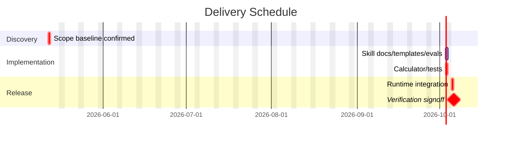

# Delivery Estimator Project Schedule Best Practices Research

调研日期：2026-05-12

## 结论

当前 `delivery-estimator` 输出不是合格的团队项目排期计划。它有估算结果，但缺少项目管理排期文档的核心视图：甘特图、日历化起止时间、里程碑、负责人/资源、基线、状态字段、依赖图、关键路径、变更与重估规则。

目标形态应从“估算摘要”升级为“排期计划包”：一页结论 + 甘特图 + WBS 字典 + 里程碑计划 + 依赖/关键路径 + 资源投入 + 风险/缓冲 + 基线/状态跟踪。

## 证据来源

- PMI WBS 指导：WBS 应先从项目章程、范围定义、合同/协议和既有项目管理实践出发，且应能支撑后续 schedule/process management。来源：[PMI - Developing and elaborating effective WBS](https://www.pmi.org/learning/library/developing-elaborating-work-breakdown-structures-7241)
- PMI WBS → Critical Path：WBS 是活动排序、前置依赖、时长估算、PERT 和关键路径计划的基础。来源：[PMI - Moving from WBS to critical path schedule](https://www.pmi.org/learning/library/2019/04/07/15/30/moving-work-breakdown-structure-critical-path-6978)
- PMI Schedule Management Plan：排期前要先设计 schedule 的用途、受众、WBS 结构、日历、活动编码、更新频率和颗粒度。来源：[PMI - Schedule Management Plan](https://www.pmi.org/learning/library/2019/04/07/15/24/project-development-schedule-management-plan-6205)
- PMI Scheduling Practice Standard：合格 schedule model 包含 schedule model id/version、项目/资源日历、data date、milestones、baseline schedule model、activity durations、resource type、risk id、三点时长等。来源：[PMI Practice Standard for Scheduling PDF](https://www.pmi.org/-/media/pmi/documents/public/pdf/certifications/practice-standard-scheduling.pdf?v=c7ca2721-8c26-4e07-ba47-069d0987bc0c)
- Atlassian Gantt：甘特图用于表达任务、时间线、依赖、里程碑、资源/负责人和进度。来源：[Atlassian - Gantt Chart](https://www.atlassian.com/agile/project-management/gantt-chart)
- Atlassian Project Schedule：项目排期应包含开始/结束日期、里程碑、依赖、状态、任务、分配和资源规划。来源：[Atlassian - Project Schedule](https://www.atlassian.com/agile/project-management/project-schedule)
- Microsoft Critical Path：关键路径决定项目完成日期；critical tasks 变化会影响 finish date，非关键任务有 float/slack。来源：[Microsoft - Manage critical path](https://support.microsoft.com/en-us/office/manage-your-project-s-critical-path-bc692e65-6245-45cf-86b7-f7115c965d2f)
- PMO Scheduling Best Practices：任务要有前置依赖、资源、实际开始/完成、完成百分比；rebaseline 应由 scope change 触发。来源：[North Dakota PMO Scheduling Best Practices PDF](https://www.ndit.nd.gov/sites/www/files/documents/project-management-office/nd-pmo-scheduling-best-practices.pdf)

## 当前版本差距

| 维度 | 当前输出 | 团队可验收排期计划应有 |
| --- | --- | --- |
| 首屏结论 | 有 P50/P80/P95 | 还要有承诺日期、版本、状态、适用范围、是否建议承诺 |
| 甘特图 | 无 | Mermaid Gantt 或表格化时间轴，展示起止日期、critical、milestone |
| 日期 | 只有小时/天数 | 需要 start date、finish date、calendar、working days |
| WBS | 平铺 task 表 | 需要 WBS 编码、work package、deliverable、activity、acceptance |
| 依赖 | 文字列表 | 需要 predecessor/successor、dependency type、blocked by、critical path |
| 关键路径 | 只有 task id 链 | 需要 critical flag、float/slack、压缩策略 |
| 资源/投入 | 只有 human hours | 需要 owner、role/resource、AI agent 分配、review gate、资源峰值 |
| 里程碑 | 无 | 需要 milestone list：计划确认、开发完成、验证通过、QA signoff、release |
| 风险 | 有风险列表 | 需要概率/影响、触发条件、缓冲、mitigation、owner、重估条件 |
| 基线/状态 | 无 | 需要 baseline version、data date、planned/actual/% complete/status |
| 变更控制 | 无 | 需要 rebaseline rule、scope change rule、assumption change rule |

## 推荐输出结构

### 1. Executive Summary

给老板和业务看：

- 项目/需求名
- 计划版本、生成日期、data date
- 交付承诺：P50/P80/P95 的日历日期
- 推荐承诺口径：建议承诺 P80，P95 作为风险暴露
- 总人类投入、人类瓶颈、最大并发 AI agents
- 最大风险、当前状态、是否可承诺

### 2. Gantt Timeline

必须有甘特图。Markdown 内推荐 Mermaid：

若 Mermaid 渲染环境不稳定，至少输出同等信息的表格：`Task / Start / Finish / Duration / Owner / Critical / Status / Milestone`。

### 3. WBS Dictionary

不是只列任务，而是每个 WBS 项要可交付、可验收、可追责：

- WBS ID
- Work package / activity
- Deliverable
- Owner / role
- Inputs
- Acceptance / done signal
- Dependencies
- Estimate：human effort、elapsed duration、confidence
- Risk / mitigation

### 4. Milestone Plan

至少包含：

- M1 Scope/AC baseline confirmed
- M2 Plan accepted
- M3 Implementation complete
- M4 Verification pass
- M5 QA/signoff
- M6 Release/handoff

每个 milestone 需要：计划日期、进入条件、退出条件、证据、owner。

### 5. Dependency And Critical Path

需要两种视图：

- Dependency table：前置、后置、依赖类型、是否阻塞、是否可 fast-track。
- Critical path：critical task、float/slack、压缩策略、风险触发后影响。

### 6. Resource And AI-Agent Plan

这是本 Skill 的差异化部分，传统 PM 模板没有，但你的生产模型必须有：

- Human owner：谁做目标裁决、review、验收、交付承诺。
- AI agent wave：每一批可开几个 agent，各自写入边界是什么。
- Review gates：哪些节点必须人类 review，不能 agent 自行通过。
- Context handoff：每个 agent 的输入包和产出证据。
- Resource bottleneck：人类 review/QA/产品裁决才是瓶颈，不是 token。

### 7. Risk, Buffer, Rebaseline

必须把风险转成管理动作：

- risk id
- trigger
- probability / impact
- buffer
- owner
- mitigation
- re-estimate rule
- rebaseline rule

建议规则：scope/AC 变化、critical path 任务失败、外部依赖失败、QA 主路径 FAIL、验证轮次超出预期时必须重估；scope 变化才允许 rebaseline。

## 对 delivery-estimator 的改造建议

1. 输入模板增加：
   - `project_start_date`
   - `calendar.working_days`
   - `milestones[]`
   - `baseline.version / data_date`
   - `tasks[].owner / resource / status / percent_complete / milestone / critical_override`
   - `tasks[].risk.probability / impact / mitigation / trigger`
2. 计算器增加：
   - 日历化 start/finish 日期
   - Mermaid Gantt 渲染
   - float/slack 计算
   - milestone rollup
   - status/baseline 字段输出
3. Markdown 报告改为“排期计划包”，不是 JSON 摘要。
4. 测试新增断言：
   - `.md` 必须包含 Mermaid Gantt
   - 必须包含 milestone table
   - 必须包含 baseline/data date
   - 必须包含 owner/resource/status/% complete
   - 必须包含 rebaseline rules

## 验收标准草案

一个排期计划可以验收，至少要让人一眼回答：

1. 这件事什么时候交付？日期是什么，不只是耗时。
2. 哪些任务决定交付日期？关键路径是什么。
3. 哪些任务可以并行？最多需要几个 AI agents。
4. 每个任务谁负责？产出是什么？完成信号是什么。
5. 当前计划版本是什么？什么时候生成？状态基准是什么。
6. 哪些风险会推迟交付？触发后如何重估。
7. 老板要投入多少人类时间？瓶颈在哪里。

当前版本只能回答 2、3、6 的一部分，不能回答 1、4、5、7 到团队可验收程度。
