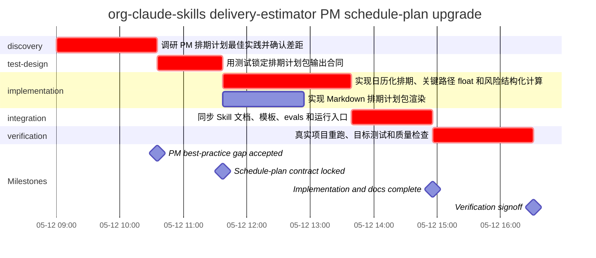

# Schedule Plan: org-claude-skills delivery-estimator PM schedule-plan upgrade

## 一页结论

- baseline：v0.2 / data date：2026-05-12 / status：verified
- project_start_date：2026-05-12
- 交付日期：P50：2026-05-12；P80：2026-05-12；P95：2026-05-13
- 推荐承诺：建议承诺 P80：2026-05-12；P95 2026-05-13 作为风险暴露。
- 交付窗口：P50/P80/P95 = 7.54 / 7.98 / 8.4 小时
- 人类投入：7.5 小时；最大 AI agents 并发：2
- 关键路径：T1 -> T2 -> T3 -> T5 -> T6
- 风险缓冲：P80-P50 = 0.44 小时

## 甘特图

## WBS 字典

| WBS | Task | Work package / activity | Owner | Resource | Inputs | Deliverables | Acceptance | Status | % |
| --- | --- | --- | --- | --- | --- | --- | --- | --- | ---: |
| 1.1 | T1 | 调研 PM 排期计划最佳实践并确认差距 | delivery owner | human + Codex research | 用户反馈：当前版本不像团队项目排期计划 | 最佳实践调研报告, 改造验收维度 | 明确当前版本不可验收的维度和下一版输出结构 | complete | 100 |
| 1.2 | T2 | 用测试锁定排期计划包输出合同 | delivery owner | human + Codex | 调研报告, 旧 calculator tests | 红灯测试, Markdown 验收断言 | 旧实现因缺少日期、甘特图、WBS 字典、里程碑、baseline 等字段而失败 | complete | 100 |
| 2.1 | T3 | 实现日历化排期、关键路径 float 和风险结构化计算 | Codex | developer agent | 红灯测试, estimate_schedule.py | schedule_common.py, schedule_core.py, schedule_model.py | P50/P80/P95、commitment_dates、float/slack、milestones、risk_register 可复验 | complete | 100 |
| 2.2 | T4 | 实现 Markdown 排期计划包渲染 | Codex | developer agent | Markdown 验收断言, projection template | schedule_markdown.py, schedule-plan.md | Markdown 包含一页结论、Mermaid Gantt、WBS、里程碑、依赖、资源、风险和 rebaseline | complete | 100 |
| 3.1 | T5 | 同步 Skill 文档、模板、evals 和运行入口 | Codex | human + Codex | script output contract, skill authoring rules | SKILL.md, estimate-input.template.json, delivery-estimate-template.md, evals.json, tests/run-all.sh | Skill 使用说明与脚本输出合同一致，不再引导生成估算摘要 | complete | 100 |
| 4.1 | T6 | 真实项目重跑、目标测试和质量检查 | delivery owner | human + verifier agent | updated skill package, real project input | schedule-plan.json, schedule-plan.md, test evidence, skill-quality static_pass | 真实项目 Markdown 可读且目标测试、py_compile、skill-quality、runtime surface 合同均通过 | complete | 100 |

## 里程碑计划

| Milestone | Title | Planned date | Owner | Exit criteria | Evidence |
| --- | --- | --- | --- | --- | --- |
| M1 | PM best-practice gap accepted | 2026-05-12 | delivery owner | Gap between estimate summary and schedule plan is explicit | docs/reports/delivery-estimator-project-schedule-best-practices-research.md |
| M2 | Schedule-plan contract locked | 2026-05-12 | delivery owner | Tests fail on missing date/Gantt/WBS/milestone/baseline behavior | tests/test-delivery-estimator-calculator.py |
| M3 | Implementation and docs complete | 2026-05-12 | Codex | Script, templates, projection and Skill docs align on schedule-plan contract | shared/skills/delivery-estimator/ |
| M4 | Verification signoff | 2026-05-12 | delivery owner | Target tests and skill quality checks pass | verification command output |

## 依赖与关键路径

- 关键路径：T1 -> T2 -> T3 -> T5 -> T6

| Task | Predecessors | Successors | Float h | Critical | Review gate |
| --- | --- | --- | ---: | --- | --- |
| T1 | - | T2 | 0.0 | yes | human PM acceptance |
| T2 | T1 | T3, T4 | 0.0 | yes | TDD red verification |
| T3 | T2 | T5 | 0.0 | yes | calculator regression tests |
| T4 | T2 | T5 | 0.75 | no | human readability review |
| T5 | T3, T4 | T6 | 0.0 | yes | skill contract test |
| T6 | T5 | - | 0.0 | yes | final verification before completion |

## 资源与 AI-Agent 计划

| Wave | Task refs | Max parallel agents | Agent assignments | Review gates |
| ---: | --- | ---: | --- | --- |
| 1 | T1 | 1 | research agent pattern inline | human PM acceptance |
| 2 | T2 | 1 | - | TDD red verification |
| 3 | T3, T4 | 2 | developer agent | calculator regression tests, human readability review |
| 4 | T5 | 1 | - | skill contract test |
| 5 | T6 | 1 | verifier agent | final verification before completion |

## 环节投入与产出

| Stage | Start | Finish | Human h | Elapsed P50 h | Outputs |
| --- | --- | --- | ---: | ---: | --- |
| discovery | 2026-05-12 | 2026-05-12 | 1.5 | 1.58 | 最佳实践调研报告, 改造验收维度 |
| test-design | 2026-05-12 | 2026-05-12 | 1.04 | 1.04 | 红灯测试, Markdown 验收断言 |
| implementation | 2026-05-12 | 2026-05-12 | 2.63 | 3.33 | schedule_common.py, schedule_core.py, schedule_model.py, schedule_markdown.py, schedule-plan.md |
| integration | 2026-05-12 | 2026-05-12 | 1.04 | 1.29 | SKILL.md, estimate-input.template.json, delivery-estimate-template.md, evals.json, tests/run-all.sh |
| verification | 2026-05-12 | 2026-05-12 | 1.29 | 1.58 | schedule-plan.json, schedule-plan.md, test evidence, skill-quality static_pass |

## 风险、缓冲与重估

| Risk | Task | Trigger | Probability | Impact | Buffer h | Mitigation | Owner |
| --- | --- | --- | --- | --- | ---: | --- | --- |
| R1 PM 文档形态理解偏差 | T1 | 输出仍停留在估算摘要 | medium | high | 1.0 | 用 PMI/Atlassian/Microsoft 证据反推验收合同 | delivery owner |
| R2 断言只测文案不测结构 | T2 | 测试没有检查 JSON 字段和 Markdown 关键章节 | low | medium | 0.5 | 同时断言 JSON schema-like 字段和 Markdown 章节 | delivery owner |
| R3 关键路径或日历日期计算错误 | T3 | 测试中的 P80 日期或 float/slack 不匹配 | medium | high | 1.0 | 用独立手算修正测试期望并保留回归测试 | Codex |
| R4 Markdown 仍不像正式排期计划 | T4 | 缺少甘特图、里程碑或 WBS 字典任一核心视图 | medium | high | 1.0 | 把 PM 核心视图写入测试断言和 projection 模板 | Codex |
| R5 文档和脚本合同漂移 | T5 | contract test 缺少新字段或 Skill 文档仍旧版 | medium | high | 0.75 | 合同测试覆盖 template/projection/SKILL 关键字段 | delivery owner |
| R6 全量回归被并发非本次改动污染 | T6 | install/runtime 类全量测试读取到并发 dirty changes | medium | medium | 0.5 | 本次采用目标测试和 skill-quality 作为直接证据，全量污染单独报告 | delivery owner |

### 重估 / Rebaseline 规则

- scope or AC changes
- critical path task fails verification
- schedule-plan markdown misses Gantt/WBS/milestone/baseline acceptance fields
- skill quality gate fails
- real project sample cannot be regenerated

### 假设

- 真实项目为 /Users/lijieli/org-claude-skills，本轮需求是把 delivery-estimator 从估算摘要升级为团队可验收的项目排期计划包。
- 1 人负责目标裁决、实现把关、测试复核、真实项目验收和最终交付承诺。
- Codex / Claude Code token 不是主要瓶颈；关键约束是排期合同一致性、确定性计算、文档同步和验证证据。
