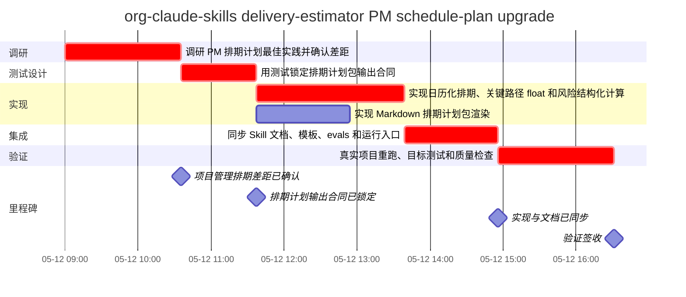

# 项目排期计划｜org-claude-skills delivery-estimator PM schedule-plan upgrade

计划基线：v0.2｜数据日期：2026-05-12｜计划状态：已验证｜起始日期：2026-05-12

> 老板版一句话：建议承诺 2026-05-12，P95 风险暴露到 2026-05-13；人工投入 7.5 小时，最大 AI 并发 2。

## 01｜决策摘要

| 关注点 | 结论 |
| --- | --- |
| 对外承诺建议 | 建议承诺 P80：2026-05-12；P95 2026-05-13 作为风险暴露。 |
| 承诺口径 | 对外按 P80 日期承诺；P95 日期只作为风险暴露，不作为默认承诺。 |
| 交付日期 | P50：2026-05-12；P80：2026-05-12；P95：2026-05-13 |
| 人类投入 | 7.5 小时 |
| 最大并行工作流 / AI 并发 | 2 / 2 |
| 关键路径 | T1 -> T2 -> T3 -> T5 -> T6 |
| 首要风险 | R1 PM 文档形态理解偏差；触发：输出仍停留在估算摘要；应对：用 PMI/Atlassian/Microsoft 证据反推验收合同 |

## 02｜关键指标

| 指标 | 数值 | 说明 |
| --- | --- | --- |
| P50 交付日期 | 2026-05-12 | 中位交付窗口 |
| P80 交付日期 | 2026-05-12 | 推荐用于对外承诺 |
| P95 交付日期 | 2026-05-13 | 用于暴露高风险窗口 |
| P50 / P80 / P95 周期 | 7.54 / 7.98 / 8.4 小时 | 基于关键路径 PERT |
| 人类投入 | 7.5 小时 | 不等同交付 wall-clock |
| 最大并行工作流 | 2 | 同一批次可并行推进的任务数 |
| 最大 AI agents 并发 | 2 | 同一批次建议投入的 AI agent 数 |
| 风险缓冲 | 0.44 小时 | P80 - P50 |

## 03｜甘特图

## 04｜任务排期总览

| WBS | 任务 | 负责人 | 资源 | 开始 | 完成 | 工期 | 状态 | 关键 | 产出 |
| --- | --- | --- | --- | --- | --- | ---: | --- | --- | --- |
| 1.1 | T1 | 调研 PM 排期计划最佳实践并确认差距 | 交付负责人 | 人工 + Codex 调研 | 2026-05-12 | 2026-05-12 | 1.58h | 已完成 | 是 | 最佳实践调研报告, 改造验收维度 |
| 1.2 | T2 | 用测试锁定排期计划包输出合同 | 交付负责人 | 人工 + Codex | 2026-05-12 | 2026-05-12 | 1.04h | 已完成 | 是 | 红灯测试, Markdown 验收断言 |
| 2.1 | T3 | 实现日历化排期、关键路径 float 和风险结构化计算 | Codex | 开发 agent | 2026-05-12 | 2026-05-12 | 2.04h | 已完成 | 是 | schedule_common.py, schedule_core.py, schedule_model.py |
| 2.2 | T4 | 实现 Markdown 排期计划包渲染 | Codex | 开发 agent | 2026-05-12 | 2026-05-12 | 1.29h | 已完成 | 否 | schedule_markdown.py, schedule-plan.md |
| 3.1 | T5 | 同步 Skill 文档、模板、evals 和运行入口 | Codex | 人工 + Codex | 2026-05-12 | 2026-05-12 | 1.29h | 已完成 | 是 | SKILL.md, estimate-input.template.json, delivery-estimate-template.md, evals.json, tests/run-all.sh |
| 4.1 | T6 | 真实项目重跑、目标测试和质量检查 | 交付负责人 | 人工 + 验证 agent | 2026-05-12 | 2026-05-12 | 1.58h | 已完成 | 是 | schedule-plan.json, schedule-plan.md, 测试证据, skill-quality static_pass |

## 05｜里程碑

| 里程碑 | 标题 | 计划日期 | 负责人 | 退出条件 | 证据 |
| --- | --- | --- | --- | --- | --- |
| M1 | 项目管理排期差距已确认 | 2026-05-12 | 交付负责人 | 估算摘要与正式排期计划的差距已明确 | docs/reports/delivery-estimator-project-schedule-best-practices-research.md |
| M2 | 排期计划输出合同已锁定 | 2026-05-12 | 交付负责人 | 测试能拦截缺少日期、甘特图、WBS、里程碑和 baseline 的旧输出 | tests/test-delivery-estimator-calculator.py |
| M3 | 实现与文档已同步 | 2026-05-12 | Codex | 脚本、模板、projection 和 Skill 文档与排期计划合同一致 | shared/skills/delivery-estimator/ |
| M4 | 验证签收 | 2026-05-12 | 交付负责人 | 目标测试与 skill quality 检查通过 | 验证命令输出 |

## 06｜关键路径与依赖

- 关键路径：T1 -> T2 -> T3 -> T5 -> T6

| 任务 | 前置任务 | 后续任务 | 浮动时间(h) | 关键 | 人工关口 |
| --- | --- | --- | ---: | --- | --- |
| T1 | - | T2 | 0.0 | 是 | 人工 PM 验收 |
| T2 | T1 | T3, T4 | 0.0 | 是 | TDD 红灯验证 |
| T3 | T2 | T5 | 0.0 | 是 | 计算器回归测试 |
| T4 | T2 | T5 | 0.75 | 否 | 人工可读性评审 |
| T5 | T3, T4 | T6 | 0.0 | 是 | skill 合同测试 |
| T6 | T5 | - | 0.0 | 是 | 完成前最终验证 |

## 07｜资源与 Agent 批次

| 批次 | 任务 | 并行工作流 | AI Agent数 | Agent分配 | 人工关口 |
| ---: | --- | ---: | ---: | --- | --- |
| 1 | T1 | 1 | 1 | 调研 agent 模式内联执行 | 人工 PM 验收 |
| 2 | T2 | 1 | 0 | - | TDD 红灯验证 |
| 3 | T3, T4 | 2 | 2 | 开发 agent | 计算器回归测试, 人工可读性评审 |
| 4 | T5 | 1 | 0 | - | skill 合同测试 |
| 5 | T6 | 1 | 1 | 验证 agent | 完成前最终验证 |

## 08｜环节投入与产出

| 环节 | 开始 | 完成 | 人工投入 | P50 周期 | 产出 |
| --- | --- | --- | ---: | ---: | --- |
| 调研 | 2026-05-12 | 2026-05-12 | 1.5 小时 | 1.58 小时 | 最佳实践调研报告, 改造验收维度 |
| 测试设计 | 2026-05-12 | 2026-05-12 | 1.04 小时 | 1.04 小时 | 红灯测试, Markdown 验收断言 |
| 实现 | 2026-05-12 | 2026-05-12 | 2.63 小时 | 3.33 小时 | schedule_common.py, schedule_core.py, schedule_model.py, schedule_markdown.py, schedule-plan.md |
| 集成 | 2026-05-12 | 2026-05-12 | 1.04 小时 | 1.29 小时 | SKILL.md, estimate-input.template.json, delivery-estimate-template.md, evals.json, tests/run-all.sh |
| 验证 | 2026-05-12 | 2026-05-12 | 1.29 小时 | 1.58 小时 | schedule-plan.json, schedule-plan.md, 测试证据, skill-quality static_pass |

## 09｜风险与重估

| 风险 | 任务 | 触发条件 | 概率 | 影响 | 缓冲(h) | 应对 | 负责人 |
| --- | --- | --- | --- | --- | ---: | --- | --- |
| R1 PM 文档形态理解偏差 | T1 | 输出仍停留在估算摘要 | 中 | 高 | 1.0 | 用 PMI/Atlassian/Microsoft 证据反推验收合同 | 交付负责人 |
| R2 断言只测文案不测结构 | T2 | 测试没有检查 JSON 字段和 Markdown 关键章节 | 低 | 中 | 0.5 | 同时断言 JSON schema-like 字段和 Markdown 章节 | 交付负责人 |
| R3 关键路径或日历日期计算错误 | T3 | 测试中的 P80 日期或 float/slack 不匹配 | 中 | 高 | 1.0 | 用独立手算修正测试期望并保留回归测试 | Codex |
| R4 Markdown 仍不像正式排期计划 | T4 | 缺少甘特图、里程碑或 WBS 字典任一核心视图 | 中 | 高 | 1.0 | 把 PM 核心视图写入测试断言和 projection 模板 | Codex |
| R5 文档和脚本合同漂移 | T5 | contract test 缺少新字段或 Skill 文档仍旧版 | 中 | 高 | 0.75 | 合同测试覆盖 template/projection/SKILL 关键字段 | 交付负责人 |
| R6 全量回归被并发非本次改动污染 | T6 | install/runtime 类全量测试读取到并发 dirty changes | 中 | 中 | 0.5 | 本次采用目标测试和 skill-quality 作为直接证据，全量污染单独报告 | 交付负责人 |

### 重估 / Rebaseline 规则

- 范围或 AC 发生变更
- 关键路径任务验证失败
- 排期 Markdown 缺失甘特图/WBS/里程碑/baseline 验收字段
- skill quality gate 失败
- 真实项目样例无法重新生成

### 不建议承诺条件

- 范围或 AC 尚未冻结。
- 关键路径任务验证失败，或验证轮次超过当前估算假设。
- 高影响风险没有 owner、缓冲或应对动作。

### 假设

- 真实项目为 /Users/lijieli/org-claude-skills，本轮需求是把 delivery-estimator 从估算摘要升级为团队可验收的项目排期计划包。
- 1 人负责目标裁决、实现把关、测试复核、真实项目验收和最终交付承诺。
- Codex / Claude Code token 不是主要瓶颈；关键约束是排期合同一致性、确定性计算、文档同步和验证证据。
