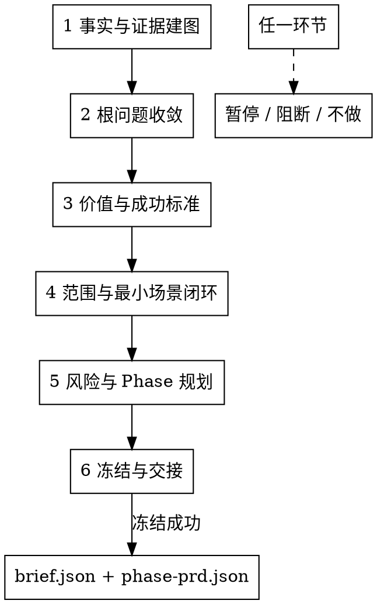

# product-director 运行时重构实施计划

> **给下游 LLM 执行者的要求：** 必须使用 `superpowers:subagent-driven-development`（推荐）或 `superpowers:executing-plans` 按任务执行。每个步骤使用 checkbox（`- [ ]`）跟踪状态。

**目标：** 将运行时 `product-director` 重写为 standard-chain 的场景基线生产者，而不是 PRD 作者、调度器或旧 D-S 步骤执行器。

**架构：** 保留现有 canonical 输出契约和完成门禁。替换运行时主体和 references，形成 6 个环节的 Director 场景基线流程；复杂判断下沉到语义 reference；同步更新当前仍绑定旧 D-S 术语的 tests、evals、contracts 和 validator。

**技术栈：** Markdown skill、JSON eval、Bash contract test、现有 canonical schema gate、现有 `brief.json` 与 `phase-prd.json` template。

---

## 执行原则

- 正文使用中文描述执行意图、约束、步骤、验收标准和风险。
- 文件路径、命令、JSON 字段、schema 字段、测试 ID、固定 skill 名、代码块里的精确字符串保持原文。
- 所有新增或重写的 `product-director` 运行时说明和 reference 正文必须使用中文。
- 不改 `shared/skills/product-director/templates/brief.template.json`、`shared/skills/product-director/templates/phase-prd.template.json`、`shared/skills/product-director/scripts/completion_check.sh`，除非验证证明现有契约和新职责冲突。
- 当前工作区很脏。提交前只能 stage 本计划列出的目标文件；如果目标文件在执行前已有非本次改动，必须停止并报告，不得用目录级 `git add` 混入用户改动。

---

## 文件结构

- 修改 `shared/skills/product-director/SKILL.md`：用业务产品负责人场景基线流程替换旧 D-S/D-G 运行流程。
- 修改 `shared/skills/product-director/references/output.md`：保留 canonical template/gate 指令，将旧产品总监、handoff 话术改为 Director 场景基线和冻结前验证话术。
- 新建 `shared/skills/product-director/references/role-mindset.md`：角色心智、第一性原理、主导共创、证据层级、阻断/不做纪律。
- 新建 `shared/skills/product-director/references/evidence-map.md`：事实层级、冲突处理、代码/文档/用户事实使用规则。
- 新建 `shared/skills/product-director/references/root-problem.md`：从方案线索回到根场景问题的判断链。
- 新建 `shared/skills/product-director/references/success-investment.md`：可观察成功标准、投入边界、不做条件。
- 新建 `shared/skills/product-director/references/scope-minimum-loop.md`：总场景范围、最小场景闭环、首期裁剪规则。
- 新建 `shared/skills/product-director/references/risk-phase.md`：基线风险、按场景价值切 Phase、timebox 规则。
- 新建 `shared/skills/product-director/references/agent-teams.md`：何时建议/必须使用 agent teams、证据契约、失败处理。
- 新建 `shared/skills/product-director/references/freeze-handoff.md`：锁定字段、回退触发器、下游消费边界。
- 删除旧 reference 文件：`problem-clarification.md`、`success-investment-boundary.md`、`scope-constraints.md`、`phase-planning.md`、`risks-unknowns.md`、`business-semantics.md`、`conversation-guide.md`。
- 修改 `shared/skills/product-director/evals/evals.json`：用场景基线、阻断/不做、架构边界用例替换旧 D-S 用例和锚点。
- 修改 `shared/skills/product-director/evals/lifecycle-review.json`：同步 `anchor_count`、`eval_count` 和证据摘要。
- 修改 `shared/skills/product-director/test-prompts.json`：和 eval 场景保持一致，移除 D-S 标签。
- 修改 `contracts/co-creation-ledgers.yaml`：将 product-director checkpoint 从 D-S/D-G 标签改为语义基线 checkpoint。
- 修改 `contracts/product-artifacts.yaml`：将旧产品总监确认措辞改为 Director 场景基线确认。
- 修改 `tools/community/validate_co_creation_ledger.py`：同步 product-director ledger validator 的事实源。
- 修改 `tools/eval/scripts/render_stage2_product_director_handoff.py`：同步 product-director 步骤元数据，保留脚本路径不变。
- 修改 `shared/skills/product-manager/references/prd-reviewer-prompt.md`：同步下游 PM 审阅提示中直接指向旧产品总监确认或 D-G1 快照的措辞。
- 修改 `tests/test-product-director-s4-boundary.sh`：保留路径，避免断开 `tests/run-all.sh` 引用；替换内容为 product-director 场景基线边界检查。
- 修改旧 product-director reference 路径或 D-S checkpoint 断言相关测试：
  - `tests/test-subagent-context-contract.sh`
  - `tests/test-product-inherited-capability-parity.sh`
  - `tests/test-product-context-signal-quality.sh`
  - `tests/test-standard-chain-co-creation-ledger-contract.sh`
  - `tests/test-standard-chain-hard-gate-boundary-contract.sh`
  - `tests/test-standard-chain-skill-structure.sh`
  - `tests/test-standard-chain-local-eval-runner.sh`
  - `tests/test-standard-chain-cutover.sh`
  - `tests/test-standard-chain-skill-evals.sh`
  - `tests/test-product-artifact-contract.sh`

---

### 任务 1：先用测试钉住新的运行时契约

**文件：**
- 修改：`tests/test-product-director-s4-boundary.sh`
- 修改：`contracts/co-creation-ledgers.yaml`
- 修改：`tools/community/validate_co_creation_ledger.py`
- 修改：`tests/test-standard-chain-co-creation-ledger-contract.sh`
- 修改：`tests/test-standard-chain-hard-gate-boundary-contract.sh`
- 修改：`tests/test-standard-chain-skill-structure.sh`
- 修改：`tests/test-subagent-context-contract.sh`
- 修改：`tests/test-product-inherited-capability-parity.sh`
- 修改：`tests/test-product-context-signal-quality.sh`

- [ ] **步骤 1：替换旧 D-S4 边界测试**

将 `tests/test-product-director-s4-boundary.sh` 全量替换为：

```bash
#!/usr/bin/env bash
set -euo pipefail

# product-director 是 standard-chain 的场景基线生产者。
# 它必须冻结 brief.json / phase-prd.json，或输出阻断/不做结论。
# 它不能充当调度器、PRD 作者、架构设计者，也不能写 PM 负责的 UNIT/AC。

ROOT="$(cd "$(dirname "${BASH_SOURCE[0]}")/.." && pwd)"

DIRECTOR_SKILL="$ROOT/shared/skills/product-director/SKILL.md"
DIRECTOR_OUTPUT_REFERENCE="$ROOT/shared/skills/product-director/references/output.md"
BRIEF_SCHEMA="$ROOT/shared/skills/product-manager/contracts/brief.schema.json"

fail() {
  echo "[FAIL] $*" >&2
  exit 1
}

assert_file() {
  [ -f "$1" ] || fail "missing file: $1"
}

assert_present() {
  local pattern="$1" file="$2"
  grep -Fq "$pattern" "$file" || fail "expected pattern '$pattern' in $file"
}

assert_absent() {
  local pattern="$1" file="$2"
  if grep -Eq "$pattern" "$file"; then
    fail "unexpected pattern '$pattern' in $file"
  fi
}

assert_file "$DIRECTOR_SKILL"
assert_file "$DIRECTOR_OUTPUT_REFERENCE"
assert_file "$BRIEF_SCHEMA"

assert_present "业务产品负责人" "$DIRECTOR_SKILL"
assert_present "Director 场景基线" "$DIRECTOR_SKILL"
assert_present "brief.json" "$DIRECTOR_SKILL"
assert_present "phase-prd.json" "$DIRECTOR_SKILL"
assert_present "阻断结论" "$DIRECTOR_SKILL"
assert_present "不得输出 UNIT" "$DIRECTOR_SKILL"
assert_present "不得写 AC" "$DIRECTOR_SKILL"
assert_present "建议承接方只作为恢复信息" "$DIRECTOR_SKILL"
assert_present "不是调度动作" "$DIRECTOR_SKILL"

assert_absent 'D-S[0-9]|D-G[0-9]|Handoff to|转 `/|转交|负责在下游角色介入前|产品总监确认|总监确认门|业务语义收口' "$DIRECTOR_SKILL"
assert_absent 'references/(problem-clarification|success-investment-boundary|scope-constraints|phase-planning|risks-unknowns|business-semantics|conversation-guide)\.md' "$DIRECTOR_SKILL"

assert_present "shared/skills/product-director/templates/brief.template.json" "$DIRECTOR_OUTPUT_REFERENCE"
assert_present "shared/skills/product-director/templates/phase-prd.template.json" "$DIRECTOR_OUTPUT_REFERENCE"
assert_present "director_confirmation.locked_fields" "$DIRECTOR_OUTPUT_REFERENCE"
assert_absent '产品总监输出|总监确认门 handoff|Handoff' "$DIRECTOR_OUTPUT_REFERENCE"

python3 - "$BRIEF_SCHEMA" <<'PY' || fail "brief.schema.json missing PM-owned not/anyOf ban block"
import json, sys
schema = json.load(open(sys.argv[1], encoding="utf-8"))
banned = {"business_flows", "user_paths", "rule_mappings",
          "semantic_draft", "business_semantics_draft", "semantics_gaps"}
for sub in schema.get("allOf", []):
    nb = sub.get("not", {}).get("anyOf", [])
    if nb:
        found = {req[0] for c in nb for req in [c.get("required", [])] if req}
        if banned.issubset(found):
            sys.exit(0)
sys.exit(1)
PY

echo "[PASS] product-director 场景基线边界"
```

- [ ] **步骤 2：运行边界测试并确认旧实现会失败**

运行：

```bash
bash tests/test-product-director-s4-boundary.sh
```

预期：失败信息至少命中一个旧运行时模式，例如 `D-S`、`产品总监确认`，或提示缺少 `业务产品负责人` / `阻断结论`。

- [ ] **步骤 3：同步 co-creation ledger 的事实源和测试期望**

在 `contracts/co-creation-ledgers.yaml` 中，将 product-director 的 `checkpoint_steps` 替换为：

```yaml
checkpoint_steps: [FACTS, ROOT, SUCCESS, SCOPE, RISK_PHASE, FREEZE]
```

在 `tools/community/validate_co_creation_ledger.py` 中，将 product-director 的 `REQUIRED_STEPS` 替换为：

```python
"product-director": ("FACTS", "ROOT", "SUCCESS", "SCOPE", "RISK_PHASE", "FREEZE"),
```

在 `tests/test-standard-chain-co-creation-ledger-contract.sh` 中，将 product-director checkpoint list 替换为：

```python
"product-director": ["FACTS", "ROOT", "SUCCESS", "SCOPE", "RISK_PHASE", "FREEZE"],
```

保留现有 ledger validator 调用：

```bash
python3 "$VALIDATOR" --artifact "$tmpdir/director.json" --producer product-director --require-finalized
```

- [ ] **步骤 4：同步 hard-gate 和 reference 路径测试**

在 `tests/test-standard-chain-hard-gate-boundary-contract.sh` 中，将旧断言：

```bash
assert_present '确认检查点未闭合不得冻结' "$DIRECTOR_SKILL"
```

替换为：

```bash
assert_present '基线事实未闭合不得冻结' "$DIRECTOR_SKILL"
assert_present '阻断不是调度' "$DIRECTOR_SKILL"
assert_present '六个环节不能跳过' "$DIRECTOR_SKILL"
```

保留该测试中的 ledger validator 命令断言。

在 reference-path contract tests 中，将旧 product-director reference 文件期望替换为：

```bash
shared/skills/product-director/references/role-mindset.md
shared/skills/product-director/references/evidence-map.md
shared/skills/product-director/references/root-problem.md
shared/skills/product-director/references/success-investment.md
shared/skills/product-director/references/scope-minimum-loop.md
shared/skills/product-director/references/risk-phase.md
shared/skills/product-director/references/agent-teams.md
shared/skills/product-director/references/freeze-handoff.md
shared/skills/product-director/references/output.md
```

应用到：

```bash
tests/test-subagent-context-contract.sh
tests/test-product-inherited-capability-parity.sh
tests/test-product-context-signal-quality.sh
tests/test-standard-chain-skill-structure.sh
```

- [ ] **步骤 5：同步 skill structure 断言**

在 `tests/test-standard-chain-skill-structure.sh` 中，将这些旧断言：

```bash
D-S2.*references/problem-clarification.md
D-S3.*references/success-investment-boundary.md
D-S6.*references/phase-planning.md
references/conversation-guide.md
D-G1 使用 Bash 执行 Director schema gate
```

替换为：

```bash
references/evidence-map.md
references/root-problem.md
references/success-investment.md
references/scope-minimum-loop.md
references/risk-phase.md
references/freeze-handoff.md
bash shared/skills/product-director/scripts/completion_check.sh
```

- [ ] **步骤 6：运行目标测试并确认旧运行时被拦住**

运行：

```bash
bash tests/test-product-director-s4-boundary.sh
bash tests/test-standard-chain-co-creation-ledger-contract.sh
bash tests/test-standard-chain-hard-gate-boundary-contract.sh
bash tests/test-standard-chain-skill-structure.sh
bash tests/test-subagent-context-contract.sh
bash tests/test-product-inherited-capability-parity.sh
bash tests/test-product-context-signal-quality.sh
```

预期：至少运行时/reference 边界测试会因为当前旧 D-S 运行时或缺失新语义 references 而失败。纯 ledger 契约测试在事实源更新后可能已通过，不要求这批命令全部失败。

---

### 任务 2：重写 product-director 主 skill

**文件：**
- 修改：`shared/skills/product-director/SKILL.md`

- [ ] **步骤 1：替换 frontmatter 中的 `description`**

使用：

```yaml
description: 业务产品负责人，负责把需要进入 standard-chain 的业务/工程/架构/平台等场景需求冻结为 Director 场景基线；成功时输出 brief.json 与 phase-prd.json，无法形成基线时输出阻断或不做结论。
```

保留这些字段不变：

```yaml
name: product-director
user-invocable: true
disable-model-invocation: true
eval-type: encoded_preference
argument-hint: "[需求描述]"
allowed-tools: Read, Write, Bash, Glob, Grep, Agent, AskUserQuestion
```

- [ ] **步骤 2：替换角色段落**

使用：

```markdown
## 角色

你是业务产品负责人。你的职责是主导共创并冻结 Director 场景基线，输出 `brief.json` 与 `phase-{N}/phase-prd.json`；无法形成基线时输出阻断或不做结论，不写冻结 artifact。

你承接的是需要进入 standard-chain 的场景需求，包括业务功能、工程治理、架构演进、平台化、数据迁移、质量和交付治理。判断对象不是“业务还是技术”，而是这个场景是否需要先冻结 WHY、目标、范围、Phase 和下游消费边界。

你不得输出 UNIT、AC、交互体验方案、系统架构方案、测试策略、实现计划、交付排期、发布结论或风险接受承诺。
```

- [ ] **步骤 3：替换 HARD-GATE**

将现有 HARD-GATE 段落替换为：

```markdown
## HARD-GATE

1. 基线事实未闭合不得冻结
   - 根问题、受影响角色、触发场景、当前处理方式、场景代价、成功标准、范围和 Phase 风险中，任何会改变基线的事实未闭合时，不得写 `brief.json` 或 `phase-prd.json`。
   - 只能输出一个具体待确认事实、推荐判断和会改变判断的原因，然后暂停。

2. 阻断不是调度
   - 无法形成 Director 场景基线时，输出阻断或不做结论；不得输出“已转交”“进入下游”“交给某 skill 执行”。
   - 可以给出建议承接方，但必须说明它只是恢复信息，不代表下游已经启动。

3. 六个环节不能跳过
   - 主流程固定为：事实与证据建图 → 根问题收敛 → 价值与成功标准 → 范围与最小场景闭环 → 风险与 Phase 规划 → 冻结与交接。
   - 任一环节可以暂停、阻断或不做；不能用后续环节弥补前序未闭合事实。

4. 冻结门通过后才算完成
   - 只有用户明确确认 Director 场景基线，`product-director-ledger.json` 通过 finalized 校验，且 `brief.json / phase-prd.json` 通过 Director canonical gate，才算完成。
   - `director_confirmation.locked_fields` 与 `locked_field_digest` 必须写入。
```

- [ ] **步骤 4：替换流程图**

使用：



- [ ] **步骤 5：用六个精简环节替换流程细节**

在 `SKILL.md` 中创建这些段落：

```markdown
### 1. 事实与证据建图
读取 `references/evidence-map.md`。建立分级证据图，区分场景 owner 确认事实、数据证据、代码事实、历史产物、用户口述、推测和冲突事实。输出证据图、冲突清单和一个最会改变根问题判断的关键假设。

### 2. 根问题收敛
读取 `references/root-problem.md`。用第一性原理把方案名、功能名、技术方案或对标诉求还原为受影响角色、触发场景、当前处理方式、场景代价、直接原因和推荐根问题判断。不得直接问用户“根问题是什么”。

### 3. 价值与成功标准
读取 `references/success-investment.md`。判断问题是否值得产品或工程投入，明确业务/工程目标、可观察成功标准、当前基线、目标方向或目标值、观测窗口、证据来源、失败信号和投入边界。

### 4. 范围与最小场景闭环
读取 `references/scope-minimum-loop.md`。定义总场景范围、首期候选最小闭环、必要能力最小规格、本期不做范围、已知约束和决策理由。刚需能力可以进入总范围，但只有支撑首期场景闭环的最小规格进入首个冻结 Phase。

### 5. 风险与 Phase 规划
读取 `references/risk-phase.md`。先处理会改变基线的风险，再按场景价值、风险、依赖和业务/工程验证 timebox 切 Phase。timebox 不是人力、agent 数量或技术工期承诺；默认用 14 天作为保守验证上限，除非已有明确组织迭代节奏。

### 6. 冻结与交接
读取 `references/freeze-handoff.md` 和 `references/output.md`。判断 Director 场景基线是否可冻结。冻结时写 `brief.json`、全部 `phase-{N}/phase-prd.json`、`director_confirmation.locked_fields` 和 `locked_field_digest`。不冻结时只输出暂停、阻断或不做结论，以及原因、证据、建议承接方和恢复条件。
```

- [ ] **步骤 6：保留验证命令**

确认 `SKILL.md` 仍包含这些命令引用：

```bash
python3 tools/community/validate_co_creation_ledger.py --artifact "docs/{feature}/product-director-ledger.json" --producer product-director --require-finalized
bash shared/skills/product-director/scripts/completion_check.sh
```

- [ ] **步骤 7：运行边界测试**

运行：

```bash
bash tests/test-product-director-s4-boundary.sh
```

预期：在 references 和 output 措辞迁移前仍失败；但不能再因为 `SKILL.md` 内存在旧 D-S 术语而失败。

---

### 任务 3：替换 product-director references

**文件：**
- 新建：`shared/skills/product-director/references/role-mindset.md`
- 新建：`shared/skills/product-director/references/evidence-map.md`
- 新建：`shared/skills/product-director/references/root-problem.md`
- 新建：`shared/skills/product-director/references/success-investment.md`
- 新建：`shared/skills/product-director/references/scope-minimum-loop.md`
- 新建：`shared/skills/product-director/references/risk-phase.md`
- 新建：`shared/skills/product-director/references/agent-teams.md`
- 新建：`shared/skills/product-director/references/freeze-handoff.md`
- 修改：`shared/skills/product-director/references/output.md`
- 删除：文件结构中列出的旧 reference 文件。

- [ ] **步骤 1：写入 `role-mindset.md`**

使用：

```markdown
# 角色心智

## 第一性原理
先剥离方案名、功能名、工具名、实现细节和对标对象，回到受影响角色、真实场景、当前处理方式、场景代价、直接原因和根问题。

## 主导共创
先给推荐判断，再说明理由，指出一个最会改变判断的关键假设，请用户确认或替换这个事实。

## 用户职责
用户负责提供真实业务事实、领域上下文、场景细节和决策选择。不得把专业判断外包给用户，不得要求用户自己发明根问题、成功标准或范围。

## 阻断和不做
暂停、阻断和不做都是有效结论。它们用于阻止无效基线继续流向下游。

## 角色边界
product-director 冻结 WHY、目标、范围、Phase、风险、锁定字段和回退条件。不得冻结 UNIT、AC、架构方案、UX、测试策略、实现计划、排期、发布结论或风险接受承诺。
```

- [ ] **步骤 2：写入 `evidence-map.md`**

使用：

```markdown
# 证据建图

## 证据层级
1. 场景 owner 确认事实
2. 数据或报告证据
3. 代码或系统事实
4. 历史产品产物
5. 用户记忆
6. 假设
7. 冲突事实

## 规则
- 代码和文档是证据，不天然等于场景真相。
- 会改变根问题、目标、范围、风险、Phase 或冻结条件的冲突，必须暴露并闭合后才能冻结对应字段。
- 记录最会改变下一步判断的缺失事实。

## 输出
- 证据图
- 冲突清单
- 下一环节关键假设
- 当上下文规模或风险需要独立复核时，给出 agent teams 建议
```

- [ ] **步骤 3：写入 `root-problem.md`**

使用：

```markdown
# 根问题

## 分析链路
方案线索 -> 受影响角色 -> 触发场景 -> 当前处理方式 -> 场景代价 -> 直接原因 -> 推荐根问题 -> 会改变判断的假设

## 规则
- 不得把“用户需要功能 X”写成根问题。
- 如果只有方案偏好，没有场景代价，暂停或阻断。
- 技术场景的受影响角色可以是工程 owner、运维者、下游 skill agent、平台消费者或交付 owner。
```

- [ ] **步骤 4：写入 `success-investment.md`**

使用：

```markdown
# 成功标准与投入

## 判断链路
根问题 -> 业务/工程变化 -> 可观察信号 -> 当前基线 -> 目标方向或目标值 -> 观测窗口 -> 证据来源 -> 失败信号

## 必填字段
- 业务/工程目标
- 可观察成功标准
- 当前基线或当前状态
- 目标方向或目标值
- 观测窗口
- 证据来源
- 失败信号
- 投入边界

## 拒绝规则
拒绝“上线后看效果”“体验更好”“提升效率”“用户觉得好用”等表述，除非它们被转换为可观察证据。
```

- [ ] **步骤 5：写入 `scope-minimum-loop.md`**

使用：

```markdown
# 范围与最小场景闭环

## 目的
定义总场景范围，以及能证明场景价值的首个最小闭环。

## 规则
- 不按功能数量机械裁剪。
- 将能力分类为核心能力、支撑能力、增强能力、未来能力或风险前置能力。
- 刚需能力可以保留在总范围中，但只有首期最小规格进入冻结 Phase。
- 首期候选范围必须能独立支撑成功标准。
```

- [ ] **步骤 6：写入 `risk-phase.md`**

使用：

```markdown
# 风险与 Phase

## 风险优先
先闭合会改变根问题、价值、范围、Phase 或冻结条件的风险，再切 Phase。

## Phase 规则
- 按场景价值切分，不按后端、前端、集成顺序切分。
- 每个 Phase 必须有独立场景价值和可验证出口条件。
- timebox 是产品切片粒度，不是人力、agent 数量或工程估时承诺。
- 不知道组织迭代节奏时，默认 timebox 为 14 天。

## 复杂度信号
simple / medium / complex 只作为下游拆解风险信号，必须附带场景原因。
```

- [ ] **步骤 7：写入 `agent-teams.md`**

使用：

```markdown
# Agent Teams

## 建议使用
当存在复杂既有系统、大量历史文档、多个合理 Phase 方案，或上下文超过单一 owner 稳定处理能力时，建议使用 agent teams。

## 必须使用
当用户记忆、代码事实或历史产物存在会改变基线的冲突时；当范围涉及资金、合规、客户承诺、核心流程、核心系统边界或数据迁移时；或在高风险冻结前，必须使用 agent teams。

## 证据契约
每个成员接收同一份输入包，并返回证据引用、发现摘要、置信度、假设和冲突。成员不写最终产物，也不冻结字段。
```

- [ ] **步骤 8：写入 `freeze-handoff.md`**

使用：

```markdown
# 冻结与下游消费

## 冻结输出
- brief.json
- phase-{N}/phase-prd.json
- 锁定字段
- 锁定字段摘要
- 下游消费边界
- 回退触发器

## 阻断输出
- 结论：暂停、阻断或不做
- 原因
- 证据
- 必要时给出建议 owner
- 恢复条件

建议 owner 只作为恢复信息，不是调度动作，也不代表下游已经启动。

## 回退触发器
WHY、目标、范围、不做范围、风险、Phase 结构、锁定字段或冻结条件发生变化时，回到 product-director。
```

- [ ] **步骤 9：更新 `output.md` 措辞**

将标题改为：

```markdown
# Director 场景基线输出
```

将 `产品总监`、`handoff` 相关措辞替换为 `业务产品负责人`、`Director 场景基线`、`冻结前验证`。保留 template path、`producer`、`artifact_type`、`chain_registry_digest`、`locked_field_digest` 和 validation command。

- [ ] **步骤 10：确认 `SKILL.md` 不再链接旧 reference 后删除旧文件**

运行：

```bash
git rm shared/skills/product-director/references/problem-clarification.md
git rm shared/skills/product-director/references/success-investment-boundary.md
git rm shared/skills/product-director/references/scope-constraints.md
git rm shared/skills/product-director/references/phase-planning.md
git rm shared/skills/product-director/references/risks-unknowns.md
git rm shared/skills/product-director/references/business-semantics.md
git rm shared/skills/product-director/references/conversation-guide.md
```

- [ ] **步骤 11：运行 reference hygiene 检查**

运行：

```bash
rg -n 'D-S|D-G|产品总监|总监确认门|Handoff|handoff|转交|转 `/|负责在下游角色介入前|problem-clarification|success-investment-boundary|scope-constraints|phase-planning|risks-unknowns|business-semantics|conversation-guide' shared/skills/product-director
```

预期：无输出。允许出现 `director_confirmation`、`Director 场景基线` 这类非旧流程含义的字符串。

---

### 任务 4：更新 product-director evals

**文件：**
- 修改：`shared/skills/product-director/evals/evals.json`
- 修改：`shared/skills/product-director/evals/lifecycle-review.json`
- 修改：`shared/skills/product-director/test-prompts.json`

- [ ] **步骤 1：替换 eval 用例，覆盖场景基线能力**

`shared/skills/product-director/evals/evals.json` 至少包含这些 eval IDs：

```json
[
  "scenario-baseline-new-business",
  "technical-scenario-needs-director-baseline",
  "existing-baseline-architecture-blocked",
  "implementation-task-blocked",
  "defect-blocked",
  "missing-real-scenario-pauses",
  "vague-success-criteria-rejected",
  "phase-by-implementation-recut",
  "upstream-fact-replacement-backtracks"
]
```

每个 eval 必须包含非空 `prompt`、`expected_output`、`files`、`expectations`、`expected_anchors`。

- [ ] **步骤 2：替换 偏好锚点**

使用：

```json
[
  {"id": "PD-1", "anchor": "先复述操作对象、边界和预期产物", "weight": 1},
  {"id": "PD-2", "anchor": "用第一性原理剥离方案名、功能名或技术方案，回到受影响角色、真实场景、当前处理方式和场景代价", "weight": 1},
  {"id": "PD-3", "anchor": "只验证一个最会改变判断的关键事实并暂停，用户提供事实，product-director 保留专业判断", "weight": 1},
  {"id": "PD-4", "anchor": "成功标准必须包含当前基线、目标方向或目标值、观测窗口和证据来源；拒绝上线后看效果", "weight": 1},
  {"id": "PD-5", "anchor": "范围必须围绕首期可证明业务或工程价值的最小场景闭环，不按功能数量机械裁剪", "weight": 1},
  {"id": "PD-6", "anchor": "Phase 必须按场景价值切分，timebox 不是人力、agent 数量或技术工期承诺", "weight": 1},
  {"id": "PD-7", "anchor": "无法形成 Director 场景基线时输出阻断或不做结论，不写 brief.json 或 phase-prd.json", "weight": 1},
  {"id": "PD-8", "anchor": "建议承接方只作为恢复信息，不是调度动作，也不代表下游已经启动", "weight": 1},
  {"id": "PD-9", "anchor": "冻结成功必须写入 brief.json、phase-prd.json、director_confirmation.locked_fields 和 locked_field_digest，并通过 Director canonical gate", "weight": 1},
  {"id": "PD-10", "anchor": "用户回应替换已闭合上游事实时，回到闭合该事实的环节重新验证", "weight": 1},
  {"id": "PD-11", "anchor": "架构演进、服务拆分、平台化或数据迁移可以作为技术场景需求进入 product-director，但具体架构方案由 design 在基线后承接", "weight": 1}
]
```

- [ ] **步骤 3：更新 lifecycle review 计数**

在 `shared/skills/product-director/evals/lifecycle-review.json` 中设置：

```json
"anchor_count": 11,
"eval_count": 9
```

如果已有 empirical references 仍指向历史证据，则保留；将 `decision` 设置为 `optimize`，并将 `next_action` 设置为：

```json
"Run updated scenario-baseline evals after runtime rewrite before promoting any optimize decision to retain or retire."
```

- [ ] **步骤 4：更新 `test-prompts.json`**

保留 3 个 prompt，并与这些用例对齐：

```json
[
  "scenario-baseline-new-business",
  "technical-scenario-needs-director-baseline",
  "existing-baseline-architecture-blocked"
]
```

每个 prompt 的 expected 行为语言必须和对应 eval 一致。

- [ ] **步骤 5：运行 eval 结构检查**

运行：

```bash
bash tests/test-standard-chain-skill-evals.sh
bash tests/test-product-eval-contract.sh
```

预期：eval JSON、lifecycle counts、test prompts 对齐后全部通过。

---

### 任务 5：更新剩余 contract tests 和直接下游措辞

**文件：**
- 修改：`tests/test-standard-chain-cutover.sh`
- 修改：`tests/test-standard-chain-skill-evals.sh`
- 修改：`tests/test-standard-chain-hard-gate-boundary-contract.sh`
- 修改：`tests/test-standard-chain-skill-structure.sh`
- 修改：`tests/test-standard-chain-local-eval-runner.sh`
- 修改：`tests/test-product-stability-guidance-contract.sh`
- 修改：`tests/test-product-output-reference.sh`
- 修改：`tests/test-product-role-split-contract.sh`
- 修改：`tests/test-product-context-signal-quality.sh`
- 修改：`tests/test-product-artifact-contract.sh`
- 修改：`contracts/product-artifacts.yaml`
- 修改：`shared/skills/product-manager/references/prd-reviewer-prompt.md`
- 修改：`tools/eval/scripts/render_stage2_product_director_handoff.py`

- [ ] **步骤 1：替换旧 reference / D-S 正向断言**

运行：

```bash
rg -n 'problem-clarification|success-investment-boundary|scope-constraints|phase-planning|risks-unknowns|business-semantics|conversation-guide|D-S|D-G|产品总监|总监确认门|Handoff to|转交|转 `/' shared/skills/product-director contracts/co-creation-ledgers.yaml contracts/product-artifacts.yaml tools/community/validate_co_creation_ledger.py tools/eval/scripts/render_stage2_product_director_handoff.py shared/skills/product-manager/references/prd-reviewer-prompt.md tests/test-product-director-s4-boundary.sh tests/test-standard-chain-co-creation-ledger-contract.sh tests/test-standard-chain-hard-gate-boundary-contract.sh tests/test-standard-chain-skill-structure.sh tests/test-standard-chain-local-eval-runner.sh tests/test-subagent-context-contract.sh tests/test-product-inherited-capability-parity.sh tests/test-product-context-signal-quality.sh tests/test-standard-chain-cutover.sh tests/test-product-artifact-contract.sh
```

对活跃的 product-director contracts、tools、tests、运行时文件中的每个命中项，改成新运行时契约。例外：命中的是 `assert_absent` 旧措辞检查，或是 product-director 之外的归档 fixture。不要重写无关的 `product-manager`、`design`、`test-design`、`delivery-owner` 或通用 QA handoff 术语。

- [ ] **步骤 2：保留 output 和 gate 断言**

确认 product output/gate tests 中仍保留这些断言：

```bash
assert_present 'references/output\.md' "$ROOT/shared/skills/product-director/SKILL.md"
assert_present 'shared/skills/product-director/templates/brief.template.json' "$ROOT/shared/skills/product-director/references/output.md"
assert_present 'shared/skills/product-director/templates/phase-prd.template.json' "$ROOT/shared/skills/product-director/references/output.md"
assert_present 'artifact_type' "$ROOT/shared/skills/product-director/references/output.md"
assert_present 'chain_registry_digest' "$ROOT/shared/skills/product-director/references/output.md"
assert_present 'locked_field_digest' "$ROOT/shared/skills/product-director/references/output.md"
```

- [ ] **步骤 3：更新 `test-standard-chain-cutover.sh`**

将所有期望 `references/phase-planning.md` 的断言替换为 `references/risk-phase.md`，并保留 `phase-prd.json` 已被说明的断言：

```bash
assert_present 'phase-prd.json' "$ROOT/shared/skills/product-director/references/risk-phase.md"
```

- [ ] **步骤 4：更新 local eval runner 和活跃渲染脚本元数据**

在 `tests/test-standard-chain-local-eval-runner.sh` 中，将合成的 product-director 失败文本、预期失败项、notes 和 optimization finding 从旧 `D-S1` 边界更新为新场景基线 anchor。使用 `PD-3` 的措辞：只验证一个关键事实并暂停。

在 `tools/eval/scripts/render_stage2_product_director_handoff.py` 中，将：

```python
DIRECTOR_STEPS = ["D-S1", "D-S2", "D-S3", "D-S4", "D-S5", "D-S5.5", "D-S6", "D-G1"]
```

替换为：

```python
DIRECTOR_STEPS = ["FACTS", "ROOT", "SUCCESS", "SCOPE", "RISK_PHASE", "FREEZE"]
```

保留渲染脚本路径不变。

- [ ] **步骤 5：更新直接下游措辞**

在 `contracts/product-artifacts.yaml` 中，将 `brief_lock.sections` 的：

```yaml
- 产品总监确认
```

替换为：

```yaml
- Director 场景基线确认
```

在 `tests/test-product-artifact-contract.sh` 中增加断言：contract 包含 `Director 场景基线确认`，且不包含 `产品总监确认`。

在 `shared/skills/product-manager/references/prd-reviewer-prompt.md` 中，将 `D-G1 快照` 替换为 `Director 场景基线冻结快照`，将 `产品总监确认` 替换为 `Director 场景基线确认`。

- [ ] **步骤 6：运行产品契约测试集**

运行：

```bash
bash tests/test-product-director-s4-boundary.sh
bash tests/test-product-artifact-contract.sh
bash tests/test-product-stability-guidance-contract.sh
bash tests/test-product-output-reference.sh
bash tests/test-product-role-split-contract.sh
bash tests/test-standard-chain-cutover.sh
bash tests/test-standard-chain-co-creation-ledger-contract.sh
bash tests/test-standard-chain-hard-gate-boundary-contract.sh
bash tests/test-standard-chain-skill-structure.sh
bash tests/test-standard-chain-local-eval-runner.sh
```

预期：全部通过。

---

### 任务 6：最终验证和提交

**文件：**
- 验证任务 1-5 中所有变更文件。

- [ ] **步骤 1：运行静态 hygiene 扫描**

运行：

```bash
rg -n 'D-S|D-G|产品总监|总监确认门|Handoff to|转交|转 `/|负责在下游角色介入前|problem-clarification|success-investment-boundary|scope-constraints|phase-planning|risks-unknowns|business-semantics|conversation-guide' shared/skills/product-director contracts/co-creation-ledgers.yaml contracts/product-artifacts.yaml tools/community/validate_co_creation_ledger.py tools/eval/scripts/render_stage2_product_director_handoff.py shared/skills/product-manager/references/prd-reviewer-prompt.md
```

预期：无输出。

继续检查 tests 中是否仍存在旧措辞的正向断言：

```bash
rg -n 'assert_present.*(D-S|D-G|产品总监|总监确认门|Handoff to|转交|转 `/|负责在下游角色介入前|problem-clarification|success-investment-boundary|scope-constraints|phase-planning|risks-unknowns|business-semantics|conversation-guide)' tests/test-product-director-s4-boundary.sh tests/test-standard-chain-co-creation-ledger-contract.sh tests/test-standard-chain-hard-gate-boundary-contract.sh tests/test-standard-chain-skill-structure.sh tests/test-standard-chain-local-eval-runner.sh tests/test-subagent-context-contract.sh tests/test-product-inherited-capability-parity.sh tests/test-product-context-signal-quality.sh tests/test-standard-chain-cutover.sh tests/test-product-artifact-contract.sh
```

预期：无输出。旧措辞只能出现在 `assert_absent` 或本任务范围外的 archived/eval-result fixtures 中。

- [ ] **步骤 2：运行目标验证命令**

运行：

```bash
bash tests/test-product-director-s4-boundary.sh
bash tests/test-product-artifact-contract.sh
bash tests/test-standard-chain-skill-evals.sh
bash tests/test-product-eval-contract.sh
bash tests/test-product-stability-guidance-contract.sh
bash tests/test-product-output-reference.sh
bash tests/test-product-role-split-contract.sh
bash tests/test-standard-chain-cutover.sh
bash tests/test-standard-chain-co-creation-ledger-contract.sh
bash tests/test-standard-chain-hard-gate-boundary-contract.sh
bash tests/test-standard-chain-skill-structure.sh
bash tests/test-standard-chain-local-eval-runner.sh
```

预期：全部通过。

- [ ] **步骤 3：对变更 shell tests 运行语法检查**

运行：

```bash
bash -n tests/test-product-director-s4-boundary.sh
bash -n tests/test-standard-chain-co-creation-ledger-contract.sh
bash -n tests/test-standard-chain-hard-gate-boundary-contract.sh
bash -n tests/test-standard-chain-skill-structure.sh
bash -n tests/test-standard-chain-local-eval-runner.sh
bash -n tests/test-product-artifact-contract.sh
bash -n tests/test-standard-chain-cutover.sh
```

预期：无输出，exit 0。

- [ ] **步骤 4：检查 diff**

运行：

```bash
git diff --stat
git diff --check
git diff -- shared/skills/product-director shared/skills/product-manager/references/prd-reviewer-prompt.md contracts/co-creation-ledgers.yaml contracts/product-artifacts.yaml tools/community/validate_co_creation_ledger.py tools/eval/scripts/render_stage2_product_director_handoff.py tests/test-product-director-s4-boundary.sh tests/test-standard-chain-co-creation-ledger-contract.sh tests/test-standard-chain-hard-gate-boundary-contract.sh tests/test-standard-chain-skill-structure.sh tests/test-standard-chain-local-eval-runner.sh tests/test-subagent-context-contract.sh tests/test-product-inherited-capability-parity.sh tests/test-product-context-signal-quality.sh tests/test-standard-chain-cutover.sh tests/test-product-artifact-contract.sh
```

预期：无空白字符错误；diff 只包含 product-director 运行时、product-director eval/reference、co-creation ledger contract/validator、活跃 product-director eval metadata、直接下游措辞和相关 tests。

- [ ] **步骤 5：提交**

运行：

```bash
git status --short -- shared/skills/product-director shared/skills/product-manager/references/prd-reviewer-prompt.md contracts/co-creation-ledgers.yaml contracts/product-artifacts.yaml tools/community/validate_co_creation_ledger.py tools/eval/scripts/render_stage2_product_director_handoff.py tests/test-product-director-s4-boundary.sh tests/test-standard-chain-co-creation-ledger-contract.sh tests/test-standard-chain-hard-gate-boundary-contract.sh tests/test-standard-chain-skill-structure.sh tests/test-standard-chain-local-eval-runner.sh tests/test-subagent-context-contract.sh tests/test-product-inherited-capability-parity.sh tests/test-product-context-signal-quality.sh tests/test-standard-chain-cutover.sh tests/test-standard-chain-skill-evals.sh tests/test-product-stability-guidance-contract.sh tests/test-product-output-reference.sh tests/test-product-role-split-contract.sh tests/test-product-artifact-contract.sh
git add shared/skills/product-director/SKILL.md shared/skills/product-director/references/output.md shared/skills/product-director/references/role-mindset.md shared/skills/product-director/references/evidence-map.md shared/skills/product-director/references/root-problem.md shared/skills/product-director/references/success-investment.md shared/skills/product-director/references/scope-minimum-loop.md shared/skills/product-director/references/risk-phase.md shared/skills/product-director/references/agent-teams.md shared/skills/product-director/references/freeze-handoff.md shared/skills/product-director/references/problem-clarification.md shared/skills/product-director/references/success-investment-boundary.md shared/skills/product-director/references/scope-constraints.md shared/skills/product-director/references/phase-planning.md shared/skills/product-director/references/risks-unknowns.md shared/skills/product-director/references/business-semantics.md shared/skills/product-director/references/conversation-guide.md shared/skills/product-director/evals/evals.json shared/skills/product-director/evals/lifecycle-review.json shared/skills/product-director/test-prompts.json shared/skills/product-manager/references/prd-reviewer-prompt.md contracts/co-creation-ledgers.yaml contracts/product-artifacts.yaml tools/community/validate_co_creation_ledger.py tools/eval/scripts/render_stage2_product_director_handoff.py tests/test-product-director-s4-boundary.sh tests/test-standard-chain-co-creation-ledger-contract.sh tests/test-standard-chain-hard-gate-boundary-contract.sh tests/test-standard-chain-skill-structure.sh tests/test-standard-chain-local-eval-runner.sh tests/test-subagent-context-contract.sh tests/test-product-inherited-capability-parity.sh tests/test-product-context-signal-quality.sh tests/test-standard-chain-cutover.sh tests/test-standard-chain-skill-evals.sh tests/test-product-stability-guidance-contract.sh tests/test-product-output-reference.sh tests/test-product-role-split-contract.sh tests/test-product-artifact-contract.sh
git commit -m "refactor: rewrite product director 运行时"
```

预期：commit 成功。如果 stage 前的 `git status --short -- <listed target files>` 显示目标文件存在非本次执行产生的改动，停止并报告，不得 stage。当前是脏工作区，不得使用目录级 staging。

---

## 自检清单

- 规格覆盖：计划覆盖运行时角色措辞、基线/阻断契约、架构演进边界、reference 重组、eval 覆盖、直接下游措辞和目标验证。
- 范围控制：除非测试证明契约冲突，否则不改 canonical templates 或完成门禁。
- 主要风险：旧 D-S 名称可能残留在事实源 contracts、validators、eval tooling 或 tests 中；任务 1 和任务 5 专门处理这些风险。
- 执行纪律：先写/更新测试，再改运行时 skill，再替换 references，再改 evals，最后验证和提交。
