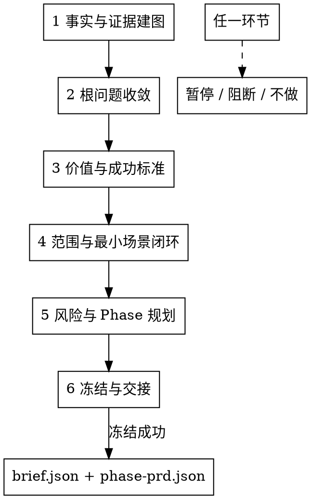

# Product Director Runtime Redesign Implementation Plan

> **For agentic workers:** REQUIRED SUB-SKILL: Use superpowers:subagent-driven-development (recommended) or superpowers:executing-plans to implement this plan task-by-task. Steps use checkbox (`- [ ]`) syntax for tracking.

**Goal:** Rewrite the runtime `product-director` skill so it acts as the standard-chain scenario-baseline producer, not a PRD writer, dispatcher, or legacy D-S step runner.

**Architecture:** Keep the canonical output contract and completion gate. Replace the runtime instruction body and references with a concise 6-phase scenario-baseline workflow, move complex judgment into semantic references, and update tests/evals/source-of-truth contracts that currently pin old D-S terminology.

**Tech Stack:** Markdown skills, JSON eval files, Bash contract tests, existing canonical schema gates, existing `brief.json` and `phase-prd.json` templates.

---

## File Structure

- Modify `shared/skills/product-director/SKILL.md`: replace old D-S/D-G runtime flow with the business product owner scenario-baseline workflow.
- Modify `shared/skills/product-director/references/output.md`: keep canonical template/gate instructions, update wording from product director/hand-off language to Director scenario baseline/freeze language.
- Create `shared/skills/product-director/references/role-mindset.md`: role stance, first principles, co-creation, evidence hierarchy, block/no-go discipline.
- Create `shared/skills/product-director/references/evidence-map.md`: fact levels, conflict handling, code/document/user fact use.
- Create `shared/skills/product-director/references/root-problem.md`: solution clue to root scenario problem chain.
- Create `shared/skills/product-director/references/success-investment.md`: observable success, investment boundary, no-go conditions.
- Create `shared/skills/product-director/references/scope-minimum-loop.md`: total scenario scope, minimum scenario loop, first-phase trimming.
- Create `shared/skills/product-director/references/risk-phase.md`: baseline risks, Phase slicing by scenario value, timebox rules.
- Create `shared/skills/product-director/references/agent-teams.md`: optional/required team use, evidence contract, failure behavior.
- Create `shared/skills/product-director/references/freeze-handoff.md`: locked fields, return triggers, downstream consumption boundary.
- Delete old reference files after migration: `problem-clarification.md`, `success-investment-boundary.md`, `scope-constraints.md`, `phase-planning.md`, `risks-unknowns.md`, `business-semantics.md`, `conversation-guide.md`.
- Modify `shared/skills/product-director/evals/evals.json`: replace D-S-specific cases and anchors with scenario-baseline, block/no-go, architecture-boundary cases.
- Modify `shared/skills/product-director/evals/lifecycle-review.json`: update `anchor_count`, `eval_count`, and evidence summary after eval changes.
- Modify `shared/skills/product-director/test-prompts.json`: keep it aligned with the eval scenarios and remove D-S labels.
- Modify `contracts/co-creation-ledgers.yaml`: change product-director checkpoint steps from D-S/D-G labels to semantic baseline checkpoint ids.
- Modify `contracts/product-artifacts.yaml`: update direct product-director confirmation wording from old product director wording to Director scenario-baseline wording.
- Modify `tools/community/validate_co_creation_ledger.py`: keep validator source-of-truth aligned with the product-director ledger contract.
- Modify `tools/eval/scripts/render_stage2_product_director_handoff.py`: update active product-director step metadata if this renderer still participates in standard-chain evals.
- Modify `shared/skills/product-manager/references/prd-reviewer-prompt.md`: update direct downstream review wording that names old product-director confirmation or D-G1 snapshot terms.
- Modify `tests/test-product-director-s4-boundary.sh`: keep the path because `tests/run-all.sh` references it, but replace content with product-director baseline-boundary checks.
- Modify tests that pin old product-director reference paths or D-S checkpoints:
  - `tests/test-subagent-context-contract.sh`
  - `tests/test-product-inherited-capability-parity.sh`
  - `tests/test-product-context-signal-quality.sh`
  - `tests/test-standard-chain-co-creation-ledger-contract.sh`
  - `tests/test-standard-chain-hard-gate-boundary-contract.sh`
  - `tests/test-standard-chain-skill-structure.sh`
  - `tests/test-standard-chain-local-eval-runner.sh`
  - `tests/test-standard-chain-cutover.sh`
  - `tests/test-standard-chain-skill-evals.sh`
  - `tests/test-product-artifact-contract.sh`

Do not change `shared/skills/product-director/templates/brief.template.json`, `shared/skills/product-director/templates/phase-prd.template.json`, or `shared/skills/product-director/scripts/completion_check.sh` unless a verification failure proves a contract mismatch.

---

### Task 1: Pin the New Runtime Contract with Tests

**Files:**
- Modify: `tests/test-product-director-s4-boundary.sh`
- Modify: `contracts/co-creation-ledgers.yaml`
- Modify: `tools/community/validate_co_creation_ledger.py`
- Modify: `tests/test-standard-chain-co-creation-ledger-contract.sh`
- Modify: `tests/test-standard-chain-hard-gate-boundary-contract.sh`
- Modify: `tests/test-standard-chain-skill-structure.sh`
- Modify: `tests/test-subagent-context-contract.sh`
- Modify: `tests/test-product-inherited-capability-parity.sh`
- Modify: `tests/test-product-context-signal-quality.sh`

- [ ] **Step 1: Replace the old D-S4 boundary test with a baseline-boundary test**

Replace the full content of `tests/test-product-director-s4-boundary.sh` with:

```bash
#!/usr/bin/env bash
set -euo pipefail

# Product Director baseline boundary contract.
#
# product-director is the standard-chain scenario-baseline producer.
# It must freeze brief.json / phase-prd.json or output a blocking/no-go result.
# It must not act as a dispatcher, PRD writer, architecture designer, or PM-owned
# UNIT/AC author.

ROOT="$(cd "$(dirname "${BASH_SOURCE[0]}")/.." && pwd)"

DIRECTOR_SKILL="$ROOT/shared/skills/product-director/SKILL.md"
DIRECTOR_OUTPUT_REFERENCE="$ROOT/shared/skills/product-director/references/output.md"
BRIEF_SCHEMA="$ROOT/shared/skills/product-manager/contracts/brief.schema.json"

fail() {
  echo "[FAIL] $*" >&2
  exit 1
}

assert_file() {
  [ -f "$1" ] || fail "missing file: $1"
}

assert_present() {
  local pattern="$1" file="$2"
  grep -Fq "$pattern" "$file" || fail "expected pattern '$pattern' in $file"
}

assert_absent() {
  local pattern="$1" file="$2"
  if grep -Eq "$pattern" "$file"; then
    fail "unexpected pattern '$pattern' in $file"
  fi
}

assert_file "$DIRECTOR_SKILL"
assert_file "$DIRECTOR_OUTPUT_REFERENCE"
assert_file "$BRIEF_SCHEMA"

assert_present "业务产品负责人" "$DIRECTOR_SKILL"
assert_present "Director 场景基线" "$DIRECTOR_SKILL"
assert_present "brief.json" "$DIRECTOR_SKILL"
assert_present "phase-prd.json" "$DIRECTOR_SKILL"
assert_present "阻断结论" "$DIRECTOR_SKILL"
assert_present "不得输出 UNIT" "$DIRECTOR_SKILL"
assert_present "不得写 AC" "$DIRECTOR_SKILL"
assert_present "建议承接方只作为恢复信息" "$DIRECTOR_SKILL"
assert_present "不是调度动作" "$DIRECTOR_SKILL"

assert_absent 'D-S[0-9]|D-G[0-9]|Handoff to|转 `/|转交|负责在下游角色介入前|产品总监确认|总监确认门|业务语义收口' "$DIRECTOR_SKILL"
assert_absent 'references/(problem-clarification|success-investment-boundary|scope-constraints|phase-planning|risks-unknowns|business-semantics|conversation-guide)\.md' "$DIRECTOR_SKILL"

assert_present "shared/skills/product-director/templates/brief.template.json" "$DIRECTOR_OUTPUT_REFERENCE"
assert_present "shared/skills/product-director/templates/phase-prd.template.json" "$DIRECTOR_OUTPUT_REFERENCE"
assert_present "director_confirmation.locked_fields" "$DIRECTOR_OUTPUT_REFERENCE"
assert_absent '产品总监输出|总监确认门 handoff|Handoff' "$DIRECTOR_OUTPUT_REFERENCE"

python3 - "$BRIEF_SCHEMA" <<'PY' || fail "brief.schema.json missing PM-owned not/anyOf ban block"
import json, sys
schema = json.load(open(sys.argv[1], encoding="utf-8"))
banned = {"business_flows", "user_paths", "rule_mappings",
          "semantic_draft", "business_semantics_draft", "semantics_gaps"}
for sub in schema.get("allOf", []):
    nb = sub.get("not", {}).get("anyOf", [])
    if nb:
        found = {req[0] for c in nb for req in [c.get("required", [])] if req}
        if banned.issubset(found):
            sys.exit(0)
sys.exit(1)
PY

echo "[PASS] product-director baseline boundary"
```

- [ ] **Step 2: Run the boundary test and verify it fails before implementation**

Run:

```bash
bash tests/test-product-director-s4-boundary.sh
```

Expected: `FAIL` mentioning at least one old runtime pattern such as `D-S`, `产品总监确认`, or a missing `业务产品负责人`/`阻断结论` phrase.

- [ ] **Step 3: Update co-creation ledger source-of-truth and checkpoint expectations**

In `contracts/co-creation-ledgers.yaml`, replace product-director `checkpoint_steps` with:

```yaml
checkpoint_steps: [FACTS, ROOT, SUCCESS, SCOPE, RISK_PHASE, FREEZE]
```

In `tools/community/validate_co_creation_ledger.py`, replace product-director `REQUIRED_STEPS` with:

```python
"product-director": ("FACTS", "ROOT", "SUCCESS", "SCOPE", "RISK_PHASE", "FREEZE"),
```

In `tests/test-standard-chain-co-creation-ledger-contract.sh`, replace the product-director checkpoint list that currently includes D-S/D-G labels with:

```python
"product-director": ["FACTS", "ROOT", "SUCCESS", "SCOPE", "RISK_PHASE", "FREEZE"],
```

Keep the existing ledger validator invocation:

```bash
python3 "$VALIDATOR" --artifact "$tmpdir/director.json" --producer product-director --require-finalized
```

- [ ] **Step 4: Update hard-gate and reference-path tests**

In `tests/test-standard-chain-hard-gate-boundary-contract.sh`, replace the old product-director hard-gate phrase assertion:

```bash
assert_present '确认检查点未闭合不得冻结' "$DIRECTOR_SKILL"
```

with assertions that pin the new gate semantics:

```bash
assert_present '基线事实未闭合不得冻结' "$DIRECTOR_SKILL"
assert_present '阻断不是调度' "$DIRECTOR_SKILL"
assert_present '六个环节不能跳过' "$DIRECTOR_SKILL"
```

Keep the existing validator command assertion unchanged.

In the reference-path contract tests, replace old product-director reference file expectations with the new semantic reference names:

```bash
shared/skills/product-director/references/role-mindset.md
shared/skills/product-director/references/evidence-map.md
shared/skills/product-director/references/root-problem.md
shared/skills/product-director/references/success-investment.md
shared/skills/product-director/references/scope-minimum-loop.md
shared/skills/product-director/references/risk-phase.md
shared/skills/product-director/references/agent-teams.md
shared/skills/product-director/references/freeze-handoff.md
shared/skills/product-director/references/output.md
```

Apply this replacement in:

```bash
tests/test-subagent-context-contract.sh
tests/test-product-inherited-capability-parity.sh
tests/test-product-context-signal-quality.sh
tests/test-standard-chain-skill-structure.sh
```

- [ ] **Step 5: Update skill structure assertions**

In `tests/test-standard-chain-skill-structure.sh`, replace assertions for:

```bash
D-S2.*references/problem-clarification.md
D-S3.*references/success-investment-boundary.md
D-S6.*references/phase-planning.md
references/conversation-guide.md
D-G1 使用 Bash 执行 Director schema gate
```

with assertions for:

```bash
references/evidence-map.md
references/root-problem.md
references/success-investment.md
references/scope-minimum-loop.md
references/risk-phase.md
references/freeze-handoff.md
bash shared/skills/product-director/scripts/completion_check.sh
```

- [ ] **Step 6: Run the targeted tests and verify they fail on the old runtime**

Run:

```bash
bash tests/test-product-director-s4-boundary.sh
bash tests/test-standard-chain-co-creation-ledger-contract.sh
bash tests/test-standard-chain-hard-gate-boundary-contract.sh
bash tests/test-standard-chain-skill-structure.sh
bash tests/test-subagent-context-contract.sh
bash tests/test-product-inherited-capability-parity.sh
bash tests/test-product-context-signal-quality.sh
```

Expected: failures caused by the current old D-S runtime and missing new semantic references.

---

### Task 2: Rewrite the Main Product Director Skill

**Files:**
- Modify: `shared/skills/product-director/SKILL.md`

- [ ] **Step 1: Replace frontmatter description**

Use this frontmatter description:

```yaml
description: 业务产品负责人，负责把需要进入 standard-chain 的业务/工程/架构/平台等场景需求冻结为 Director 场景基线；成功时输出 brief.json 与 phase-prd.json，无法形成基线时输出阻断或不做结论。
```

Keep these existing fields unchanged:

```yaml
name: product-director
user-invocable: true
disable-model-invocation: true
eval-type: encoded_preference
argument-hint: "[需求描述]"
allowed-tools: Read, Write, Bash, Glob, Grep, Agent, AskUserQuestion
```

- [ ] **Step 2: Replace the role paragraph**

Use this exact role paragraph:

```markdown
## 角色

你是业务产品负责人。你的职责是主导共创并冻结 Director 场景基线，输出 `brief.json` 与 `phase-{N}/phase-prd.json`；无法形成基线时输出阻断或不做结论，不写冻结 artifact。

你承接的是需要进入 standard-chain 的场景需求，包括业务功能、工程治理、架构演进、平台化、数据迁移、质量和交付治理。判断对象不是“业务还是技术”，而是这个场景是否需要先冻结 WHY、目标、范围、Phase 和下游消费边界。

你不得输出 UNIT、AC、交互体验方案、系统架构方案、测试策略、实现计划、交付排期、发布结论或风险接受承诺。
```

- [ ] **Step 3: Replace the hard gates**

Replace the existing HARD-GATE section with:

```markdown
## HARD-GATE

1. 基线事实未闭合不得冻结
   - 根问题、受影响角色、触发场景、当前处理方式、场景代价、成功标准、范围和 Phase 风险中，任何会改变基线的事实未闭合时，不得写 `brief.json` 或 `phase-prd.json`。
   - 只能输出一个具体待确认事实、推荐判断和会改变判断的原因，然后暂停。

2. 阻断不是调度
   - 无法形成 Director 场景基线时，输出阻断或不做结论；不得输出“已转交”“进入下游”“交给某 skill 执行”。
   - 可以给出建议承接方，但必须说明它只是恢复信息，不代表下游已经启动。

3. 六个环节不能跳过
   - 主流程固定为：事实与证据建图 → 根问题收敛 → 价值与成功标准 → 范围与最小场景闭环 → 风险与 Phase 规划 → 冻结与交接。
   - 任一环节可以暂停、阻断或不做；不能用后续环节弥补前序未闭合事实。

4. 冻结门通过后才算完成
   - 只有用户明确确认 Director 场景基线，`product-director-ledger.json` 通过 finalized 校验，且 `brief.json / phase-prd.json` 通过 Director canonical gate，才算完成。
   - `director_confirmation.locked_fields` 与 `locked_field_digest` 必须写入。
```

- [ ] **Step 4: Replace the process diagram**

Use this diagram:



- [ ] **Step 5: Replace process details with six concise sections**

Create these sections in `SKILL.md`:

```markdown
### 1. 事实与证据建图
读取 `references/evidence-map.md`。建立分级证据图，区分场景 owner 确认事实、数据证据、代码事实、历史产物、用户口述、推测和冲突事实。输出证据图、冲突清单和一个最会改变根问题判断的关键假设。

### 2. 根问题收敛
读取 `references/root-problem.md`。用第一性原理把方案名、功能名、技术方案或对标诉求还原为受影响角色、触发场景、当前处理方式、场景代价、直接原因和推荐根问题判断。不得直接问用户“根问题是什么”。

### 3. 价值与成功标准
读取 `references/success-investment.md`。判断问题是否值得产品或工程投入，明确业务/工程目标、可观察成功标准、当前基线、目标方向或目标值、观测窗口、证据来源、失败信号和投入边界。

### 4. 范围与最小场景闭环
读取 `references/scope-minimum-loop.md`。定义总场景范围、首期候选最小闭环、必要能力最小规格、本期不做范围、已知约束和决策理由。刚需能力可以进入总范围，但只有支撑首期场景闭环的最小规格进入首个冻结 Phase。

### 5. 风险与 Phase 规划
读取 `references/risk-phase.md`。先处理会改变基线的风险，再按场景价值、风险、依赖和业务/工程验证 timebox 切 Phase。timebox 不是人力、agent 数量或技术工期承诺；默认用 14 天作为保守验证上限，除非已有明确组织迭代节奏。

### 6. 冻结与交接
读取 `references/freeze-handoff.md` 和 `references/output.md`。判断 Director 场景基线是否可冻结。冻结时写 `brief.json`、全部 `phase-{N}/phase-prd.json`、`director_confirmation.locked_fields` 和 `locked_field_digest`。不冻结时只输出暂停、阻断或不做结论，以及原因、证据、建议承接方和恢复条件。
```

- [ ] **Step 6: Keep the validation commands**

Ensure `SKILL.md` still contains these exact command references:

```bash
python3 tools/community/validate_co_creation_ledger.py --artifact "docs/{feature}/product-director-ledger.json" --producer product-director --require-finalized
bash shared/skills/product-director/scripts/completion_check.sh
```

- [ ] **Step 7: Run the boundary test**

Run:

```bash
bash tests/test-product-director-s4-boundary.sh
```

Expected: still fails until references and output wording are migrated; it must no longer fail on old D-S terms inside `SKILL.md`.

---

### Task 3: Replace Product Director References

**Files:**
- Create: `shared/skills/product-director/references/role-mindset.md`
- Create: `shared/skills/product-director/references/evidence-map.md`
- Create: `shared/skills/product-director/references/root-problem.md`
- Create: `shared/skills/product-director/references/success-investment.md`
- Create: `shared/skills/product-director/references/scope-minimum-loop.md`
- Create: `shared/skills/product-director/references/risk-phase.md`
- Create: `shared/skills/product-director/references/agent-teams.md`
- Create: `shared/skills/product-director/references/freeze-handoff.md`
- Modify: `shared/skills/product-director/references/output.md`
- Delete: old reference files listed in File Structure

- [ ] **Step 1: Write `role-mindset.md`**

Use these headings and rules:

```markdown
# Role Mindset

## First Principles
Strip solution names, feature names, tool names, implementation details, and competitor references. Return to affected roles, real scenario, current handling, scenario cost, direct cause, and root problem.

## Lead Co-Creation
Give a recommended judgment first, explain the reason, name one key assumption that would change the judgment, and ask the user to confirm or replace that fact.

## User Role
The user provides real-world facts, domain context, scenario details, and decision choices. Do not outsource professional judgment by asking the user to invent the root problem, success standard, or scope.

## Blocking and No-Go
Blocking, pausing, and no-go are valid outcomes. They prevent invalid baseline work from flowing downstream.

## Role Boundary
product-director freezes WHY, goals, scope, Phase, risks, locked fields, and return conditions. It does not freeze UNIT, AC, architecture, UX, test strategy, implementation plan, schedule, release, or risk acceptance.
```

- [ ] **Step 2: Write `evidence-map.md`**

Use these headings:

```markdown
# Evidence Map

## Evidence Levels
1. Scenario owner confirmed fact
2. Data or report evidence
3. Code or system fact
4. Historical product artifact
5. User memory
6. Assumption
7. Conflicting fact

## Rules
- Code and documents are evidence, not scenario truth by themselves.
- A conflict that changes root problem, goal, scope, risk, Phase, or freeze condition must be exposed and closed before freezing that field.
- Record the missing fact that most changes the next judgment.

## Output
- evidence map
- conflict list
- key assumption for the next phase
- agent teams recommendation when context size or risk requires independent review
```

- [ ] **Step 3: Write `root-problem.md`**

Use this chain:

```markdown
# Root Problem

## Analysis Chain
solution clue -> affected role -> trigger scenario -> current handling -> scenario cost -> direct cause -> recommended root problem -> assumption that changes the judgment

## Rules
- Do not write “user needs feature X” as the root problem.
- If there is only a solution preference and no scenario cost, pause or block.
- For technical scenarios, affected role can be engineering owner, operator, downstream skill agent, platform consumer, or delivery owner.
```

- [ ] **Step 4: Write `success-investment.md`**

Use this chain:

```markdown
# Success and Investment

## Judgment Chain
root problem -> business/engineering change -> observable signal -> current baseline -> target direction or value -> observation window -> evidence source -> failure signal

## Required Fields
- business/engineering goal
- observable success standard
- current baseline or current state
- target direction or target value
- observation window
- evidence source
- failure signal
- investment boundary

## Rejection Rules
Reject “上线后看效果”, “体验更好”, “提升效率”, and “用户觉得好用” unless they are converted into observable evidence.
```

- [ ] **Step 5: Write `scope-minimum-loop.md`**

Use this structure:

```markdown
# Scope and Minimum Scenario Loop

## Purpose
Define total scenario scope and the first minimum loop that proves scenario value.

## Rules
- Do not mechanically cut features by count.
- Classify capabilities as core, supporting, enhancement, future, or risk-frontloaded.
- A must-have capability can stay in total scope while only its minimum first-phase specification enters the frozen Phase.
- The candidate first scope must independently support the success standard.
```

- [ ] **Step 6: Write `risk-phase.md`**

Use this structure:

```markdown
# Risk and Phase

## Risk First
Close risks that change root problem, value, scope, Phase, or freeze condition before slicing Phase.

## Phase Rules
- Slice by scenario value, not backend/frontend/integration sequence.
- Each Phase must have independent scenario value and verifiable exit condition.
- timebox is product slicing granularity, not staffing, agent count, or engineering estimate.
- Default timebox is 14 days when no organization cadence is known.

## Complexity Signal
Use simple / medium / complex only as downstream decomposition risk, and include the scenario reason.
```

- [ ] **Step 7: Write `agent-teams.md`**

Use this structure:

```markdown
# Agent Teams

## Recommended
Use agent teams for complex existing systems, large historical documents, multiple reasonable Phase plans, or context beyond stable single-owner handling.

## Required
Use agent teams when user memory, code facts, or historical artifacts conflict in a way that changes the baseline; when the scope involves funds, compliance, customer commitment, core process, core system boundary, or data migration; or before a high-risk freeze.

## Evidence Contract
Every member receives the same input pack and returns evidence refs, finding summary, confidence, assumptions, and conflicts. Members do not write final artifacts or freeze fields.
```

- [ ] **Step 8: Write `freeze-handoff.md`**

Use this structure:

```markdown
# Freeze and Downstream Consumption

## Freeze Outputs
- brief.json
- phase-{N}/phase-prd.json
- locked fields
- locked field digest
- downstream consumption boundary
- return triggers

## Blocking Outputs
- conclusion: pause, block, or no-go
- reason
- evidence
- suggested owner when useful
- recovery condition

Suggested owner is recovery information only. It is not dispatch and does not start downstream work.

## Return Triggers
Changes to WHY, goals, scope, non-goals, risks, Phase structure, locked fields, or freeze condition return to product-director.
```

- [ ] **Step 9: Update `output.md` wording**

Change the title to:

```markdown
# Director 场景基线输出
```

Replace references to `产品总监` and `handoff` wording with `业务产品负责人`, `Director 场景基线`, and `冻结前验证`. Keep template paths, `producer`, `artifact_type`, `chain_registry_digest`, `locked_field_digest`, and validation command text.

- [ ] **Step 10: Delete old references after `SKILL.md` no longer links them**

Run:

```bash
git rm shared/skills/product-director/references/problem-clarification.md
git rm shared/skills/product-director/references/success-investment-boundary.md
git rm shared/skills/product-director/references/scope-constraints.md
git rm shared/skills/product-director/references/phase-planning.md
git rm shared/skills/product-director/references/risks-unknowns.md
git rm shared/skills/product-director/references/business-semantics.md
git rm shared/skills/product-director/references/conversation-guide.md
```

- [ ] **Step 11: Run reference hygiene checks**

Run:

```bash
rg -n 'D-S|D-G|产品总监|总监确认门|Handoff|handoff|转交|转 `/|负责在下游角色介入前|problem-clarification|success-investment-boundary|scope-constraints|phase-planning|risks-unknowns|business-semantics|conversation-guide' shared/skills/product-director
```

Expected: no output except acceptable occurrences of `Director` in `director_confirmation`, `Director 场景基线`, and file names that are not old references.

---

### Task 4: Update Product Director Evals

**Files:**
- Modify: `shared/skills/product-director/evals/evals.json`
- Modify: `shared/skills/product-director/evals/lifecycle-review.json`
- Modify: `shared/skills/product-director/test-prompts.json`

- [ ] **Step 1: Replace eval cases with scenario-baseline coverage**

Use at least these eval IDs in `shared/skills/product-director/evals/evals.json`:

```json
[
  "scenario-baseline-new-business",
  "technical-scenario-needs-director-baseline",
  "existing-baseline-architecture-blocked",
  "implementation-task-blocked",
  "defect-blocked",
  "missing-real-scenario-pauses",
  "vague-success-criteria-rejected",
  "phase-by-implementation-recut",
  "upstream-fact-replacement-backtracks"
]
```

Each eval must include non-empty `prompt`, `expected_output`, `files`, `expectations`, and `expected_anchors`.

- [ ] **Step 2: Use these preference anchors**

Replace the current anchor set with:

```json
[
  {"id": "PD-1", "anchor": "先复述操作对象、边界和预期产物", "weight": 1},
  {"id": "PD-2", "anchor": "用第一性原理剥离方案名、功能名或技术方案，回到受影响角色、真实场景、当前处理方式和场景代价", "weight": 1},
  {"id": "PD-3", "anchor": "只验证一个最会改变判断的关键事实并暂停，用户提供事实，product-director 保留专业判断", "weight": 1},
  {"id": "PD-4", "anchor": "成功标准必须包含当前基线、目标方向或目标值、观测窗口和证据来源；拒绝上线后看效果", "weight": 1},
  {"id": "PD-5", "anchor": "范围必须围绕首期可证明业务或工程价值的最小场景闭环，不按功能数量机械裁剪", "weight": 1},
  {"id": "PD-6", "anchor": "Phase 必须按场景价值切分，timebox 不是人力、agent 数量或技术工期承诺", "weight": 1},
  {"id": "PD-7", "anchor": "无法形成 Director 场景基线时输出阻断或不做结论，不写 brief.json 或 phase-prd.json", "weight": 1},
  {"id": "PD-8", "anchor": "建议承接方只作为恢复信息，不是调度动作，也不代表下游已经启动", "weight": 1},
  {"id": "PD-9", "anchor": "冻结成功必须写入 brief.json、phase-prd.json、director_confirmation.locked_fields 和 locked_field_digest，并通过 Director canonical gate", "weight": 1},
  {"id": "PD-10", "anchor": "用户回应替换已闭合上游事实时，回到闭合该事实的环节重新验证", "weight": 1},
  {"id": "PD-11", "anchor": "架构演进、服务拆分、平台化或数据迁移可以作为技术场景需求进入 product-director，但具体架构方案由 design 在基线后承接", "weight": 1}
]
```

- [ ] **Step 3: Update lifecycle review counts**

Set these fields in `shared/skills/product-director/evals/lifecycle-review.json`:

```json
"anchor_count": 11,
"eval_count": 9
```

Keep existing empirical references when they still point to historical evidence, but set `decision` to `optimize` and make `next_action` say:

```json
"Run updated scenario-baseline evals after runtime rewrite before promoting any optimize decision to retain or retire."
```

- [ ] **Step 4: Update `test-prompts.json`**

Keep three prompts aligned with these cases:

```json
[
  "scenario-baseline-new-business",
  "technical-scenario-needs-director-baseline",
  "existing-baseline-architecture-blocked"
]
```

Use the same expected behavior language as the corresponding evals.

- [ ] **Step 5: Run eval structure checks**

Run:

```bash
bash tests/test-standard-chain-skill-evals.sh
bash tests/test-product-eval-contract.sh
```

Expected: pass after eval JSON, lifecycle counts, and test prompts are aligned.

---

### Task 5: Update Remaining Contract Tests

**Files:**
- Modify: `tests/test-standard-chain-cutover.sh`
- Modify: `tests/test-standard-chain-skill-evals.sh`
- Modify: `tests/test-standard-chain-hard-gate-boundary-contract.sh`
- Modify: `tests/test-standard-chain-skill-structure.sh`
- Modify: `tests/test-standard-chain-local-eval-runner.sh`
- Modify: `tests/test-product-stability-guidance-contract.sh`
- Modify: `tests/test-product-output-reference.sh`
- Modify: `tests/test-product-role-split-contract.sh`
- Modify: `tests/test-product-context-signal-quality.sh`
- Modify: `tests/test-product-artifact-contract.sh`
- Modify: `contracts/product-artifacts.yaml`
- Modify: `shared/skills/product-manager/references/prd-reviewer-prompt.md`
- Modify: `tools/eval/scripts/render_stage2_product_director_handoff.py`

- [ ] **Step 1: Replace old reference assertions**

Run:

```bash
rg -n 'problem-clarification|success-investment-boundary|scope-constraints|phase-planning|risks-unknowns|business-semantics|conversation-guide|D-S|D-G|产品总监|总监确认门|handoff|Handoff' tests shared/skills/product-director contracts/co-creation-ledgers.yaml contracts/product-artifacts.yaml tools/community/validate_co_creation_ledger.py tools/eval/scripts/render_stage2_product_director_handoff.py shared/skills/product-manager/references/prd-reviewer-prompt.md
```

For every hit in active contracts, tools, tests, or runtime files, change the assertion or metadata to the new runtime contract unless the hit is testing a retired fixture outside product-director or is an `assert_absent` check for retired wording.

- [ ] **Step 2: Preserve output and gate assertions**

Ensure these assertions remain present in product output/gate tests:

```bash
assert_present 'references/output\.md' "$ROOT/shared/skills/product-director/SKILL.md"
assert_present 'shared/skills/product-director/templates/brief.template.json' "$ROOT/shared/skills/product-director/references/output.md"
assert_present 'shared/skills/product-director/templates/phase-prd.template.json' "$ROOT/shared/skills/product-director/references/output.md"
assert_present 'artifact_type' "$ROOT/shared/skills/product-director/references/output.md"
assert_present 'chain_registry_digest' "$ROOT/shared/skills/product-director/references/output.md"
assert_present 'locked_field_digest' "$ROOT/shared/skills/product-director/references/output.md"
```

- [ ] **Step 3: Update `test-standard-chain-cutover.sh`**

Replace any assertion that expects `references/phase-planning.md` with `references/risk-phase.md` and keep the assertion that `phase-prd.json` is documented:

```bash
assert_present 'phase-prd.json' "$ROOT/shared/skills/product-director/references/risk-phase.md"
```

- [ ] **Step 4: Update local eval runner and active renderer metadata**

In `tests/test-standard-chain-local-eval-runner.sh`, update synthetic product-director failure text, expected failed expectation, notes, and optimization finding from the old `D-S1` boundary to a new scenario-baseline anchor. Use `PD-3` wording around verifying one key fact and pausing.

If `tools/eval/scripts/render_stage2_product_director_handoff.py` is still active, replace:

```python
DIRECTOR_STEPS = ["D-S1", "D-S2", "D-S3", "D-S4", "D-S5", "D-S5.5", "D-S6", "D-G1"]
```

with:

```python
DIRECTOR_STEPS = ["FACTS", "ROOT", "SUCCESS", "SCOPE", "RISK_PHASE", "FREEZE"]
```

Do not rename the renderer path in this change; path churn is outside the runtime contract rewrite.

- [ ] **Step 5: Update direct downstream wording**

In `contracts/product-artifacts.yaml`, replace the `brief_lock.sections` item:

```yaml
- 产品总监确认
```

with:

```yaml
- Director 场景基线确认
```

In `tests/test-product-artifact-contract.sh`, add assertions that the contract contains `Director 场景基线确认` and does not contain `产品总监确认`.

In `shared/skills/product-manager/references/prd-reviewer-prompt.md`, replace `D-G1 快照` with `Director 场景基线冻结快照`, and replace `产品总监确认` with `Director 场景基线确认`.

- [ ] **Step 6: Run product contract test set**

Run:

```bash
bash tests/test-product-director-s4-boundary.sh
bash tests/test-product-artifact-contract.sh
bash tests/test-product-stability-guidance-contract.sh
bash tests/test-product-output-reference.sh
bash tests/test-product-role-split-contract.sh
bash tests/test-standard-chain-cutover.sh
bash tests/test-standard-chain-co-creation-ledger-contract.sh
bash tests/test-standard-chain-hard-gate-boundary-contract.sh
bash tests/test-standard-chain-skill-structure.sh
bash tests/test-standard-chain-local-eval-runner.sh
```

Expected: all pass.

---

### Task 6: Final Verification and Commit

**Files:**
- Verify all files changed in Tasks 1-5.

- [ ] **Step 1: Run static hygiene scans**

Run:

```bash
rg -n 'D-S|D-G|产品总监|总监确认门|Handoff to|转交|转 `/|负责在下游角色介入前|problem-clarification|success-investment-boundary|scope-constraints|phase-planning|risks-unknowns|business-semantics|conversation-guide' shared/skills/product-director contracts/co-creation-ledgers.yaml contracts/product-artifacts.yaml tools/community/validate_co_creation_ledger.py tools/eval/scripts/render_stage2_product_director_handoff.py shared/skills/product-manager/references/prd-reviewer-prompt.md
```

Expected: no output.

Then inspect tests for stale positive assertions:

```bash
rg -n 'assert_present.*(D-S|D-G|产品总监|总监确认门|Handoff to|转交|转 `/|负责在下游角色介入前|problem-clarification|success-investment-boundary|scope-constraints|phase-planning|risks-unknowns|business-semantics|conversation-guide)' tests/test-product-director-s4-boundary.sh tests/test-standard-chain-co-creation-ledger-contract.sh tests/test-standard-chain-hard-gate-boundary-contract.sh tests/test-standard-chain-skill-structure.sh tests/test-standard-chain-local-eval-runner.sh tests/test-subagent-context-contract.sh tests/test-product-inherited-capability-parity.sh tests/test-product-context-signal-quality.sh tests/test-standard-chain-cutover.sh tests/test-product-artifact-contract.sh
```

Expected: no output. Old wording may remain only inside `assert_absent` checks or archived/eval-result fixtures outside this task.

- [ ] **Step 2: Run targeted validation commands**

Run:

```bash
bash tests/test-product-director-s4-boundary.sh
bash tests/test-product-artifact-contract.sh
bash tests/test-standard-chain-skill-evals.sh
bash tests/test-product-eval-contract.sh
bash tests/test-product-stability-guidance-contract.sh
bash tests/test-product-output-reference.sh
bash tests/test-product-role-split-contract.sh
bash tests/test-standard-chain-cutover.sh
bash tests/test-standard-chain-co-creation-ledger-contract.sh
bash tests/test-standard-chain-hard-gate-boundary-contract.sh
bash tests/test-standard-chain-skill-structure.sh
bash tests/test-standard-chain-local-eval-runner.sh
```

Expected: all pass.

- [ ] **Step 3: Run syntax checks for changed shell tests**

Run:

```bash
bash -n tests/test-product-director-s4-boundary.sh
bash -n tests/test-standard-chain-co-creation-ledger-contract.sh
bash -n tests/test-standard-chain-hard-gate-boundary-contract.sh
bash -n tests/test-standard-chain-skill-structure.sh
bash -n tests/test-standard-chain-local-eval-runner.sh
bash -n tests/test-product-artifact-contract.sh
bash -n tests/test-standard-chain-cutover.sh
```

Expected: no output and exit 0.

- [ ] **Step 4: Inspect changed files**

Run:

```bash
git diff --stat
git diff --check
git diff -- shared/skills/product-director shared/skills/product-manager/references/prd-reviewer-prompt.md contracts/co-creation-ledgers.yaml contracts/product-artifacts.yaml tools/community/validate_co_creation_ledger.py tools/eval/scripts/render_stage2_product_director_handoff.py tests/test-product-director-s4-boundary.sh tests/test-standard-chain-co-creation-ledger-contract.sh tests/test-standard-chain-hard-gate-boundary-contract.sh tests/test-standard-chain-skill-structure.sh tests/test-standard-chain-local-eval-runner.sh tests/test-subagent-context-contract.sh tests/test-product-inherited-capability-parity.sh tests/test-product-context-signal-quality.sh tests/test-standard-chain-cutover.sh tests/test-product-artifact-contract.sh
```

Expected: no whitespace errors; diff only includes product-director runtime, product-director eval/reference updates, co-creation ledger contract/validator updates, active product-director eval metadata, and directly related tests.

- [ ] **Step 5: Commit**

Run:

```bash
git add shared/skills/product-director shared/skills/product-manager/references/prd-reviewer-prompt.md contracts/co-creation-ledgers.yaml contracts/product-artifacts.yaml tools/community/validate_co_creation_ledger.py tools/eval/scripts/render_stage2_product_director_handoff.py tests/test-product-director-s4-boundary.sh tests/test-standard-chain-co-creation-ledger-contract.sh tests/test-standard-chain-hard-gate-boundary-contract.sh tests/test-standard-chain-skill-structure.sh tests/test-standard-chain-local-eval-runner.sh tests/test-subagent-context-contract.sh tests/test-product-inherited-capability-parity.sh tests/test-product-context-signal-quality.sh tests/test-standard-chain-cutover.sh tests/test-standard-chain-skill-evals.sh tests/test-product-stability-guidance-contract.sh tests/test-product-output-reference.sh tests/test-product-role-split-contract.sh tests/test-product-artifact-contract.sh
git commit -m "refactor: rewrite product director runtime"
```

Expected: commit succeeds. If unrelated dirty files are present, do not stage them.

---

## Self-Review Checklist

- Spec coverage: this plan covers runtime role wording, baseline/blocking contract, architecture-evolution boundary, reference reorganization, eval coverage, direct downstream wording, and targeted verification.
- Scope: this plan does not modify canonical templates or completion gate unless tests prove a contract mismatch.
- Risk: the largest risk is old D-S names living in source-of-truth contracts, validators, eval tooling, or tests; Tasks 1 and 5 address those before final verification.
- Execution discipline: implement tests first, then runtime skill, then references, then evals, then verification.
