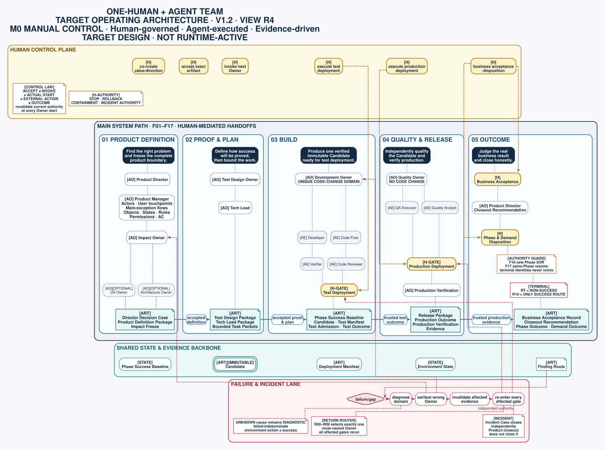
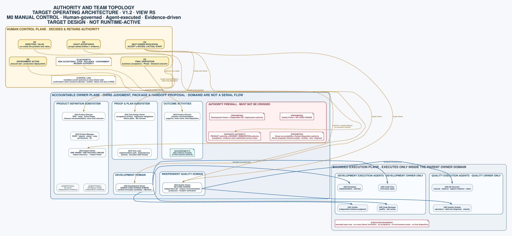
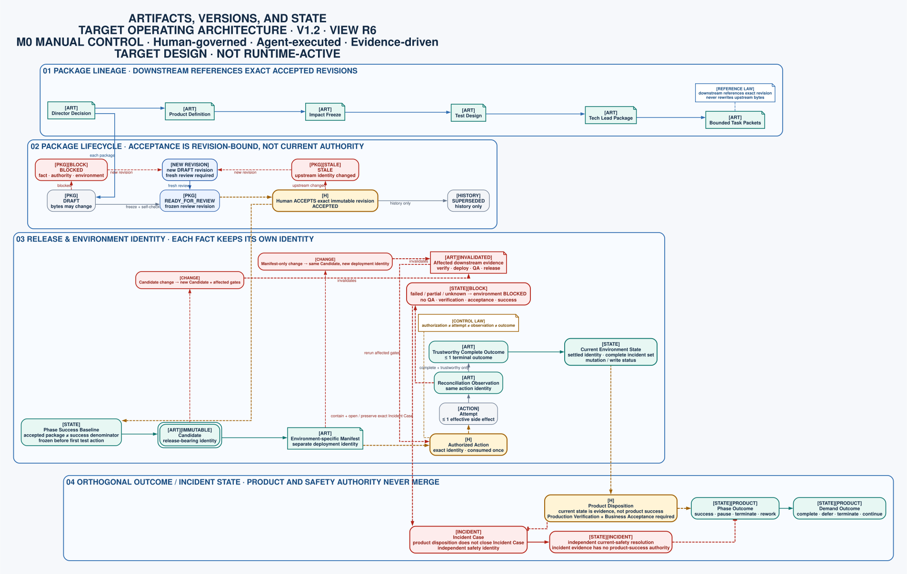
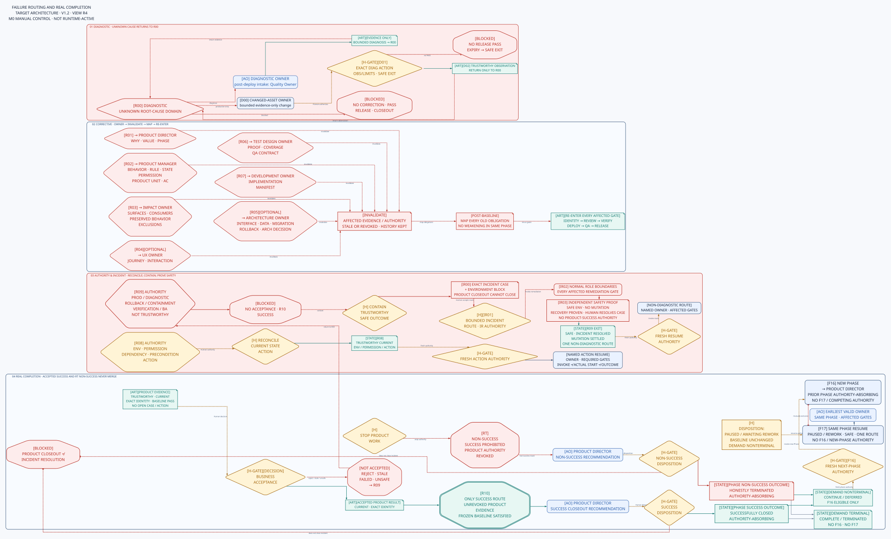

# One-Human + Agent Team Operating Architecture V1.2

## Status

- Architecture version: `TARGET-V1.2`.
- View revision: `R3`.
- Macro design status: approved in human co-creation on 2026-07-30.
- Written baseline status: pending final human review.
- Runtime status: not implemented.
- Operating mode: `M0`, with manual cross-Owner invocation and manual deployment.
- Versioning note: `TARGET-V1.2` remains a candidate baseline until final human acceptance.
- Authority boundary: this document defines the target operating architecture. It does not claim that the current standard-chain runtime implements it.
- Activation boundary: do not register this document in `contracts/active-doc-scope.yaml`. Runtime activation requires separately approved role designs, isolated implementation evidence for every mapped target role, whole-chain acceptance, and one atomic target-runtime cutover.

## Purpose

This baseline serves two readers without creating two sources of truth:

1. A human sees a team battle map: division of work, sequence, decision points, deployment gates, feedback loops, and real completion.
2. Codex, Claude, or another Agent reads a strict macro contract: stable roles, authority boundaries, handoff identities, blocking conditions, return ownership, and terminal semantics.

The tables and invariants are normative. The diagrams are projections of those semantics. If a projection conflicts with the normative text, the projection is wrong.

## Goal

Enable one human to direct a replaceable Agent team from ambiguous demand through production deployment and business acceptance while preserving:

- human authority over value, risk, deployment, rollback, and acceptance;
- professional separation of product, impact, experience, architecture, verification design, planning, development, and independent quality;
- bounded context for execution Agents;
- stage-owned and versioned handoffs;
- immutable release identity and environment-specific deployment identity;
- deterministic failure routing;
- operational-incident remediation independent of product closeout;
- honest Phase and Demand outcomes;
- manual control before automation.

## Scope

This architecture covers:

`Demand signal → accepted business result or explicit non-success closeout → separate human Phase and Demand outcomes`

It includes team topology, role authority, normal and exceptional flow, optional stages, handoff artifacts, release identity, human deployment gates, failure routing, incident remediation, terminal semantics, target runtime naming, and the activation strategy.

It deliberately excludes:

- detailed Skill instructions;
- artifact JSON, YAML, database, or event schemas;
- control-plane transaction, launch, retry, and recovery protocols;
- deployment concurrency, fencing, adapter, and reconciliation implementation;
- exact UX and Architecture activation algorithms;
- automated orchestration;
- project-specific requirements;
- the `qft-tenants` acceptance scenario;
- per-file cutover, installer transaction, residue-audit, and rollback implementation.

Those details must later satisfy this architecture; they may not silently redefine it.

## Reading Contract

### Notation

| Mark | Meaning |
|---|---|
| `[H]` | Human authority or human-executed gate |
| `[AO]` | Agent Owner: accountable stage orchestrator |
| `[AE]` | Execution Agent working under an Owner |
| `[ART]` | Versioned artifact or evidence package |
| `[H-GATE]` | Human approval plus a human-executed deployment, rollback, or business decision |
| Solid edge | Forward evidence or artifact flow |
| Dashed edge | Authority, optional activation, invalidation, or return routing |
| Double border | Immutable Candidate identity |

Color is supplemental only. Every distinction must remain readable in grayscale.

### Edge semantics

An Owner-to-Owner edge means the upstream Owner may propose a versioned handoff after its exit conditions pass. It never means the upstream Agent may invoke the downstream Owner.

In `M0`, every cross-Owner transition requires the human to:

1. review the human-readable projection;
2. verify the exact package revision;
3. accept or reject that revision;
4. invoke the exact next Owner.

`ACCEPT`, `INVOKE`, actual Owner start, external action, and action outcome are separate facts. A unique invocation must bind the current authority, exact input, target Owner, and permitted action. Actual start must revalidate that authority. Revoked or duplicate commands must not produce an additional start, and output produced after revocation cannot become a current handoff. Start evidence must be truthful; an uncertain launch remains blocking until the same invocation is reconciled without duplication. The detailed launch and recovery protocol is deferred.

## Human View 0: Team Battle Map



[Open PNG projection](assets/2026-07-30--one-human-agent-team-operating-architecture-v1.2/team-battle-map.png)

## Normative Role Contract

### Top-level roles

| Stable ID | Role type | Owns | Must not own | Primary output |
|---|---|---|---|---|
| `HUMAN_CONTROL` | Human control plane | business authority, co-creation, stage acceptance, cross-Owner invocation, risk decisions, environment actions, incident authority, business acceptance, and Phase/Demand disposition | empirical truth by decree; delegated technical proof | identity-bound authority, action, acceptance, and outcome evidence |
| `PRODUCT_DIRECTOR` | Agent Owner with human co-creation | WHY, target actor and scenario, value, investment boundary, non-goals, Active Phase boundary, and closeout recommendation | product behavior, architecture, impact coverage, tasks, code, tests, final disposition | Director Decision Case and Closeout Recommendation |
| `PRODUCT_MANAGER` | Agent Owner with human co-creation | WHAT, business objects, states, rules, permissions, Product Units, and product acceptance criteria | WHY mutation, source-code impact, architecture, implementation tasks | Product Definition Package |
| `IMPACT_OWNER` | Agent Owner | affected business surfaces, system assets, consumers, preserved behavior, evidence exclusions, and impact completeness | business-rule definition, UX design, technical solution | one Impact Package lineage with discovery and freeze checkpoints |
| `UX_OWNER` | Conditional Agent Owner with human co-creation | user journey, interaction, information architecture, prototype, experience risk and evidence | business priority, technical architecture, code | optional UX Package |
| `ARCHITECTURE_OWNER` | Conditional Agent Owner with human co-creation | technical solution, interfaces, data, migration, quality attributes, rollback strategy, architectural risk | product value or detailed product behavior | optional Architecture Package |
| `TEST_DESIGN_OWNER` | Agent Owner | pre-development proof obligations, acceptance coverage, regression obligations, failure paths, specialty tests, and QA handoff | implementation or release judgment | Test Design Package |
| `TECH_LEAD` | Agent Owner | implementation path, dependencies, batches, Task decomposition, and execution constraints | changing product scope, impact baseline, or architecture while planning | Tech Lead Package and bounded Task Packets |
| `DEVELOPMENT_OWNER` | Agent Owner | code-changing execution, TDD, verification, code review, integration, Candidate assembly, Deployment Manifests, and test-admission evidence | independent QA judgment, deployment, business risk acceptance | Candidate, Deployment Manifests, and Test Admission Package |
| `QUALITY_OWNER` | Agent Owner | independent QA, Finding classification, retest, release recommendation, production verification, and incident verification | code changes, deployment authority, business risk acceptance, incident-resolution authority | Finding Route Package, Release Package, and verification evidence |

### Execution roles

| Stable ID | Parent Owner | Executes | Prohibited authority |
|---|---|---|---|
| `DEVELOPER` | `DEVELOPMENT_OWNER` | scoped implementation and self-testing | scope, architecture, independent acceptance |
| `CODE_FIXER` | `DEVELOPMENT_OWNER` | root-cause code correction with fresh regression evidence | bypassing verification or review |
| `VERIFIER` | `DEVELOPMENT_OWNER` | Task and acceptance-evidence verification | implementation mutation during verdict |
| `CODE_REVIEWER` | `DEVELOPMENT_OWNER` | code-quality and risk review | product or release decision |
| `QA_EXECUTOR` | `QUALITY_OWNER` | test execution, observation, evidence capture, and retest | code changes, release decision |
| `QUALITY_ANALYST` | `QUALITY_OWNER` | reproduction, read-only diagnosis, and Finding-classification support | code changes or cross-Owner invocation |

Quality Owner and QA are not synonyms. Quality Owner is accountable for the quality stage; QA Executor performs tests under that Owner.

### Normative runtime names

Stable IDs define architecture identity. Runtime names are the first-party Skill entrypoints that implement those identities. The target mapping is fixed:

| Stable ID | Target runtime name |
|---|---|
| `PRODUCT_DIRECTOR` | `product-director` |
| `PRODUCT_MANAGER` | `product-manager` |
| `IMPACT_OWNER` | `impact-owner` |
| `UX_OWNER` | `ux-owner` |
| `ARCHITECTURE_OWNER` | `architecture-owner` |
| `TEST_DESIGN_OWNER` | `test-design-owner` |
| `TECH_LEAD` | `tech-lead` |
| `DEVELOPMENT_OWNER` | `development-owner` |
| `QUALITY_OWNER` | `quality-owner` |
| `DEVELOPER` | `developer` |
| `CODE_FIXER` | `code-fixer` |
| `VERIFIER` | `verifier` |
| `CODE_REVIEWER` | `code-reviewer` |
| `QA_EXECUTOR` | `qa-executor` |
| `QUALITY_ANALYST` | `quality-analyst` |

`HUMAN_CONTROL` is an authority domain, not a Skill entrypoint.

At target cutover, retire the first-party chain entrypoints `ux`, `design`, `test-design`, `delivery-owner`, `fix`, `verify`, `review`, and `qa`. Retire both the `consistency-audit` Skill entrypoint and its `consistency-auditor` chain identity after each required consistency obligation is assigned to the accountable target Owner and proven by that Owner's acceptance contract. Replace `product-director`, `product-manager`, `tech-lead`, and `developer` in place; do not create `-v2` aliases. Third-party mirrors and unrelated standalone Skills are outside this retirement set.

Development may proceed role by role in an isolated target branch, worktree, and runtime. Partial promotion into the shared runtime, legacy-to-target adapters, dual-read contracts, mixed artifact revisions, and simultaneous old/new first-party chain entrypoints are forbidden. The shared runtime activates only after every mapped target role and required consumer passes its role, installer, generic, adversarial, and whole-chain gates.

## Human View 1: Authority and Team Topology



[Open PNG projection](assets/2026-07-30--one-human-agent-team-operating-architecture-v1.2/authority-and-team-topology.png)

## Normative Operating Flow

### Shared guards

All flow edges use three architecture-level guards:

- **Current-authority guard:** the exact accepted input, authority domain, target Owner or action, and current product/incident state still permit the transition.
- **Current-environment guard:** every affected environment has a known current state, a complete current open-incident set, no conflicting mutator, and no unresolved action that would make the transition unsafe.
- **Phase-success guard:** after the first test action, the immutable Phase Success Baseline remains the denominator for same-Phase success.

The detailed mechanism that enforces these guards is deferred. The properties are not.

### Forward flow

| Flow ID | From | To | Required condition | Human control |
|---|---|---|---|---|
| `F00` | demand signal | `PRODUCT_DIRECTOR` | original signal and provenance; known target-environment incident state is linked; unknown environment identity stays explicit | invoke Product Director; discovery may proceed, but unknown or open incident state grants no production or success authority |
| `F01` | `PRODUCT_DIRECTOR` | `PRODUCT_MANAGER` | accepted Director Decision Case; all Director handoff gates pass | accept exact revision and invoke Product Manager |
| `F02` | `PRODUCT_MANAGER` | `IMPACT_OWNER.discovery` | accepted Product Definition Package | accept and invoke Impact discovery |
| `F03` | `IMPACT_OWNER.discovery` | `UX_OWNER` | accepted Impact discovery revision; UX explicitly activated | record activation and invoke UX |
| `F04` | `IMPACT_OWNER.discovery` | `ARCHITECTURE_OWNER` | accepted Impact discovery revision; Architecture explicitly activated; required product/UX inputs exist | record activation and invoke Architecture |
| `F05` | Impact discovery plus activated or skipped conditional views | `IMPACT_OWNER.freeze` | every activated view is accepted; every skip has a rationale and reopen trigger | invoke Impact Owner to create a new freeze revision |
| `F06` | `IMPACT_OWNER.freeze` | `TEST_DESIGN_OWNER` | Impact freeze references discovery and every activation/skip decision; blocking impact gaps are zero | accept freeze and invoke Test Design |
| `F07` | `TEST_DESIGN_OWNER` | `TECH_LEAD` | accepted Test Design Package | accept and invoke Tech Lead |
| `F08` | `TECH_LEAD` | `DEVELOPMENT_OWNER` | accepted plan, bounded Task Packets, and execution constraints | accept and invoke Development Owner |
| `F09` | `DEVELOPMENT_OWNER` | `HUMAN_TEST_DEPLOYMENT` | accepted `PRODUCT` Test Admission Package binds the Candidate, exact test Manifest, Phase, Phase Success Baseline, and required evidence | freeze the Baseline before the first test action; authorize and execute the exact test deployment |
| `F10` | test deployment | `QUALITY_OWNER.pre_release` | trustworthy complete-success deployment outcome, ready test environment, exact identity match, and settled environment state | invoke Quality Owner; failure, partial result, unknown result, or unresolved environment state is routed instead |
| `F11` | `QUALITY_OWNER.pre_release` | `HUMAN_PRODUCTION_DEPLOYMENT` | `PRODUCT` Release Package qualifies one Candidate-production Manifest pair against the Phase Success Baseline; affected production incident sets are known and empty | accept exact package and classified residual risk; authorize and execute the exact production deployment |
| `F12` | production deployment | `QUALITY_OWNER.production_verification` | trustworthy complete-success outcome, exact identity match, current production state, empty incident set, and no unresolved mutation | invoke production verification; otherwise contain and route through `R09` |
| `F13` | production verification | `HUMAN_BUSINESS_ACCEPTANCE` | mandatory `PRODUCT` verification obligations pass against the Phase Success Baseline for the exact current production identity | human accepts or rejects the actual business result; failed or stale evidence enters `R09` |
| `F14` | accepted `PRODUCT` result through `R10` | `PRODUCT_DIRECTOR.recommend_closeout` | exact success evidence remains current; incident set is empty; containment is complete or unnecessary; no unresolved action can supersede it | invoke Product Director for recommendation only; `RT` uses the non-success path |
| `F15` | Product Director recommendation | `HUMAN_DISPOSITION_DECISION` | recommendation binds exact evidence and distinguishes Phase from Demand | human records one consistent disposition. Success requires `R10`. A next Phase may follow only after the preceding Phase is successfully closed or honestly terminated. A paused or awaiting-rework Phase may only resume through `F17`; a failed Phase may never be relabeled successful |
| `F16` | next-Phase authorization | `PRODUCT_DIRECTOR` | Demand is explicitly nonterminal; the preceding Phase is authority-absorbing through successful closure or termination; no same-Phase resume or competing new-Phase authority remains current; exact new Phase identity and authorization are current; affected environment and incident guards pass | consume the authorization and invoke Product Director for the new Phase |
| `F17` | same-Phase resume authorization | route-named earliest valid Owner | Phase is paused or awaiting rework; Demand is nonterminal; value boundary and Success Baseline are unchanged; incidents are resolved; environment is safe; one current non-diagnostic route identifies the resume point; no next-Phase, new-Phase, or competing Phase authority remains current | consume exact resume authorization and invoke the named Owner; affected gates rerun |

### Optional-stage semantics

`UX_OWNER` and `ARCHITECTURE_OWNER` are independently conditional. Until detailed activation contracts are approved:

- the relevant upstream Owner recommends activation or skip;
- the recommendation states its evidence and risk basis;
- the human decides;
- a skip records rationale and reopen trigger;
- Impact freeze waits for every activated view to close.

### Exceptional diagnostic production flow

Production-only observation must not be forced through the release-success path:

| Flow ID | From | To | Required condition | Human control |
|---|---|---|---|---|
| `D00` | accepted `R00` route | route-named changed-asset Owner | read-only and test observation cannot discriminate the root-cause domain; the evidence-only change is bounded and bound to `PRODUCT` or `INCIDENT_REMEDIATION` | accept the route and invoke the exact Owner; changed release or manifest identity receives affected review and verification |
| `D01` | Diagnostic Deployment Package | human diagnostic production deployment | package binds exact identity, environment state, diagnostic question, observation owner/window, safety limits, and a no-gap safe-exit obligation; it carries no Release `PASS` | separately authorize the bounded diagnostic action; safe-exit protection remains effective until the diagnostic state ends in a proven safe or normally qualified state; observation-window expiry initiates the pre-authorized safe exit without a new human decision |
| `D02` | trustworthy complete-success diagnostic outcome plus observations | `R00` | observations answer only the diagnostic question and remain bound to the exact action and observed environment state | invoke `R00` classification; evidence cannot enter release, business acceptance, `R10`, or product success |

Pre-action authority or environment mismatch enters `R08` with no intended side effect. Failed, partial, unknown, or unsafe diagnostic result enters containment and `R09`. If expiry cannot establish a trustworthy safe state, the incident/environment block remains current and the flow enters `R09`. The exact safe-exit implementation is deferred.

## Normative Artifact and State Model

### Stable artifact classes

| Class | Stable artifacts | Owner | Macro identity rule |
|---|---|---|---|
| stage packages | Director Decision Case, Product Definition, Impact discovery/freeze, optional UX/Architecture, Test Design, Tech Lead, Task Packets | producing Owner | accepted revisions are immutable; downstream references rather than edits |
| human authority | Human Control Event, Control Plane Revision, Owner Invocation Record | Human control plane | acceptance, invocation, actual start, revocation, and disposition remain distinguishable and identity-bound |
| success denominator | Phase Success Baseline Record | Human control plane | frozen before the first test action; same-Phase revisions may preserve or strengthen but never weaken it |
| release identity | Candidate | Development Owner | immutable identity for declared release-bearing material |
| deployment identity | Deployment Manifest | Development Owner | immutable environment-specific identity separate from Candidate; secret values stay outside |
| environment control state | Environment Generation, Environment Incident Guard, Environment Write Guard | human-controlled environment plane | one current settled state and complete incident set per environment; at most one effective mutator |
| environment action evidence | authorization, attempt, reconciliation observation, deployment/rollback/containment outcome | Human and action executor | authority, attempted action, observation, and trustworthy outcome are separate facts |
| quality and release evidence | Test Admission, Finding Route, Release Package, Production Verification, Business Acceptance | Development Owner, Quality Owner, Human | exact identity, authority domain, Phase/Incident subject, and current environment state cannot be rebound |
| incident control | Incident Remediation Case and Incident Verification Evidence | Human control plane and Quality Owner | incident lineage is independent of product outcome and grants no implicit product authority |
| product disposition | Closeout Recommendation, Phase Outcome, Demand Outcome, Disposition Decision | Product Director and Human | Product Director recommends; Human records one consistent disposition; product-terminal states absorb authority |

Detailed fields and persistence schemas are deferred.

### Work granularity

```text
PRODUCT:              Demand → Phase → Product Unit → Task → Candidate lineage
INCIDENT_REMEDIATION: Incident Case → bounded remediation work → Task → optional Candidate lineage
```

- a Demand may contain multiple Phases;
- a Phase contains Product Units;
- Product Units map to one or more Tasks;
- a Candidate integrates a declared Task set for one exact product or incident lineage;
- a deployed instance is identified by Candidate + environment-specific Manifest + current environment state + trustworthy outcome;
- Incident Case lineage is not a child of a terminated product Phase and never inherits product-success authority.

### Stage-package lifecycle

| State | Meaning | Who may establish it |
|---|---|---|
| `DRAFT` | Owner is working; bytes may change | producing Owner |
| `READY_FOR_REVIEW` | Owner freezes a review revision and completes self-check | producing Owner |
| `ACCEPTED` | evidence is sufficient to authorize the next bounded stage; exact revision freezes | Human only |
| `BLOCKED` | fact, authority, environment, or upstream decision prevents valid completion | producing Owner records; Human resolves authority blockers |
| `STALE` | upstream change may invalidate the accepted conclusion | dependency projection marks; Human triggers reassessment in `M0` |
| `SUPERSEDED` | newer revision replaced this revision; historical only | control plane |

`BLOCKED` or `STALE` never jumps directly back to `ACCEPTED`; resolution creates a new revision and a fresh review. Historical acceptance never proves current authority to start.

### Identity and invalidation

| Object | What remains immutable | What current-lineage change does |
|---|---|---|
| stage package | accepted bytes and revision | dependent accepted packages become `STALE`; history remains |
| Phase Success Baseline | frozen success denominator | equivalent or stronger mapping may continue; weakening requires non-success closeout and a new Phase |
| Candidate | release-bearing identity | release-bearing change creates a new Candidate and invalidates old qualification for the replacement |
| Deployment Manifest | environment-specific identity | manifest change creates a new Manifest and reruns affected authorization, deployment, and verification |
| authority or invocation | exact subject, target, and permitted action | revocation prevents new current execution or handoff; historical evidence remains |
| environment state | actual settled identity and incident/write status | successor state makes earlier environment-bound success evidence non-current |
| action evidence | what was authorized, attempted, observed, or completed | later actions do not rewrite prior facts; only trustworthy complete outcomes prove success |
| Incident Case | incident identity and safety objective | product disposition cannot resolve it; Human resolution requires current safety evidence |
| Phase/Demand outcome | recorded product disposition | product-terminal identity cannot regain active authority |

### Candidate and Manifest boundary

Candidate identity changes when release-bearing code, build, migration, packaged configuration, or packaged dependency changes. Observation-only evidence does not create a Candidate.

A Manifest-only change leaves Candidate identity unchanged but creates a new deployment identity and requires every affected gate to rerun. Evidence for one Candidate-Manifest pair never qualifies another pair.

### Environment safety properties

- each environment has one current settled state, one complete current open-incident set, and at most one effective mutator;
- each environment action has one unique identity, one current human authorization consumed at most once, at most one effective side effect, and no more than one trustworthy terminal outcome;
- duplicate submission may only reconcile the same action; any retry intended to cause a new side effect requires fresh authority and a new action identity;
- stale, conflicting, or revoked mutations cannot advance the current state;
- an unknown, partial, or indeterminate action blocks quality, verification, acceptance, and success;
- only a trustworthy complete outcome proves deployment, rollback, or containment success;
- before write authority transfers, the previous mutator must be proven unable to continue writing;
- no failed production action may leave a window in which neither an incident/environment block nor safe containment is current;
- no QA, production verification, incident verification, business acceptance, `R10`, or disposition begins while the relevant environment has unresolved mutation authority.

The concurrency, fencing, isolation, retry, and reconciliation mechanisms that prove these properties belong to later deployment/control-plane design.

## Human View 2: Artifacts, Versions, and State



[Open PNG projection](assets/2026-07-30--one-human-agent-team-operating-architecture-v1.2/artifacts-versions-and-state.png)

## Normative Return Routing

### Routing rule

A return is a versioned Finding Route Package, not a backward chat message. Every route states:

- triggering evidence and exact affected identity;
- authority domain: `PRODUCT` or `INCIDENT_REMEDIATION`;
- route type: `DIAGNOSTIC`, `CORRECTIVE`, `AUTHORITY`, or `TERMINAL`;
- exactly one accountable next-action role;
- invalidated packages, qualifications, or authority;
- resume point and observable resume condition;
- required human decision.

Unknown root cause stays `DIAGNOSTIC`. It may authorize only bounded evidence production, never a business correction, `PASS`, release, or closure.

Human containment is authority execution, not root-cause diagnosis. A request, authorization, or command does not prove containment; only a trustworthy complete-success outcome may establish a safe contained state. Incomplete or indeterminate containment blocks normal resume and successful closeout.

### Independent incident-remediation flow

Product disposition and operational incident state are independent:

| Flow ID | Meaning | Required authority and exit |
|---|---|---|
| `IR00` | open or preserve the exact Incident Case and environment-level incident block before any failed-state block can disappear | Human; product closeout must preserve every still-open Case |
| `IR01` | accept one bounded incident route and invoke the exact Owner under `INCIDENT_REMEDIATION` authority | Human; current Case, route, target, and environment state must still match |
| `IR02` | execute bounded remediation and every affected identity, review, test, quality, deployment, and verification gate | normal role boundaries remain; remediation evidence has no product-success authority |
| `IR03` | independently verify the current safe state and resolve the Case | Human; current safe environment, no unresolved mutation, complete containment/recovery evidence, and Incident Verification must all pass |

Incident authority cannot introduce new product value, broaden business behavior, weaken the product Success Baseline, revive a product-terminal identity, or enter Business Acceptance or `R10`.

### Macro route table

| Route | Type | Trigger | Target | Default invalidation and resume |
|---|---|---|---|---|
| `R00` | `DIAGNOSTIC` | failure is real but root-cause domain is unresolved | one named diagnostic Owner; Quality Owner is default intake for post-deployment failure | block correction/PASS/release/close; bounded evidence returns to `R00`, and production-only evidence uses `D00`–`D02` |
| `R01` | `CORRECTIVE` | target actor, real problem, value, or Active Phase is wrong | Product Director | dependent product packages and authority stale; after Baseline freeze, changed success denominator closes old Phase non-successfully and creates a new Phase |
| `R02` | `CORRECTIVE` | product behavior, rule, state, permission, Product Unit, or acceptance criterion is wrong | Product Manager | Product Definition and dependents stale; after Baseline freeze, removed or relaxed obligation requires a new Phase |
| `R03` | `CORRECTIVE` | affected surface, consumer, preserved behavior, or evidence exclusion is incomplete | Impact Owner | Impact freeze and dependents stale; corrected freeze and affected gates rerun |
| `R04` | `CORRECTIVE` | journey or interaction evidence is wrong or missing | UX Owner | UX and affected dependents stale; new UX, refreshed Impact, and affected gates rerun |
| `R05` | `CORRECTIVE` | interface, data, migration, rollback, or architecture decision is wrong | Architecture Owner | affected design and downstream qualification stale; new Architecture and affected gates rerun |
| `R06` | `CORRECTIVE` | proof obligation, coverage, or QA contract is wrong | Test Design Owner | proof/plan and downstream qualification stale; after Baseline freeze, reduced proof denominator requires a new Phase |
| `R07` | `CORRECTIVE` | expected behavior/design are clear but implementation or Manifest is wrong | Development Owner | affected qualification and downstream evidence revoked; changed identities and affected verify/review/deploy/QA gates rerun |
| `R08` | `AUTHORITY` | environment, permission, external dependency, current-state precondition, or action reconciliation is faulty | Human control plane | product/code conclusions remain unless contradicted; resume only after current environment state is trustworthy and fresh action authority succeeds |
| `R09` | `AUTHORITY` | production/diagnostic action, rollback, containment, verification, or business acceptance fails, is partial, becomes indeterminate, or loses current-state validity | Human control plane | containment and Incident Case are required; success remains blocked until safe state, resolved incident, no unresolved mutation, one non-diagnostic route, and fresh resume authority |
| `RT` | `TERMINAL` | Human stops product work and requests non-success closeout | Product Director | successful closure prohibited; current product authority is revoked; Human records honest non-success disposition while open incidents continue through `IR00`–`IR03` |
| `R10` | `TERMINAL` | accepted `PRODUCT` result satisfies the frozen Baseline and exact production evidence remains current with empty incident state and no unresolved action | Product Director | recommend success only; Human rechecks current evidence and records separate Phase/Demand outcomes |

Every post-Baseline `R01`–`R07` correction must map old obligations to the new revision. An implementation-only correction may prove that the Baseline did not change. Failure evidence remains history and cannot be erased by changing the success denominator.

## Human View 3: Failure Routing and Real Completion



[Open PNG projection](assets/2026-07-30--one-human-agent-team-operating-architecture-v1.2/failure-routing-and-terminal-outcomes.png)

## Terminal Semantics

Package acceptance, Success Baseline, Candidate qualification, Manifest identity, invocation authority, environment state, action outcome, containment, Incident Case, Phase outcome, and Demand outcome are separate state domains.

Phase outcomes distinguish at least:

- successfully closed after production verification and human business acceptance;
- paused;
- terminated;
- awaiting rework, including a rolled-back result that still intends same-Phase correction.

Demand outcomes distinguish at least:

- completed;
- paused or deferred;
- terminated;
- still active with another authorized Phase.

A successfully closed or terminated Phase is authority-absorbing for that Phase identity. Only a nonterminal paused or awaiting-rework Phase may use `F17`. A completed or terminated Demand is authority-absorbing for that Demand identity and cannot use `F16` or `F17`.

A product-terminal Phase may be followed by a new Phase only when the Demand remains explicitly nonterminal, no resume or competing Phase authority remains current, and Human grants fresh next-Phase authority. A nonterminal Phase may resume but cannot coexist with a new-Phase authority. The old Phase remains honestly successful or non-successful; it is never reopened or relabeled.

Product Director recommends. Human records one consistent disposition:

- continue the Demand with one exact new Phase through `F16`;
- pause and later resume the unchanged Phase through `F17`;
- finish or terminate with no resume or next-Phase authority.

Product closeout never closes an open Incident Case. Incident remediation never contributes product-success evidence.

## Architecture Invariants

1. Human control is cross-cutting, not the first serial stage.
2. Human alone owns business, cross-Owner, environment-action, incident, risk, business-acceptance, and Phase/Demand authority.
3. Human confirmation cannot convert unknowns, conflicts, assumptions, or failed obligations into facts or `PASS`.
4. `ACCEPT`, `INVOKE`, actual start, external action, and outcome remain distinct and cannot be inferred from one another.
5. Each Owner start is uniquely attributable and non-replayable; start requires current authority, uncertain launch remains blocking until reconciled, and post-revocation output cannot become current.
6. Owners own their outputs; downstream roles reference but never mutate accepted bytes. Invalidation propagates while history remains.
7. Impact Owner is one role with one lineage and two immutable checkpoints. UX and Architecture are independently conditional.
8. Test Design is independent and constrains Development Owner and Quality Owner.
9. Development Owner is the only code-changing domain. Quality Owner and QA never modify code.
10. Development and Quality do not share one long execution context; execution Agents consume bounded Task Packets.
11. Phase Success Baseline freezes before the first test action; same-Phase work may preserve or strengthen but never weaken its success denominator.
12. Candidate, Manifest, current environment state, action evidence, and acceptance evidence are distinct identities; one identity's evidence cannot qualify another.
13. Each environment has one current settled state, one complete open-incident set, and at most one effective mutator. `UNKNOWN` is not empty.
14. Stale, conflicting, or revoked mutation cannot produce an effective side effect or advance current state.
15. Failed, partial, unknown, or unresolved environment action blocks QA, verification, acceptance, and success.
16. Only a trustworthy complete outcome proves deployment, rollback, or containment success.
17. Mutator transfer is legal only after the previous mutator is proven unable to continue writing; two effective writers are forbidden.
18. Production diagnosis is bounded, has a continuous safe-exit obligation, carries no Release `PASS`, and returns only to `R00`.
19. Every route names evidence, authority domain, type, one next Owner, invalidation, and resume condition. Unknown cause cannot masquerade as correction.
20. Environment failure does not invalidate product/code conclusions by default, but it blocks environment-dependent success.
21. Product closeout does not close an incident. Incident remediation cannot revive product-terminal authority or become product-success evidence.
22. An incident resolves only when current environment safety is known, no mutation is unresolved, containment/recovery is proven, and independent incident verification passes.
23. Phase and Demand outcomes are separate. Paused or awaiting-rework state may resume; successfully closed/terminated Phase and completed/terminated Demand are authority-absorbing.
24. `RT` is always non-success. `R10` accepts only current, unrevoked `PRODUCT` evidence satisfying the frozen Success Baseline.
25. The `qft-tenants` scenario is reserved for final whole-chain validation and must not shape individual role contracts prematurely.
26. Each environment action has one unique identity, consumes one current human authorization at most once, produces at most one effective side effect and one trustworthy terminal outcome, and requires fresh authority for any new side effect.
27. Diagnostic observation-window expiry automatically initiates its pre-authorized safe exit; failure to prove a safe state preserves or opens the environment incident block and enters `R09`.
28. At most one Phase authority is current within a Demand: a nonterminal Phase may resume through `F17`, while a new Phase may start through `F16` only after the preceding Phase is authority-absorbing.
29. Every first-party target role has exactly one runtime name from the normative mapping; legacy aliases and target aliases cannot coexist.
30. Target roles may be implemented and manually evaluated incrementally only in an isolated non-active runtime.
31. Shared-runtime activation is one atomic whole-chain cutover. Partial role promotion, compatibility adapters, dual reads, and mixed legacy/target revisions are forbidden.
32. After cutover, retired first-party chain sources, routes, contracts, and managed runtime residues are absent from the active tree and installed runtime. Git history is their sole reference source; rollback restores the frozen legacy release as a whole and reinstalls it.

## Deferred Detailed-Design Obligations

Later designs must choose and prove mechanisms for:

- control-plane serialization, truthful durable invocation start/acknowledgement, indeterminate-launch reconciliation, cancellation, replay prevention, durable-output authority, and recovery;
- environment single-writer enforcement, stale-writer rejection, unique action identity, once-only authorization consumption, same-action reconciliation, current-state settlement, safe transfer, rollback, and containment;
- incident-set completeness across Demands and atomic removal of any failed-state gap;
- diagnostic safe-exit enforcement, automatic expiry initiation, and failure escalation without an unguarded window;
- artifact schemas, storage, digests, and event identities;
- optional-stage activation algorithms;
- isolated target-runtime construction, atomic installer transaction, retired-name residue audit, and whole-release rollback mechanics.

These are open implementation decisions, not permission to weaken the invariants. A target/legacy compatibility layer is not an open option.

## Target Versus Current Runtime

The target architecture is not implemented. The current standard chain still aggregates responsibilities that this target separates and does not provide the target release, environment, incident, or disposition contracts. The current runtime is a frozen evaluation baseline, not a migration substrate.

Build and evaluate the target chain without installing it into the shared runtime. Freeze the legacy baseline by immutable Git identity before target implementation begins. Once every mapped target role and required consumer passes, rehearse and execute one cutover that replaces the complete active first-party chain, removes retired managed residues, audits retired unmanaged names, and verifies a target-only runtime inventory. If activation fails, restore the frozen legacy release and reinstall the whole legacy runtime. Do not repair activation by leaving a mixed chain alive.

This choice deliberately trades gradual availability for semantic cleanliness. Its risks are a larger activation batch and delayed target use; the controls are bounded role-by-role evaluation, whole-chain rehearsal, an explicit inventory oracle, and whole-release rollback.

Current-runtime evidence:

- [`contracts/standard-chain.yaml`](../../../contracts/standard-chain.yaml)
- [`shared/skills/delivery-owner/SKILL.md`](../../../shared/skills/delivery-owner/SKILL.md)
- [`contracts/standard-chain-invocation-policy.yaml`](../../../contracts/standard-chain-invocation-policy.yaml)

## Agent Consumption Contract

An Agent designing or implementing a role must:

1. identify the architecture version and role stable ID;
2. distinguish target design from current runtime;
3. preserve the role's ownership and prohibited authority;
4. preserve every applicable architecture invariant;
5. consume only current, accepted, identity-bound inputs and authority;
6. create a stage-owned output rather than modifying upstream bytes;
7. keep cross-Owner invocation human-controlled in `M0`;
8. define return routes with authority domain, invalidation, and resume semantics;
9. stop and propose an architecture revision if its work changes a role, order, human gate, identity rule, or terminal condition;
10. never infer authority from diagram proximity, a forward arrow, or historical acceptance.

## Change Control

- bump the architecture version when roles, authority, order, mandatory human gates, artifact ownership, identity rules, return ownership, or terminal semantics change;
- bump only the view revision when layout or visual wording changes without semantic change;
- update normative text, affected diagrams, invariants, dependent role references, and consistency evidence together;
- edit adjacent `.dot` sources and regenerate SVG/PNG; never hand-edit generated projections.

## Validation and Acceptance

The candidate baseline is acceptable only when:

### Human comprehension

- a reader can identify the team, division of work, optional roles, manual control points, deployment gates, feedback loops, incident lane, and real terminal outcome;
- Impact Owner and Quality Owner each appear as one role with multiple activities;
- Owner, execution Agent, artifact, and human gate are visually distinct;
- target design is not presented as current implementation.

### Agent precision

- every role, artifact class, forward edge, return route, guard, and terminal state resolves to the normative contract;
- deferred mechanism is not mistaken for missing authority or permission to invent a weaker local rule;
- Product and Incident authority, Candidate and Manifest identity, environment state, and Phase/Demand outcome remain separate.

### Failure-mode rejection

- no Owner starts automatically, twice, or after authority revocation;
- no environment authorization is replayed into a second side effect or conflicting terminal outcome;
- no changed identity inherits old qualification;
- no stale or conflicting mutator advances current environment state;
- no failed, partial, unknown, or unresolved action enters QA, verification, acceptance, or success;
- no diagnostic evidence enters release success;
- no post-failure revision weakens the Phase Success Baseline and still claims same-Phase success;
- no product closeout resolves an incident;
- no incident evidence enters Business Acceptance or `R10`;
- no product-terminal identity regains active authority;
- no paused or awaiting-rework Phase coexists with a new-Phase authority;
- no successful Phase closure bypasses production verification and human business acceptance;
- no target role is promoted into the shared runtime before whole-chain acceptance;
- no legacy alias, adapter, dual-read path, mixed artifact revision, or retired managed residue survives target activation;
- no rollback leaves a hybrid runtime.

## Next Step After Final Review

After the human reviews and accepts this baseline:

1. record it as the target reference for subsequent role-design documents;
2. return to the pending Product Director written-spec review;
3. use `writing-plans` for one approved, bounded role implementation and evaluation slice at a time;
4. keep every slice in the isolated, non-active target runtime and obtain human acceptance before moving to the next role;
5. design remaining roles and shared mechanisms against this architecture, including target consumer contracts and atomic cutover controls;
6. after every mapped target role passes, create and rehearse the whole-chain cutover and whole-release rollback plan;
7. activate the target runtime only as one complete replacement;
8. reserve automation and the `qft-tenants` whole-chain case until required role contracts and generic evaluations pass.
