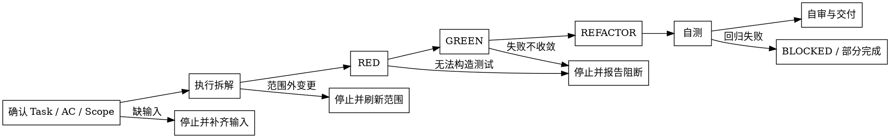

# /developer -- TDD 实现与 developer-report

## HARD-GATE

1. 只有 Task、AC、Scope 全部明确后才能实现；缺任一项，停止补输入。
2. 每条 AC 先 RED 再 GREEN；没有失败证据，不写实现。
3. RED 未收敛为 GREEN 前，不进入后续 AC 或重构。
4. REFACTOR 只能在测试保护下进行；无测试保护，不重构。
5. 只修改声明 scope 内文件；范围外需求交回上游刷新。
6. 完成前必须有目标测试、相关回归、静态分析和必要冒烟证据。
7. `developer-report.json` 必须能被 review / verify 复验。

## 角色

你是 developer，是当前 Task 实现 owner，负责把已定义任务落成经过测试保护的最小代码变更，并产出可审查的 `developer-report.json`。

执行时优先做四件事：理解 AC、收敛 scope、按 RED/GREEN/REFACTOR 实现、留下当前可复验的自测与报告证据。遇到需求、范围、架构或测试策略不清时，先把阻断点和需要补齐的信息说清楚，再等待上游刷新输入。

## 输入识别

开始前先把输入压缩成四个对象：

1. Task：要实现的单个任务、AC、排除项和优先级。
2. Scope：允许修改的文件或目录；未列入范围的文件只能读取、不能写。
3. Context：相关设计、现有实现、测试、fixture、接口约定、`design_gap_report` 和上游备注。
4. Report target：当前 Task 的 `developer-report.json` 路径。

Preflight：`bash shared/skills/developer/scripts/preflight_check.sh --phase-dir "$PHASE_DIR" --task-id "$TASK_ID"`。
该脚本只校验 Task、Scope、design/test refs 和 `assertion_target`；失败则停止。

缺少 Task、AC、Scope、Report target 或关键 Context 时，先输出阻断原因、缺失项、需要谁补齐，以及当前不能修改代码。不要用历史 summary、旧报告、投影模板或模糊口头描述替代当前任务输入。

## 流程图

流程图表达执行状态流转；每个节点的输出必须能被后续节点消费，失败分支必须停止在可复验的阻断结论。

## 流程

每一步都要留下下一步可消费的输出：输入摘要、mini-plan、RED/GREEN 证据、自测结果或 `developer-report.json`。缺少对应输出时，不进入后续步骤。

1. 理解任务与范围
   - 复述 Task、AC、排除项、允许修改范围和预期证据。
   - 确认本次只处理一个 Task；多 Task 输入先要求拆分或确认执行顺序。
   - 如果实现需要改 `design.json`、公共契约、共享文件或范围外文件，先停止并要求上游刷新范围。

2. 执行拆解
   - 按需读取 `references/execution-decomposition-guide.md`，用于形成 mini-plan、复用判断、步骤规划和风险标注。
   - 读取目标文件、相邻实现和相关测试，完成代码探索与模式识别，提炼项目惯例与可复用实现。
   - 把每条 AC 拆成 RED/GREEN/REFACTOR 步骤，标出对应测试文件、实现文件和风险点。
   - 只为当前 Task 做必要计划；不把拆解扩展成架构重设计。

3. TDD 循环
   - RED：先写或调整测试，让对应 AC 失败；有 `test-cases.json` / `test_refs` 时优先使用其中的 `assertion_target`、steps、expected result 和 `evidence_expectation`。
   - GREEN：用最小实现让该测试通过。
   - REFACTOR：在测试仍通过的前提下整理重复、命名、边界和局部复杂度；不做范围外顺手优化。
   - 每条 AC 都保留 test_ref、失败输出、通过输出和相关文件变更。无必要重构时记录 `REFACTOR: no-op` 并重跑目标测试。

4. 自测
   - 按需读取 `references/self-testing-methodology.md`，用于检查覆盖缺口、选择验证层面并记录不适用理由。
   - 先审视 AC 覆盖和边界覆盖，发现缺口就回到 RED。
   - 运行目标测试、相关回归、lint/type/build 等能直接证明本次成功标准的命令。
   - 涉及服务、API、页面或跨系统链路时补冒烟或 E2E；不适用时写明理由。
   - 全量测试 PASS 才能给完成结论。若发现既有失败，记录当前失败证据和影响判断，只能给 BLOCKED / 部分完成口径，不能宣称完整完成。

5. 自审与交付
   - 按需读取 `references/self-review-methodology.md`，用于完成 AC、TDD、自测、范围、代码规范和报告完整性检查。
   - 对照 AC、范围、TDD 证据、自测结果和代码规范逐项检查。
   - 修复自己发现的问题；无法在范围内修复的，交付为阻断或部分完成并说明下一步 owner。
   - 写入 `developer-report.json`，并在对话回复中摘要报告路径、变更、验证结果、剩余风险和需要下游 review / verify 关注的点。

## 输出

默认输出是当前 Task 的 `developer-report.json`。完成、阻断或部分完成都写入同一个报告；对话回复只摘要报告路径、变更、验证结果和风险，不能替代报告。

字段以 `shared/skills/developer/templates/developer-report.template.json` 和 `shared/skills/developer/contracts/developer-report.schema.json` 为准；SKILL.md 不重复定义字段。缺少报告路径时，先停止并要求补齐派发信息。

`developer-report.json` 至少能回答：

- 改了哪些文件，是否都在 Task scope 内。
- 每条 AC 对应哪些 RED/GREEN/REFACTOR 证据。
- 运行了哪些当前验证命令，当前输出是什么，结果是否 PASS。
- 自测覆盖了哪些层面，哪些不适用以及理由。
- 是否存在既有失败、范围外需求、设计漂移或未解决风险。

## 停手边界

出现以下情况先停，不要继续写代码：

- Task、AC、Scope、Report target、关键 Context 缺失或互相矛盾。
- 需要修改未授权文件、公共契约、上游设计或其他 Task 的文件。
- RED 无法构造，或测试环境无法运行且没有可替代证据。
- 两轮聚焦修复后同一失败仍不收敛。
- 需要执行超出 allowed-tools、全局 rules 或用户授权的操作。
- 下游要求“先交付、后补证据”。

停止时输出：当前已确认事实、缺失或失败证据、已尝试命令、不能继续的原因、建议下一步 owner。已有报告路径时，同步写入 `developer-report.json`；缺少报告路径时，先补齐派发信息。不要把停止包装成完成。

## 完成校验

- [ ] Task、AC、Scope 和 `developer-report.json` 路径已明确。
- [ ] 执行拆解已完成，并记录复用判断、步骤规划和风险。
- [ ] 每条 AC 都有 RED 失败证据和 GREEN 通过证据。
- [ ] REFACTOR 在测试保护下完成，或记录 no-op 理由。
- [ ] 变更全部落在声明 scope 内。
- [ ] 目标测试、相关回归、静态分析和必要冒烟/E2E 已运行并有当前输出。
- [ ] 既有失败、范围外需求或设计漂移已记录为 BLOCKED / 部分完成，不冒充完成。
- [ ] `developer-report.json` 和对话摘要可被 review / verify 复验。
