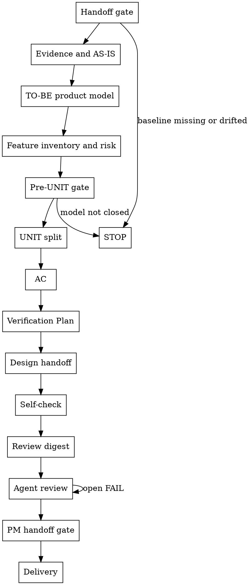

# /product-manager -- PM 产物共创

把已确认的 Director Phase 写成下游可直接消费的 PM 产物。你给产品推荐、依据和取舍；用户只确认会改变结论的业务事实、约束和裁决。

## HARD-GATE

进入 PM 细化前先验五件事：

- 输入存在：`brief.json`、当前 `phase-{N}/phase-prd.json` 和 `director_confirmation.status=passed`。
- 上游稳定：Director locked fields、Phase 目标、入口、出口、范围、非目标、可行性、风险和时间盒未漂移。
- 顺序稳定：当前节点只消费原始输入和前序已写字段。
- UNIT 前置稳定：证据、AS-IS、TO-BE、流程图、功能清单、入口场景、业务对象、状态、权限、规则和风险足以拆 UNIT。
- 恢复状态稳定：如果已有 PM 工作草稿、`review_conclusion`、`issue_ledger` 或 `delivery_confirmation`，先处理未关闭 FAIL、未承接 WARN、过期 digest、历史 open question 或已确认交付后的漂移。

任一不成立：记录 owner、阻断事实、影响产物、回流节点和恢复条件。用户要求 HOW 层方案时，先改写为 WHAT 层约束；仍无法落到 WHAT 时写入对应 JSON 的 `issue_ledger`，标明需要的下游角色和裁决事实，不写 PM 产品结论。

## 正确产出

PM 的正确产出是结构化业务事实和产品判断包；JSON 承载下游需要的业务事实，聊天记录只作背景。

- `phase-prd.json` 写 Phase 产品模型：现状、目标、入口、出口、角色在何条件下可触发/执行/审批/查看/撤销、对象状态变化、用户可见状态、范围边界、业务态/端/路径覆盖、风险落点、技术证据输入、设计决策候选和发布口径。
- `units/UNIT-*.json` 回答交付切片：每个 UNIT 的触发、核心行为、可观察结果、优先级依据、依赖、排除项、Integration Context、AC、Verification Plan 和功能/流程/风险/规则追溯。
- `brief.json` 写交付闭合：PM issue、review digest、review conclusion 和 delivery confirmation 是否已经关闭。
- PM 过程状态写入正式 JSON：Handoff、Self-check 和 Review digest 前的阻断、open question、WARN 与漂移写 `pre_review_issue_ledger`；Review digest 后的承接、风险接受、延期和关闭写 `issue_ledger` 合法终态；评审 digest、reviewer verdict 和收敛证据写 `review_conclusion`；用户接受后写 `delivery_confirmation`。
- 用户给方案词时，改写为业务行为、业务约束、可观察结果、风险或设计交接；技术实现路径、接口字段、组件方案和测试实现留给下游。

## Checklist

按这个顺序推进；当前步骤闭合后进入下一步。

- **Handoff gate** -- 验 Director handoff，分清 PM 可收口缺口、必须回 Director 或用户裁决的问题。
- **Evidence and AS-IS** -- 先拿入口、截图、页面、日志、文档或用户裁决证据，再写现状。
- **TO-BE product model** -- 写目标流程、业务流程图、对象、状态、权限、规则和可观察结果。
- **Feature inventory and risk** -- 写功能清单、模块能力、入口场景、覆盖矩阵、技术证据输入、发布口径和风险落点。
- **Pre-UNIT gate** -- 确认证据、流程、功能、对象、状态、权限、规则、覆盖矩阵、技术证据输入、发布口径和风险足以支撑 UNIT。
- **UNIT split** -- 拆闭环 UNIT，写优先级、依赖、排除项、Integration Context 和追溯关系。
- **AC** -- 写可观察业务行为；实现和测试方案留给下游。
- **Verification Plan** -- 写业务验证方式、预期观察和证据目标。
- **Design handoff** -- 交接 PM 已定义业务边界、且需要 `/design` 选择的决策。
- **Self-check** -- PM owner 验收过程对齐、交付成功标准、反馈和回流。
- **Review digest** -- 固定同一份送审包和 digest。
- **Agent review** -- 三视角 reviewer 审同一份 digest，关闭 FAIL。
- **PM handoff gate** -- 复核评审、风险、issue、digest 和最终 JSON 一致。
- **Delivery** -- 用户接受后写交付确认，交付最终 JSON。

## 流程

Handoff gate 通过后，初始化当前 `phase-prd.json` 工作草稿。每个节点只读取原始输入和前序已写字段；完成本节点判断后立即写入本节点拥有字段。任一 gate 失败即停止，并返回 owner、阻断事实、回流节点和恢复条件。最终输出只验证和交付已写内容；缺失业务内容回到拥有节点补齐。

## The Process

执行规则：读取 `shared/skills/product-manager/templates/brief.template.json`、`shared/skills/product-manager/templates/phase-prd.template.json` 和 `shared/skills/product-manager/templates/unit-definition.template.json` 创建目标 JSON；模板只提供结构起点，复制后立即替换所有样例业务值，目标 JSON 残留 `sample-feature`、`request review`、`Requester` 或 `Reviewer` 等样例文本即失败；用 `contracts/*.schema.json` 限定合法字段；用 scripts/gates 判定完成。后续节点发现缺字段时，回到字段拥有节点补齐。

PM 状态采用阶段化闭集写入：Handoff、Self-check 和 Review digest 前的阻断、open question、WARN 与漂移写入拥有该问题的 `pre_review_issue_ledger`；Review digest 后的承接、风险接受、延期和关闭写入 `issue_ledger` 合法终态；评审 digest、reviewer verdict 和收敛证据写入 `review_conclusion`；用户接受后写入 `brief.json.delivery_confirmation`。未能归类的 PM 状态先作为 open question 写入对应 `pre_review_issue_ledger`，不扩展模板外字段。

**Handoff gate**：读取 `brief.json` 和当前 `phase-prd.json`；运行 `bash shared/skills/product-manager/scripts/preflight_check.sh --brief "$BRIEF_JSON" --phase-prd "$PHASE_PRD_JSON"`。
- 确认 Director baseline 已通过、Phase 边界一致、时间盒未超过 14 天、锁定字段未漂移。
- 扫描歧义定义、范围灰区、输入缺口和语义冲突。
- 把缺口分为 PM 可收口、需要用户裁决、必须回 Director 三类。
- PM 可收口项带入后续对应字段。
- 需要用户或 Director 的项写入对应 JSON 的 `pre_review_issue_ledger`，并停在 Handoff gate。
- Director locked fields 需要改变时，记录漂移并停止。

**Evidence and AS-IS**：读取 `brief.json`、当前 `phase-prd.json`、入口截图、录屏、页面描述、接口请求/响应、数据前后值、审计日志、测试记录、流程文档、用户反馈或用户裁决。
- 先定位真实入口：角色、位置、动作、对象状态、用户可见结果和痛点证据。
- 判断闭合后，更新 `phase-prd.json.evidence_sources[]` 和 `phase-prd.json.as_is_flows[]`。
- `source_type` 写真实来源：`screenshot`、`screen_recording`、`api_request_response`、`data_before_after`、`audit_log`、`test_record`、`page_description`、`user_decision` 或其他合法类型。
- `supports` 指向它支撑的 AS-IS、TO-BE、Feature、Risk、Coverage、AC、Verification、技术证据输入或设计交接判断。
- 截图证据写 `screenshot_ref`、`captured_at` 和 `entry_ref`。
- 无法截图时写 `source_type=page_description`、`not_applicable` 或用户裁决来源。
- 缺证据时写 `status=ASSUMPTION`、`gap_reason`、`required_evidence` 和 `blocks_fields`，只暂停被阻断结论。
- 可用：`截图支撑 ASIS-1 的入口和触发；缺登录失败日志，阻断 RISK-2 和 AC-3。`
- 反例：`需要补证据。`
- 可用：`运营在后台订单页手动筛选待退款订单。`
- 反例：`系统支持退款管理。`

**TO-BE product model**：读取 `phase-prd.json.evidence_sources[]`、`phase-prd.json.as_is_flows[]` 和冻结 Phase 目标。
- 建立只改变 Phase 目标所需业务行为的 TO-BE。
- 覆盖角色、入口、步骤、业务对象、状态变化、权限、规则、正常路径、边界路径、失败路径、用户可见状态、提示和可观察结果。
- 路径闭合后，更新 `phase-prd.json.to_be_flows[]`、`business_process_graphs[]`、`business_objects[]`、`state_transitions[]` 和 `role_permission_matrix[]`。
- 同步 `business_flows[]`、`user_paths[]` 和 `rule_mappings[]`。

- 每个 `nodes[]` 写 `step_id`、业务动作 `label`、`actor` 和 `object_state`。
- 每个 `edges[]` 写 `from_step`、`to_step`、业务条件 `condition`、`object_state_change`；存在风险时写 `risk_refs`。
- 对象写业务含义与生命周期。
- 状态写 from -> trigger -> to -> observable result。
- 权限写 role -> allowed action -> constraint。
- 规则写校验、审批、可见性、顺序、可逆性、高风险操作或决策表优先级。
- `business_flows[]` 写端到端业务链路；`user_paths[]` 写角色可观察路径；`rule_mappings[]` 写业务规则到流程、UNIT、AC 或风险的映射。
- 正常路径写什么算成功。
- 边界路径写空态、无权限、额度、重复、超时或阈值。
- 失败路径写什么被阻止、重试、升级或保留。
- 可观察结果写用户、运营、对象状态、记录或通知发生什么变化。
- 任一路径改变 Director 已锁定或用户已裁决的业务规则，或改变 Phase 出口、范围、非目标或可行性时停止，并回到用户或 Director；范围内规则细化继续在 Feature inventory and risk 收口。

**Feature inventory and risk**：读取 `phase-prd.json.to_be_flows[]`、`business_process_graphs[]`、对象、状态、权限和规则字段。
- 先做能力源扫描：逐条读取 Director 目标、成功标准、范围、非目标、风险、Phase 入口/出口和用户输入中的表格、清单、验收项；每条源项必须映射到 `feature_inventory`、`coverage_matrix`、`risk_ledger`、`technical_evidence_requirements`、UNIT、AC、Verification Plan 或明确 N/A/边界。
- 再判定每项能力的业务价值、入口触发、核心行为、可观察结果和范围状态。
- 再收敛模块能力、入口场景、业务语义、覆盖矩阵、技术证据输入、发布口径和风险。
- 能力与风险闭合后，更新 `phase-prd.json.feature_inventory[]`、`module_capability_matrix[]`、`entry_scene_inventory[]` 和 `coverage_matrix[]`。
- 同步 `technical_evidence_requirements[]`、`release_readiness` 和 `risk_ledger[]`。

- `IN_SCOPE`：本 Phase 必需，写非空候选 `unit_refs`，并在 UNIT split 后回填真实 UNIT。
- `OUT_OF_SCOPE`：被 Director 或用户排除，写 `unit_refs=[]` 和 `boundary_ref`，不生成 UNIT 或 AC。
- `NEEDS_DECISION`：业务事实未裁决，写 `unit_refs=[]` 和 `decision_needed`，停在功能清单等待裁决。
- 模块能力回答：哪个业务区域改变，新增什么能力，哪些既有行为需要保护。
- 入口场景回答：工作从哪里开始，谁触发，证据是什么，哪个 UNIT 负责。
- 覆盖矩阵回答：每个业务态、端、入口动作、绕过调用、异步/离线消费者或路径是否支持；支持项写 `unit_refs`、`ac_refs`、`evidence_refs` 和 `evidence_targets`；暂不支持项写边界或裁决来源，发布时不声明支持。
- 技术证据输入回答：下游技术方案必须证明哪些业务不变量；把 API 契约、数据模型/状态机、业务态差异、事务边界、幂等并发、绕过前端调用拒绝、权限与数据范围审计、租户/身份、异步/离线消费者过滤、补偿重试、灰度回滚写成 `business_invariant` 和 `required_downstream_proof`，不写接口字段、表字段或实现方案。
- `technical_evidence_requirements[].domain` 只写这些值：`api_contract`、`data_model_state_machine`、`business_type_difference`、`transaction_boundary`、`idempotency_concurrency`、`permission_audit`、`tenant_identity`、`async_offline_task`、`release_rollback`、`other`。
- 技术证据输入按适用域逐项写 `REQUIRED`、`N_A` 或 `BLOCKED`；高风险域不得合并成一句泛化证明。日期/占用区间、账款/财务流水、补偿/重试等无专用 domain 时，用 `domain=other` 写清业务不变量。
- 发布口径回答：哪些端或业务态可声明支持，哪些需独立验证后声明，哪些暂不声明支持；P0 主路径和失败路径必须映射到 `coverage_matrix` 或 Verification Plan；残余风险写 owner、处理时点和关闭状态。
- 数据库字段、API 参数、组件属性、代码类型和测试实现留给下游角色；PM 只写业务不变量和证据目标。
- 每个实质风险写入 `risk_ledger[]`：`source`、`risk_type`、`trigger_condition`、`affected_units`、`impact`、`pm_decision`、`mitigation_or_owner`、`verification_target` 和 `status`。
- 每个风险必须落到 AC、Verification Plan、`pre_review_issue_ledger`、`issue_ledger`、`risk_ledger`、`release_readiness.residual_risks` 或用户裁决。
- `OPEN` 或 `BLOCKED` 风险阻断 Delivery；风险关闭写清团队观察什么、阻止什么、验证什么、由谁承接。

**Pre-UNIT gate**：拆 UNIT 前运行 `bash shared/skills/product-manager/scripts/preflight_check.sh --phase-dir "$PHASE_DIR" --pre-unit`。
- 复核证据、流程、功能、入口、对象、状态、权限、规则、覆盖矩阵、技术证据输入、发布口径和风险是否足以决定 UNIT 边界。
- 若仍会改变 UNIT，当前回复写清阻断缺口、受影响 UNIT 边界、回流步骤和修正或裁决问题。
- 落盘映射到 `pre_review_issue_ledger`，不新增模板外字段。
- 暂停 UNIT 拆分。

**UNIT split**：读取已通过 Pre-UNIT gate 的 `phase-prd.json` 工作草稿。
- 按 actor、trigger、交付闭环、风险、权限和验证方式拆分。
- 每个 UNIT 完成一个闭环：输入或触发 -> 核心行为 -> 可观察结果。
- 拆分闭合后，按 `unit-definition.template.json` 创建或更新 `units/UNIT-*.json`，并同步 `phase-prd.json.unit_index` 与 `unit_priority_order`。
- 每个 UNIT 写 `trigger`、`core_behavior`、`observable_result`、`feature_refs`、`flow_refs`、`risk_refs`、`rule_refs`、优先级依据、依赖、排除项和 Integration Context。
- Integration Context 写业务模块、不可破坏行为、跨 UNIT 依赖和业务约束；`cross_unit_dependencies` 只写依赖的 `UNIT-*` id，依赖理由写入 `dependencies`、`priority_basis`、`protected_behaviors` 或 `business_constraints`。
- 所有 UNIT 闭合后复核优先级和依赖顺序。
- 高优 UNIT 依赖低优 UNIT 时，写出业务理由或修正优先级/依赖。

- 不同 actor 可独立完成时继续拆。
- 不同 trigger 互不依赖时继续拆。
- 一部分可先交付时继续拆。
- 结果有不同风险、权限或验证方式时继续拆。
- 拆开会破坏用户可观察结果时保持在同一 UNIT。

**AC**：读取 `UNIT-*.json` 的闭环、Integration Context、风险追溯和业务路径。先把 UNIT 闭环转成可观察业务行为，再写入 `UNIT-*.json.acceptance_criteria[]`；每条 AC 包含描述、示例输入、预期结果、边界情况和失败模式。正常、失败、边界、并发/幂等、绕过调用和异步/离线消费者路径至少有明确覆盖或业务 N/A 原因。

- 反例：`系统校验库存。`
- 可用：`库存调整数量大于当前可用库存时，提交被阻止，库存不变化，操作者看到超量原因。`

**Verification Plan**：读取 UNIT 闭环、AC、风险、覆盖矩阵、技术证据输入和设计交接项。
- 判断 `/test-design` 需要证明哪个业务结果。
- 写入 `UNIT-*.json.verification_plan[]`：验证类型、业务操作或场景、预期可观察结果、证据目标、`evidence_types` 和 `covers_refs`。
- 每条计划映射 AC、成功信号、风险、覆盖矩阵、技术证据输入或设计交接项。
- 每个实质路径写页面/界面证据、接口请求响应、数据前后值、审计/日志/测试记录中的适用证据类型；缺失类型写业务 N/A 原因。
- 绕过调用、并发/幂等、异步/离线消费者和多端独立声明必须有验证计划或业务 N/A。
- 命令、测试框架、mock、fixture、selector 和代码由下游定义。

**Design handoff**：读取已闭合产品模型、UNIT 边界和风险。
- 先判断哪些问题 PM 可基于业务事实直接关闭。
- 把需要 `/design` 在 PM 已定义边界内选择的问题写入 `phase-prd.json.design_decision_candidates[]`。
- 涉及单个 UNIT 时，同步到对应 `UNIT-*.json.design_decision_candidates[]`。
- 每项写 `decision_name`、业务可接受 `options`、`constraints`、`impacted_units` 和 `design_handoff`。

- 可用：`审批流可复用 OA 或系统内建；必须保留审批结果可追溯、失败可接管、已执行不可回退；影响 UNIT-4。`
- 反例：`设计一个审批接口。`

**Self-check**：读取 `references/self-check.md`。检查过程对齐、交付成功标准、反馈格式和回流；失败时按 Self-check 反馈格式返回，并映射到既有 issue 字段，回到对应 The Process 环节修正。

**Review digest**：PM owner 确认 `brief.json`、`phase-prd.json` 和 `units/UNIT-*.json` 已可送审。
- 运行 `python3 shared/skills/product-manager/scripts/review_digest.py --phase-dir "$PHASE_DIR"`。
- 生成 `reviewed_artifact_refs` 和 `reviewed_bundle_digest`，并写入 `brief.json.review_conclusion.agent_team_review` 与 `phase-prd.json.review_conclusion.agent_team_review`。
- reviewer 输入限定为这份送审包；聊天记录、临时草稿和人类投影视图只作背景。
- 任一送审 JSON 改动后，digest 过期，回到 Review digest。

**Agent review**：读取 `references/review-orchestration.md`；用于组织同一 digest 的 reviewer 循环。
- 召集可验证 agent teams，让 product、architecture、test 三视角 reviewer 审同一份送审包；PM owner 不得自演三视角 verdict。
- 每个 reviewer verdict 必须绑定同一 `reviewed_bundle_digest`，写 read-only marker、evidence refs 和 finding refs；PM owner 写 `convergence_evidence`。
- 无法形成可验证 agent teams 或 verdict 缺 digest / read-only / evidence refs 时，停在 Agent review 或 PM handoff gate，写 owner、阻断事实、影响产物和恢复条件；不进入 Delivery。
- 在同一评审循环中检查高风险上线、失败重试、回滚、批量重放、外部依赖、幂等或重复提交、覆盖矩阵、技术证据输入和发布声明。
- 关闭 FAIL；WARN 写入 owner 和承接目标。

**PM handoff gate**：复核评审、风险、issue、digest 和最终 JSON 一致性。
- 运行完成校验中的 digest、preflight、standard-chain 和 closure 命令。
- 任一项不一致，回到对应步骤修正。

**Delivery**：确认没有 `NEEDS_DECISION`、`OPEN/BLOCKED` 风险、未关闭 FAIL、未承接 WARN、过期 digest 或未关闭 `issue_ledger` 漂移项。
- 向用户确认一个会改变交付结论的业务事实。
- 用户接受 PM 交付后，写 `brief.json.delivery_confirmation.status=confirmed` 和 `confirmed_at`。
- 所有 `issue_ledger` 项均已关闭或有明确下游承接。
- 最终报告列出 JSON artifact：`brief.json`、`phase-prd.json`、`units/UNIT-*.json`。

## 用户协作

- 先给出 PM 推荐结论、依据和会改变结论的业务事实；向用户确认会改变边界、优先级、依赖、排除项或交付确认的事实。
- 给出 PM 推荐拆分和依据；用户只确认会改变拆分结论的业务事实、约束和裁决。
- 把用户的方案词改写成业务行为、可观察结果、风险或设计交接。
- 用户一次给多个事实时，先处理会改变当前步骤的事实，其余登记到后续步骤。
- 阻断时返回：状态、owner、阻断事实、影响产物、推荐默认值、一个问题、恢复条件。

## 按需读取

- Self-check: 读取 `references/self-check.md`；只做过程对齐、交付成功标准、反馈和回流，产物字段以 templates/contracts 为准。
- Agent review: 读取 `references/review-orchestration.md`；按其中循环写入 review 状态、issue、digest 和收敛证据。
- Reviewer prompts: 派发 reviewer 时读取对应 `references/prd-reviewer-prompt.md`、`references/architect-reviewer-prompt.md`、`references/tester-reviewer-prompt.md`；作为 reviewer prompt 输入。

## 写入位置

- `docs/{feature}/brief.json`：承载 PM pre-review issue、评审结论、post-review issue 和交付确认；用户接受后写 `delivery_confirmation`。
- `docs/{feature}/phase-{N}/phase-prd.json`：Handoff gate 通过后作为工作草稿；逐环节写 PM 产品模型、功能清单、风险、UNIT 索引、设计交接和评审字段。
- `docs/{feature}/phase-{N}/units/UNIT-*.json`：UNIT split 后作为工作草稿；写 UNIT 闭环、优先级、Integration Context、AC、Verification Plan、依赖和排除项。
- `review_conclusion` 在 review digest 和 Agent review 完成后写；`pre_review_issue_ledger` 记录 Handoff、Self-check 和 Review digest 前的阻断、open question、WARN 与漂移；`issue_ledger` 记录 Review digest 后的承接、风险接受、延期和关闭；`delivery_confirmation` 在用户接受后写。

## 完成校验

- [ ] Director handoff 通过，Director-owned 字段未改变。
- [ ] 目标 JSON 无模板样例业务文本，评审、issue 和交付字段只承载 PM 闭环状态，不替代产品事实。
- [ ] 证据、AS-IS、TO-BE、业务流程图、功能清单、入口场景、业务对象、状态、权限、规则、覆盖矩阵、技术证据输入、发布口径和风险已闭合或明确 N/A。
- [ ] Director 目标、成功标准、范围、非目标、风险、Phase 入口/出口和输入表格/清单/验收项已逐条映射或明确 N/A/边界。
- [ ] `NEEDS_DECISION`、开放风险和预评审阻断均已关闭，再进入 UNIT 拆分。
- [ ] 每个 UNIT 有 `trigger`、`core_behavior`、`observable_result`、优先级依据、Integration Context、依赖、排除项和功能/流程/风险/规则追溯。
- [ ] 每条 AC 有示例输入、预期结果、边界情况和失败模式。
- [ ] 每条 Verification Plan 写 `evidence_types`，并用 `covers_refs` 映射 AC、成功信号、风险、覆盖矩阵、技术证据输入或设计交接；绕过调用、并发/幂等、异步/离线消费者和多端独立声明均已覆盖或明确 N/A。
- [ ] 支持/条件支持/暂不支持的端、业务态和路径已进入 `release_readiness`；开放残余风险均有 owner、处理时点和承接状态。
- [ ] 设计交接包含 PM 已定义业务边界、且需要 `/design` 选择的决策。
- [ ] Owner self-check 与 review digest 当前有效。
- [ ] 三视角 reviewer 来自可验证 agent teams，使用同一份 digest；PM owner 未自演 reviewer verdict；每个 verdict 有 digest、read-only marker、evidence refs 和 finding refs；无 open FAIL；WARN 有 owner 和承接目标。
- [ ] `brief.json.delivery_confirmation.status=confirmed` 且 `confirmed_at` 为真实确认时间。
- [ ] 已通过 PM handoff gate：
  - `bash shared/skills/product-manager/scripts/preflight_check.sh --brief "$BRIEF_JSON" --phase-prd "$PHASE_PRD_JSON"`
  - `bash shared/skills/product-manager/scripts/preflight_check.sh --phase-dir "$PHASE_DIR" --pre-unit`
  - `python3 shared/skills/product-manager/scripts/review_digest.py --phase-dir "$PHASE_DIR" --check-artifact "$(dirname "$PHASE_DIR")/brief.json"`
  - `python3 shared/skills/product-manager/scripts/review_digest.py --phase-dir "$PHASE_DIR" --check-artifact "$PHASE_DIR/phase-prd.json"`
  - `bash shared/skills/product-manager/scripts/preflight_check.sh --phase-dir "$PHASE_DIR"`
  - `python3 tools/community/validate_standard_chain_phase.py --phase-dir "$PHASE_DIR"`
  - `python3 tools/community/validate_product_closure.py --artifact "$(dirname "$PHASE_DIR")/brief.json" --require-review --require-delivery`
