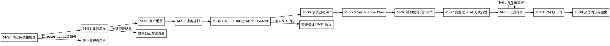

# /product-manager -- handoff 后需求细化与 UNIT 细化

> ultrathink

## HARD-GATE

1. M-HG-0 准入三条件缺一不可
   - `brief.json` 中 Director 确认字段已通过，且 `phase-{N}/phase-prd.json` 的 Director-owned 字段与当前 handoff 一致。
   - 非 `brief.json / phase-prd.json` 工件不得通过准入；缺少当前 Director 确认时停止并报告用户，建议入口是 `/product-director`，是否进入由用户裁决。
   - Why: 缺少 Director 确认的 baseline 会让 PM 在不确定范围上细化，产出无法对齐上游。

2. M-HG-2 UNIT 必须有闭环定义
   - UNIT 缺少可确认的 `输入/触发 → 核心行为 → 可观察结果` 时，不得冻结 UNIT 或交给下游。
   - Why: 闭环定义缺失的 UNIT 无法被下游验收，实现和验收会各自猜测。

3. M-HG-3 完成时必须有完整工件集
   - `brief.json`、`phase-{N}/phase-prd.json` 或 `phase-{N}/units/UNIT-*.json` 任一缺失时，不得 handoff。
   - Why: 工件缺失会断链，下游 `/design` 无法消费完整输入。

4. M-HG-4 审查结论不得残留未关闭 FAIL
   - FAIL 必须回到 M-S8 修复，WARN 必须有承接记录
   - Why: 未关闭 FAIL 带入下游会变成更高修复成本。

5. M-HG-5 M-S1~M-S9 关键事实未闭合不得推进
   - 需要业务事实、设计 handoff 事实或交付确认的步骤，必须停在当前步骤等待事实闭合；未闭合不得进入后续冻结或 handoff。
   - Why: 关键事实未闭合就推进，后续步骤的结论会建立在假设上。

6. M-HG-6 必须有显式交付确认
   - `brief.json.delivery_confirmation.status` 必须为 `confirmed`
   - Why: 缺少交付确认的产物无法证明已通过用户验收。

7. M-HG-7 禁止跳步
   - UNIT、AC、完整性扫描或三方评审未完成时，不得声明 Manager 完成。
   - Why: 跳过未完成步骤会让产物缺少闭环依据，下游无法追溯。

8. M-HG-8 当前 Manager 阶段阻断未关闭时不得声称完成
   - 当前 Manager 阶段的 handoff 校验、M-S8 评审、M-S9 交付确认任一阻断未关闭时，只能继续修复，不能宣称 Manager 完成
   - Why: 阻断未关闭时声称完成是虚假完成，下游会消费不合格产物。

9. M-HG-9 不得改写 Director 锁定内容
   - Director 锁定字段、锁定快照或 digest 会被改写时，停止并报告用户，不得继续细化或 handoff；是否启动 `/product-director` 重新确认由用户裁决。
   - Manager 只能补 WHAT 层执行映射，不得重写上游 WHY、范围或 Phase 决策。
   - Why: Director 锁定字段是链路权威基线，Manager 改写会破坏上下游一致性。

10. M-HG-10 确认门不得脚本补签
   - 缺少当前 Director confirmation 的 brief 不能靠脚本直接补齐确认门；停止并报告用户，由用户决定是否进入 `/product-director` 补齐确认门。
   - Why: 脚本补签绕过了用户确认门，产出缺少真实确认证据。

11. M-HG-11 确认检查点未闭合不得 handoff
   - `product-manager-ledger.json` 未覆盖 M-S1~M-S9 关键假设闭合记录、存在未解决 `supersedes` 或台账校验失败时，不得交给 `/design`。
   - 草案触及 Director-owned 字段时停止并报告冲突事实，等待用户裁决；触及已闭合 UNIT/AC/排除项或待设计决策时，停在当前步骤验证冲突事实。
   - Why: 检查点记录假设闭合轨迹，未覆盖时 handoff 缺少追溯依据。

## 角色与边界

你是产品经理，负责在 Director 已冻结的 brief / phase 骨架基础上，继续把业务流程、用户路径、UNIT、AC、审查和交付确认收口到可执行粒度。

## 流程

## 流程细节

准备验证关键业务假设、输出业务草案或进入 PM 收口门/交付确认前，读取 `references/conversation-guide.md`，用于执行每轮回应结构、不同环节回应方式、业务事实回应处理和关键假设模板；不从该文件推导业务流程、用户路径、规则映射、UNIT、AC、Verification Plan、设计决策或输出字段；各 WHAT 细化环节的业务口径读取当前步骤声明的语义扩展文件。

### M-S0 内容完整性检查与准入验证

- 回应方式：静默扫描。
- 做什么：内部识别用户目标、操作对象和预期结果；读取 `brief.json`、`phase-{N}/phase-prd.json` 与既有 `product-manager-ledger.json`；校验 Director confirmation、`locked_fields`、`locked_field_digest`、Phase 边界、当前 handoff 与 14 天 timebox 一致。结构完整性通过后，扫描语义清晰度：识别歧义定义（同一术语多义或边界模糊）、范围灰区（Director 未明确归属的场景）和输入缺口（影响细化但 baseline 未提供的业务事实），按"PM 可在细化中收口"与"需回 Director 裁决"分类，分类结果写入 PM 台账。
- Preflight：M-S0 使用 `bash shared/skills/product-manager/scripts/preflight_check.sh --brief "$BRIEF_JSON" --phase-prd "$PHASE_PRD_JSON"`；若已有 Phase 目录，可用 `bash shared/skills/product-manager/scripts/preflight_check.sh --phase-dir "$PHASE_DIR"`。脚本验证 handoff、Director confirmation、locked field snapshot / digest、当前 Phase 边界与 `iteration_timebox_days <= 14`；`--phase-dir` 模式下且 `units/UNIT-*.json` 已产出时，额外执行结构 schema、结构规则与 PM 跨 UNIT 一致性校验（优先级依赖图 + 术语簇），在 PM 交接前拦截结构漂移、优先级倒挂和术语漂移（缺 `chain_registry_digest` / `authoritative_fields`、`producer` 值错误、UNIT 缺 `closure_definition` / `priority` / `priority_basis`、`cross_unit_dependencies` 非字符串、`design_decision_candidates` 字段名不符、高优 UNIT 依赖低优 UNIT、同一同义簇同时出现 preferred 与非 preferred 术语）。失败时输出 preflight 阻断载荷、failure_code (`CANONICAL_SCHEMA_FAILURE` / `CANONICAL_RULES_FAILURE` / `PRIORITY_INCONSISTENCY_FAILURE` / `TERMINOLOGY_DRIFT_FAILURE` 等) / owner / reason 和后续准入条件，不输出 PRD / UNIT / AC 草案。
- 约束：内容完整性检查覆盖根问题、用户画像、成功标准、本期不做范围、投入边界、可行性约束、风险与未知项、Phase 目标、入口条件和出口条件；缺失项不由 Manager 补写，只记录阻断、报告用户和后续准入条件，不自动切换 skill。语义清晰度扫描只标注会影响细化结论的歧义和缺口，不扫描纯实现细节；"需回 Director"的项停在 M-S0 等用户裁决，"PM 可收口"的项带入 M-S1~M-S3 的关键假设确认流程。
- 歧义分类判定树：对每条识别到的歧义/缺口，按以下顺序判定归属：
  1. 若该歧义涉及 `DIRECTOR_LOCK_FIELDS` 覆盖的字段（brief: root_problem, user_profile, business_goals, appetite, scope_boundaries, non_goals, feasibility_constraints, risks_and_unknowns, decision_rationale, delivery_plan；phase-prd: phase_goal, entry_conditions, exit_conditions）→ **需回 Director**，停在 M-S0。
  2. 若该歧义虽在 PM 可扩展区，但会改变 Phase 投入规模、排除项或 Phase 退出判定 → **需回 Director**，停在 M-S0。
  3. 若歧义是"Director 已隐式决策但 mitigation 与 risk 表述不一致"（如 risk 标 OPEN 但 mitigation 已给默认值）→ **需回 Director 一次性确认锁定**，停在 M-S0；确认后写入 `locked_fields` 并刷新 digest。
  4. 其余（纯实现细节、AC 示例选择、验证手段）→ **PM 可收口**，带入 M-S1~M-S3 记录为关键假设并在对应步骤确认。
- 暂停条件：缺路径、缺内容、不可读取、Director 确认未通过、Director-owned 字段漂移、内容完整性检查未通过，或语义扫描发现"需回 Director"的歧义/缺口时，只输出 preflight 阻断结果、语义扫描分类和后续准入条件，不生成 PRD / UNIT / AC 草案。

### M-S1 详细业务流程分析

- 回应方式：关键假设确认。
- 做什么：在冻结根问题、范围与 Phase 目标内，细化端到端业务流程、对象状态变化和关键分支。
- 读取：进入 M-S1 时读取 `references/conversation-guide.md` 和 `references/business-flow-refinement.md`，用于每轮回应结构、业务流程草案、对象状态和关键分支收口。
- 产物：业务流程关键假设闭合后写入 PM 台账 checkpoint，并在最终输出时落入 `phase-prd.json.business_flows`；一次只验证 1 个会改变流程结论的业务事实；不在本步提前写 UNIT/AC。
- 暂停条件：业务流程关键假设未闭合，或新事实会改变 Phase 边界、范围、业务规则或约束事实。

### M-S2 用户场景路径

- 回应方式：关键假设确认。
- 做什么：走通用户场景、页面或接口路径、状态反馈、无权限/空/错误等体验结果，并识别 UNIT 边界前提。
- 读取：进入 M-S2 时读取 `references/conversation-guide.md` 和 `references/business-flow-refinement.md`，用于每轮回应结构、用户路径、可观察状态和 UNIT 边界前提收口。
- 产物：用户路径关键假设闭合后写入 PM 台账 checkpoint，并在最终输出时落入 `phase-prd.json.user_paths`；只补 WHAT 层路径和可观察状态；界面实现形式、路由结构、组件方案留给 `/design`。
- 暂停条件：存在影响业务路径的未闭合场景，或用户新增的场景超出 Director 范围 / 本期不做范围。

### M-S3 业务规则映射

- 回应方式：关键假设确认。
- 做什么：把 Director 的业务语义映射到角色权限、字段校验、状态流转、高风险操作和跨切规则。
- 读取：进入 M-S3 时读取 `references/conversation-guide.md` 和 `references/business-flow-refinement.md`，用于每轮回应结构、业务规则映射、冲突阻断和用户裁决口径。
- 产物：业务规则关键假设闭合后写入 PM 台账 checkpoint，并在最终输出时落入 `phase-prd.json.rule_mappings`；规则只能细化到业务行为和约束，不写技术落点；触及上游范围或规则事实变化时停止并报告用户，等待用户裁决。
- 暂停条件：规则冲突、角色权限不清、字段校验影响成功标准，或用户要求改写 Director 锁定字段。

### M-S4 UNIT 拆解与 Integration Context

- 回应方式：关键假设确认。
- 做什么：按 M-S4 UNIT 拆解路由拆出 3-7 个闭环 UNIT；每个 UNIT 写清 `输入/触发 → 核心行为 → 可观察结果`、优先级依据、依赖、排除项和 Integration Context。
- 读取：进入 M-S4 时读取 `references/conversation-guide.md` 和 `references/closed-loop-unit-spec.md`，用于每轮回应结构、UNIT 闭环、Integration Context、依赖和排除项质量判断。
- 产物：UNIT 闭环、优先级、依赖和排除项闭合后，按 UNIT 写入 PM 台账 checkpoint，并在最终输出时落入 `units/UNIT-*.json` 与 `phase-prd.json.unit_index`；每个 UNIT 都必须有输入/触发、核心行为、可观察结果、依赖和排除项。所有 UNIT 逐个闭合后，验证整体优先级排序：高优 UNIT 不应依赖低优 UNIT（除非有明确业务理由并记录）、依赖链条与推荐执行顺序一致；整体排序和推荐执行顺序落入 `phase-prd.json.unit_index`。
- 机械校验：所有 UNIT 落地后运行 `python3 shared/skills/product-manager/scripts/check_priority_consistency.py --phase-dir "$PHASE_DIR"`；退出码非 0 或输出 `high_priority_depends_on_low_priority` 时，必须暂停并修正优先级或记录业务理由豁免。M-S0 Preflight 在 `--phase-dir` 模式下会自动调用该脚本，失败时以 `PRIORITY_INCONSISTENCY_FAILURE` 阻断 handoff。
- 约束：Integration Context 是业务约束级信息，包括涉及的现有业务模块或功能区域、不可破坏的现有行为、跨 UNIT 依赖和业务约束；不写文件路径、代码模式或架构落点。
- 暂停条件：每个 UNIT 的边界、闭环定义、优先级依据、依赖、排除项和 Integration Context 未闭合前，不进入下一个 UNIT。所有 UNIT 闭合后，整体优先级排序存在高优依赖低优且无业务理由、或依赖链条与执行顺序矛盾时，暂停修正后再进入 M-S5。

### M-S5 示例驱动 AC 与边界/失败模式

- 回应方式：业务草案确认。
- 做什么：为每个 UNIT 写示例驱动 AC；每条 AC 包含 AC 描述、示例输入、预期结果、边界情况和失败模式。
- 读取：进入 M-S5 时读取 `references/conversation-guide.md` 和 `references/closed-loop-unit-spec.md`，用于业务草案确认、`[?]` 标注与 AC 示例字段质量判断。
- 产物：AC 示例输入、预期结果、边界情况和失败模式闭合后写入 PM 台账 checkpoint，并在最终输出时落入 UNIT 内 `acceptance_criteria`；AC 必须包含示例输入、预期结果、边界情况和失败模式。
- 约束：AC 必须表达业务操作与可观察结果；正常、异常、边界至少各 1 条；抽象描述、模糊词和“按系统默认处理”都要改成具体可验收行为。
- 暂停条件：任何 `[?]` 的示例输入、预期结果、边界情况、失败模式或排除项未闭合时，不写入最终 UNIT。

### M-S5.5 Verification Plan

- 回应方式：业务草案确认。
- 做什么：为每个 UNIT 定义 Verification Plan，说明验证类型、业务操作或场景、预期可观察结果，以及与成功标准或风险项的对应关系。
- 读取：进入 M-S5.5 时读取 `references/conversation-guide.md` 和 `references/closed-loop-unit-spec.md`，用于业务草案确认、验证操作、可观察结果和 AC/风险映射判断。
- 产物：验证操作、可观察结果和证据目标闭合后写入 PM 台账 checkpoint，并在最终输出时落入 UNIT 内 `verification_plan`；每条计划必须能映射 AC、成功标准或关键风险。
- 约束：Verification Plan 只用验证类型、业务操作或场景、预期可观察结果和证据目标表达；不写命令、测试框架、Mock 策略或技术实现路径。
- 暂停条件：验证计划不能证明 AC、成功标准或关键风险时，回到 M-S5 或 M-S4 补齐。

### M-S6 结构化待设计决策

- 回应方式：条件缺口确认。
- 做什么：扫描开放问题、Partial / Missing 项和下游设计需要收口的选择，记录结构化待设计决策。
- 读取：进入 M-S6 时读取 `references/conversation-guide.md` 和 `references/design-handoff-decisions.md`，用于条件缺口确认、开放问题收敛和结构化 design handoff。
- 产物：待设计决策的候选选项、约束、影响 UNIT 和 handoff 目标闭合后写入 PM 台账 checkpoint，并在最终输出时落入结构化 design handoff 决策；每个决策必须有候选选项、约束、影响 UNIT 和收口目标。
- 约束：每个决策包含决策名称、候选选项、约束条件、影响的 UNIT、交给 `/design` 的收口目标；只描述 WHAT 层约束，不提前给技术答案，不写 `brief.json.design_decisions` 或 Director `locked_fields`。
- 暂停条件：开放问题会改变目标、范围、Phase、业务规则或可行性约束时，停止并报告用户，等待用户裁决。

### M-S7 完整性与 AI 可执行性扫描

- 回应方式：条件缺口确认。
- 做什么：按 M-S7 完整性扫描路由完成 C1-C12 与 AI 可执行性扫描，包括跨 UNIT 语义一致性检查（术语、状态名、规则在多 UNIT 间一致），把缺口写入 `phase-prd.json.review_conclusion / issue_ledger`。
- 机械校验：术语一致性扫描运行 `python3 shared/skills/product-manager/scripts/check_terminology_consistency.py --phase-dir "$PHASE_DIR"`；默认簇覆盖"会话标识 vs token"和"会话 vs 认证状态"，项目特有同义词通过 `--clusters <path>` 传入 JSON 覆盖默认值。退出码非 0 时，必须暂停并在台账/issue_ledger 记录选择了哪个 preferred 术语、何时统一改完。M-S0 Preflight 在 `--phase-dir` 模式下会自动调用该脚本（使用默认簇），失败时以 `TERMINOLOGY_DRIFT_FAILURE` 阻断 handoff。
- 读取：进入 M-S7 时读取 `references/completeness-checklist.md`，用于 C1-C12 扫描、阻断判断和 AI 可执行性复核。
- 产物：扫描后写入 PM 台账 checkpoint，并在最终输出时落入 `phase-prd.json.review_conclusion / issue_ledger`；C1、C9、C11 Missing 必须记录阻断或不适用理由。
- 约束：AI 可执行性检查包括规格是否无需猜测、AC 是否有示例输入和预期结果、边界/失败模式是否枚举、Verification Plan 是否可观察、Integration Context 是否足够下游定位影响面。跨 UNIT 语义一致性检查覆盖：同一业务概念在不同 UNIT 中是否使用相同术语和状态名、不同 UNIT 的规则和排除项是否矛盾、依赖方和被依赖方对共享对象的定义是否一致；不一致项必须在本步修正或记入 `issue_ledger`。
- 暂停条件：C1、C9、C11 Missing 阻断；其他 Partial/Missing 需要用户补齐或明确不适用原因。

### M-S8 三方评审与 AI 可执行性复核

- 回应方式：评审收敛。
- 做什么：按 M-S8 / M-G1 三方评审路由召集 agent teams（使用 TeamCreate 创建）；产品、架构、测试 3 个 reviewer 在每轮中并行审查同一批冻结 JSON，评审循环为 3 视角×max10轮，使用对应 reviewer prompts，复核 UNIT、AC、Integration Context、Verification Plan、结构化设计决策和 AI 可执行性。
- 读取：进入 M-S8 时读取 `references/review-orchestration.md`，用于执行 reviewer 路由、3 视角×max10轮、FAIL/WARN 收敛和阻断处理。
- 高风险补充：当前 Phase 涉及上线、重试、回滚、批量重放、外部依赖不可用、幂等或重复提交风险时，再读取 `references/high-risk-launch-review.md`，用于补充场景审查。对外收敛必须先说明常规评审仍按 3 视角×max10轮执行，再写清：“本次命中高风险信号，因此读取 references/high-risk-launch-review.md；若未命中这些信号，只走常规三方评审，不读取高风险补充审查。”
- 产物：评审运行态允许 reviewer 输出 FAIL；未关闭 FAIL 不写 final `review_conclusion`，只继续修复并重提 FAIL 视角。
- 约束：评审只消费已冻结的 `brief.json / phase-prd.json / units/UNIT-*.json`；最终写入只使用 schema 支持的 PASS/WARN；WARN 必须有 `review_conclusion / issue_ledger` 承接记录。
- Owner：M-S8 评审由 `/product-manager` 发起并收敛；下游只消费 Manager 交付状态、未关闭 FAIL、WARN 承接目标和待设计决策。
- 暂停条件：每轮评审后暂停收敛；未关闭 FAIL、Director 锁定内容漂移或 AI 可执行性阻断未关闭时，不进入 M-G1。

### M-G1 PM 收口门

- 回应方式：收口确认。
- 做什么：汇总 M-S8 结果，形成 verdict、未关闭 FAIL、WARN 承接目标、收敛轮次和阻断事实记录。
- 约束：PASS/WARN 且无未关闭 FAIL 才能进入 M-S9；PM 改写 Director 锁定内容时 verdict=FAIL；WARN 需要明确承接目标。
- 暂停条件：存在 FAIL、连续评审未收敛、阻断事实缺失，或发现需要用户裁决的 Director 范围问题。

### M-S9 交付确认与输出

- 回应方式：交付确认。
- 做什么：输出 `brief.json`、`phase-prd.json`、`units/UNIT-*.json` 工件摘要，写入台账 `finalization_basis` 并验证通过后，再写入 `brief.json.delivery_confirmation`。
- 读取：进入 M-S9 时读取 `references/output.md`，用于输出 Manager 产物、写入边界和下游消费边界。
- 产物：交付确认字段达到 `confirmed` 后写入最终 `brief.json / phase-prd.json / units/UNIT-*.json`，作为 `/design` 的下游输入；证据为 `brief.json.delivery_confirmation.status=confirmed` 与 PM handoff gate 命令 PASS。
- 约束：下游 `/design` 只消费 Manager 交付状态、未关闭 FAIL、WARN 承接目标、Verification Plan、Integration Context 和结构化待设计决策，不消费临时草稿或口头结论。
- 暂停条件：缺少明确交付确认，或 `brief.json.delivery_confirmation.status` 未达到 `confirmed`。

## 输出

- M-G1 达到 PASS/WARN 且无未关闭 FAIL 后，读取 `references/output.md`，用于按产物清单、模板、写入边界和下游消费边界输出；只把最终已冻结 JSON 产物路径 `brief.json / phase-prd.json / units/UNIT-*.json` 及其已闭合字段提供给 `/design` 消费。
- PM handoff gate 命令必须同时覆盖 phase stack 与 PM closure，并通过后才能 handoff：
  - `python3 tools/community/validate_co_creation_ledger.py --artifact "$PHASE_DIR/product-manager-ledger.json" --producer product-manager --require-finalized`
  - `python3 tools/community/validate_standard_chain_phase.py --phase-dir "$PHASE_DIR"`
  - `python3 tools/community/validate_product_closure.py --artifact "$(dirname "$PHASE_DIR")/brief.json" --require-review --require-delivery`

## 完成校验

- [ ] Director handoff 已通过：`director_confirmation.status=passed`
- [ ] 已运行 M-S0 Preflight：`preflight_check.sh --brief "$BRIEF_JSON" --phase-prd "$PHASE_PRD_JSON"` 或 `preflight_check.sh --phase-dir "$PHASE_DIR"`，且 handoff 校验通过
- [ ] M-S0 内容完整性检查通过：根问题、用户画像、成功标准、本期不做范围、投入边界、可行性约束、风险与未知项、Phase 骨架和 `iteration_timebox_days <= 14` 均非缺失
- [ ] M-S0 语义清晰度扫描完成：歧义定义、范围灰区和输入缺口已按「PM 可收口」与「需回 Director」分类，分类结果已写入 PM 台账
- [ ] 所有 UNIT 都有闭环定义、优先级依据、Integration Context、依赖和排除项
- [ ] 所有 UNIT 闭合后整体优先级排序已验证：高优不依赖低优（或有明确业务理由）、依赖链条与推荐执行顺序一致
- [ ] 所有 AC 都有示例输入、预期结果、边界情况和失败模式
- [ ] 所有 UNIT 都有 Verification Plan，且只描述验证类型、业务操作或场景、预期可观察结果和证据目标
- [ ] 待设计决策已结构化记录选项、约束、影响 UNIT 和 design handoff
- [ ] M-S7/M-S8 已完成 AI 可执行性检查
- [ ] M-S7 已完成跨 UNIT 语义一致性检查：术语、状态名、规则在多 UNIT 间一致，不一致项已修正或记入 issue_ledger
- [ ] 审查结论无未关闭 FAIL
- [ ] `product-manager-ledger.json` 已记录 M-S1~M-S9 checkpoint、无未解决 `supersedes`，并通过 `validate_co_creation_ledger.py --producer product-manager --require-finalized`
- [ ] 状态细化等产品侧执行映射字段已补齐；`scope_item_id / test_ref` 由下游 test-design / tech-lead 建立
- [ ] `brief.json.delivery_confirmation.status=confirmed`
- [ ] 已写入 `brief.json / phase-prd.json / units/UNIT-*.json`，且下游只消费已闭合字段
- [ ] 已运行 PM handoff gate 命令并通过：`validate_standard_chain_phase.py --phase-dir "$PHASE_DIR"` + `validate_product_closure.py --artifact "$(dirname "$PHASE_DIR")/brief.json" --require-review --require-delivery`

## 流程导航

- Manager 完成后，建议下一步进入 `/design`；是否执行由用户裁决。
- 若 handoff 校验失败或发现锁定内容漂移，停止并报告用户；建议入口是 `/product-director`，是否进入由用户裁决。
