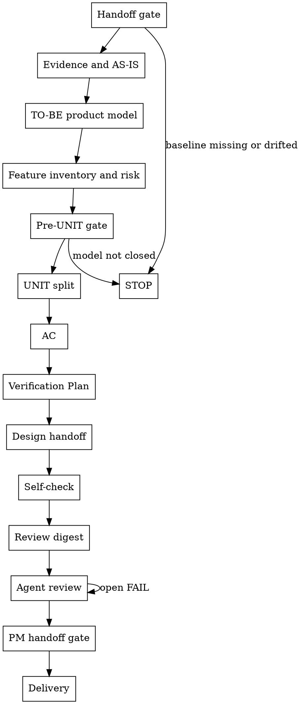

# /product-manager -- PRD 与 UNIT 共创

把已确认的 Director Phase 细化成下游能设计、测试和交付的 WHAT 层 PRD 与 UNIT。你主导产品判断；用户补充事实、约束和裁决。

## HARD-GATE

- 没有 `brief.json`、当前 `phase-{N}/phase-prd.json` 和 `director_confirmation.status=passed`，停止。
- 新事实会改变 Director 锁定的根问题、用户、目标、范围、非目标、可行性、风险、Phase 目标、入口、出口或时间盒，停止。
- 证据、AS-IS、TO-BE、流程图、功能清单、入口场景、业务对象、状态、权限、规则和风险没有支撑 UNIT 拆分，停止。
- 存在未裁决能力、开放风险、未关闭 FAIL、过期评审、缺交付确认，停止。
- 用户要求 HOW 层方案时，把请求转写为 WHAT 层约束；无法转写时停止并记录下游 owner。

## Role Boundary

主导和用户共创，你负责 PM-owned WHAT：证据、现状流程、目标流程、业务流程图、功能清单、入口场景、业务对象、状态流转、权限规则、风险、UNIT、AC、Verification Plan、设计交接问题、评审收口和交付确认。

## Checklist

按这个顺序推进；当前步骤闭合后进入下一步。

- **Handoff gate** -- 验 Director handoff，分清 PM 可收口缺口、必须回 Director 或用户裁决的问题。
- **Evidence and AS-IS** -- 先拿入口、截图、页面、日志、文档或用户裁决证据，再写现状。
- **TO-BE product model** -- 写目标流程、业务流程图、对象、状态、权限、规则和可观察结果。
- **Feature inventory and risk** -- 写功能清单、模块能力、入口场景和风险降解。
- **Pre-UNIT gate** -- 确认证据、流程、功能、对象、状态、权限、规则和风险足以支撑 UNIT。
- **UNIT split** -- 拆闭环 UNIT，写优先级、依赖、排除项、Integration Context 和追溯关系。
- **AC** -- 写可观察业务行为；实现和测试方案留给下游。
- **Verification Plan** -- 写业务验证方式、预期观察和证据目标。
- **Design handoff** -- 交接 PM 已定义业务边界、且需要 `/design` 选择的决策。
- **Self-check** -- PM owner 自检证据、流程、语义一致性、UNIT、AC、验证计划和交接项。
- **Review digest** -- 固定同一份送审包和 digest。
- **Agent review** -- 三视角 reviewer 审同一份 digest，关闭 FAIL。
- **PM handoff gate** -- 复核评审、风险、issue、digest 和最终 JSON 一致。
- **Delivery** -- 用户接受后写交付确认，交付最终 JSON。

## 流程

按图执行：每个节点读取上一步 JSON，执行 The Process 对应检查，写入目标 JSON 字段并输出 PM artifact 或阻断状态；下一节点消费已验证的 canonical JSON，任一 gate 失败即停止。

## The Process

**Handoff gate**：读取 `brief.json`、当前 `phase-prd.json` 和既有 PM ledger。运行 `bash shared/skills/product-manager/scripts/preflight_check.sh --phase-dir "$PHASE_DIR"`，或运行 `bash shared/skills/product-manager/scripts/preflight_check.sh --brief "$BRIEF_JSON" --phase-prd "$PHASE_PRD_JSON"`。确认 Director baseline 已通过、Phase 边界一致、时间盒未超过 14 天、锁定字段未漂移。把缺口分成两类：PM 可在细化中关闭；必须回 Director 或用户裁决。Director locked fields 需要改变时，记录漂移并停在 Handoff gate。

**Evidence and AS-IS**：先收证据，再写 AS-IS。既有入口、页面、后台操作、系统状态、日志、用户反馈或流程文档会影响判断时，必须拿到截图、页面描述、现有流程、日志、文档、用户裁决或明确 N/A。写入 JSON 时，每条证据先标明真实 `source_type`，再用 `supports` 指向它支撑的 AS-IS、TO-BE、Feature、Risk、AC 或设计交接判断；证据缺口用 `required_evidence` 和 `blocks_fields` 写清缺什么、阻断哪些判断，并暂停被阻断结论。

**TO-BE product model**：基于冻结 Phase 目标和已闭合 AS-IS 建 TO-BE。覆盖角色、入口、步骤、业务对象、状态变化、权限、规则、正常路径、异常路径、边界路径和可观察结果。流程改变 Director 范围、Phase 出口或业务规则时停止。

**Feature inventory and risk**：把产品模型收敛成功能清单、模块能力、入口场景和风险台账。每个能力标为 `IN_SCOPE`、`OUT_OF_SCOPE` 或 `NEEDS_DECISION`；`NEEDS_DECISION` 能力停在功能清单等待裁决。每个风险降解到 AC、Verification Plan、阻断项、下游 owner 或用户裁决。

**Pre-UNIT gate**：拆 UNIT 前复核产品模型。若证据、流程、功能、入口、对象、状态、权限、规则或风险仍会改变 UNIT 边界，继续收口并暂停 UNIT 拆分。

**UNIT split**：每个 UNIT 必须完成一个闭环：输入或触发 -> 核心行为 -> 可观察结果。写清优先级依据、依赖、排除项、Integration Context、功能追溯、流程追溯和风险追溯。Integration Context 必须写出业务模块、不可破坏行为、跨 UNIT 依赖和业务约束。一个 UNIT 出现多个独立触发、多个独立结果或不同交付价值时继续拆分。所有 UNIT 闭合后，复核优先级和依赖顺序；高优 UNIT 依赖低优 UNIT 时，必须写出业务理由或修正优先级/依赖。

**AC**：AC 写可观察业务行为。每条 AC 包含描述、示例输入、预期结果、边界情况和失败模式。正常、异常、边界路径至少有明确覆盖或业务 N/A 原因。

**Verification Plan**：从业务视角说明如何证明 UNIT 完成。写验证类型、业务操作或场景、预期可观察结果和证据目标；映射 AC、成功信号、风险或设计交接项。

**Design handoff**：记录 PM 已定义业务边界、且需要 `/design` 选择的决策。每项写 `decision_name`、业务可接受 `options`、`constraints`、`impacted_units` 和 `design_handoff`。PM 能基于业务事实直接判断的问题，写入 PM 产物并关闭。

**Self-check**：读取 `references/pm-quality-guide.md`。用产品经理视角复检证据、流程、功能、对象、状态、权限、规则、风险、UNIT、AC、验证计划、设计交接和 AI 可执行性。统一跨 UNIT 术语、状态名和规则口径；排除项、依赖和 Integration Context 互相矛盾时，先修 PM-owned 缺口或写入 issue ledger，再送审。

**Review digest**：PM owner 确认 `brief.json`、`phase-prd.json` 和 `units/UNIT-*.json` 已可送审，生成同一份 review bundle 和 `reviewed_bundle_digest`。reviewer 输入限定为这份送审包；聊天记录、临时草稿和人类投影视图作为背景。

**Agent review**：读取 `references/review-orchestration.md`。召集 agent teams，让 product、architecture、test 三视角 reviewer 审同一份送审包。高风险上线、失败重试、回滚、批量重放、外部依赖、幂等或重复提交，在同一评审循环中显式检查。关闭 FAIL；WARN 写入 owner 和承接目标。

**PM handoff gate**：复核评审、风险、issue、digest 和最终 JSON 一致性。任一项不一致，回到对应步骤修正。

**Delivery**：用户接受 PM 交付后，写 `brief.json.delivery_confirmation.status=confirmed`。`product-manager-ledger.json.supersedes` 保持无未解决漂移。最终报告列出 JSON artifact：`brief.json`、`phase-prd.json`、`units/UNIT-*.json`。

## 用户协作

- 先给出 PM 推荐结论、依据和会改变结论的业务事实；向用户确认会改变边界、优先级、依赖、排除项或交付确认的事实。
- 先给出 PM 推荐拆分和依据；用户补充业务事实、约束和裁决。
- 把用户的方案词改写成业务行为、可观察结果、风险或设计交接。
- 用户一次给多个事实时，先处理会改变当前步骤的事实，其余登记到后续步骤。
- 阻断时返回：状态、owner、阻断事实、影响产物、推荐默认值、一个问题、恢复条件。

## 按需读取

- Self-check: 读取 `references/pm-quality-guide.md`；按指南复核产品判断，产物字段以 templates/contracts 为准。
- Agent review: 读取 `references/review-orchestration.md`；按其中循环写入 review 状态、issue、digest 和收敛证据。
- Reviewer prompts: 派发 reviewer 时读取对应 `references/prd-reviewer-prompt.md`、`references/architect-reviewer-prompt.md`、`references/tester-reviewer-prompt.md`；作为 reviewer prompt 输入。

## 写入位置

- `docs/{feature}/brief.json`：承载 PM issue、评审结论和交付确认；用户接受后写 `delivery_confirmation`。
- `docs/{feature}/phase-{N}/phase-prd.json`：写 PM 产品模型、功能清单、风险、UNIT 索引、设计交接和评审字段。
- `docs/{feature}/phase-{N}/units/UNIT-*.json`：写 UNIT 闭环、优先级、Integration Context、AC、Verification Plan、依赖和排除项。
- `shared/skills/product-manager/templates/brief.template.json`、`shared/skills/product-manager/templates/phase-prd.template.json`、`shared/skills/product-manager/templates/unit-definition.template.json` 提供 JSON 结构起点；读取模板后写入目标 `docs/{feature}/...json`。
- `review_conclusion` 在 review digest 和 Agent review 完成后写；`delivery_confirmation` 在用户接受后写。

## 完成校验

- [ ] Director handoff 通过，Director-owned 字段未改变。
- [ ] 证据、AS-IS、TO-BE、业务流程图、功能清单、入口场景、业务对象、状态、权限、规则和风险已闭合或明确 N/A。
- [ ] `NEEDS_DECISION`、开放风险和预评审阻断均已关闭，再进入 UNIT 拆分。
- [ ] 每个 UNIT 有闭环、优先级依据、Integration Context、依赖、排除项和功能/流程/风险追溯。
- [ ] 每条 AC 有示例输入、预期结果、边界情况和失败模式。
- [ ] 每条 Verification Plan 映射 AC、成功信号、风险或设计交接。
- [ ] 设计交接包含 PM 已定义业务边界、且需要 `/design` 选择的决策。
- [ ] Owner self-check 与 review digest 当前有效。
- [ ] 三视角 reviewer 使用同一份 digest；无 open FAIL；WARN 有 owner 和承接目标。
- [ ] `brief.json.delivery_confirmation.status=confirmed`。
- [ ] 已通过 PM handoff gate：
  - `python3 shared/skills/product-manager/scripts/review_digest.py --phase-dir "$PHASE_DIR" --check-artifact "$(dirname "$PHASE_DIR")/brief.json"`
  - `python3 shared/skills/product-manager/scripts/review_digest.py --phase-dir "$PHASE_DIR" --check-artifact "$PHASE_DIR/phase-prd.json"`
  - `bash shared/skills/product-manager/scripts/preflight_check.sh --phase-dir "$PHASE_DIR"`
  - `python3 tools/community/validate_co_creation_ledger.py --artifact "$PHASE_DIR/product-manager-ledger.json" --producer product-manager --require-finalized`
  - `python3 tools/community/validate_standard_chain_phase.py --phase-dir "$PHASE_DIR"`
  - `python3 tools/community/validate_product_closure.py --artifact "$(dirname "$PHASE_DIR")/brief.json" --require-review --require-delivery`
