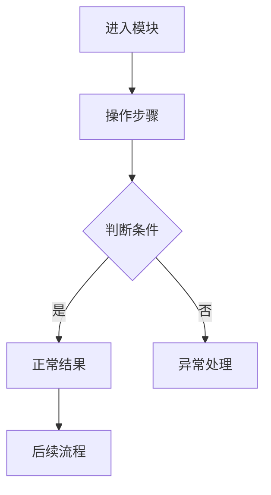

# Phase {N}: [阶段目标]

## 阶段目标

[从 Director D-S6 继承]

## 入口与出口条件

[从 Director D-S6 继承]

## 业务流程

[M-S1 共创成果：按子模块/子流程画 Mermaid 图，每个核心流程一张图]

<!-- 示例格式（实际使用时删除本注释块）：

要求：
- 每个子模块/核心流程一张独立的 Mermaid 图
- 用 flowchart TD（从上到下）或 flowchart LR（从左到右）
- 关键判断用菱形节点 {判断条件}
- 跨模块依赖用虚线 -.->
-->

### 流程协同规则

[跨模块/跨流程的协同规则，如"储备客户承担线索经营；签约后转入成交客户模块建档"]

## 页面清单与组装视图

[M-S2 共创成果：页面→UNIT 映射。有 UI 的产品必填；纯后端/CLI/API 产品标注 N/A 并说明原因]

### 通用交互规范

[跨页面的通用 UX 规则，有 UI 的产品必填]

| 编号 | 规范 | 说明 |
|------|------|------|
| UX-01 | 必填标识 | 必填项以 `*` 标识，未通过校验时在字段级展示错误提示 |
| UX-02 | 写操作确认 | 关键写操作必须显式确认，操作后返回成功或失败结果 |
| UX-03 | 分页规范 | 列表页支持分页，展示当前页、总页数和总记录数 |
| UX-04 | 敏感信息 | 敏感字段默认脱敏展示，完整信息仅在受控场景按权限查看 |

> 以上为起始项，按产品实际情况增删。

### 页面清单表

| 页面ID | 页面名称 | 路由 | 承载 UNIT | 核心交互 |
|--------|---------|------|----------|---------|

### 页面跳转与联动关系

| 来源页面 | 触发动作 | 目标页面/弹窗 | 关系类型 | 说明 |
|---------|---------|-------------|---------|------|

### 页面状态要求

| 状态 | 适用页面 | 表现要求 |
|------|---------|---------|
| 初始加载 | | 展示页面级加载状态，禁止空白页 |
| 查询中 | | 展示区域级 loading，防止重复点击 |
| 空状态 | | 显示"暂无数据"提示，保留筛选区 |
| 查询失败 | | 显示错误提示，提供重试入口 |
| 无权限 | | 隐藏按钮或提示无权限 |
| 提交成功 | | 明确反馈成功结果 |
| 提交失败 | | 明确反馈失败原因，保留上下文 |

## 角色权限矩阵

[M-S3 共创成果：结构化权限定义。多角色系统必填；单用户/无权限区分的产品标注 N/A 并说明原因]

| 角色 | [模块1] | [模块2] | ... |
|------|---------|---------|-----|

## 功能清单

### 优先级定义

| 优先级 | 定义 |
|--------|------|
| P0 | 核心链路必备，缺失将直接影响业务闭环 |
| P1 | 重要支撑能力，缺失会影响效率或数据完整性 |
| P2 | 辅助能力，用于优化体验和后续管理 |

### 模块能力矩阵

| 模块 | 查询 | 新增/登记 | 详情 | 记录查看 | 批量操作 | 导出 |
|------|------|----------|------|---------|---------|------|

### 功能清单表

| ID | 功能名称 | 优先级 | 端 | 描述 | 对应 UNIT |
|----|---------|--------|---|------|----------|

> - ID 命名规范：`F-{模块缩写}-{序号}`，如 `F-CM-001`
> - 优先级：P0 / P1 / P2（见上方定义）
> - 端：前端 / 后端 / 全栈

## 功能需求（UNIT 索引）

| UNIT | 标题 | 闭环目标 | 优先级 | 依赖 | 定义文件 |
|------|------|----------|--------|------|----------|
| [UNIT-ID] | [功能标题] | [输入/触发 -> 核心行为 -> 可观察结果] | [MVP/增强/扩展] | [无 / UNIT-N] | [units/UNIT-N.json] |

## Integration Context（集成上下文）

| UNIT | 业务模块/功能区域 | 不可破坏的现有行为 | 跨 UNIT 依赖 | 业务约束说明 |
|------|------------------|----------------------|---------------|--------------|
| [UNIT-ID] | [如权限/订单/线索；无则 N/A] | [现有流程/权限/数据口径] | [无 / UNIT-N] | [WHAT 层约束，不写技术落点] |

## Verification Plan（验证计划）

| UNIT | 验证类型 | 业务操作或场景 | 预期可观察结果 | 对应 AC / 成功标准 / 风险项 |
|------|----------|----------------|------------------|-----------------------------|
| [UNIT-ID] | [功能/数据/流程/权限/风险验证] | [用户或系统执行的业务动作] | [页面反馈/状态变化/记录/阻断结果] | [AC-U1-01 / success_signal / risk-id] |

## 业务对象状态与枚举

[有状态流转的业务对象必填；无状态对象标注 N/A 并说明原因]

| 对象 | 状态/枚举 | 值列表 | 流转规则 | 说明 |
|------|----------|--------|---------|------|

## 字段校验矩阵

[有表单输入的产品必填；无表单的产品标注 N/A 并说明原因]

| 业务场景 | 字段 | 必填 | 校验规则 | 失败提示方向 |
|---------|------|------|---------|------------|

## 高风险操作清单

[有写操作/批量操作的产品必填；只读产品标注 N/A 并说明原因]

| 操作 | 模块 | 风险点 | 前端控制 | 后端控制 | 日志要求 |
|------|------|--------|---------|---------|---------|

## 验收标准

### 功能验收

| PRD编号 | 功能 | 验收条件 | 优先级 | 验证方式 |
|---------|------|---------|--------|---------|

### 流程验收

| 流程 | 验收项 | 验收标准 |
|------|--------|---------|

### 安全验收

| 类别 | 验收项 | 验收标准 |
|------|--------|---------|

## QA 测试重点

| 类别 | 测试重点 |
|------|---------|
| 页面功能 | 各模块入口、列表查询、分页、视图切换、弹窗交互 |
| 表单校验 | 必填项校验、格式校验、日期/金额/数量合法性 |
| 记录联动 | 详情页与列表页数据一致、扩展页签联动展示 |
| 视图区分 | 不同状态视图、不同台账视图的数据隔离与准确性 |
| 高风险操作 | 批量操作确认机制、操作结果回执、日志留痕 |
| 权限控制 | 不同角色可见模块、按钮、敏感信息范围正确 |
| 安全控制 | 敏感字段脱敏展示、越权访问拦截 |
| 异常处理 | 无数据、接口失败、分页越界、同步失败的降级处理 |

> 以上为起始项，按产品实际情况增删。
