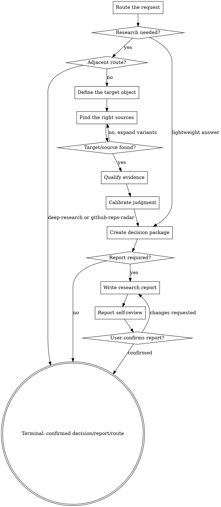

# /research -- Source Targeting And Team Judgment

> ultrathink

/research 用在团队可能基于外部信息行动之前。它先找准资料/对象，再判准团队判断：prove the source or object is the right one, qualify the evidence, then turn it into a calibrated, challengeable, actionable team judgment.

## HARD-GATE

<HARD-GATE>
Do NOT calibrate judgment until source/object targeting is complete.
Do NOT treat a similar name, mirror, directory page, or secondary summary as the target object.
Do NOT turn an authority, popularity signal, README, benchmark, blog post, or directory listing into a conclusion; first convert it into verifiable claims and evidence tiers.
Do NOT recommend, reject, adopt, exclude, or route downstream without strongest support evidence, strongest opposing challenge, failure conditions, and open verification items.
Do NOT call formal research complete until `docs/{feature}/research-report.md` exists, Report Self-Review passes, and the user confirms the report.
Do NOT continue inside research when the request belongs to `github-repo-radar` or `deep-research`; route explicitly and stop.
</HARD-GATE>

## Anti-Pattern: "The First Relevant Result Is The Right Source"

The first plausible source is often the wrong object, a stale mirror, a directory page, or a secondary summary. Research does not start by judging; it starts by proving that the target object and source set are the right ones. A judgment built on the wrong object is worse than no judgment.

## When to Use

Use `/research` when the user asks for help before the team may believe, adopt, reject, compare, learn, reuse, or write an external object into a plan.

Typical triggers:

- "这个东西能不能用？" -- adoption judgment for a tool, library, method, product, MCP, plugin, skill, package, or repo.
- "这几个选哪个？" -- candidate selection where alternatives must be found, narrowed, compared, and challenged.
- "这个说法靠谱吗？" -- claim, article, method, best-practice, or proposal analysis.
- "这个到底是哪一个？" -- community object identification when names, owners, mirrors, packages, or repos may be confused.
- "我倾向 X，帮我把把关。" -- judgment review before a preference enters team planning.
- "做方案前先看看外面怎么做。" -- external-solution scouting before product, design, technical, or implementation work.

Use it only when the answer must become a team judgment, not merely an explanation.

## When NOT to Use

- Simple facts or definitions: answer directly.
- Plain summaries: summarize directly unless the user asks whether the claims are reliable or adoptable.
- Breaking news or latest status without team action: search and answer, but do not open full research.
- Broad long-horizon research, industry reports, 横纵分析, or PDF-style deliverables: route to `deep-research`.
- GitHub repo adoption state such as `discard/watch/trial/deep-read/contribute/adopt`: route to `github-repo-radar`.
- Work already ready for product/design/tech-lead/developer execution: hand off to the relevant downstream skill.

## Checklist

You MUST complete these items in order:

1. **Route the request** -- decide whether this is lightweight answer, `/research`, `deep-research`, `github-repo-radar`, or downstream execution.
2. **Define the target object** -- identify whether the target is a tool, candidate set, claim, article, method, trend, community object, or existing judgment.
3. **Find the right sources** -- produce a Source Targeting Package with name variants, upstream/official source, mirror/directory deduplication, excluded lookalikes, and freshness / timestamp.
4. **Qualify evidence** -- label evidence as official/source code, release notes, benchmark, real usage case, issue/discussion, directory/popularity signal, or opinion piece.
5. **Calibrate judgment** -- convert evidence into support, opposition, applicability boundary, failure boundary, confidence, and reversal condition.
6. **Create decision package** -- deliver the current judgment, decisive reason, source targeting result, strongest evidence, strongest challenge, flip condition, and next action.
7. **Write report when required** -- write `docs/{feature}/research-report.md` only for formal report / 留档 / 团队评审 / 审计 requests.
8. **Report self-review** -- scan for wrong source, stale source, missing opposition, weak evidence tier, overclaimed confidence, wrong profile, and missing next action.
9. **User confirmation or route handoff** -- ask for confirmation only when formal report, scope change, cost change, or downstream handoff is involved.

## Process Flow

## Quick Triage And Routing

Use lightweight triage when the user asks "怎么看", "值不值得正式调研", "下一步用哪个 Skill", or "要不要开完整 research". 轻量预判断不是 /research 完成，不为轻量预判断强制落盘 research-report.md。

Lightweight triage 只输出最小决策包：

- 推荐路径：继续轻量答复、进入正式 `research`、路由 `github-repo-radar`、路由 `deep-research`、或等待用户补范围。
- 当前依据：用户目标、对象类型、资料定位风险、证据缺口、相邻 Skill 边界。
- 下一步：一个可执行动作；若要进入正式报告，确认调研范围、关注维度和 feature 目录。

Routing rules:

- GitHub 仓库发现、评估、比较、学习、贡献、采用，且需要 `discard/watch/trial/deep-read/contribute/adopt` 动作状态 -> `github-repo-radar`。
- 用户显式调用 `$deep-research`，或要求 Deep Research / 深度研究 / 横纵分析 / 历时共时分析 / Markdown + PDF 报告 -> `deep-research`。
- 采用判断、候选取舍、观点吸收、对象识别、已有判断复核、外部方案理解 -> 留在 `research`。

正式报告收口 requires Step 7 report writing, Report Self-Review, and user confirmation.

## The Process

**Route the request:** Ask whether the user needs information, a source/object identity, or a team judgment. If no team action may follow, answer directly. If the work is broad long-form research, route to `deep-research`. If the work is repo adoption-state management, route to `github-repo-radar`.

**Define the target object:** Name the object being judged before searching deeply. It may be a tool, library, framework, product, MCP, plugin, skill, package, repo, article, method, best practice, competitor behavior, trend, candidate set, or existing recommendation. If this is unclear, ask one missing question.

Also choose `presentation_profile` before final output:

- `decision`: 调研目的 is a near-term decision; 目标读者 needs the answer first; 读后动作 is adopt, reject, pilot, wait, or route.
- `understanding`: 调研目的 is clear understanding; 目标读者 needs mechanism and boundary first; 读后动作 is learn, monitor, or narrow scope.
- `audit`: 调研目的 is evidence review; 目标读者 needs source coverage and challenge first; 读后动作 is accept, revise, or reopen judgment.

When profile routing is unclear, read `references/report-presentation-framework.md`.

**Find the right sources:** Build a Source Targeting Package before judgment:

- Target object and aliases.
- name variants: spaces, hyphens, joined words, owner/namespace, command name, package name, repo name.
- upstream/official source.
- mirror/directory deduplication.
- excluded lookalikes.
- source freshness / timestamp.
- remaining source blind spots.

For community object identification, do not stop at the first plausible hit. Name variants and excluded lookalikes are mandatory.

**Qualify evidence:** Evidence Qualification must separate evidence strength:

- Strong: official docs, source code, changelog/release notes, accepted standards, reproducible benchmark, production usage case.
- Medium: maintainer issue/discussion, migration guide, ecosystem integration, credible technical article with primary references.
- Weak: directory listing, stars/downloads, marketing copy, unverified benchmark, unsourced blog opinion, social proof.

Weak evidence can explain interest; it cannot justify adoption by itself.

When a candidate or claim needs more than a one-line evidence summary, read `references/evidence-package-guide.md` and create an evidence package before calibrating judgment.

**Calibrate judgment:** Judgment Calibration turns evidence into a bounded conclusion:

- Current judgment.
- Confidence level and why.
- Decisive reason.
- Strongest support evidence.
- Strongest opposing challenge.
- Applicability boundary.
- Failure boundary.
- Reversal / flip condition.
- Open verification item.

**Use agent teams carefully:** agent teams 只用于 Step 2/3/5 的多策略候选穷举、候选深挖和 challenger 挑战. 召集 agent teams only after the target object and route are clear. Give every member fixed input, evidence requirements, output format, and no-overreach rules. Members must not share conclusions before producing independent evidence.

**Create decision package:** Decision Package is the default output. It is not a report. It must include:

- Source Targeting Package summary.
- Evidence Qualification summary.
- Current judgment: adopt / conditionally adopt / reject / learn / monitor / needs more evidence.
- Confidence.
- Decisive reason.
- Strongest opposition.
- Reversal condition.
- Next smallest action.

For `decision`, decision 输出首屏必须包含：当前判断、决定性理由、最大风险和下一步. If project constraints are missing, label the output as a general observation, not a recommendation.

## 研究判断动作合同

- 候选机制：每个候选必须写清：解决什么问题、核心机制、适用边界和失效边界。
- 资料定位：每个外部对象必须写清上游来源、名称变体、镜像/目录去重、排除对象和时间戳。
- 证据绑定：每个论断必须绑定可追溯证据源；无源论断只能进入待验证项。
- 证据分级：弱证据只能解释关注度，不能单独支撑采用判断。
- 论点挑战：每个关键判断必须写最强支持证据、最强反方挑战和结论翻转条件。
- 项目约束：每个推荐必须引用项目约束；缺少项目约束时只能标为通用观察，不得作为推荐。

## Report Writing

Write `docs/{feature}/research-report.md` only when the user asks for a formal report, retention, team review, auditability, or a long-form research artifact. The report must state `调研模式` and `呈现模式`, then use source targeting -> evidence qualification -> judgment -> audit progressive disclosure.

Template routes:

- Use `projections/research-report-template.md`.
- Select one profile header: `decision`, `understanding`, or `audit`.
- Select one mode body: `selection`, `analysis`, or `discovery`.
- Always keep shared audit appendix, Report Self-Review, and User Confirmation Gate.
- Do not recreate split header/body/appendix projection files.

## Report Self-Review

After writing the report, review it before asking the user to confirm:

1. **Source scan:** target object, source variants, upstream source, excluded lookalikes, freshness, and blind spots are explicit.
2. **Evidence scan:** every key claim has a traceable source, timestamp, and evidence tier.
3. **Challenge scan:** every key judgment includes strongest support, strongest opposition, and failure boundary.
4. **Scope scan:** the report answers the confirmed scope and does not expand into unconfirmed dimensions.
5. **Profile scan:** first screen matches `decision`, `understanding`, or `audit`.
6. **Action scan:** next step is executable and tied to project constraints; missing constraints are marked as general observation.

Fix self-review failures inline before asking for confirmation.

## User Confirmation Gate

For lightweight triage, ask the user to confirm the recommended path only when the next step changes scope, cost, or skill route.

For formal reports, ask the user to review `docs/{feature}/research-report.md`. If the user requests changes, update the report and rerun Report Self-Review. Do not claim formal research complete until the user confirms.

## Terminal State

The terminal state is either a confirmed lightweight decision package, a user-confirmed research report, or an explicit route to an adjacent skill.

The ONLY allowed next action after a completed formal research report is the user-confirmed handoff target. Do not silently continue into design, planning, implementation, `github-repo-radar`, or `deep-research`.

## 警示信号

出现以下想法时立刻停下：

- "第一个结果看起来相关" → STOP. 先做名称变体、上游来源、镜像去重和排除证明。
- "列一下主流方案让用户自己选" → STOP. 收敛到 TOP 3，并解释淘汰项和复活条件。
- "这个方案很流行所以推荐" → STOP. 用证据等级、项目约束和失效条件评估适配度。
- "官方/权威这么说，所以可以采纳" → STOP. 抽成可验证论点，再找反方挑战和适用边界。
- "简单介绍下优缺点就够了" → STOP. 交付 Source Targeting、Evidence Qualification 和 Decision Package。
- "调研完直接给结论" → STOP. 结论必须带置信度、翻案条件和下一步动作。
- "多个目录站都指向它，所以可以算独立证据" → STOP. 回溯上游仓库/文档并对镜像去重。
- "这个名字看起来像，所以先按它收敛再慢慢修" → STOP. 先证明目标对象，不能把相似对象当目标。

## Completion Check

- [ ] Route is correct: direct answer, `/research`, `deep-research`, `github-repo-radar`, or downstream skill.
- [ ] Target object is explicit.
- [ ] Source Targeting Package exists: variants, upstream/official source, deduplication, excluded lookalikes, freshness / timestamp, blind spots.
- [ ] Evidence Qualification labels strong/medium/weak evidence.
- [ ] Current judgment includes confidence, decisive reason, strongest support, strongest opposition, boundary, flip condition, and next action.
- [ ] Weak evidence is not used as sole adoption support.
- [ ] Project constraints are cited for recommendations; missing constraints are marked as general observation.
- [ ] Formal report, when required, exists at `docs/{feature}/research-report.md`, passes Report Self-Review, and is user-confirmed.
