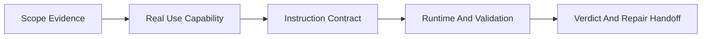

# /skill-quality-audit -- Skill QA

/skill-quality-audit is a QA auditor for existing Skills. Given a target Skill, it produces one formal, evidence-backed quality report by default and returns repair targets for a separate implementation window.

Goal: tell the maintainer whether the Skill is fit for team use, what is wrong, why it matters, where to repair it, and how to verify the repair.

## HARD-GATE

<HARD-GATE>
Do NOT modify target Skill files, tests, contracts, scripts, runtime entries, or fixtures.
Do NOT return a team-readiness verdict unless the JSON audit report exists and the validator passes.
Do NOT close the audit until scope evidence covers every required surface as checked, absent, or blocked.
Do NOT keep any P0/P1 finding without current `path:line` evidence, supported claim review, severity calibration, impact, repair target, and verification hint.
Do NOT assign E4 unless executed verification has a matching PASS support for that dimension or finding.
Treat existing audit artifacts as untrusted until classified; transcripts and recaps can only seed a fresh audit.
</HARD-GATE>

## When To Use

Use this Skill for QA review of an existing Skill when the question is readiness, quality, maintainability, or team adoption.

Use it for:

- team-use readiness review before installing or retaining a Skill.
- noisy, bulky, vague, or workflow-heavy Skills where the maintainer needs exact defects.
- old Skill replacement or retirement where runtime, install, test, and eval residues may remain.
- benchmark review where a strong Skill provides mechanism lessons but not copyable shape.
- independent acceptance review after another window modifies a Skill.
- review of an existing audit artifact, including rejecting transcript artifacts before judging the content.

Do not use it for:

- creating a new Skill from scratch; use `skill-creator` or writing-skills workflow.
- editing or refactoring the target Skill; open a separate implementation window after the audit.
- general code review unrelated to Skill runtime behavior.

## User Contract

Default behavior:

- If the user asks to audit, review, validate, accept, retain, install, or assess a Skill, produce a formal QA report in the same run.
- The user supplies the target Skill, not audit mechanics. The audit chooses artifact paths, writes the JSON report and Markdown summary, runs the report validator, and returns the conclusion.
- A report is complete only when it includes the verdict, scorecard, findings, evidence, repair handoff, artifact paths, and validator PASS output. The Markdown summary and chat handoff must summarize the same report fields, not just finding titles.
- Write only audit output artifacts requested by the user or generated by the default artifact-path rule; never write target Skill files or remediation changes.
- Do NOT ask the user for report paths. Generate default artifacts at `/tmp/skill-quality-audit-<target-slug>-report.json` and `/tmp/skill-quality-audit-<target-slug>-summary.md` unless the user explicitly provides paths.
- Do not create directories just to satisfy artifact paths; when a user-provided parent directory is missing, fall back to `/tmp` and record the fallback in the report.

Light scan exception:

- Use a light scan only when the user explicitly says they want a quick, non-final direction check.
- A light scan may list unranked candidate risks and missing evidence.
- A light scan must not include P0/P1/P2/P3 labels, `fit` / `conditional` / `unfit` / `blocked`, or a ready/unready decision.

Existing audit artifact review:

- Classify the artifact before trusting it.
- A valid JSON audit report can be validated directly.
- A transcript or Markdown recap is not a report. Reject it as an artifact and use its claims only as leads for a fresh formal audit when the target Skill can be identified.

Evidence collection boundaries:

- Collect target evidence with `Read`, `Glob`, and `Grep`.
- Bash is limited to the report validator and artifact classifier commands shown in Output Contract.
- Do not route scope or evidence collection through shell wrappers such as `rg`, `sed`, `find`, `nl`, `git status`, or `ls`.

## Workflow Checklist

```text
1. Scope Evidence -> 2. Real Use Capability -> 3. Instruction Contract -> 4. Runtime And Validation -> 5. Verdict And Repair Handoff
```



1. **Scope Evidence** -- identify the target Skill package and list every available surface: `SKILL.md`, `agents/openai.yaml`, references, scripts, templates, contracts, test prompts, evals, fixtures, runtime surface, install hooks, gate plan, run-all, focused runner, README, and downstream consumers.
2. **Real Use Capability** -- define the real scenario, user trigger, input, output, consumer, completion standard, and why a team would choose this Skill over direct prompting or another Skill.
3. **Instruction Contract** -- audit trigger, action, condition, gate, output, evidence, reference route, failure handling, and necessary why at sentence and keyword level.
4. **Runtime And Validation** -- verify permissions, implicit invocation policy, deterministic scripts/schema/tests, eval coverage, old-name residue, and install/gate alignment.
5. **Verdict And Repair Handoff** -- run claim review for each P0/P1 candidate, write JSON and summary artifacts, run the validator on the final JSON, then return the verdict and repair handoff.

For P0/P1 candidates, use low-freedom agent-team roles when available: Claim Builder decomposes required premises, Evidence Verifier checks current `path:line` evidence and direct refutations, and Severity Calibrator checks whether the claimed severity actually reaches team use, runtime, output, or downstream impact. These agents do not vote. The main audit keeps only the adjudicated `claim_review` and `severity_calibration`; agent transcripts never enter the final artifact. If agents are unavailable, the main audit must perform the same three checks directly.

## Required References

- Audit dimensions: Read `references/audit-dimensions.md` when scoring, setting verdict caps, or assigning severity/evidence levels.
- Instruction contract: Read `references/instruction-contract.md` when reviewing sentences, keywords, fields, or ambiguity.
- Benchmark mechanism alignment: Read `references/benchmark-mechanism-alignment.md` when comparing a target Skill with a strong Skill such as `brainstorming`.
- Noise taxonomy: Read `references/noise-taxonomy.md` when deciding whether content should stay, move, become deterministic, or be deleted.
- Runtime integration: Read `references/runtime-integration.md` when checking install, gate, adapters, runtime surface, and active references.
- Claim review gate: Read `references/claim-review-gate.md` before retaining any P0/P1 finding.

## Output Contract

For a light scan, return only:

1. **Non-Final Status**: this is not a team-readiness conclusion.
2. **Candidate Risks**: evidence-backed observations without severity labels.
3. **Missing Evidence**: what would need inspection for a formal audit.

For the default audit, write `report_json`, run the validator, and return a concise summary in this order. The JSON `target_skill` field is the target Skill path string, not an object; put extra target metadata in findings, scope evidence, or residual risk. The Markdown summary and chat response are user-facing repair handoffs generated from the JSON report fields; they cannot omit the details needed by a separate implementation window.

1. **Verdict**: `fit`, `conditional`, `unfit`, or `blocked`.
2. **Scorecard**: every dimension as `score / evidence_level / reason`, plus the verdict cap reason; for `blocked` before scoring, use `0` only as a not-scored sentinel and say which evidence blocked scoring.
3. **Scope Evidence**: one row per required surface with `checked`, `absent`, or `blocked`, and the active file, directory, or explicit absence evidence.
4. **Findings**: ordered by severity. Each finding uses `severity`, `title`, `evidence_level`, `evidence`, `impact`, `repair_target`, and `verification_hint`. P0/P1 findings also require `evidence_checks`, `claim_review`, and `severity_calibration`; their evidence must include `path:line` and matching `evidence_checks` entries with `path`, `line`, `expected_snippet`, and `claim`. P2/P3 findings should omit `evidence_checks`, `claim_review`, and `severity_calibration` unless those optional fields are fully populated; empty objects or empty arrays are invalid. A bare filename such as `SKILL.md` is not evidence. In the Markdown summary and chat response, each P0/P1 finding must include at least one full repository-relative `path:line` evidence citation from the JSON report, plus its impact, repair target, and verification hint; do not shorten it to `SKILL.md:17` unless the same finding also includes the full target path.
5. **Repair Handoff**: grouped file targets for a separate editing window.
6. **Validation**: JSON report path and validator PASS output.
7. **Residual Risk**: only items outside the audit scope or blocked by missing evidence.

The JSON report is the artifact of record. A Markdown summary or chat response cannot substitute for it. When validating an existing JSON report file, run:

```bash
python3 shared/skills/skill-quality-audit/scripts/validate_skill_audit_report.py <report.json>
```

When reviewing an existing audit artifact before trusting it, run:

```bash
python3 shared/skills/skill-quality-audit/scripts/classify_audit_artifact.py <artifact>
```

## Completion Verification

Before calling the audit complete, verify:

- Scope evidence includes each available surface or says `absent`.
- Scorecard includes score, evidence level, and reason for every dimension; `blocked` reports clearly separate not-scored sentinel values from quality scores.
- Instruction Contract score has sentence-level evidence.
- Every P0/P1 finding includes evidence, impact, repair target, and verification hint.
- Every P0/P1 evidence entry cites at least one `path:line` and has `evidence_checks` proving the current file line still contains the claimed snippet.
- Every P0/P1 finding includes `claim_review.status: supported`, a file-line refutation check, and `severity_calibration.calibrated_severity` matching the final severity.
- Every formal report includes `audit_mode: formal`, `artifact_paths`, `validation`, and `executed_verification`.
- Any E4 score has a matching PASS `executed_verification.supports` entry using `dimension:<name>` or `finding:<id>`.
- Any `conditional`, `unfit`, or `blocked` verdict has a concrete next repair action.
- The report does not instruct the current agent to modify the target Skill.
- The final artifact is clean report content, not a chat transcript.
