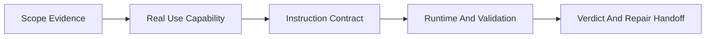

# /skill-quality-audit -- Skill QA

/skill-quality-audit is a read-only QA gate for existing Skills. It proves whether a Skill is ready for team use, scores the defects with evidence, and returns repair targets for a separate implementation window.

Goal: produce an evidence-backed audit report that a maintainer can act on without guessing.

## HARD-GATE

<HARD-GATE>
Do NOT modify target Skill files, tests, contracts, scripts, runtime entries, or fixtures.
Do NOT produce a score-only verdict; every blocking or high-priority issue needs file evidence, impact, repair target, and verification hint.
Do NOT judge output quality before confirming the target Skill's real use scene, consumer, and expected delivery capability.
Do NOT treat a strong reference Skill such as `brainstorming` as a wording template; compare mechanisms only.
Do NOT mark a Skill fit when Instruction Contract score is below 7; below 5 forces `unfit`.
Do NOT close the audit until active runtime, install, tests, evals, references, scripts, templates, and downstream consumers have been included in scope evidence or explicitly marked absent.
</HARD-GATE>

## When To Use

Use this Skill for QA review of an existing Skill when the question is readiness, quality, maintainability, or team adoption.

Use it for:

- team-use readiness review before installing or retaining a Skill.
- noisy, bulky, vague, or workflow-heavy Skills where the maintainer needs exact defects.
- old Skill replacement or retirement where runtime, install, test, and eval residues may remain.
- benchmark review where a strong Skill provides mechanism lessons but not copyable shape.
- independent acceptance review after another window modifies a Skill.

Do not use it for:

- creating a new Skill from scratch; use `skill-creator` or writing-skills workflow.
- editing or refactoring the target Skill; open a separate implementation window after the audit.
- general code review unrelated to Skill runtime behavior.

## Workflow Checklist

```text
1. Scope Evidence -> 2. Real Use Capability -> 3. Instruction Contract -> 4. Runtime And Validation -> 5. Verdict And Repair Handoff
```



1. **Scope Evidence** -- identify the target Skill package and list every available surface: `SKILL.md`, `agents/openai.yaml`, references, scripts, templates, contracts, test prompts, evals, fixtures, runtime surface, install hooks, gate plan, run-all, focused runner, README, and downstream consumers.
2. **Real Use Capability** -- define the real scenario, user trigger, input, output, consumer, completion standard, and why a team would choose this Skill over direct prompting or another Skill.
3. **Instruction Contract** -- audit trigger, action, condition, gate, output, evidence, reference route, failure handling, and necessary why at sentence and keyword level.
4. **Runtime And Validation** -- verify permissions, implicit invocation policy, deterministic scripts/schema/tests, eval coverage, old-name residue, and install/gate alignment.
5. **Verdict And Repair Handoff** -- score dimensions, assign severity and evidence level, explain the verdict cap, and provide repair targets with verification hints.

## Required References

- Audit dimensions: Read `references/audit-dimensions.md` when scoring, setting verdict caps, or assigning severity/evidence levels.
- Instruction contract: Read `references/instruction-contract.md` when reviewing sentences, keywords, fields, or ambiguity.
- Benchmark mechanism alignment: Read `references/benchmark-mechanism-alignment.md` when comparing a target Skill with a strong Skill such as `brainstorming`.
- Noise taxonomy: Read `references/noise-taxonomy.md` when deciding whether content should stay, move, become deterministic, or be deleted.
- Runtime integration: Read `references/runtime-integration.md` when checking install, gate, adapters, runtime surface, and active references.

## Output Contract

Return a concise audit report in this order:

1. **Verdict**: `fit`, `conditional`, `unfit`, or `blocked`.
2. **Scorecard**: 10-point score per dimension and the verdict cap reason.
3. **Scope Evidence**: checked surfaces and missing surfaces.
4. **Findings**: ordered by severity, each with `evidence`, `impact`, `repair_target`, and `verification_hint`.
5. **Repair Handoff**: grouped file targets for a separate editing window.
6. **Residual Risk**: only items outside the audit scope or blocked by missing evidence.

For machine-readable handoff, use `contracts/skill-audit-report.schema.json` and validate with:

```bash
python3 shared/skills/skill-quality-audit/scripts/validate_skill_audit_report.py <report.json>
```

## Completion Verification

Before calling the audit complete, verify:

- Scope evidence includes each available surface or says `absent`.
- Instruction Contract score has sentence-level evidence.
- Every P0/P1 finding includes evidence, impact, repair target, and verification hint.
- Any `conditional`, `unfit`, or `blocked` verdict has a concrete next repair action.
- The report does not instruct the current agent to modify the target Skill.
