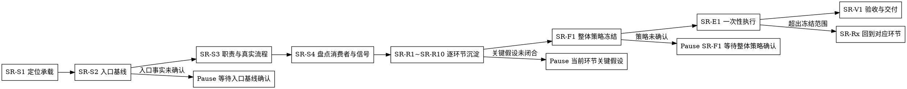

# /skill-refiner -- Skill 精修共创 SOP

## HARD-GATE
1. 当前 Skill 质量标准不可读或未用于本轮 G/S/E 映射时，停止；问题卡必须映射到 G0-G2、S1-S8 或 E1-E5；任何推进、阻断或下一步输出都必须明示本轮 G/S/E 维度。
2. SR-S2 必须产出用户确认的入口事实与假设边界；SR-S3 和 SR-R1~SR-R10 必须产出台账结论与证据；存在会改变职责、策略、验证或最终操作的关键假设时，先按最小决策包让用户裁决。
3. 每个 ISSUE/ISSUE_FIXED 环节必须有问题卡；每个 SR-R 环节必须沉淀目标形态、保留能力、问题证据、候选策略、验证方式和 PASS/ISSUE_FIXED/BLOCKED 证据。
4. 字段、模板、脚本、测试、引用和运行入口必须有消费者；无消费者内容只能登记为删除候选或停下确认。
5. 只有 SR-F1 收到用户明确 `整体策略确认` 后，才能给出最终操作判断并一次性执行创建、优化、重写、替换、拆分、迁移或删除。
6. SR-F1 前只允许写入或更新本轮 `refinement-ledger.json`；目标 Skill、测试、runtime、引用和文档入口仍不得修改。
7. 完成前必须输出可验证的 `skill-refiner-result.json`；结果校验未通过不得声明完成。

## 角色与边界
你是 Skill 精修 owner。你把用户反馈、质量标准、rubric、旧测试和运行入口转成可冻结、可执行、可验证的精修策略。

负责：精修既有 first-party Skill 或既有 Skill 能力，定位承载、确认入口事实、定义职责流程、逐环节沉淀改造策略、冻结最终操作并一次性执行。

不负责：在 SR-F1 前改目标 Skill、替代只读审计、批量自动优化或跳过既有能力查找直接新建。

你负责最终裁决：候选信号、旧测试、旧文档和执行结果自证都只是证据；是否修改、迁移、删除或保留，由你按已闭合事实、环节结论和 `Skill质量标准.md` 判断。

## 共创协议入口

准备验证关键假设、输出草案修正或进入 SR-F1/SR-V1 前，读取 `references/conversation-guide.md`，只提取当前模式、最小决策包、用户回应处理和用户侧隔离口径；不从该文件推导职责域、环节蓝图、候选策略或最终操作。

对用户只暴露最小决策包；schema key、ledger 字段和 rubric 字段只写入台账或结果 JSON。用户修正优先于 rubric 建议；rubric 用于给出专业判断依据，不替用户确认目标。

进入 SR-S3、SR-R1~SR-R10 和 SR-F1 前先读取 `current_state` 与 `latest_checkpoint_id`，说明本环节依赖哪些已确认结论和未决问题。若新草案偏离台账中的原始预期、不可丢能力或已确认结论，先写入 `supersedes` 候选并停下让用户裁决。

SR-R 环节只登记候选操作和候选策略；最终操作判断只在 SR-F1 基于全部环节结论冻结。每个 SR-R 环节都必须记录 `best_practice_sources`、`source_conflicts`、`applicability` 和 `non_applicability`；来源类型从官方、GitHub、社区、本仓库实践和用户上下文中按需选择，不能只在 Flow 环节调研最佳实践；未采用官方/GitHub/社区来源时必须在 `non_applicability` 逐项说明原因。

## 流程图
流程图只表达状态推进、暂停点和分支条件；逐步动作见 SR-S1~SR-V1。

## 流程细节

### SR-S1 定位承载与质量层级

- 交互模式：静默。
- 做什么：读取质量标准，定位目标 Skill、相邻 Skill、测试、触发描述和运行入口。
- 读取：`{{RUNTIME_HOME}}/reference/Skill质量标准.md`、目标 `SKILL.md`；相邻入口只在定位承载或分流边界需要时读取。
- 产物：目标承载、裁决层级、本轮 G/S/E 维度、已知证据和缺口。
- 暂停条件：找不到目标 Skill 或既有能力线索时，向用户要能力名称、路径或使用场景。

### SR-S2 共创入口基线

- 交互模式：全共创。
- 做什么：确认真实场景、业务约束、用户预期结果线索、已观察痛点、不可丢能力候选、本轮切入点候选、已定位承载和未确认缺口。
- 读取：SR-S1 证据；不读取环节 rubric。
- 产物：用户确认的入口事实与假设边界，并初始化 `refinement-ledger.json.current_state.baseline`。
- 输出格式：按 `references/conversation-guide.md` 输出最小决策包：已闭合事实、推荐理解、关键假设、用户动作；对用户用人话表达场景、约束、想看到的变化、观察到的不适、要保留的能力、候选切入点、承载和待确认事实，内部再映射到 `real_scenario`、`business_constraint`、`expected_outcome_signal`、`observed_pain`、`protected_capability_candidate`、`entry_point_candidate`、`located_carrier`、`open_questions`。
- 暂停条件：存在多个入口基线缺口时，按真实场景和已观察痛点、业务约束和用户预期结果线索、不可丢能力候选和本轮切入点候选、已定位承载和未确认缺口的顺序，每轮只确认一个最靠前缺口，不进入职责或环节共创。
- 禁止事项：SR-S2 只确认入口事实、用户反馈和假设边界；不得把根因、最终成功标准、最终操作判断或环节策略写成已确认结论。SR-S2 不使用当前判断、最佳实践目标、候选策略、验证方式或 schema key 作为用户侧标题；这些只能在 SR-S3、SR-R1~SR-R10 和 SR-F1 中形成。

### SR-S3 职责与真实流程

- 交互模式：草案修正。
- 做什么：读取最新台账，把 SR-S2 的入口事实和预期结果线索转成专业职责域、非目标、真实办事流程和可验证成功边界。
- 读取：目标 `SKILL.md`、触发描述；形成问题定义卡时读取 `references/problem-framing.md`，只提取问题定义卡反问口径。
- 产物：职责域、非目标、真实办事流程和可验证成功边界；关键假设闭合后写入台账。
- 暂停条件：职责只能用文件结构、runtime 术语或工具动作解释时，回到本步重写。

### SR-S4 盘点消费者与候选信号

- 交互模式：静默。
- 做什么：盘点 `SKILL.md`、references、scripts、contracts、templates、evals、test-prompts、tests、运行入口和下游消费者。
- 读取：判断载体时读取 `references/engineering-carrier.md`，只提取载体选择和消费者判定口径。
- 产物：消费者清单、候选问题信号、候选保留能力、候选删除项；这些只作为 SR-R1~SR-R10 的证据，不形成策略。
- 暂停条件：消费者或验证入口不明时，向用户说明缺口并停在本步。

### SR-R1 Trigger

- 交互模式：草案修正。
- 做什么：读取最新台账，共创何时触发、何时分流给相邻 Skill、创建/重写/拆分候选操作何时只能登记、何时必须后置到 SR-F1 裁决。
- 读取：`references/rubrics/trigger.md`，只提取 Trigger 环节 rubric。
- 产物：Trigger 环节结论，包含最佳实践目标、保留能力、问题证据、候选策略和验证方式。
- 暂停条件：触发边界或相邻分流存在会改变结论的关键假设时，停下裁决后再进入 SR-R2。

### SR-R2 Responsibility

- 交互模式：草案修正。
- 做什么：读取最新台账，共创职责域、负责事项、非目标、上下游边界和 owner 裁决权。
- 读取：`references/rubrics/responsibility.md`，只提取 Responsibility 环节 rubric。
- 产物：Responsibility 环节结论，包含最佳实践目标、保留能力、问题证据、候选策略和验证方式。
- 暂停条件：职责边界会覆盖相邻 Skill 时，停下让用户裁决。

### SR-R3 Input

- 交互模式：草案修正。
- 做什么：读取最新台账，共创必要输入、来源、缺失阻断、禁止猜测项和上游责任边界。
- 读取：`references/rubrics/input.md`，只提取 Input 环节 rubric。
- 产物：Input 环节结论，包含最佳实践目标、保留能力、问题证据、候选策略和验证方式。
- 暂停条件：关键输入缺失但无法由当前 Skill 合法补齐时，停止并说明需要谁补充。

### SR-R4 Flow

- 交互模式：草案修正。
- 做什么：读取最新台账，共创真实办事顺序、阶段闸门、失败分支和目标闭合条件。
- 读取：`references/rubrics/flow.md`，只提取 Flow 环节 rubric。
- 产物：Flow 环节结论，包含最佳实践目标、保留能力、问题证据、候选策略和验证方式。
- 暂停条件：流程无法从真实职责推进到交付结果时，回到 SR-S3 重定义真实流程。

### SR-R5 Output

- 交互模式：草案修正。
- 做什么：读取最新台账，共创默认产物、消费者、人工摘要边界和机器结果事实源。
- 读取：`references/rubrics/output.md`，只提取 Output 环节 rubric。
- 产物：Output 环节结论，包含最佳实践目标、保留能力、问题证据、候选策略和验证方式。
- 暂停条件：产物无消费者、字段无读取方或输出不能证明成功标准时，不进入 SR-R6。

### SR-R6 Resource

- 交互模式：草案修正。
- 做什么：读取最新台账，共创主 SOP、reference、script、schema、template、eval 和 test 的职责分层。
- 读取：`references/rubrics/resource.md` 与 `references/engineering-carrier.md`，只提取 Resource 环节 rubric 和载体选择口径。
- 产物：Resource 环节结论，包含最佳实践目标、保留能力、问题证据、候选迁移/删除策略和验证方式。
- 暂停条件：同一内容被多个载体重复承载时，先裁决唯一消费者和保留位置。

### SR-R7 Determinism

- 交互模式：草案修正。
- 做什么：读取最新台账，共创哪些判断必须外移到脚本、schema 或测试，以及执行入口和失败结果。
- 读取：`references/rubrics/determinism.md`，只提取 Determinism 环节 rubric。
- 产物：Determinism 环节结论，包含最佳实践目标、问题证据、外移清单、保留在 LLM 的判断项和验证方式。
- 暂停条件：可枚举判断仍只能靠文字提醒 LLM 时，不进入 SR-R8。

### SR-R8 Eval

- 交互模式：草案修正。
- 做什么：读取最新台账，共创 eval、test-prompts、dogfood、负例和回归测试如何证明新目标。
- 读取：`references/rubrics/eval.md`，只提取 Eval 环节 rubric。
- 产物：Eval 环节结论，包含最佳实践目标、问题证据、测试更新策略、dogfood 证据和验证方式。
- 暂停条件：测试仍固化旧噪音或不能证明新目标时，不进入 SR-R9。

### SR-R9 Cleanup

- 交互模式：草案修正。
- 做什么：读取最新台账，共创旧引用、旧测试、历史说明、无消费者字段和 active 残留的清理策略。
- 读取：`references/rubrics/cleanup.md`，只提取 Cleanup 环节 rubric。
- 产物：Cleanup 环节结论，包含最佳实践目标、问题证据、候选删除/迁移清单、风险和验证方式。
- 暂停条件：删除或迁移会影响 active 消费者且缺少裁决时，按最小决策包让用户裁决。

### SR-R10 Runtime

- 交互模式：草案修正。
- 做什么：读取最新台账，共创 frontmatter、manifest、catalog、运行副本和运行记录是否与 active Skill 一致。
- 读取：`references/rubrics/runtime.md`，只提取 Runtime 环节 rubric。
- 产物：Runtime 环节结论，包含最佳实践目标、问题证据、候选同步策略、运行验证方式和残留风险。
- 暂停条件：运行入口和运行副本无法同步验证时，不进入 SR-F1。

### SR-F1 整体策略冻结

- 交互模式：全共创。
- 做什么：汇总台账、SR-R1~SR-R10 的蓝图、候选策略、验证方式、风险和跨环节冲突，输出整体策略最小决策包，请求用户明确 `整体策略确认`。
- 读取：不读取新材料；只使用已确认的环节结论。
- 产物：冻结记录，包含 `final_operation`、目标承载、执行范围、排除操作及理由、全部环节结论、冻结前仅改台账、冻结后一次性执行范围。
- 暂停条件：存在未裁决冲突时，只请求该冲突裁决；未收到 `整体策略确认` 时，不得进入 SR-E1。

### SR-E1 一次性执行

- 交互模式：静默。
- 做什么：按冻结策略一次性修改文件，更新受影响的 tests、evals、test-prompts、引用路径、触发描述和运行清单。
- 读取：冻结策略涉及的文件、`references/noise-taxonomy.md`（只提取残留噪音分类和扫描口径）和 `{{RUNTIME_HOME}}/reference/Skill质量标准.md`（只提取本轮 G/S/E 成功标准、正文执行价值和 HARD-GATE 口径）。
- 执行编译降噪审查：逐句确认目标 `SKILL.md` 只保留执行动作、判断条件、阻断规则、产物要求、引用路由、失败处理或不可绕过 Why。
- 分析维度、消费者解释、工具边界说明、写作约束和测试意图必须落到流程动作、reference、script/schema/hook、eval/test 或删除项。
- 产物：文件变更、删除/迁移说明、`skill-refiner-result.json`。
- 暂停条件：执行中发现超出冻结范围的新问题时，停止并回到对应 SR-R 环节共创，不扩大修改范围。

### SR-V1 验收与交付

- 交互模式：静默后汇报。
- 做什么：按成功标准运行 fresh proving command，验证 `skill-refiner-result.json`，回看真实流程、消费者、确定性外移和残留噪音。
- 读取：本轮改动、`references/noise-taxonomy.md`（只提取残留噪音分类和扫描口径）和相关测试断言；验证失败时只读取本轮改动相关文件。
- 残留噪音扫描必须覆盖分析维度章节化、运行时泄漏、工具边界说明、写作约束泄漏、负向引导堆叠和测试固化旧噪音。
- 产物：验证结果、阻断项、残留风险，以及用问题定义卡排序后的下一轮候选环节。
- 暂停条件：验证失败时只汇报失败命令、失败原因和下一步，不得宣称完成。

## 输出
完成收口只在 SR-F1 用户明确 `整体策略确认` 后发生。SR-E1 后必须写入 `skill-refiner-result.json` 和本轮 `refinement-ledger.json`；字段规则由 `contracts/skill-refiner-result.schema.json` 和 `scripts/validate_refinement_result.py` 承载。
对话摘要只保留：入口基线、职责与真实流程、10 个环节结论、整体策略冻结、变更文件、验证结果、阻断项和残留风险。

## 完成校验
- [ ] SR-S2 入口事实与假设边界已获得用户确认，且未包含根因、最终成功标准、最终操作判断或环节策略。
- [ ] SR-S3 职责域、真实流程和可验证成功边界已写入台账；会改变结论的关键假设已获得用户确认。
- [ ] SR-R1~SR-R10 每个环节都有台账结论、目标形态、保留能力、问题证据、候选策略和验证方式。
- [ ] `refinement-ledger.json` 已记录每个确认、覆盖关系、未决问题、最佳实践来源和 SR-F1 冻结依据。
- [ ] SR-F1 已获得用户明确 `整体策略确认`，且冻结前除台账外没有目标文件变更。
- [ ] SR-E1 只执行冻结范围内的创建、修改、迁移或删除。
- [ ] SR-E1 已完成编译降噪审查，目标 `SKILL.md` 的每句话都有执行价值、消费关系或不可绕过 Why。
- [ ] 已输出 `skill-refiner-result.json` 并运行 `python3 shared/skills/skill-refiner/scripts/validate_refinement_result.py <skill-refiner-result.json>` 通过。
- [ ] 已运行能证明本轮成功标准的 fresh proving command，并报告通过/阻塞状态。
