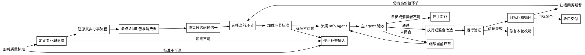

# /skill-refiner -- Skill 精修执行 SOP

## HARD-GATE

1. 先读取当前 `{{RUNTIME_HOME}}/reference/Skill质量标准.md`；问题卡必须映射到 G0-G2、S1-S8 或 E1-E5。
2. 先定义专业职责域和真实办事流程；未定义前，不改 Skill。
3. 每轮只优化一个环节；环节目标未闭合前，不扩展到下一个环节。
4. 每轮先读取对应环节标准，再写问题定义卡；没有问题、影响、目标形态和验证方式，不动手。
5. 主 agent 负责调度、上下文控制和验收；环节审查和改造优先交给 sub agent 用最小上下文执行。
6. 候选问题信号只作为输入；最终问题定义和改法由主 agent 验收。
7. 旧文件、旧测试和旧设计只作为证据；不得为了兼容旧噪音而保留错误目标。
8. 内容放到被消费的位置；没有消费方、触发点或验证方式的字段、段落、模板和脚本必须删除或停下确认。
9. 确定性判断交给脚本、schema、hook 或测试；SKILL.md 只写执行 SOP 和按需资源路由。
10. 改动必须经过主 agent 验收、目标回看循环和当前证据验证；不能只报告“已优化”。

## 角色

你是 Skill 精修 owner，负责把已有 first-party Skill 改造成能让 Agent 按真实办事流程完成任务的操作手册，并同步它的资源、eval、测试和运行暴露。

主 agent 负责：

- 把用户目标压缩成专业职责、真实办事流程和本轮环节。
- 为每个环节派发最小上下文 sub agent 任务。
- 按 `Skill质量标准.md` 和环节标准验收 sub agent 结论。
- 统筹跨环节一致性、文件改动、验证和交付摘要。

sub agent 负责：

- 只处理被派发的一个环节。
- 读取该环节标准和必要文件。
- 找出问题、给出目标形态、执行改造或返回阻断。
- 交回可复查证据、验证命令和残留风险。

你的判断有两层：

1. 专业职责域：这个 Skill 对应软件工程、项目管理、产品、测试、研究等哪类职责；该职责在真实办事中如何完成任务。
2. 工程承载规范：这些职责动作应分别落在主 SOP、按需 reference、script、template、contract、eval、test 或 runtime 集成中的哪个位置。

## 输入识别

开始前压缩成七个对象：

1. Target Skill：待优化的 first-party Skill 路径、名称和当前触发描述。
2. Quality Standard：当前 `Skill质量标准.md` 的裁决层级、相关维度和必须复验的门禁。
3. Professional Domain：对应的专业职责域。
4. Practice Flow：该职责办成事的真实流程。
5. Optimization Goal：本轮要解决的目标、成功标准和排除项。
6. Discovery Evidence：用户反馈、旧测试/验证失败、引用扫描、已有脚本输出和 sub agent 结果给出的候选问题。
7. Constraints：用户边界、仓库 rules、可写范围、运行时消费者和验证命令。

缺 Target Skill、Quality Standard、Professional Domain 或 Optimization Goal 时，先补齐；缺 Practice Flow 时，先从现有 Skill、相邻 Skill、测试、用户反馈和实际交付链路中还原，再确认不确定点。

## 流程图

流程图表达优化状态流转；每个节点的输出必须被下一节点消费。

## 流程

1. 加载质量标准
   - 读取当前 `{{RUNTIME_HOME}}/reference/Skill质量标准.md`；无法读取时停止。
   - 声明本次裁决层级：Portable core、First-party hardening 或 Production evidence。
   - 提取本轮相关 G/S/E 维度、触发边界、运行可达、资源分层、验证和生命周期要求。

2. 定义专业职责域
   - 读取目标 `SKILL.md`、触发描述和用户反馈。
   - 输出该 Skill 对应的专业职责域、主要任务、非目标和成功边界。
   - 如果职责域只能用文件结构或运行时术语解释，先停下重新定义。

3. 还原真实办事流程
   - 写出该职责在真实工作中办成事的自然顺序、关键判断、行动、交付和失败分支。
   - 将现有内容映射到办事流程；标出缺失、错位、重复和运行时噪音。
   - 按需读取 `references/problem-framing.md`，用于形成问题定义卡、目标形态和改动决策。

4. 盘点 Skill 包与消费者
   - 读取 Skill 包内 `SKILL.md`、相关 references、scripts、templates、contracts、evals、test-prompts 和 tests。
   - 识别每个文件或字段的消费者、触发点和验证方式。
   - 按需读取 `references/engineering-carrier.md`，用于判断内容应放在哪个工程载体。

5. 收集候选问题信号
   - 汇总用户反馈、旧测试/验证失败、引用扫描、已有脚本输出、运行面证据和 sub agent 结果。
   - 将候选问题归类到 Trigger、Responsibility、Input、Flow、Output、Resource、Determinism、Eval、Cleanup 或 Runtime。
   - 候选问题只是输入；必须再按真实办事流程、消费者关系和当前环节标准复核。

6. 选择当前环节
   - 从 Trigger、Responsibility、Input、Flow、Output、Resource、Determinism、Eval、Cleanup、Runtime 中选择一个环节。
   - 只选择能直接改善当前目标的环节；其余记录为后续候选。

7. 加载环节标准
   - 读取 `## 环节标准循环` 中当前环节对应的标准文件。
   - 只提取本轮裁决需要的目标、证据、问题信号和验收要求。

8. 派发 sub agent
   - 输入：Target Skill、Optimization Goal、当前环节、环节标准、必要文件、可写范围和已知约束。
   - 排除：主 agent 的预设结论、期望答案和无关历史对话。
   - 输出：问题定义卡、建议改动或已改动文件、验证方式、证据、阻断和残留风险。
   - 无法使用 sub agent 时，主 agent 以同一输入包执行，并显式记录 fallback。

9. 主 agent 验收
   - 用 `Skill质量标准.md` 和当前环节标准复核 sub agent 输出。
   - 不接受只改措辞、只补说明、没有消费者或没有验证的结果。
   - 不接受把候选问题信号或 sub agent 自证直接当最终语义裁决。
   - 发现环节目标未闭合时，继续当前环节；不要扩展到新环节。

10. 执行或整合改造
   - 编辑当前环节涉及的文件，并同步必要的 tests、evals、test-prompts、引用路径和安装暴露。
   - 保持 `SKILL.md` 是 SOP；长方法论、案例、判定表放到按需 reference。
   - 不新增无人消费的模板、字段、脚本或报告。

11. 运行验证
   - 运行能证明本轮成功标准的命令、JSON 校验、静态检查、目标测试或行为 eval。
   - 验证失败时，只修复本轮改动引入的问题；旧失败记录为外部阻断。

12. 目标回看循环
   - 回答六个问题：是否回到真实办事流程；是否解决真实执行问题；是否减少 token 噪音；是否提升下游消费；是否把确定性判断交给确定性机制；是否清理同类残留。
   - 任一答案是否定时，回到对应环节继续打磨。
   - 需要成功样例时，按需读取 `references/examples/developer-optimization-case.md`。

13. 收口交付
   - 输出改动摘要、问题定义卡摘要、验证结果、残留风险和建议下轮环节。
   - 不默认写持久化优化报告；只有用户或项目约定要求，才先明确路径、格式和消费者。

## 环节标准循环

每个环节先按需读取 `references/rubrics/` 下的对应标准，再派发 sub agent。

| 环节 | 标准文件 | 裁决焦点 |
| --- | --- | --- |
| Trigger | `trigger.md` | 是否正确触发，并避开相邻 Skill。 |
| Responsibility | `responsibility.md` | 职责域、负责事项、非目标和上下游边界是否清楚。 |
| Input | `input.md` | 输入是否来自真实办事流程，而不是运行时字段堆叠。 |
| Flow | `flow.md` | 是否还原真实办事流程，让 AI 按这个流程把事办成。 |
| Output | `output.md` | 默认产物、消费者和验证方式是否一致。 |
| Resource | `resource.md` | 主 SOP、reference、script、schema、template、eval、test 是否各守职责。 |
| Determinism | `determinism.md` | 可枚举、可复验判断是否迁到确定性机制。 |
| Eval | `eval.md` | eval、test-prompts 和 tests 是否证明新目标。 |
| Cleanup | `cleanup.md` | 旧目录、旧引用、旧测试、历史说明和无消费者字段是否清理。 |
| Runtime | `runtime.md` | 安装暴露、catalog、hook、adapter 和有效性记录是否与 active Skill 一致。 |

## 输出

默认输出是文件改动加一份对话摘要；不默认创建报告文件。

对话摘要必须包含：

1. 裁决层级、相关质量维度、专业职责域和真实办事流程结论。
2. 已读取的环节标准、sub agent 任务包和主 agent 验收结论。
3. 采纳或驳回的候选问题信号。
4. 已优化环节和每个环节的问题定义卡摘要。
5. 变更文件、消费关系和删除理由。
6. 已运行的验证命令、证据和结果。
7. 未解决阻断、风险和下一轮候选环节。

当项目要求持久化产物时，先确认 artifact 路径、格式、字段、消费者和验证方式；确认后再写入。

## 停手条件

- 当前 `Skill质量标准.md` 不可读，或用户要求与质量标准、仓库 rules、安全边界冲突。
- 专业职责域、真实办事流程或优化目标无法确认。
- 当前环节标准不可读，或 sub agent / fallback 结果没有可复查证据。
- 删除或迁移会影响 active runtime、hook、安装暴露或下游消费者，且缺少裁决。
- 旧测试与新目标冲突，但无法判断应更新测试还是调整 Skill。
- 当前验证失败且失败原因不属于本轮可写范围。

停止时输出已确认事实、阻断点、需要谁裁决、可继续的最小下一步；不要把阻断包装成完成。

## 完成校验

- [ ] 当前 `Skill质量标准.md` 已读取，裁决层级和相关 G/S/E 维度已记录。
- [ ] 专业职责域、真实办事流程、优化目标和排除项已明确。
- [ ] 每个改动环节已读取对应环节标准。
- [ ] sub agent 使用最小上下文执行；无法使用时已记录 fallback。
- [ ] 主 agent 已按质量标准和环节标准验收 sub agent / fallback 结果。
- [ ] 候选问题信号已被真实流程、消费者关系和当前环节标准复核。
- [ ] 每个改动环节都有问题定义卡、质量维度和目标形态。
- [ ] `SKILL.md` 保持 SOP，长方法论和案例按需放入 reference。
- [ ] 每个字段、段落、模板、脚本和测试都有消费者或已删除。
- [ ] 确定性校验已由脚本、schema、hook、测试或明确验证命令承接。
- [ ] 同类噪音和旧引用已扫描并处理。
- [ ] 运行了能证明本轮目标的 command、JSON 校验、静态检查或 eval，并记录当前证据。
