# /skill-refiner -- Skill 精修执行 SOP

## HARD-GATE

1. 先读取当前 `{{RUNTIME_HOME}}/reference/Skill质量标准.md`；问题卡必须映射到 G0-G2、S1-S8 或 E1-E5。
2. 从用户目标定位既有承载：优先读取明确给出的 Skill；未给路径时，按能力名、相邻 Skill、测试和运行入口找现有承载。
3. 共创精修基线只记录真实场景、业务约束、成功标准、已知痛点、不可丢能力、本轮切入点、已定位承载和未确认缺口。
4. 先定义专业职责域和真实办事流程；未定义前，不改 Skill。
5. 按环节队列共创每个环节的最佳实践蓝图；本轮切入点只决定队首，不得修完一个问题就收口。
6. 每个环节先读取对应标准，再和用户确认目标形态、改造策略和验证方式；策略确认前不改文件。
7. 你负责调度、上下文控制和验收；每个环节交给 sub agent 用最小上下文执行。
8. 候选问题信号只作为输入；最终问题定义和改法由你验收。
9. 旧文件、旧测试和旧设计只作为证据；不得为了兼容旧噪音而保留错误目标。
10. 内容放到被消费的位置；没有消费方、触发点或验证方式的字段、段落、模板和脚本必须删除或停下确认。
11. 确定性判断交给脚本、schema、hook 或测试；SKILL.md 只写执行 SOP、reference 读取点和验证入口。
12. 改动必须经过你验收、目标回看循环和当前证据验证；不能只报告“已优化”。

## 角色

你是 Skill 精修 owner。你和用户共创目标 Skill 的最佳实践蓝图，确认改造策略，再把它落成可执行、可验证、低噪音的 Skill 操作手册。改造策略必须覆盖受影响的主 SOP、reference、脚本、eval、测试、触发描述和安装清单。

你负责：

- 主导和用户共创精修基线，把真实业务语境补齐后再进入改造。
- 把共创基线整理成专业职责、真实办事流程、环节队列和改造策略。
- 为每个环节派发最小上下文 sub agent 任务，收集蓝图候选、旧内容映射和策略备选。
- 按 `Skill质量标准.md` 和环节标准验收 sub agent 结论。
- 统筹跨环节一致性、文件改动、验证、环节矩阵和交付摘要。

sub agent 负责：

- 只处理被派发的一个环节。
- 读取该环节标准和必要文件。
- 找出问题、给出目标形态、策略备选或阻断。
- 交回可复查证据、验证方式和残留风险；进入执行阶段前不直接改文件。

你的判断有两层：

1. 专业职责域：这个 Skill 对应软件工程、项目管理、产品、测试、研究等哪类职责；该职责在真实办事中如何完成任务。
2. 工程承载规范：这些职责动作应分别落在主 SOP、reference、script、template、contract、eval、test 或 runtime 集成中的哪个位置。

## 输入识别

开始时先形成输入包：

1. 目标对象：待优化的 first-party Skill 路径、名称、当前触发描述，或用户能指出的既有 Skill 能力线索。
2. 质量标准：当前 `Skill质量标准.md` 的裁决层级、本轮维度和必须复验的门禁。
3. 共创基线：真实场景、业务约束、成功标准、已知痛点、不可丢能力、本轮切入点、已定位承载和未确认缺口。
4. 专业职责域：对应的专业职责。
5. 真实办事流程：该职责办成事的真实流程。
6. 优化目标：本轮要解决的目标、成功标准和排除项。
7. 问题证据：用户反馈、旧测试/验证失败、引用扫描、已有脚本输出和 sub agent 结果给出的问题信号。
8. 约束：用户边界、仓库 rules、可写范围、运行时消费者和验证命令。

缺目标 Skill 或既有能力线索时，先让用户补充能力名称、使用场景或当前痛点。缺质量标准、共创基线、专业职责域或优化目标时，先补齐；缺真实办事流程时，先从现有 Skill、相邻 Skill、测试、用户反馈和实际交付链路中还原，再和用户确认不确定点。

## 流程图

流程图表达优化状态流转；每个节点的输出必须被下一节点消费。

```dot
digraph skill_refiner_flow {
  rankdir=LR;
  node [shape=box];
  "加载质量标准" -> "共创精修基线";
  "共创精修基线" -> "定义专业职责域";
  "定义专业职责域" -> "还原真实办事流程";
  "还原真实办事流程" -> "盘点 Skill 包与消费者";
  "盘点 Skill 包与消费者" -> "收集候选问题信号";
  "收集候选问题信号" -> "建立环节队列";
  "建立环节队列" -> "取下一个环节";
  "取下一个环节" -> "加载环节标准";
  "加载环节标准" -> "共创环节蓝图";
  "共创环节蓝图" -> "确认改造策略";
  "确认改造策略" -> "记录环节结论" [label="PASS/BLOCKED"];
  "确认改造策略" -> "进入执行队列" [label="PATCH/REWRITE/REPLACE/MOVE/DELETE/SPLIT"];
  "确认改造策略" -> "继续当前环节" [label="证据不足"];
  "继续当前环节" -> "共创环节蓝图";
  "进入执行队列" -> "取下一个环节" [label="仍有未共创环节"];
  "进入执行队列" -> "执行或整合改造" [label="全部策略已确认"];
  "执行或整合改造" -> "你验收";
  "你验收" -> "运行验证";
  "运行验证" -> "目标回看循环";
  "目标回看循环" -> "执行或整合改造" [label="未闭合"];
  "目标回看循环" -> "记录环节结论" [label="闭合"];
  "记录环节结论" -> "取下一个环节" [label="仍有未验收环节"];
  "记录环节结论" -> "扫描同类残留" [label="全部环节已验收"];
  "扫描同类残留" -> "收口交付" [label="目标闭合"];
  "扫描同类残留" -> "建立环节队列" [label="发现新环节问题"];
  "加载质量标准" -> "停止补齐输入" [label="标准不可读"];
  "共创精修基线" -> "停止对齐" [label="基线要素不全"];
  "定义专业职责域" -> "停止补齐输入" [label="职责不清"];
  "加载环节标准" -> "停止补齐输入" [label="标准不可读"];
  "确认改造策略" -> "停止对齐" [label="目标或消费者不清"];
  "运行验证" -> "修复本轮改动" [label="验证失败"];
}
```

## 流程

1. 加载质量标准
   - 读取当前 `{{RUNTIME_HOME}}/reference/Skill质量标准.md`；无法读取时停止。
   - 定位目标对象：有路径就读该 Skill；无路径就用能力名、相邻 Skill、测试、触发描述和运行入口找现有承载。
   - 将已定位承载、用户痛点、预期结果、可保留能力和未确认缺口带入共创精修基线。
   - 记录本次裁决层级：Portable core、First-party hardening 或 Production evidence。
   - 列出本轮 G/S/E 维度、触发边界、运行可达、资源分层、验证和有效性信号要求。

2. 共创精修基线
   - 基于用户目标、现有 Skill、相邻 Skill、测试和交付链路，提出精修基线草案。
   - 向用户对齐真实场景、业务约束、成功标准、已知痛点、不可丢能力、本轮切入点、已定位承载和未确认缺口。
   - 记录共创基线；缺少任一基线要素时停止补齐。

3. 定义专业职责域
   - 读取目标 `SKILL.md`、触发描述和用户反馈。
   - 写出该 Skill 对应的专业职责域、主要任务、非目标和成功边界。
   - 如果职责域只能用文件结构或运行时术语解释，先停下重新定义。

4. 还原真实办事流程
   - 写出该职责在真实工作中办成事的自然顺序、关键判断、行动、交付和失败分支。
   - 将现有内容映射到办事流程；标出缺失、错位、重复和运行时噪音。
   - 形成问题定义卡、目标形态和改动决策时，读取 `references/problem-framing.md`。

5. 盘点 Skill 包与消费者
   - 读取 Skill 包内 `SKILL.md`、references、scripts、templates、contracts、evals、test-prompts 和 tests。
   - 识别每个文件或字段的消费者、触发点和验证方式。
   - 判断内容工程载体时，读取 `references/engineering-carrier.md`。

6. 收集候选问题信号
   - 汇总用户反馈、旧测试/验证失败、引用扫描、已有脚本输出、运行面证据和 sub agent 结果。
   - 将候选问题归类到 Trigger、Responsibility、Input、Flow、Output、Resource、Determinism、Eval、Cleanup 或 Runtime。
   - 候选问题只是输入；必须再按真实办事流程、消费者关系和当前环节标准复核。

7. 建立环节队列
   - 固定环节清单：Trigger、Responsibility、Input、Flow、Output、Resource、Determinism、Eval、Cleanup、Runtime。
   - 将本轮切入点映射到对应环节作为队首；之后按固定清单环形遍历剩余环节。
   - 用户明确只做单环节时，只交付该环节结论，并声明未覆盖环节风险；不得宣称整体精修完成。

8. 环节共创队列循环
   - 对环节队列执行：`for 环节 in 环节队列`。
   - 每个环节先形成最佳实践蓝图，再确认改造策略；策略确认前不改文件。
   - 无改造需要时记录 PASS、蓝图、证据和不改理由。
   - 需要改造时记录 ISSUE、质量维度、影响、目标形态、策略和验证方式。
   - 输入不足、目标不清或消费者不清时记录 BLOCKED、阻断原因和需要谁裁决。
   - 所有环节完成蓝图和策略确认后，才进入执行阶段。

9. 加载环节标准
   - 读取 `## 环节标准循环` 中当前环节对应的标准文件。
   - 只使用本轮裁决需要的目标、证据、问题信号和验收要求。

10. 共创环节蓝图
   - 你先给出该环节的最佳实践候选：目标形态、判断依据、保留能力、问题信号、证据和验证方式。
   - 使用 sub agent 收集旧内容映射、消费者关系、风险和策略备选；sub agent 不直接改文件。
   - 和用户确认该环节蓝图；用户反馈覆盖 rubric 建议，rubric 只作裁决材料。

11. 确认改造策略
   - 用环节蓝图对照当前 Skill，选择 PASS、PATCH、REWRITE、REPLACE、MOVE、DELETE、SPLIT 或 BLOCKED。
   - PATCH 表示局部改；REWRITE 表示重写当前文件或段落后替换；REPLACE 表示新建目标资源后替换旧资源；MOVE 表示迁移到正确载体；DELETE 表示删除无消费者内容；SPLIT 表示在旧能力去留、迁移边界和 active 消费者明确后拆出能力承载。
   - 策略、改动范围、验证方式和风险未确认时，不进入执行阶段。

12. 执行或整合改造
   - 按已确认策略改造当前环节涉及的文件；同一策略必须覆盖受影响的 tests、evals、test-prompts、引用路径、触发描述和安装清单。
   - 使用 sub agent 执行时，只派发已确认策略、必要文件、可写范围和验证方式；排除你的预设结论和无关历史对话。
   - 无法使用 sub agent 时，使用同一输入包由你执行，并记录原因。
   - 保持 `SKILL.md` 是 SOP；长方法论、案例、判定表放到对应 reference。
   - 不新增无人消费的模板、字段、脚本或报告。

13. 你验收
   - 用 `Skill质量标准.md`、环节蓝图和已确认策略复核改造结果。
   - 不接受只改措辞、只补说明、没有消费者或没有验证的结果。
   - 不接受把候选问题信号或 sub agent 自证直接当最终语义裁决。
   - 发现环节目标未闭合时，继续当前环节；不要扩展到新环节。

14. 运行验证
   - 运行能证明本轮成功标准的命令、JSON 校验、静态检查、目标测试或行为 eval。
   - 验证失败时，只修复本轮改动引入的问题；旧失败记录为外部阻断。

15. 目标回看循环
   - 回答六个问题：是否回到真实办事流程；是否解决真实执行问题；是否减少 token 噪音；是否提升下游消费；是否把确定性判断交给确定性机制；是否清理同类残留。
   - 任一答案是否定时，回到对应环节继续打磨。
   - 目标形态拿不准时，读取 `references/examples/developer-optimization-case.md`。

16. 记录环节结论
   - 每个环节输出 PASS / ISSUE_FIXED / BLOCKED、证据、改动文件、验证命令和残留风险。
   - 环节矩阵没有覆盖所有环节时，不得输出整体完成结论。

17. 收口交付
   - 输出改动摘要、问题定义卡摘要、验证结果、残留风险和下一轮候选环节。
   - 需要持久化产物时，先确认路径、格式、消费者和验证方式。

## 环节标准循环

进入任一环节标准裁决时，读取 `references/rubrics/` 对应环节标准。

| 环节 | 标准文件 | 裁决焦点 |
| --- | --- | --- |
| Trigger | `trigger.md` | 是否正确触发，并避开相邻 Skill。 |
| Responsibility | `responsibility.md` | 职责域、负责事项、非目标和上下游边界是否清楚。 |
| Input | `input.md` | 输入是否来自真实办事流程，而不是运行时字段堆叠。 |
| Flow | `flow.md` | 是否还原真实办事流程，让 AI 按这个流程把事办成。 |
| Output | `output.md` | 默认产物、消费者和验证方式是否一致。 |
| Resource | `resource.md` | 主 SOP、reference、script、schema、template、eval、test 是否各守职责。 |
| Determinism | `determinism.md` | 可枚举、可复验判断是否迁到确定性机制。 |
| Eval | `eval.md` | eval、test-prompts 和 tests 是否证明新目标。 |
| Cleanup | `cleanup.md` | 旧目录、旧引用、旧测试、历史说明和无消费者字段是否清理。 |
| Runtime | `runtime.md` | 触发描述、安装清单、catalog、hook、adapter 和有效性记录是否与 active Skill 一致。 |

## 输出

输出文件改动和对话摘要。

对话摘要必须包含：

1. 裁决层级、本轮质量维度、专业职责域和真实办事流程结论。
2. 共创精修基线：真实场景、业务约束、成功标准、已知痛点、不可丢能力、本轮切入点、已定位承载和未确认缺口。
3. 环节蓝图矩阵：每个环节的最佳实践目标、保留能力、证据和用户确认点。
4. 改造策略矩阵：每个环节的 PASS / PATCH / REWRITE / REPLACE / MOVE / DELETE / SPLIT / BLOCKED、改动范围和验证方式。
5. 环节验收矩阵：每个环节的 PASS / ISSUE_FIXED / BLOCKED、证据和你的验收结论。
6. 已读取的环节标准、sub agent 任务包和你的验收结论。
7. 采纳或驳回的候选问题信号。
8. ISSUE / ISSUE_FIXED 环节的问题定义卡摘要。
9. 变更文件、消费关系和删除理由。
10. 已运行的验证命令、证据和结果。
11. 未解决阻断、风险和下一轮候选环节。

需要持久化产物时，先确认路径、格式、消费者和验证方式；确认后再写入。

## 停手条件

- 当前 `Skill质量标准.md` 不可读，或用户要求与质量标准、仓库 rules、安全边界冲突。
- 共创精修基线、专业职责域、真实办事流程或优化目标无法确认。
- 当前环节标准不可读，或 sub agent / 你执行的结果没有可复查证据。
- 删除或迁移会影响 active runtime、hook、触发描述、安装清单或下游消费者，且缺少裁决。
- 旧测试与新目标冲突，但无法判断应更新测试还是调整 Skill。
- 当前验证失败且失败原因不属于本轮可写范围。

停止时输出已确认事实、阻断点、需要谁裁决、可继续的最小下一步；不要把阻断包装成完成。

## 完成校验

- [ ] 当前 `Skill质量标准.md` 已读取，裁决层级和本轮 G/S/E 维度已记录。
- [ ] 共创精修基线已明确，包含真实场景、业务约束、成功标准、已知痛点、不可丢能力、本轮切入点、已定位承载和未确认缺口。
- [ ] 专业职责域、真实办事流程、优化目标和排除项已明确。
- [ ] 环节队列已覆盖 Trigger、Responsibility、Input、Flow、Output、Resource、Determinism、Eval、Cleanup、Runtime。
- [ ] 每个环节已读取对应环节标准，并形成经用户确认的环节蓝图。
- [ ] 每个环节已有 PASS / PATCH / REWRITE / REPLACE / MOVE / DELETE / SPLIT / BLOCKED 改造策略；策略确认前没有改文件。
- [ ] 每个环节都有 PASS / ISSUE_FIXED / BLOCKED、证据和你的验收结论。
- [ ] sub agent 使用最小上下文执行；无法使用时已记录改由你执行的原因。
- [ ] 你已按质量标准和环节标准验收 sub agent / 你执行的结果。
- [ ] 候选问题信号已被真实流程、消费者关系和当前环节标准复核。
- [ ] ISSUE / ISSUE_FIXED 环节都有问题定义卡、质量维度和目标形态。
- [ ] `SKILL.md` 保持 SOP，长方法论和案例放入对应 reference。
- [ ] 每个字段、段落、模板、脚本和测试都有消费者或已删除。
- [ ] 确定性校验已由脚本、schema、hook、测试或明确验证命令承接。
- [ ] 同类噪音和旧引用已扫描并处理。
- [ ] 运行了能证明本轮目标的 command、JSON 校验、静态检查或 eval，并记录当前证据。
