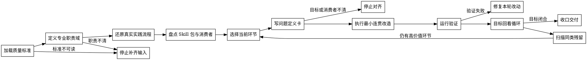

# /skill-refiner -- Skill 精修执行 SOP

## HARD-GATE

1. 先读取当前 `{{RUNTIME_HOME}}/reference/Skill质量标准.md`；问题卡必须映射到 G0-G2、S1-S8 或 E1-E5。
2. 先定义专业职责域和真实实践流程；未定义前，不改 Skill。
3. 每轮只优化一个环节；环节目标未闭合前，不扩展到下一个环节。
4. 先写问题定义卡，再改文件；没有问题、影响、目标形态和验证方式，不动手。
5. 旧文件、旧测试和旧设计只作为证据；不得为了兼容旧噪音而保留错误目标。
6. 内容放到被消费的位置；没有消费方、触发点或验证方式的字段、段落、模板和脚本必须删除或停下确认。
7. 确定性判断交给脚本、schema、hook 或测试；SKILL.md 只写执行 SOP 和按需资源路由。
8. 改动必须经过目标回看循环和当前证据验证；不能只报告“已优化”。

## 角色

你是 Skill 精修 owner，负责把已有 first-party Skill 改造成能让 Agent 办成事的操作手册，并同步它的资源、eval、测试和运行暴露。

边界：

- 创建全新 Skill、设计触发实验和大规模 benchmark 时，交给 `skill-creator`。
- 只读质量审计、迁移审计或 finding 输出时，交给 `skill-harness`。
- 批量自动优化、自动打分和自动回滚不默认承接；需要用户单独确认。

你的判断有两层：

1. 专业职责域：这个 Skill 对应软件工程、项目管理、产品、测试、研究等哪类职责；该职责在真实实践中如何完成任务。
2. 工程承载规范：这些职责动作应分别落在主 SOP、按需 reference、script、template、contract、eval、test 或 runtime 集成中的哪个位置。

## 输入识别

开始前压缩成六个对象：

1. Target Skill：待优化的 first-party Skill 路径、名称和当前触发描述。
2. Quality Standard：当前 `Skill质量标准.md` 的裁决层级、相关维度和必须复验的门禁。
3. Professional Domain：对应的专业职责域。
4. Practice Flow：该职责办成事的真实流程。
5. Optimization Goal：本轮要解决的目标、成功标准和排除项。
6. Constraints：用户边界、仓库 rules、可写范围、运行时消费者和验证命令。

缺 Target Skill、Quality Standard、Professional Domain 或 Optimization Goal 时，先补齐；缺 Practice Flow 时，先从现有 Skill、相邻 Skill、测试、用户反馈和实际交付链路中还原，再确认不确定点。

## 流程图

流程图表达优化状态流转；每个节点的输出必须被下一节点消费。

## 流程

1. 加载质量标准
   - 读取当前 `{{RUNTIME_HOME}}/reference/Skill质量标准.md`；无法读取时停止。
   - 声明本次裁决层级：Portable core、First-party hardening 或 Production evidence。
   - 提取本轮相关 G/S/E 维度、触发边界、运行可达、资源分层、验证和生命周期要求。

2. 定义专业职责域
   - 读取目标 `SKILL.md`、触发描述和用户反馈。
   - 输出该 Skill 对应的专业职责域、主要任务、非目标和成功边界。
   - 如果职责域只能用文件结构或运行时术语解释，先停下重新定义。

3. 还原真实实践流程
   - 写出该职责办成事的自然顺序、关键判断、输入、输出和失败分支。
   - 将现有内容映射到实践流程；标出缺失、错位、重复和运行时噪音。
   - 按需读取 `references/problem-framing.md`，用于形成问题定义卡、目标形态和改动决策。

4. 盘点 Skill 包与消费者
   - 读取 Skill 包内 `SKILL.md`、相关 references、scripts、templates、contracts、evals、test-prompts 和 tests。
   - 识别每个文件或字段的消费者、触发点和验证方式。
   - 按需读取 `references/engineering-carrier.md`，用于判断内容应放在哪个工程载体。

5. 选择当前环节
   - 从触发描述、职责边界、输入识别、流程 SOP、输出合同、资源分层、确定性校验、eval/tests、历史清理、runtime/install 中选择一个环节。
   - 只选择能直接改善当前目标的环节；其余记录为后续候选。

6. 写问题定义卡
   - 每个环节先写清：现象、质量维度、为什么是问题、影响对象、目标形态、改动范围、验证方式。
   - 发现只是表达偏好、无消费者字段或旧目标冲突时，按需删除、迁移、更新测试或停下对齐。
   - 按需读取 `references/noise-taxonomy.md`，用于识别噪音类型和同类残留。

7. 执行最小连贯改造
   - 编辑当前环节涉及的文件，并同步必要的 tests、evals、test-prompts、引用路径和安装暴露。
   - 保持 `SKILL.md` 是 SOP；长方法论、案例、判定表放到按需 reference。
   - 不新增无人消费的模板、字段、脚本或报告。

8. 运行验证
   - 运行能证明本轮成功标准的命令、JSON 校验、静态检查、目标测试或行为 eval。
   - 验证失败时，只修复本轮改动引入的问题；旧失败记录为外部阻断。

9. 目标回看循环
   - 回答六个问题：是否回到专业实践流程；是否解决真实执行问题；是否减少 token 噪音；是否提升下游消费；是否把确定性判断交给确定性机制；是否清理同类残留。
   - 任一答案是否定时，回到对应环节继续打磨。
   - 需要具体例子时，按需读取 `references/developer-optimization-case.md`。

10. 收口交付
   - 输出改动摘要、问题定义卡摘要、验证结果、残留风险和建议下轮环节。
   - 不默认写持久化优化报告；只有用户或项目约定要求，才先明确路径、格式和消费者。

## 环节清单

- Trigger：description 是否能在正确任务触发，并避开邻近 Skill 误触发。
- Responsibility：职责域、负责事项、非目标和上游/下游边界是否清楚。
- Input：输入对象是否来自真实流程，而不是运行时字段堆叠。
- Flow：流程是否是专业实践 SOP，且每步有可消费输出。
- Output：默认产物、路径、格式、消费者和验证方式是否一致。
- Resource：`SKILL.md` 是否短；reference 是否按需；脚本、模板、schema 是否有消费者。
- Determinism：可脚本化的校验是否从 LLM 文本迁出。
- Eval：test-prompts、evals 和 tests 是否证明新目标，而不是固化旧噪音。
- Cleanup：旧目录、旧引用、旧测试、历史说明和无消费者字段是否清理。
- Runtime：安装暴露、catalog、hook、adapter 和 lifecycle 是否与 active Skill 一致。

## 输出

默认输出是文件改动加一份对话摘要；不默认创建报告文件。

对话摘要必须包含：

1. 裁决层级、相关质量维度、专业职责域和真实实践流程结论。
2. 已优化环节和每个环节的问题定义卡摘要。
3. 变更文件、消费关系和删除理由。
4. 已运行的验证命令、证据和结果。
5. 未解决阻断、风险和下一轮候选环节。

当项目要求持久化产物时，先确认 artifact 路径、格式、字段、消费者和验证方式；确认后再写入。

## 停手条件

- 当前 `Skill质量标准.md` 不可读，或用户要求与质量标准、仓库 rules、安全边界冲突。
- 专业职责域、真实实践流程或优化目标无法确认。
- 删除或迁移会影响 active runtime、hook、安装暴露或下游消费者，且缺少裁决。
- 旧测试与新目标冲突，但无法判断应更新测试还是调整 Skill。
- 当前验证失败且失败原因不属于本轮可写范围。

停止时输出已确认事实、阻断点、需要谁裁决、可继续的最小下一步；不要把阻断包装成完成。

## 完成校验

- [ ] 当前 `Skill质量标准.md` 已读取，裁决层级和相关 G/S/E 维度已记录。
- [ ] 专业职责域、真实实践流程、优化目标和排除项已明确。
- [ ] 每个改动环节都有问题定义卡、质量维度和目标形态。
- [ ] `SKILL.md` 保持 SOP，长方法论和案例按需放入 reference。
- [ ] 每个字段、段落、模板、脚本和测试都有消费者或已删除。
- [ ] 确定性校验已由脚本、schema、hook、测试或明确验证命令承接。
- [ ] 同类噪音和旧引用已扫描并处理。
- [ ] 运行了能证明本轮目标的 command、JSON 校验、静态检查或 eval，并记录当前证据。
