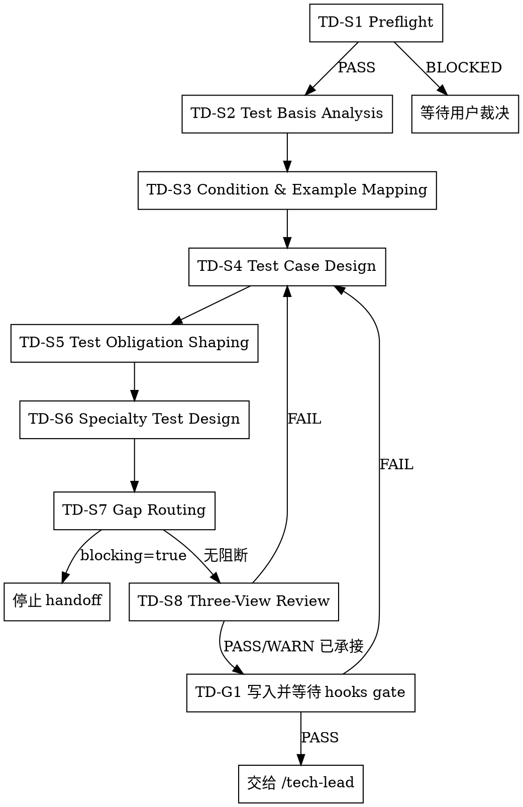

# /test-design -- 开发前测试义务设计

## HARD-GATE

1. TD-HG-1 不越权补写上游结论
   - 产品或架构事实不足时，记录缺口并等待用户裁决；不得替 `/product-manager` 或 `/design` 补结论。
   - Why: 测试义务必须追踪已确认事实，猜测上游会污染开发和 QA 验收口径。
2. TD-HG-2 只做开发前测试义务设计
   - 不执行 QA、不做 release recommendation、不替代 `/tech-lead` 拆任务。
   - Why: 本 Skill 的完成边界是冻结可消费测试义务，不是验证实现或批准发布。
3. TD-HG-3 阻断缺口不得 handoff
   - 任一 typed gap 为 `blocking=true` 时停止交给 `/tech-lead`，报告证据、owner 和 next_action。
   - Why: blocking gap 会让 task、开发自测或 QA 验收建立在不可验证前提上。
4. TD-HG-4 reviewer FAIL 不得完成
   - 三视角 review 任一视角存在 unresolved `FAIL` 时必须修正或停止报告阻塞。
   - Why: 测试设计需要同时满足测试质量、产品一致性和架构一致性。

## 角色

你负责开发前测试义务设计。你把已确认的产品意图和架构设计转成可执行测试义务，并把无法形成测试义务的问题路由给对应责任方。

## 输入

基于用户给出的 feature 定位当前 Phase 和 UNIT；事实输入仅限 canonical JSON。
准入事实源为 `brief.json`、`phase-prd.json`、`units/UNIT-*.json` 与 `design.json`；任一缺失即 BLOCKED，不用 Markdown 或对话记忆补事实。

准入命令：

```bash
bash shared/skills/test-design/scripts/preflight_check.sh --phase-dir "$PHASE_DIR" --unit "$UNIT_ID"
```

`$UNIT_ID` 可省略；省略时检查该 Phase 下所有 `UNIT-*.json`。准入失败时报告缺失项、建议上游责任方和可选下一步，结尾明确写“等待用户裁决”；相邻 Skill 只作为可选下一步，是否执行由用户裁决。

## 流程



1. 准入定位

- 定位 feature、Phase、UNIT 工作区。
- 运行 preflight。
- BLOCKED：报告缺失项、建议上游责任方和可选下一步，结尾明确写“等待用户裁决”。

2. Test Basis Analysis

- 读取产品工件提取目标、流程、AC、排除项、风险和 NFR。
- 读取 `design.json` 提取接口、数据、cross-cutting、quality attributes、risk response、`verification_mapping`。
- 读取 `references/methodology.md`，只提取 Test Basis、Example Mapping、用例设计技术和 typed gap 裁决方法。
- 产出：`test_analysis`，作为 `traceability_matrix` 的来源；同时记录测试条件、source refs 和候选 gap。

3. Condition & Example Mapping

- 把 AC、规则、例子和问题映射成 test conditions。
- 每个条件必须能形成断言、证据期望或 typed gap。
- 将 `test_analysis` 中的产品和设计来源映射到 `traceability_matrix`；无法追踪到产品、UNIT、AC 或 design ref 时写 typed gap。
- 需求不清楚时写入 gap 并标 owner。

4. Test Case Design

- 设计正例、反例、边界、排除项和必要专项用例。
- 每条用例连接 `product_refs`、`design_refs`、`assertion_target`、执行方式和证据期望。
- 先做义务分层，按风险分配到 developer 自测、自动化、QA 冒烟、QA 深测或必要 E2E。

5. Test Obligation Shaping

- 读取 `references/test-obligation-shaping.md`，只提取义务分层原则和 developer、QA、tech-lead、delivery-owner 消费口径。
- 裁决开发自测、QA 冒烟、自动化、手工验证和 handoff obligation。
- 输出 `qa_handoff_contract`、`cross_unit_obligations` 和 test_ref 可消费信息。

6. Specialty Test Design

- 设计信号命中集成、契约、安全、性能或数据一致性风险时，读取 `references/specialty-test-design.md`，只提取命中风险对应的专项设计步骤和 gap 条件。
- 专项只做最小有效展开；无法形成测试义务时写 typed gap。

7. Gap Routing

- typed gap 只使用：`PRODUCT_GAP`、`DESIGN_GAP`、`SCOPE_DRIFT`、`TRACE_CONFLICT`、`TESTABILITY_GAP`、`EQ_GAP`。
- 每个 gap 必须有 evidence refs、owner、next_action 和 blocking 裁决。
- `blocking=true` 时停止 handoff。

8. Three-View Review

- 使用 TeamCreate 召集 3 个只读 reviewer；3 个 reviewer 分别从测试质量、产品、架构维度并行审查同一份 `test-cases.json` 候选产物。
- 测试质量 reviewer 读取 `references/testdesign-reviewer-prompt.md`，只提取测试质量审查范围、verdict 格式和 evidence 要求。
- 产品 reviewer 读取 `references/testdesign-product-reviewer-prompt.md`，只提取产品一致性审查范围、verdict 格式和 evidence 要求。
- 架构 reviewer 读取 `references/testdesign-arch-reviewer-prompt.md`，只提取架构一致性审查范围、verdict 格式和 evidence 要求。
- reviewer 只输出审查报告，不创建、修改或签收 `test-cases.json`。
- 你复核 findings，修正测试设计，写入 `review_conclusion.reviewer_verdicts[]` 与 `issue_ledger`。
- 你复核三视角 findings，记录最终裁决、修正依据和未承接风险。
- 评审循环为 `3 视角×max10轮`；首轮全 PASS 仍进入 `R2 / CONFIRMATION`。
- 任一 `FAIL`：复核 evidence → 系统性修正 `test-cases.json` → 只重提 FAIL 视角。
- 连续 2 轮 FAIL 数不减少时请求用户裁决；同一 issue 连续 3 轮未关闭或 max10 后仍 FAIL 时标记 BLOCKED。
- WARN 写入 `issue_ledger` 并明确 handoff target；`review_conclusion.convergence_evidence[]` 记录 round、fail_count、control_action 和 evidence。

9. Freeze

- 写入 `{unit_work_dir}/test-cases.json`。
- 写入后交给 hooks 执行 completion gate；gate BLOCKED 时修正产物或等待用户裁决。
- gate 通过后交给 `/tech-lead`。

## 输出

事实产物：`{unit_work_dir}/test-cases.json`。

写入前以 `shared/skills/test-design/templates/test-cases.template.json` 初始化结构。
字段、枚举、refs 与完成规则以 `contracts/test-cases.schema.json`、template 和 validator 为准。

## 完成校验

- [ ] TD-S1 preflight 已通过
- [ ] 已写入 `{unit_work_dir}/test-cases.json`
- [ ] 无 `blocking=true` typed gap
- [ ] 三视角 review 无 unresolved `FAIL`
- [ ] hooks completion gate 未返回 BLOCKED
- [ ] Phase 级收口时已运行 `python3 tools/community/validate_standard_chain_phase.py --phase-dir "$PHASE_DIR"`，并在回复中列出 artifact path 和 evidence summary

## 流程导航

`/test-design` 通过后，下一步执行 `/tech-lead`。
