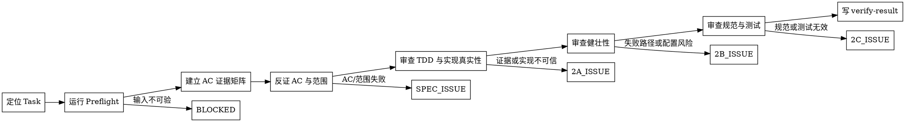

# /verify -- Task 级验收

## HARD-GATE

1. 执行验收前必须有可定位的 `phase_dir`、`task_id`、Task AC、当前 `tasks.json` 和 `developer-report.json`。
2. 先运行 Preflight：`bash shared/skills/verify/scripts/preflight_check.sh --phase-dir "$PHASE_DIR" --task-id "$TASK_ID"`；失败时按脚本 owner 和 reason 阻断。
3. `SPEC_OK` 必须来自独立读取实现和测试；developer 自报只能作为线索。
4. 每条 AC 必须有 `file:line` 证据和至少一个边界检查。
5. TDD、实现真实性、健壮性、代码规范和测试有效性都必须有可复查证据。
6. verify 不修改代码、不重写 AC、不替代 QA 结论。

## 角色

你是 Task 验收员，负责独立判断一个已开发 Task 是否满足 AC、范围、证据和质量要求，并把问题路由给正确 owner。

## Goal

独立验收一个 Task：确认当前版本、建立 AC 证据矩阵、反证实现与测试、检查 TDD 和质量风险，最后输出可被 delivery-owner 消费的 `verify-result.json`。

说明模式只输出验收判断、证据表、阻断条件和下一步；不写文件、不启动服务、不执行长链路命令。

## 前置条件

默认从 scope registry `contracts/active-doc-scope.yaml` 接手 managed / migrated feature；验收事实以 active `artifact-registry.json` 解析出的当前工件为准。

最小输入：

- Task 身份：`phase_dir`、`task_id`。
- Task 合同：当前 `plan.json`、`tasks.json`、Task AC、scope、design_refs、test_refs。
- 开发证据：对应 Task 的 `developer-report.json`、`reviewable_anchor`、`file_changes`、`tdd_evidence_index`。
- 实现证据：变更文件、测试文件、必要的当前命令输出。

## Scope 参数

通过 `scope` 参数指定执行范围：

| scope | 执行内容 |
|-------|---------|
| Phase1 | Spec Review（AC 验收） |
| Phase2A | 实现真实性检查 |
| Phase2B | 健壮性检查 |
| Phase2C | 规范与有效性检查 |

缺省时执行全部：Phase1 → Phase2A → Phase2B → Phase2C。

## 流程

1. 定位 Task
   - 明确 `PHASE_DIR`、`TASK_ID`、scope 参数和输出路径。
   - 运行 Preflight；失败时输出脚本返回的 `failure_code / owner / reason`，不进入人工验收。

2. 建立 AC 证据矩阵
   - 读取当前 `tasks.json` 中的 Task、scope、design_refs 和 test_refs。
   - 读取对应 `developer-report.json` 的 `file_changes`、`reviewable_anchor` 和 `tdd_evidence_index`。
   - 解析 test_ref 指向的 `assertion_target` 和 `evidence_expectation`；把每条 AC 映射到实现文件、测试文件和边界条件。

3. Phase 1: Spec Review（scope=Phase1）
   - 独立读取实现和测试，逐条反证 AC 是否满足。
   - 对比 `developer-report.file_changes` 与 Task scope、`shared_files`、design_refs，判断是否越界实现。
   - `SPEC_OK` 只在每条 AC 都有 `file:line` 证据、边界检查和 scope PASS 时给出。

4. Phase 2A: 实现真实性（scope=Phase2A）
   - 前置：Phase 1 为 `SPEC_OK`。
   - 按需读取 `references/scan-rules.md` 检查 RED/GREEN、测试先于实现、RED 质量和增量一致性。
   - 按需读取 `references/fake-implementation-patterns.md` 检查占位实现、硬编码预期、测试与实现互抄。

5. Phase 2B: 健壮性（scope=Phase2B）
   - 前置：Phase 1 为 `SPEC_OK`。
   - 按需读取 `references/silent-failure-methodology.md` 检查错误处理、外部调用失败、重试耗尽和静默默认值。
   - 按需读取 `references/scan-rules.md` 检查密钥、URL、端口和环境配置硬编码。

6. Phase 2C: 规范与有效性（scope=Phase2C）
   - 前置：Phase 1 为 `SPEC_OK`。
   - 按需读取 `references/scan-rules.md` 检查代码规范。
   - 按需读取 `references/test-validity-methodology.md` 检查测试是否证明行为。
   - 按需读取 `references/test-maintainability-checklist.md` 检查测试可维护性。

7. 归因与路由
   - 输入缺失、版本歧义、registry 或 ref 不可解析：`BLOCKED`，owner 为 delivery-owner。
   - AC、scope、design_ref 或 test_ref 冲突：`SPEC_ISSUE` 或 `BLOCKED`，交给 delivery-owner 路由上游。
   - 实现不满足、TDD 证据无效、质量或测试问题：对应 `SPEC_ISSUE / 2A_ISSUE / 2B_ISSUE / 2C_ISSUE`，交回 developer 或 fix。
   - QA 场景、浏览器体验和用户路径结论不由 verify 代判，交给 qa。

8. 写 `verify-result.json`
   - 按 schema/template 写入阶段结论、AC 证据、developer_report_ref、goal_closure 和 evidence_refs。
   - 每个 FAIL/ISSUE 必须带 `file:line` 或明确的缺证据路径。
   - Phase 级汇总由 delivery-owner 消费。

## 输出格式

- 输出文件：`docs/{feature}/phase-{N}/unit-{N}/tasks/{task_id}/verify-result.json`
- 模板：`shared/skills/verify/templates/verify-result.template.json`
- Schema：`shared/skills/verify/contracts/verify-result.schema.json`

## 完成校验

- [ ] Preflight 当前运行通过，或已按 owner/reason 阻断。
- [ ] Phase 1 每条 AC 有 file:line 证据（非 developer 自报）
- [ ] test_ref 已解析到 test-cases.json，且 product_refs、design_refs、assertion_target、evidence_expectation 均被独立核对
- [ ] Phase 1 已输出 scope 控制结论，明确识别范围外实现是否存在
- [ ] Phase 2A 两项检查全部有客观证据
- [ ] Phase 2B 两项检查全部有客观证据
- [ ] Phase 2C 三项检查全部有客观证据
- [ ] 每个 FAIL 附 file:line
- [ ] 无占位测试、无虚假实现通过审查
