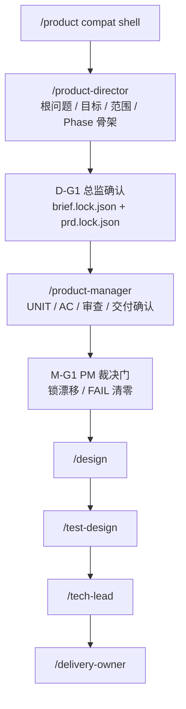

# Product Split Playbook Map

> 引用者：`/product`、`/product-director`、`/product-manager`
> 作用：提供 split 后唯一的总览式玩法入口，回答“整套打法是什么、当前在哪一段、下一步该去哪”

这份 playbook 只描述共享方法论与路由，不自证“split 一定更强”。
“是否比旧 monolith 更强”必须由 `docs/product-role-split-20260414/evidence-and-eval-plan.md` 约定的 contract、benchmark、blind comparison 与人工可复核证据共同回答。

## 全局流程图

## 角色分工

### `/product-director`

- 负责：根问题、目标与成功标准、范围、前置约束事实、Phase 规划、Director 基线冻结
- 不负责：UNIT 拆解、AC 细化、三方评审闭环、交付确认
- 典型问题：这件事到底在解决什么、做到什么算成功、为什么要拆成这些 Phase

### `/product-manager`

- 负责：详细业务流程、用户路径、UNIT、AC、完整性扫描、三方评审、交付确认
- 不负责：改写 Director 锁定字段
- 典型问题：每个 Phase 具体拆什么 UNIT、怎么验收、哪些问题要回退 Director

## 当前在哪一段

- 需求还停留在“想法 / 方案 / 大致目标”层：先去 `/product-director`
- 已经有 Director 确认和 lock snapshot：进入 `/product-manager`
- Manager 发现根问题、范围、规则、Phase 边界要变：回退 `/product-director`

## 用户向表达约束

当用户问的是“你会怎么回应我”“现在该怎么组织评审”这类问题时：
- 先用产品语言直接回答下一步动作和原因
- 再补 skill 名称、handoff 边界或步骤编号
- 不要用 `M-S8 / M-G1 / S6 / S7` 这类内部编号代替解释

用户要的是一套可执行的最佳实践，不是内部实现代号表。

## 方案先行时的标准回应

如果用户一上来给的是方案而不是问题，优先按这个顺序回应：
1. 先拦住直接出 PRD：
   `我先不直接整理成方案。`
2. 再拉回真实问题：
   `先确认这件事到底要解决什么痛点，导出、权限和大盘分别服务哪个场景。`
3. 再收口成功标准：
   `做到什么算成功，怎么判断它真的有价值。`
4. 最后再补当前入口：
   `按 split 入口，这一步对应 /product-director。`

## 共享判断框架

### 价值假设验证

在定义需求前先逼自己回答：
- 假设是什么
- 怎么验证
- 当前基线是什么
- 目标值或方向是什么
- 观测窗口是什么
- 数据来源是什么
- 失败长什么样

核心问句：
`如果这个功能上线，你怎么知道它成功了？`

### MVP 最小闭环三分法

- 核心：没有它，问题就没解决
- 增强：有它更好，但核心已经能独立交付价值
- 未来：明确延后，本期不做

核心问句：
`如果只能做一件事，是哪件？`

## 警示信号

出现以下想法时，必须暂停并重校当前步骤：
- 用户已经给了方案，我直接整理成需求
- 已经够清楚了，可以停止追问
- 这个 AC 用模糊词描述也没关系
- 我先按主题拆几个 UNIT，后面让下游自己再拆
- 先全部标 MVP，后面再说
- 这一步我自己判断就行，不用等用户

## Agent Team 评审编排

Manager 阶段的三方评审不是“有 reviewer 就算做了”，而是必须按下面的闭环执行：

### 三视角并行

- 产品视角：检查 `R1~R6 + R13 + PR-C1`
- 架构视角：检查技术可行性、隐含依赖、技术约束
- 测试视角：检查回归风险、AC 可测试性、异常与边界覆盖

### 复审纪律

- 首轮全 PASS，也必须再做一轮 `CONFIRMATION`
- 若存在 FAIL，只重提 FAIL 视角，不重跑已 PASS 视角
- 连续 2 轮 FAIL 数不减少：`ASK_USER`
- 同一问题连续 3 轮未关闭：`BLOCKED`
- WARN 必须显式承接，不能口头忽略

### 台账与收敛规则

- 稳定 issue id 用 `PR-* / AR-* / TR-*`
- 已关闭但要保留痕迹的项改写为 `HIS-*`
- `Issue Count` 只统计当前仍未关闭的稳定 issue
- 某视角 `Verdict=PASS` 时，`Issue Count` 必须为 `0`
- 首轮全 PASS，也必须补一轮 `R2 / CONFIRMATION`
- 回答 reviewer team 规则时，优先把这些显式规则列出来，不要只说“做三方 review”

### 结果载体

reviewer team 的结果不能停留在口头结论，必须落到共享工件里：
- `brief.md#审查结论`
- `审查汇总`
- `审查问题台账`
- `收敛轮次摘要`
- `用户裁决记录`（仅在 `ASK_USER / BLOCKED` 时填写）

### 产品视角必须保留的新增检查点

- `R13`：成功信号完整性
- `PR-C1`：共创可信度
- Director 锁定字段与 `brief.lock.json / prd.lock.json` 一致性

### 产品视角新增检查点

- `R13`：成功信号完整性
- `PR-C1`：共创可信度
- Director 锁定字段与 `brief.lock.json / prd.lock.json` 一致性

## 路由速查

| 情况 | 入口 |
|------|------|
| 先澄清问题、目标、范围、Phase | `/product-director` |
| 已有 handoff，继续细化 UNIT / AC / 审查 | `/product-manager` |
| 历史链接、旧入口、只想看总览 | `/product` |
